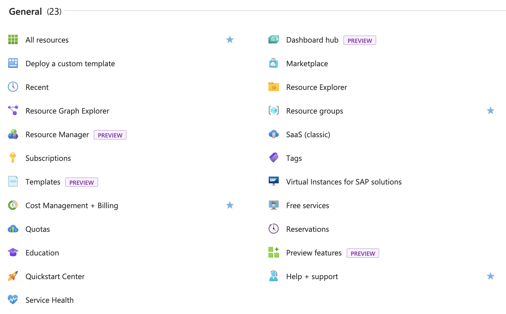

Azure is a cloud computing platform and service provided by Microsoft. It offers a range of infrastructure as a service (IaaS), platform as a service (PaaS), and software as a service (SaaS) solutions for building, deploying, and managing various types of applications and services.

## Overview {#overview}

Azure provides a wide range of features and services, including virtual machines, storage, databases, artificial intelligence, machine learning, blockchain, Internet of Things (IoT), containers, and serverless computing. It also offers a global network of data centers, enabling users to deploy and scale applications worldwide.

Azure offers hundreds of services provided by Microsoft or its partners. As of June 19, 2024, it has 19 major categories with a total of 413 services:

With Azure, you can easily create and manage virtual machines, store and manage data, build and deploy web applications, perform large-scale data analytics, and achieve automation and monitoring. Azure also provides robust security and compliance features to ensure the security of your data and applications.

Whether you are an individual developer, a startup, or a large enterprise, Azure offers flexible pricing models to meet the needs of projects of different scales and requirements. You can pay based on actual usage, avoiding high fixed costs.

The following provides an overview of the 19 major categories of services.

### AI + Machine Learning {#ai-machine-learning}

Azure offers powerful AI and machine learning capabilities that enable users to build and deploy intelligent applications and solutions. With Azure's AI and machine learning services, you can leverage advanced machine learning algorithms and models to process and analyze large-scale data, gaining valuable insights and predictive capabilities.

Through these AI and machine learning services, you can achieve various application scenarios such as intelligent recommendations, fraud detection, sentiment analysis, speech recognition, and automated decision-making. Whether you are a beginner or a professional, Azure's AI and machine learning capabilities can help you easily build and deploy intelligent applications.

### Analytics {#analytics}

Azure Analytics is an important category under the Azure platform, providing a range of powerful data analysis and insight services. These services help users extract valuable information from massive data and perform in-depth data analysis and visualization.

Azure Analytics offers a rich set of data analysis and insight services, helping users extract valuable information from massive data and perform in-depth data analysis and visualization. Whether it's processing structured or unstructured data, batch processing or real-time processing, Azure Analytics can meet various data analysis needs.

### Compute {#compute}

Compute services are a large category under the Azure platform, providing various computing resources and services for building, deploying, and managing applications and services.

Azure Compute offers multiple compute options, including virtual machines, containers, serverless computing, and batch processing. You can choose the appropriate compute resources based on the requirements of your application and scale elastically based on actual usage.

### Containers {#containers}

Containers is a category that provides a range of container-related services and tools for building, deploying, and managing containerized applications.

Azure Containers offers powerful container orchestration and management capabilities, allowing users to easily create, deploy, and scale containerized applications. With Azure's container services, you can use Docker container technology to package applications and their dependencies and run them in the cloud or on-premises environments.

Azure Containers provides multiple container service options, including Azure Kubernetes Service (AKS), Azure Container Instances (ACI), and Azure Container Registry (ACR). These services provide flexible container deployment and management methods suitable for projects of different scales and requirements.

Using Azure Containers, you can achieve high availability, elastic scalability, and automated management of containerized applications. Whether it's a single container application or a complex microservices architecture, Azure Containers can provide reliable containerization solutions.

### Databases {#databases}

Databases services provide a variety of database services and solutions for storing and managing structured data.

Azure Databases offers multiple database options, including relational databases, NoSQL databases, and caching services. You can choose the appropriate database type based on the requirements of your application and scale elastically based on actual usage.

Whether you need traditional relational databases, flexible NoSQL databases, or high-performance caching services, Azure Databases can provide suitable database services and solutions for you.

Through Azure Databases, you can easily create and manage database instances, perform data read/write and queries, and achieve high availability and data persistence. Azure Databases also provide robust security and compliance features to ensure the security and privacy of your data.

### DevOps {#devops}

DevOps provides a range of powerful tools and services for implementing continuous delivery and continuous integration practices.

DevOps offers comprehensive DevOps solutions, including chaos testing, continuous integration, continuous delivery, test automation, application monitoring, and troubleshooting.

### General {#general}

Azure General provides a range of general cloud services and tools, serving as the fundamental functionality for using the entire Azure platform.

Through Azure General, you can find a range of tools that help you quickly become familiar with and use Azure effectively manage your resources and plan your expenses. If you are not particularly familiar with cloud computing services or have just started working in related fields, getting help in the General category is a good choice.

### Hybrid + Multicloud {#hybrid-multicloud}

Azure Hybrid + Multicloud provides a range of powerful hybrid cloud and multicloud solutions, helping users build, deploy, and manage applications and services in different cloud environments.

Azure Hybrid + Multicloud offers multiple hybrid cloud and multicloud service options, including hybrid cloud connectivity, data integration, application migration, and multicloud management. These services enable users to flexibly deploy and manage applications in different cloud environments, achieving resource sharing and collaboration.

Through Azure Hybrid + Multicloud, you can achieve data integration and application migration in hybrid cloud environments, enabling collaborative work and resource sharing across cloud platforms. Azure Hybrid + Multicloud also provides powerful multicloud management capabilities, helping users centrally manage and monitor resources and services in different cloud environments.

### Identity {#identity}

Azure Identity provides a range of authentication and access management services for protecting the security of applications and data.

Azure Identity offers multiple options for authentication and access management, including Azure Active Directory (Azure AD), Azure AD B2C, and Azure AD Domain Services. These services provide comprehensive authentication and access management solutions, helping users establish secure authentication and access control mechanisms.

Through Azure Identity, you can achieve user authentication and access management, protecting the confidentiality and integrity of applications and data. Azure Identity also provides powerful authentication and access management features such as multi-factor authentication, single sign-on, role-based access control, and identity federation, helping users ensure that only authorized users can access applications and data.

### Integration {#integration}

Azure Integration provides a range of powerful integration services and tools for achieving seamless integration and data exchange between applications and systems.

Azure Integration offers multiple integration service options, including message queues, event grids, logic apps, and data factories. These services enable users to easily build, deploy, and manage integration solutions between applications and systems.

Through Azure Integration, you can achieve real-time data exchange and collaboration between applications and systems. Azure Integration also provides powerful message passing and event processing capabilities, helping users achieve efficient data flow and business processes.

### Internet of Things {#iot}

Azure Internet of Things (IoT) provides a range of powerful IoT services and solutions for connecting, monitoring, and managing physical devices and sensors.

Azure IoT offers multiple IoT service options, including device connectivity, data ingestion, real-time analytics, and remote monitoring. These services enable users to easily build, deploy, and manage IoT solutions, achieving device interconnection and real-time data processing.

Through Azure IoT, you can achieve device connectivity and management, monitor device status and performance, and perform real-time data analysis and prediction. Azure IoT also provides powerful remote monitoring and control capabilities, helping users achieve remote device management and operation.

Using Azure IoT, you can build various IoT application scenarios, such as smart homes, smart factories, smart agriculture, and smart cities. Whether you are an individual user or an enterprise customer, Azure IoT can provide reliable IoT solutions, helping you achieve device interconnection and real-time data processing.

### Management and Governance {#management-governance}

Azure Management and Governance provides a range of powerful management and governance services, helping users effectively manage and monitor Azure resources and applications.

Azure Management and Governance offers multiple management and governance service options, including resource management, access control, cost management, policies, and compliance. These services enable users to easily manage and monitor Azure resources and applications, achieving resource optimization and compliance assurance.

Through Azure Management and Governance, you can achieve centralized management and monitoring of resources, optimize resource utilization and cost control. Azure Management and Governance also provide powerful access control and permission management features, helping users control access to and operation of resources.

Using Azure Management and Governance, you can define and implement policies and compliance rules, ensuring the compliance and security of applications and data. Azure Management and Governance also provide rich monitoring and reporting capabilities, helping users understand the status and performance of resources in real time.

### Migration {#migration}

Azure Migration provides a range of powerful migration services and tools, helping users migrate existing applications and data to the Azure platform.

Azure Migration offers multiple migration service options, including virtual machine migration, database migration, application migration, and data migration. These services enable users to easily migrate existing applications and data to the Azure platform, achieving a smooth migration process and seamless application transformation.

Through Azure Migration, you can migrate and convert virtual machine environments to Azure virtual machines. Azure Migration also provides powerful database migration capabilities, helping users migrate existing databases to Azure database services, achieving smooth data migration and seamless connectivity.

Using Azure Migration, you can easily migrate existing applications to the Azure platform, achieving application cloudification and elastic scalability. Azure Migration also provides powerful data migration capabilities, helping users migrate existing data to Azure storage services, achieving secure data storage and high availability.

### Mixed Reality {#mixed-reality}

Azure Mixed Reality provides a range of powerful mixed reality services and solutions for building, deploying, and managing mixed reality applications and experiences.

Azure Mixed Reality offers multiple mixed reality service options, including mixed reality development tools, mixed reality content management and distribution, and mixed reality device management and monitoring. These services enable users to easily build, deploy, and manage mixed reality applications and experiences, achieving immersive interaction and innovative user experiences.

Through Azure Mixed Reality, you can create realistic virtual scenes and interactive experiences using advanced mixed reality technologies and tools. Azure Mixed Reality also provides powerful mixed reality content management and distribution capabilities, helping users push mixed reality applications and experiences to different devices and platforms.

Using Azure Mixed Reality, you can build various mixed reality application scenarios, such as virtual training, virtual meetings, virtual exhibitions, and virtual tourism. Whether you are an individual user or an enterprise customer, Azure Mixed Reality can provide innovative mixed reality solutions, helping you achieve immersive interaction and innovative user experiences.

### Monitor {#monitor}

Azure Monitor provides a range of powerful monitoring and log management services, helping users monitor and analyze the performance and health of applications and infrastructure in real time.

Azure Monitor offers multiple monitoring and log management service options, including application performance monitoring, infrastructure monitoring, log analysis, and alert management. These services enable users to monitor and analyze the performance and health of applications and infrastructure in real time, promptly identifying and resolving potential issues.

Through Azure Monitor, you can monitor the performance and availability of applications in real time, understanding application load and response time. Azure Monitor also provides powerful infrastructure monitoring capabilities, helping users monitor the performance and resource utilization of servers, virtual machines, and containers.

Using Azure Monitor, you can collect and analyze log data from applications and infrastructure, understanding the operation and event occurrence of applications. Azure Monitor also provides flexible alert management capabilities, helping users set and manage alert rules, promptly notifying and responding to critical events.

### Networking {#networking}

Azure Networking provides a range of powerful network services and solutions for building, deploying, and managing network infrastructure and connectivity.

Azure Networking offers multiple network service options, including virtual networks, load balancers, application gateways, VPN gateways, and ExpressRoute. These services enable users to easily build and manage flexible and reliable network architectures, achieving high-speed connectivity and communication between applications and services.

Through Azure Networking, you can create and manage virtual networks, define network topology and subnetting, achieving isolation and security between applications and services. Azure Networking also provides powerful load balancing and application gateway features, helping users achieve high availability and performance optimization of applications.

Using Azure Networking, you can easily create and manage VPN gateways and ExpressRoute connections, achieving secure and reliable remote connections and extending hybrid cloud environments. Azure Networking also provides powerful network security and firewall features, helping users protect the security and privacy of networks and applications.

### Security {#security}

Azure Security provides a range of powerful security and compliance services. These services help users protect the security of applications and data, preventing malicious attacks and data breaches.

Azure Security offers multiple security and compliance service options, including authentication and access management, data protection and encryption, threat detection and defense, security monitoring and auditing. These services provide comprehensive security solutions, helping users establish secure cloud environments and applications.

Through Azure Security, you can achieve authentication and access management, protecting the confidentiality and integrity of applications and data. Azure Security also provides powerful threat detection and defense capabilities, helping users detect and respond to security threats in a timely manner.

### Storage {#storage}

Azure Storage provides a scalable cloud storage solution for storing and managing large-scale structured and unstructured data.

Azure Storage offers various storage service options, including Blob storage, file storage, table storage, and queue storage. These services allow users to easily store and access various types of data, achieving data persistence and reliability.

With Azure Storage, you can store and manage large-scale structured and unstructured data such as images, videos, documents, and logs. Azure Storage also provides robust data replication and backup capabilities to help protect data security and availability.

Using Azure Storage, you can achieve high availability and elastic scalability of data, adjusting storage capacity based on actual usage. Azure Storage also provides flexible access control and permission management features to help users control data access and usage permissions.

### Web + Mobile {#web-mobile}

Azure Web + Mobile offers a range of powerful cloud services and tools for building, deploying, and managing web and mobile applications.

Azure Web + Mobile provides various service options, including web applications, mobile applications, API management, and notification services. These services enable users to easily build and deploy high-performance, scalable web and mobile applications.

With Azure Web + Mobile, you can build various web and mobile application scenarios, such as e-commerce websites, social media apps, enterprise portals, and mobile clients. Whether you are an individual developer or an enterprise customer, Azure Web + Mobile provides reliable cloud services and tools to help you build and deploy high-performance, scalable web and mobile applications.

## Conclusion {#conclusion}

This article introduces the Microsoft Azure overview in the Azure 101 series. Azure is a cloud computing platform and service provided by Microsoft, offering a wide range of features and services including virtual machines, storage, databases, artificial intelligence, machine learning, blockchain, Internet of Things (IoT), containers, serverless computing, and more. Azure also provides a global network of data centers, allowing users to deploy and scale applications worldwide. This article also provides an overview of the 19 major categories of Azure services, including AI + machine learning, data analytics, compute, containers, databases, DevOps, general cloud services, hybrid and multi-cloud, identity and access management, integration, IoT, management and governance, migration, mixed reality, monitoring, networking, security, storage, web and mobile applications. These services and solutions can help users build, deploy, and manage various types of applications and services, providing powerful security and compliance features. Whether you are an individual developer, a startup, or a large enterprise, Azure offers flexible pricing models to meet the needs of projects of different scales and requirements.
