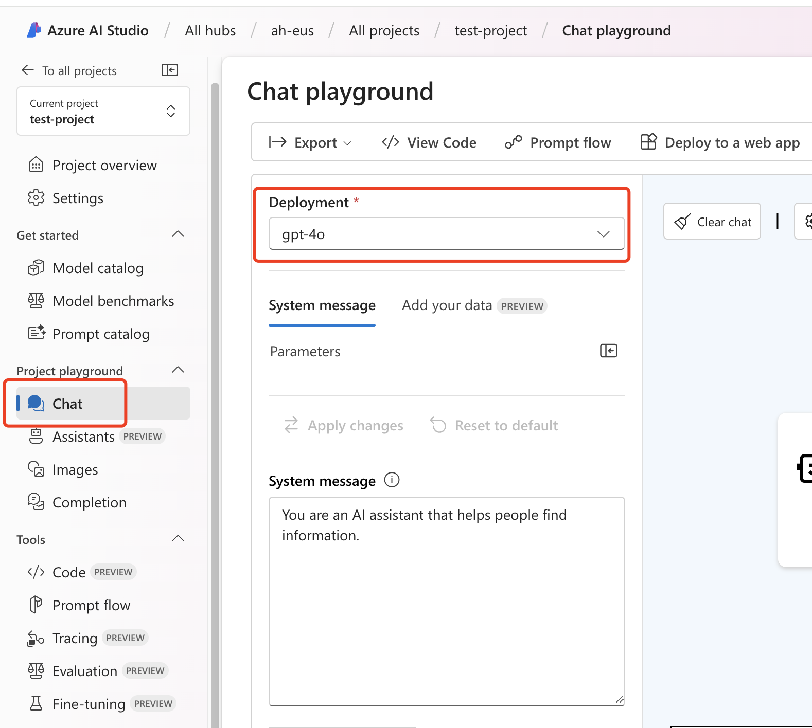

Using ChatGPT to help us solve problems in our work and daily life has become a habit. However, after using the official GPT-4o heavily, we may encounter temporary quota issues. Today, we will show you how to easily build your own personalized ChatGPT application using Azure OpenAI services.

## Prerequisites

Before we begin, make sure you have an Azure global subscription. If you don't have one yet, you can easily start an Azure subscription through [Pay-as-you-go](https://azure.microsoft.com/en-us/pricing/purchase-options/pay-as-you-go/?wt.mc_id=MVP_373702):

Note: To open a Pay-as-you-go Azure subscription, you need to bind an international credit card. As a new user, you will also have $200 of free credit, which you can fully utilize for Azure services.

Except for the costs incurred by interacting with GPT-4o, everything else mentioned here is free and will not generate any charges if not used in daily life. The cost of GPT-4o can also be completely covered by the free credit, so you don't have to worry about your credit card being maxed out.

Once you have successfully subscribed to Azure, let's get started!

## Step 1: Create Azure AI Studio Service

In the search bar at the top of the Azure subscription homepage, type "azure ai" and find Azure AI Studio:

Click to enter the Azure AI Studio resource page:

Click + New Azure AI Hub to enter the creation page:

From the interface, you can see that creating an Azure AI Hub is divided into 7 steps. Follow the instructions and select the default options all the way. The recommended region is East US, as there are some usage restrictions for free subscriptions, and based on experience, East US is more convenient to use.

Another thing to note is the cost. You can refer to the [Azure OpenAI pricing details](https://azure.microsoft.com/en-us/pricing/details/cognitive-services/openai-service/?wt.mc_id=MVP_373702) page to see the pricing for each model:

After the creation is complete, return to the Azure AI Studio resource page:

You can see that we have created an Azure AI hub and a corresponding Azure AI services resource.

## Step 2: Start Using Azure AI Studio

Click to open the Azure AI Hub resource we created in the first step. You will see a prominent Launch Azure AI Studio button in the details:

Clicking it will take you to a brand new Azure AI Studio interface:

This will be the main area where we work. Click on the AI Hub we just created in the list. Of course, we can still create a new AI Hub here:

In the AI Hub, we can see all the associated resources:

First, we need to create a Project. Click All projects in the left menu and then select the + New Project button above the list:

Creating a Project is very simple, just enter a name:

After creation, you will automatically enter the Project details page:

Now you can familiarize yourself with the AI Studio, Hub, and Project interfaces. Next, let's deploy the large language model!

## Step 3: Deploy the GPT-4o Large Language Model

Still in the Project interface, find the Deployments menu in the left menu bar and click to enter, then select the + Create Deployment button:

In the creation interface, we can see that Azure provides us with over 1000 different large language models to choose from. Of course, they require different computational resources, so you can try them one by one if you're interested (be careful not to max out your credit card). Here, we choose the GPT-4o model:

After selecting, enter the deployment page, modify the relevant options as needed, and click Deploy to start the deployment:

After successful deployment, we can see that GPT-4o appears in our deployment list:

## Step 4: Deploy Your Own ChatGPT Web Application

After confirming that the model deployment is successful, we enter the Chat menu in the left menu of the project and select the GPT-4o model we just created:

In the Chat interface, we can choose the large language model and test simple question and answer functions. Once everything is confirmed, we can start creating our own Web App. Select Deploy to a web app from the top menu:

In the deployment configuration, enter the name, select the subscription and region for the Web App deployment, and provide other information. If you want to save the chat history of ChatGPT, you can enable the option at the bottom, but it will create an additional CosmosDB database service and incur additional costs:

After confirming the deployment, wait for it to complete. If the deployment is successful, there will be a Launch button in the Chat interface:

Clicking it will open your own ChatGPT Web interface:

Note: By default, the Web App we deployed is authenticated based on the account (IAM) in your subscription. If you are using it yourself, you can keep this default behavior.

If you have the technical ability and want to customize and develop this personalized ChatGPT Web App, you can go to the [Git Repo](https://github.com/microsoft/sample-app-aoai-chatGPT?wt.mc_id=MVP_373702) to view all the implementation details and modify it to suit your own needs.

## Summary

With Azure AI services, we can implement many practical AI-related business scenarios, allowing us to go beyond the overwhelming news and endless imagination and personally experience and practice AI and large language models!
