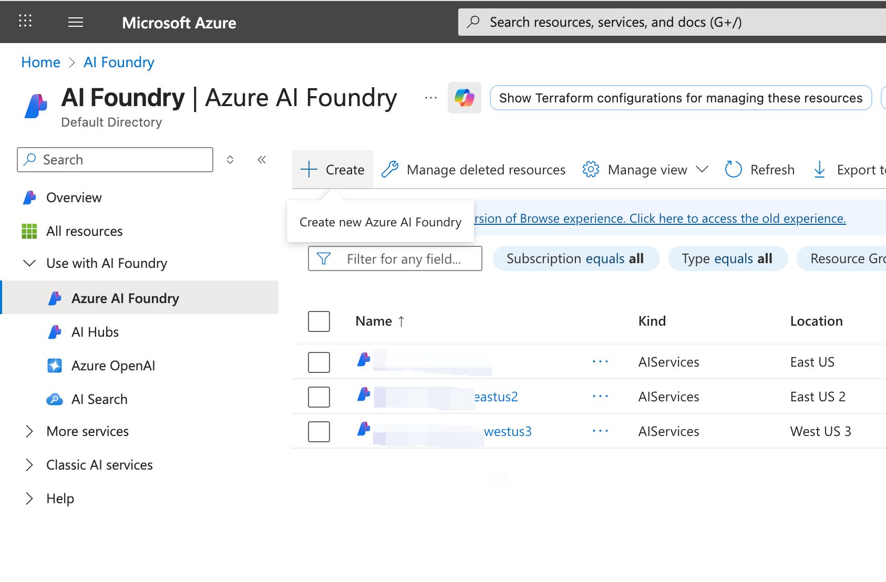
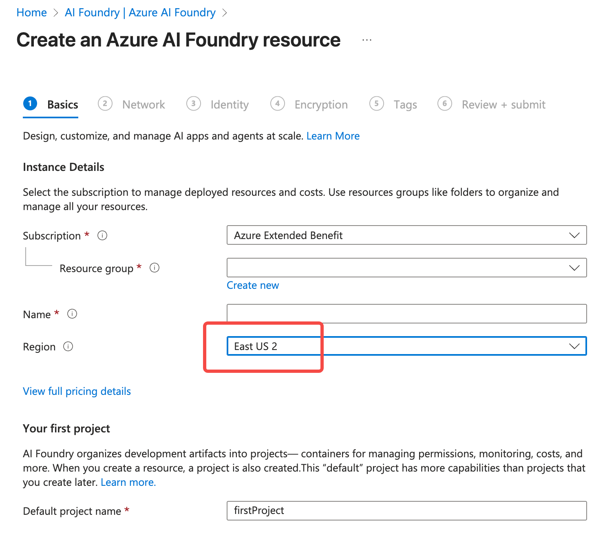
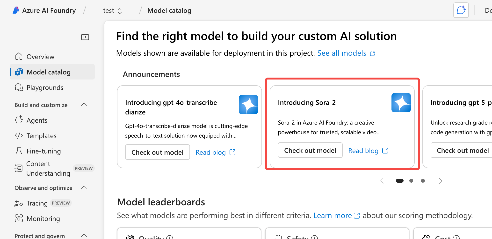
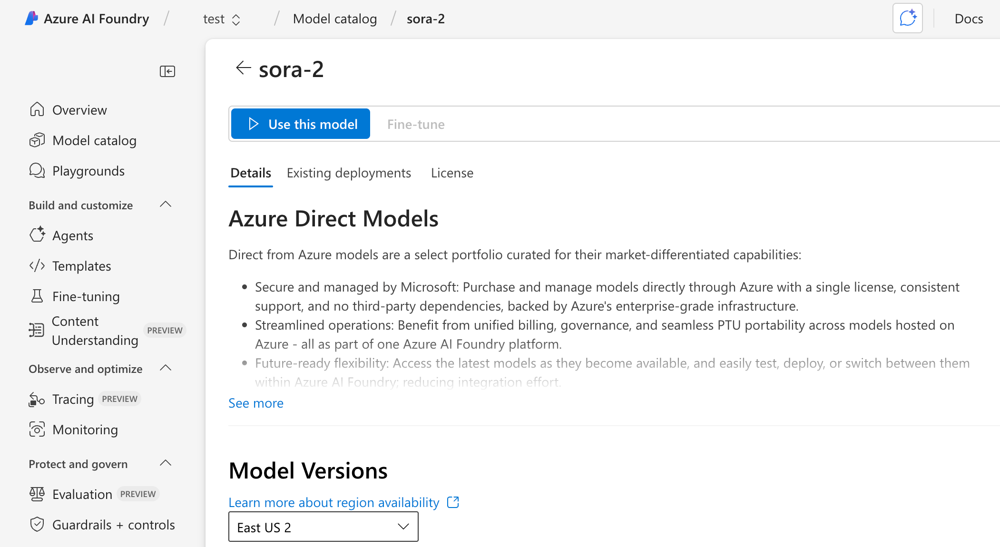
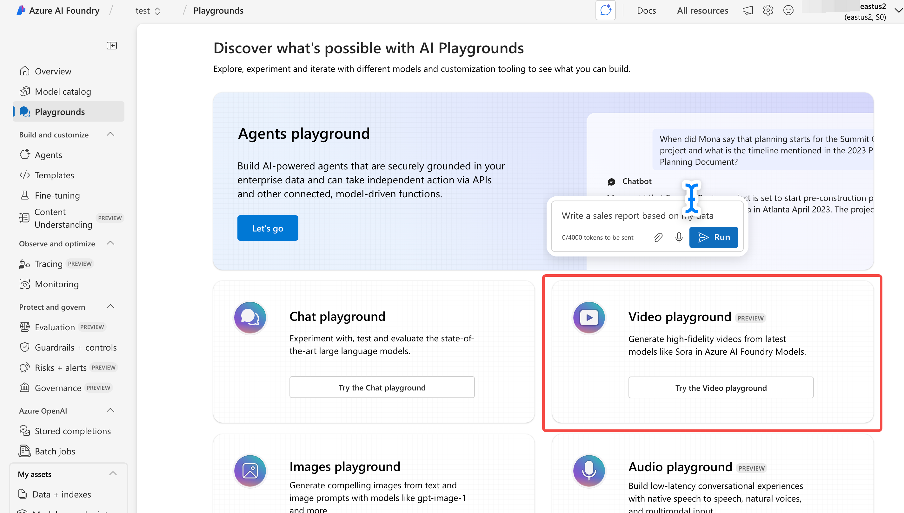
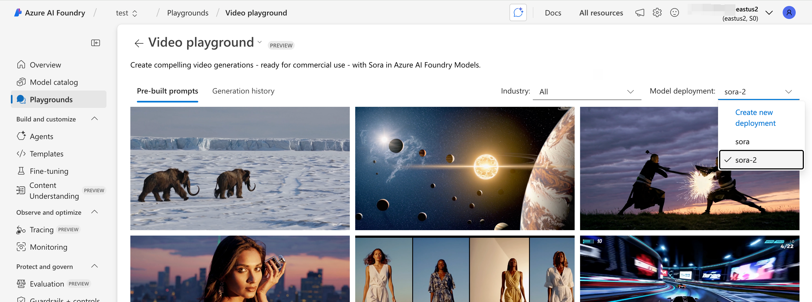

With Azure AI Foundry opening support for **Sora 2 (OpenAI's generative video model)**, developers can now access top-tier video generation capabilities in an enterprise-grade, compliant, and controllable environment. This tutorial will take you from zero to production, showing how to call Sora 2 via the **Playground** and the **Python SDK** to complete a "text-to-video" workflow.

## Prerequisites

Before starting, you need:

### Get an Azure subscription

You need an **Azure subscription**. If you're unsure how to get one, [refer to the subscription registration section in my earlier article](/en/blog/2024/build-own-chatgpt-on-azure/#prerequisites).

### Create an Azure AI Foundry

First, go to Azure AI Foundry in your Azure subscription. Expand All Resources, find Azure AI Foundry, and click Create to create a new Azure AI Foundry:



When creating it, be careful about the region. Because Sora 2 was in preview and not available in all regions at the time of writing, it's recommended to choose the East US 2 region:



### 1. Create an Azure AI Foundry Project

After creation, go into your Azure AI Foundry, find Projects under All Resources, and click New to create a new Project:


### 2. Open the Azure AI Foundry Portal

After creating the Project, open it and click Go to Azure AI Foundry portal:


Normally the Azure AI Foundry portal looks like this:


### 3. Enable and deploy the Sora 2 model

Since Sora 2 was still in preview at the time of this article, you may need to request access first. Later, once availability is open, you can skip this step. First click Model catalog on the left, find the Sora 2 model label, and click Check out model:



You can also find the desired model from the model list below.

If you don't have permission to use Sora 2, the model details page will show:


Click Request access to apply for permission.

If you already have access to Sora 2, click Use this model to deploy it:



Deployment is straightforward — you can keep the default options and create the deployment:


After deployment completes, switch the left menu to Models + endpoints to view the model list:


Now you have your own Sora 2 model and can start using it!

## Use Sora 2 via Azure AI Foundry Playground

Azure AI Foundry provides a powerful visual interface so you can generate videos without writing code.

### 1. Open the Playground

Open Playgrounds from the left menu and choose Video playground:



Once in the Playground, select the Sora 2 model:



### 2. Fill in the prompt

Sample prompt:

```text
A high-energy cyberpunk chase in the rain with neon reflections on wet streets. A futuristic motorcycle speeds through, dynamic motion blur capturing its sleek design and vibrant city lights.
```


### 3. Configure options

Adjustable options include:

| Option             | Description                                 |
| ------------------ | ------------------------------------------- |
| Attach an image    | You can attach an image to guide the video  |
| Aspect ratio       | Video aspect ratio, default is 16:9         |
| Resolution         | Resolution, currently only 720p is offered  |
| Duration           | Output video duration (e.g. 5s, 10s), default 8s |


### 4. Generate the video

After configuration, click Generate to create the video. When generation succeeds, you can preview or download it from Generation history:


## Call Sora 2 from Python

Azure provides a unified interface for OpenAI models, so you can call them directly from your backend.

### 1. Install the SDK

```bash
pip install azure-ai-openai
pip install python-dotenv
```

### 2. Configure environment variables

Create a `.env` file:

```bash
AZURE_OPENAI_ENDPOINT=https://<your-resource-name>.openai.azure.com/
AZURE_OPENAI_KEY=<your-key>
AZURE_OPENAI_API_VERSION=2024-10-01-preview
```

### 3. Python example: text-to-video

Here is a minimal runnable example:

```python
import os
from dotenv import load_dotenv
from azure.ai.openai import OpenAIClient
from azure.core.credentials import AzureKeyCredential

load_dotenv()

client = OpenAIClient(
    endpoint=os.getenv("AZURE_OPENAI_ENDPOINT"),
    credential=AzureKeyCredential(os.getenv("AZURE_OPENAI_KEY")),
    api_version=os.getenv("AZURE_OPENAI_API_VERSION")
)

prompt = """
A cinematic shot of a spaceship flying through a nebula filled with colorful cosmic clouds.
"""

response = client.get_video(
    model="sora-2",
    prompt=prompt,
    duration=5,              # seconds
    resolution="1080p",
)

# Save video
video_bytes = response.video
with open("output.mp4", "wb") as f:
    f.write(video_bytes)

print("Video generated: output.mp4")
```

### 4. Using a structured payload

Sora also supports finer control such as shots, storyboard scripts, and environment details.

```python
payload = {
    "prompt": "A cute corgi running on a beach during sunset.",
    "duration": 8,
    "resolution": "720p",
    "motion": "medium",
    "style": "realistic"
}

response = client.get_video(
    model="sora-2",
    **payload
)

with open("corgi_beach.mp4", "wb") as f:
    f.write(response.video)
```

## Tips for generating better videos

### 1. Recommended prompt structure (General Prompt Template)

```text
[Main subject] + [Scene environment] + [Action] + [Camera effects] + [Lighting] + [Style]
```

Example:

```text
A high-energy cyberpunk chase in the rain with neon reflections on wet streets. A futuristic motorcycle speeds through, dynamic motion blur capturing its sleek design and vibrant city lights.
```

### 2. Control consistency

* Use a **seed** for reproducible, style-consistent generations
* Set motion level appropriately for more natural movement
* Provide clear scene descriptions to reduce model misinterpretation

## FAQ

### 1. I tried but can't see Sora 2?

You currently need access permission. You should:

* Contact your Azure administrator
* Check the model page to confirm it has been enabled

### 2. What's the maximum video duration?

Limits vary by region; typically **≤ 10 seconds**.

### 3. My Python-generated video is too small or empty?

Ensure you save `response.video` rather than the wrong field.

## Summary

This article introduced two ways to use the **Sora 2 text-to-video model** in **Azure AI Foundry**:

* Use the visual **Playground** for quick experiments
* Use the **Python SDK** to automatically generate videos in production

Azure's enterprise-grade security and compliance make Sora 2 a strong option for bringing video generation into enterprise scenarios.
