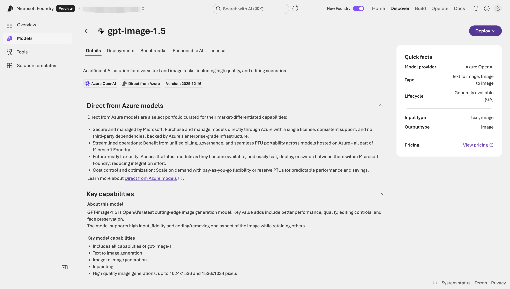
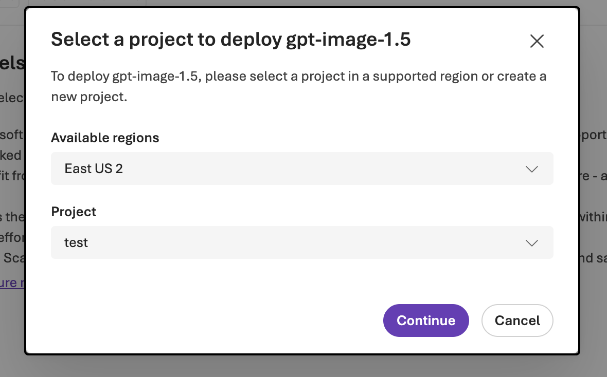
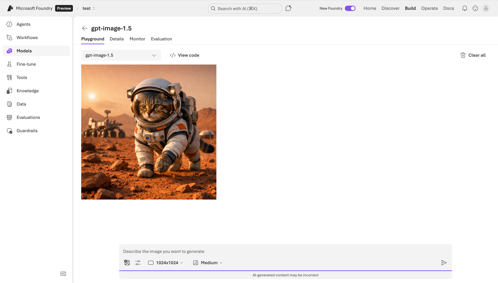

In recent years, generative AI technology has evolved rapidly. Beyond natural language processing, **image generation and editing capabilities have become a key frontier of AI innovation**. In this trend, OpenAI launched the GPT Image series models, which are also available within the Azure OpenAI Service. The newly released **GPT-Image-1.5** can be seen as the new flagship in the field of image generation, offering significant improvements in performance, efficiency, and controllability.

## What is GPT-Image-1.5

GPT-Image-1.5 is OpenAI's latest **multimodal image generation model**, part of the GPT Image series, and currently the best-performing version. Compared to its predecessors (such as GPT-Image-1), it shows marked improvements in instruction following, image quality, generation speed, and cost efficiency.

Officially defined, GPT Image models are **natively multimodal language models capable of accepting text and image inputs and generating image outputs**. Functionally, it supports not only generating images from pure text but also editing, modifying, and stylizing existing images.

In short:

* **Multimodal**: Understands both text and image inputs simultaneously.
* **Image Generation & Editing**: Supports generating new images from text, as well as local modifications and enhancements to existing images.
* **High Quality & Efficient**: Generates finer details faster and at a lower cost compared to previous generations.

## Core Capabilities and Features

### 1. Precise Instruction Following and Expression

GPT-Image-1.5 has significantly improved in understanding natural language prompts, excelling particularly in:

* **Visual expression of complex descriptions**, with more accurate understanding of details.
* **Generating clear and readable text content within images**.
* **Following user instructions for customized modifications and combinations**.

Compared to initial image generation models (like the DALL·E series), these GPT Image series models respond to prompts more intuitively and with higher controllability.

### 2. Improved Image Quality and Generation Speed

The generation speed of GPT-Image-1.5 is much faster than the previous generation (reportedly up to about 4x faster), which is crucial for scenarios requiring rapid iteration of visual content (such as design, product prototyping, etc.).

Furthermore, the image generation results perform better in terms of detail, realism, and consistency, with significant progress in key elements like faces, textures, and lighting.

### 3. Editing and Enhancement Capabilities

GPT-Image-1.5 also supports image editing, including:

* **Local Modification**: Changing selected areas.
* **Adding or Removing Elements**.
* **Stylistic Adjustments and Concept Transformation**.

There is no need to completely regenerate the entire image, significantly improving workflow efficiency.

### 4. Cost and Efficiency Optimization

The API call cost for GPT-Image-1.5 is reduced by approximately 20% compared to the previous generation, making high-quality image generation sustainable on a larger scale, especially suitable for enterprise-level batch generation needs.

### 5. Security and Compliance

As part of the Azure OpenAI Service, the use of GPT-Image-1.5 is protected by Azure's **security, compliance, and content filtering systems**, supporting various customized moderation and responsible use safeguards.

## Deploying and Using GPT-Image-1.5 in Microsoft Foundry

With the launch of **Microsoft Foundry** (currently in Preview), Microsoft is integrating Azure OpenAI, model catalog, inference endpoints, Playground, and enterprise governance capabilities into a **unified AI application building platform**. In this preview version, **GPT-Image-1.5 has been directly included in Foundry's model system as a first-class model**, eliminating the need to manage it through the traditional "Azure AI Foundry / Azure AI Studio" path.

### 1. Deploying GPT-Image-1.5 in Microsoft Foundry

In the Preview version of Foundry, the model deployment process is closer to "product-grade model hosting" rather than traditional Azure resource configuration:

First, enter the **Microsoft Foundry (Preview) Console**. Select **Models** on the left. Find **GPT-Image-1.5** (Image / Multimodal category) in the model list.


After opening the model details page, click **Deploy** to create a new inference deployment.



Select the default deployment, simply choose a **Region**, and the deployment is complete. The whole process is very simple:



Once deployed, you will automatically enter the GPT-Image-1.5 Playground:


Upon completion, Foundry automatically generates:

* A callable **Inference Endpoint**
* Identity, quota, and monitoring policies bound to it

This flow emphasizes **Model as a Service**, where developers no longer need to directly concern themselves with the complex configuration of underlying Azure OpenAI resources.

### 2. Using Foundry Playground for Image Generation and Prompt Validation

Microsoft Foundry (Preview) has a built-in unified **Playground** for interactive experimentation with GPT-Image-1.5.

In the Playground, you can:

* Directly input text Prompts to generate images.
* Adjust parameters like image size and quality level.
* Quickly validate the effects of complex descriptions and stylistic instructions.
* Compare generation results of different Prompts.

This capability is particularly suitable for collaboration among the following roles:

* Product Managers: Validating the feasibility of visual ideas.
* Designers: Exploring generation styles and composition.
* Engineers: Solidifying Prompt templates before writing code.

The positioning of the Playground in the Preview version of Foundry is **Prompt as an Asset**, where validated Prompts can be directly migrated to production code.

The generated image effect is as follows:



### 3. Integration from Foundry to Application Code

At the application level, **GPT-Image-1.5 deployed via Microsoft Foundry (Preview) essentially still provides services in the form of a standard inference Endpoint**:

* On the code side, you only need to care about:
  * Endpoint URL
  * Deployment Name
  * Authentication method
* No longer directly dependent on the model's original name or version number.

In enterprise practice, the common pattern is:

* Development / Test / Production environments use different Deployments.
* Model version upgrades (e.g., GPT-Image-1.5 → future versions) are completed at the Foundry layer.
* Application code remains unchanged, only consuming the stable Endpoint.

This pattern significantly reduces the **intrusiveness of model evolution on business systems**.

## How to Use GPT-Image-1.5 in Azure OpenAI

You can call GPT-Image-1.5 through the API, SDK provided by Azure OpenAI, or the Azure AI Foundry platform. The basic process is as follows:

### 1. Get Access and Deploy Model

On the model details page, you can view all information for calling GPT-Image-1.5 via code:


### 2. Generate Images using REST API

Use a `POST` request to call the image generation endpoint:

```sh
POST https://<your_resource>.openai.azure.com/openai/deployments/<your_deployment>/images/generations?api-version=<api_version>
Content-Type: application/json
api-key: <your_api_key>

{
  "prompt": "A cat in a spacesuit walking on the surface of Mars",
  "size": "1024x1024",
  "n": 1,
  "quality": "high"
}
```

Common parameters:

* `prompt`: Text description.
* `size`: Image dimensions (e.g., 1024x1024).
* `n`: Number of images to generate.
* `quality`: Generation quality (low/medium/high).

### 3. Image Editing (If Supported)

Upload an existing image and combine it with prompt instructions for modification:

```sh
POST /images/edits
```

Such calls can specify fields like mask and input image to control local changes.

### 4. SDK and Development Environment

Azure supports SDKs in multiple languages (e.g., Python, C#), allowing you to securely call APIs and handle generation results using the Azure Identity authentication library.

## Summary

GPT-Image-1.5 represents the capability boundary of the next stage of AI creative tools in the field of image generation. It offers significant improvements in instruction understanding, generation speed, image quality, cost efficiency, and multimodal processing, providing developers and enterprises with a powerful and scalable visual AI solution.

For teams looking to build mid-to-long-term AI capability platforms, Foundry + GPT-Image-1.5 is a more engineered and sustainable choice than using raw APIs directly.

The Azure OpenAI Service combines model capabilities with enterprise-grade security and compliance, making GPT-Image-1.5 suitable not only for experimental exploration but also for supporting production-grade applications.

If you are building applications that require visual understanding or automated creative generation, whether for batch generation or interactive experiences, GPT-Image-1.5 is worth in-depth practice.
