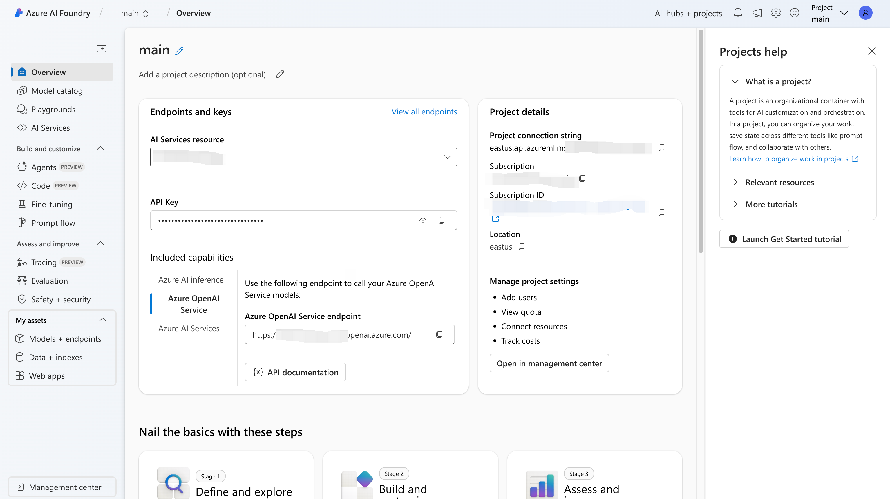
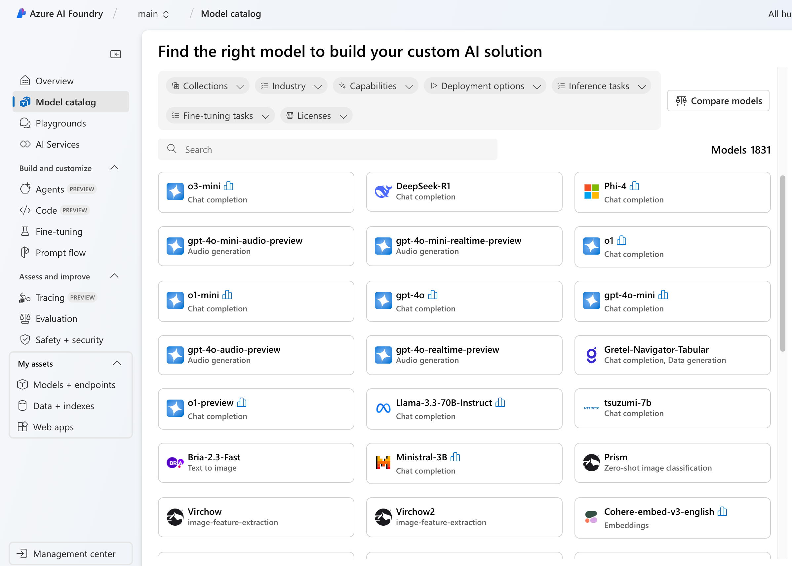
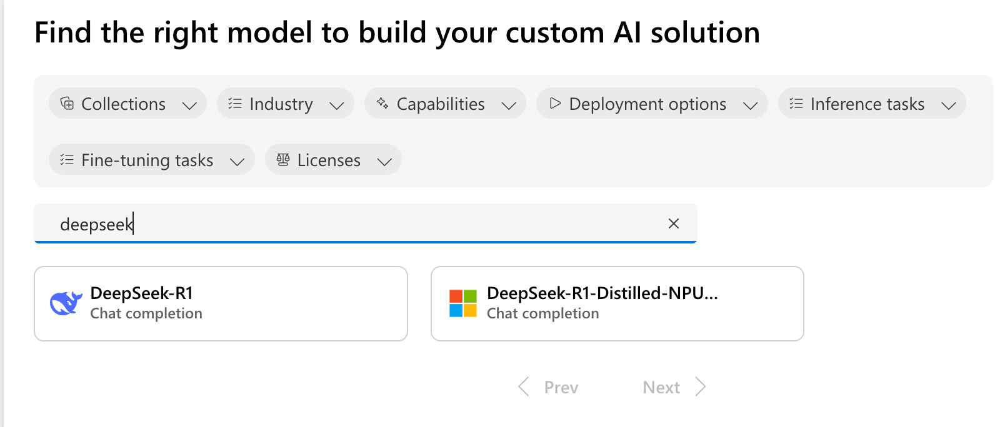
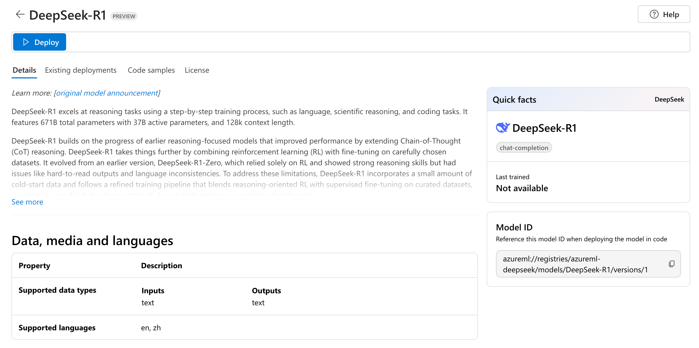
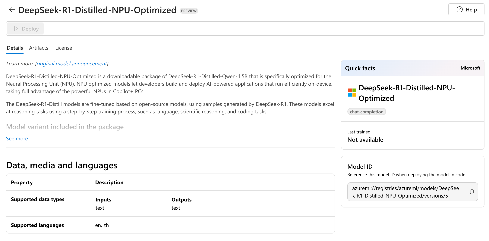
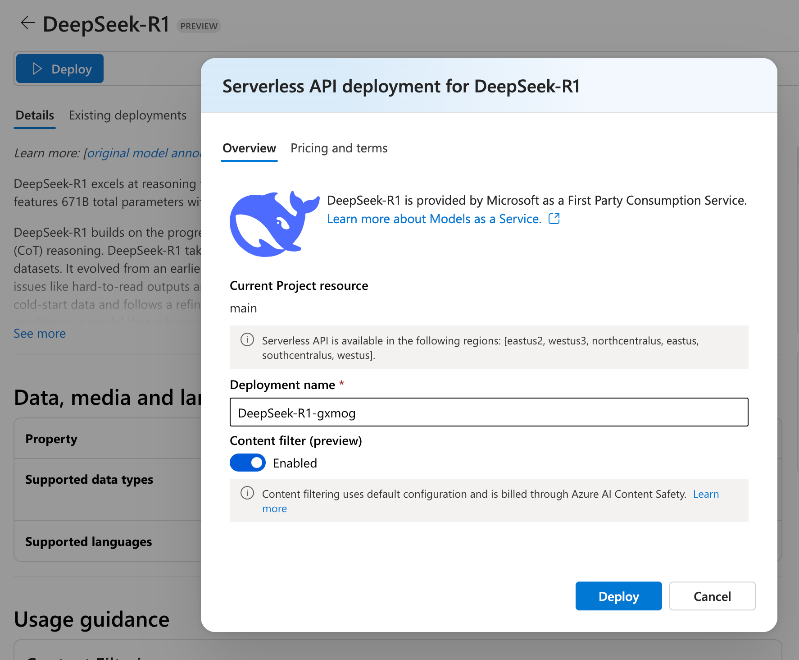
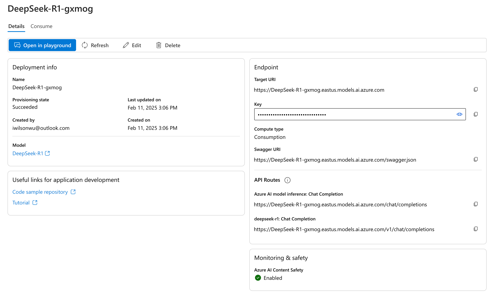
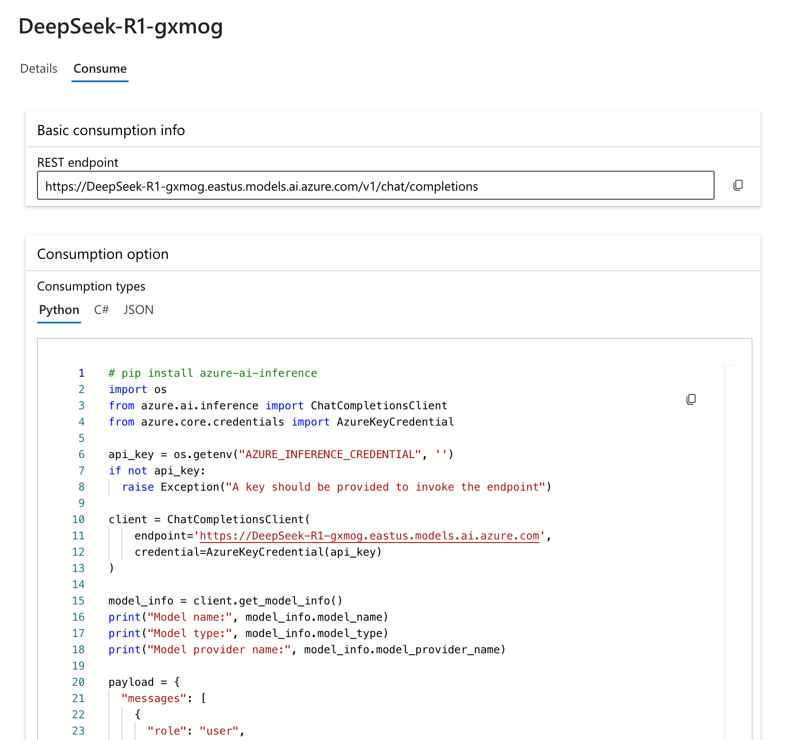

The popularity of DeepSeek has once again showcased the charm of AI. However, this has not led to a reduction in the demand for computing power. Instead, it has brought about another wave of demand for computing power by building more AI business scenarios in low-cost, user-friendly artificial intelligence. Today, we will quickly experience the elegance of DeepSeek through Azure AI Foundry (formerly Azure AI Studio).

## Prerequisites

First, you need to have an Azure subscription. New users can refer to the steps in [Building Your Own ChatGPT on Azure Without Any Code](https://wilsonwu.me/en/blog/2024/build-own-chatgpt-on-azure/#prerequisites) to get started. Then, create AI Foundry and related resources in your Azure subscription by following the steps in [Creating Azure AI Foundry Service](https://wilsonwu.me/en/blog/2024/build-own-chatgpt-on-azure/#step-1-create-azure-ai-studio-service). Once everything is set up, go to the Azure AI Foundry homepage and open the project named "main". The interface looks like this:



## Deploying the DeepSeek-R1 Large Language Model (LLM)

Click on the Model catalog in the left menu to enter the model list page:



Here, you can see that Azure offers over 1800 models to meet users' diverse needs.

Enter "DeepSeek" in the search box to view the types of DeepSeek models supported by Azure:



The first one is the full version of the DeepSeek-R1 610B model:



Another is the NPU-optimized distilled version of DeepSeek-R1 1.5B based on Qwen:



We will choose the 610B version for deployment. Enter the model details and click Deploy to confirm the deployment:



Click Deploy again to complete the deployment. After the deployment is finished, it will automatically jump to the Models + endpoints details in My assets:



At this point, the deployment of DeepSeek-R1 610B is complete, and the entire process is very simple.

## Invoking DeepSeek-R1 for Inference

Next, we will try to invoke the model we just deployed for a conversation. Enter the model details and click the Consume Tab:



Here, we will use Python code to try it out. The code is as follows:

```python
# pip install azure-ai-inference
import os
from azure.ai.inference import ChatCompletionsClient
from azure.core.credentials import AzureKeyCredential

api_key = os.getenv("AZURE_INFERENCE_CREDENTIAL", 'Replace to the real Key of your DeepSeek deployment')
if not api_key:
  raise Exception("A key should be provided to invoke the endpoint")

client = ChatCompletionsClient(
    endpoint='https://DeepSeek-R1-gxmog.eastus.models.ai.azure.com',
    credential=AzureKeyCredential(api_key)
)

model_info = client.get_model_info()
print("Model name:", model_info.model_name)
print("Model type:", model_info.model_type)
print("Model provider name:", model_info.model_provider_name)

payload = {
  "messages": [
    {
      "role": "user",
      "content": "I am going to Paris, what should I see?"
    },
    {
      "role": "assistant",
      "content": "Paris, the capital of France, is known for its stunning architecture, art museums, historical landmarks, and romantic atmosphere. Here are some of the top attractions to see in Paris:\n\n1. The Eiffel Tower: The iconic Eiffel Tower is one of the most recognizable landmarks in the world and offers breathtaking views of the city.\n2. The Louvre Museum: The Louvre is one of the world's largest and most famous museums, housing an impressive collection of art and artifacts, including the Mona Lisa.\n3. Notre-Dame Cathedral: This beautiful cathedral is one of the most famous landmarks in Paris and is known for its Gothic architecture and stunning stained glass windows.\n\nThese are just a few of the many attractions that Paris has to offer. With so much to see and do, it's no wonder that Paris is one of the most popular tourist destinations in the world."
    },
    {
      "role": "user",
      "content": "What is so great about #1?"
    }
  ],
  "max_tokens": 2048
}
response = client.complete(payload)

print("Response:", response.choices[0].message.content)
print("Model:", response.model)
print("Usage:")
print("	Prompt tokens:", response.usage.prompt_tokens)
print("	Total tokens:", response.usage.total_tokens)
print("	Completion tokens:", response.usage.completion_tokens)
```

Create a .py file (e.g., ds-demo.py), paste the above code into it, replace the api_key variable with your own Key, and then run the following command to install the dependency package:

```bash
pip install azure-ai-inference
```

Then run the code:

```bash
python ds-demo.py
```

Under normal circumstances, the output will be similar to the following:

```text
Model name: deepseek-r1
Model type: chat-completion
Model provider name: DeepSeek
Response: <think>
Okay, the user asked, "What is so great about #1?" referring to the Eiffel Tower from my previous list. Let me break down how to approach this.

First, I need to recall the initial response where I listed the Eiffel Tower as number 1. The user wants more depth on why it's considered great. They might be planning their trip and prioritizing attractions, or they're curious about its significance beyond just being famous.

I should start by highlighting its iconic status. Everyone knows the Eiffel Tower, but why? Maybe mention its historical context, like being built for the 1889 World's Fair. People often appreciate the history behind landmarks.

Then, the views from the tower are a big selling point. The panoramic scenes of Paris from different levels. Maybe mention specific landmarks visible from there, like the Seine River or the Champ de Mars.

Architectural aspects are important too. The design by Gustave Eiffel and the engineering marvel it was at the time. Some might not know it was initially controversial, so that's an interesting fact.

The cultural significance: how it's a symbol of Paris and France. Its presence in media, movies, art, etc. Also, the light shows at night could be a romantic or must-see aspect.

Practical info like dining options, maybe the Michelin-starred restaurant. Visitors might not know about the shops or the champagne bars, which add to the experience.

Seasonal variations could be useful too. Visiting during different times of the year offers different experiences, like ice skating in winter.

Also, touching on the emotional aspect—the atmosphere, the feeling of being there. It's a bucket list item for many, so that personal achievement angle might resonate.

Need to balance facts with engaging descriptions. Avoid jargon, keep it friendly and informative. Make sure to address both the objective reasons (history, architecture) and subjective experiences (views, ambiance). Check for any common misconceptions, like it being temporary, which adds intrigue.

Finally, wrap it up by reinforcing why it's a must-visit, summarizing the key points. Ensure the user feels excited and informed enough to prioritize visiting the Eiffel Tower.
</think>

The **Eiffel Tower** (La Tour Eiffel) is iconic for so many reasons—it’s not just a landmark, it’s a symbol of Paris, France, and even romance itself. Here’s why it’s so special:

---

### 1. **Engineering Marvel & Historical Significance**  
   - Built for the **1889 World’s Fair** to celebrate the 100th anniversary of the French Revolution, it was initially criticized by some as an eyesore. Today, it’s a testament to 19th-century engineering genius by **Gustave Eiffel**.  
   - At 1,083 feet (330 meters), it was the **tallest man-made structure in the world** until 1930, showcasing groundbreaking use of iron and rivet construction.

---

### 2. **Breathtaking Views**  
   - The tower offers **360° panoramic views** of Paris from three levels. The second floor (115 meters) is ideal for photos, while the **top floor** (276 meters) lets you gaze over the entire city, spotting landmarks like the Arc de Triomphe, Sacré-Cœur, and the Seine River.  
   - Visit at sunset or nighttime for magical vistas as the city lights sparkle.

---

### 3. **Cultural & Romantic Symbol**  
   - The Eiffel Tower embodies Parisian elegance and has starred in countless films, books, and artworks.  
   - Its **nightly light show** (every hour after dusk until 1 a.m.) features 20,000 golden bulbs twinkling for 5 minutes—pure magic.  

---

### 4. **Ever-Changing Experience**  
   - Seasonal activities: Sip champagne at the top, enjoy a meal at the **Michelin-starred Jules Verne restaurant**, or (in winter) skate on a temporary ice rink on the first floor.  
   - It’s also adorned differently for events (e.g., lit in rainbow colors for Pride Month or draped in the Ukrainian flag in solidarity).

---

### 5. **Universal Bucket-List Moment**  
   - Standing beneath its lattice structure or ascending its heights feels surreal—a visceral connection to history and human achievement.  
   - For many, visiting the Eiffel Tower fulfills a lifelong dream of being in Paris, making it deeply personal and unforgettable.

---

### Fun Fact:  
The tower was meant to be **temporary** (lasting just 20 years), but its value as a radio transmission tower saved it from demolition. Now, over **7 million visitors** see it annually!

Whether you admire it from the Champ de Mars, climb its stairs, or toast with champagne at the summit, the Eiffel Tower is a must-see—it’s Paris in its most iconic form. ✨
Model: deepseek-r1
Usage:
        Prompt tokens: 200
        Total tokens: 1235
        Completion tokens: 1035
```

## 总结

DeepSeek 的优势在于其强大的自然语言处理能力和高效的推理性能。通过 Azure AI Foundry 部署，用户可以快速上手并体验其强大的功能。DeepSeek-R1 提供了多种模型版本，满足不同需求，从全量版到经过优化的蒸馏版，用户可以根据实际应用场景选择合适的模型。

## Conclusion

The advantage of DeepSeek lies in its powerful natural language processing capabilities and efficient inference performance. By deploying through Azure AI Foundry, users can quickly get started and experience its powerful features. DeepSeek-R1 offers multiple model versions to meet different needs, from the full version to the optimized distilled version, allowing users to choose the appropriate model based on actual application scenarios.
