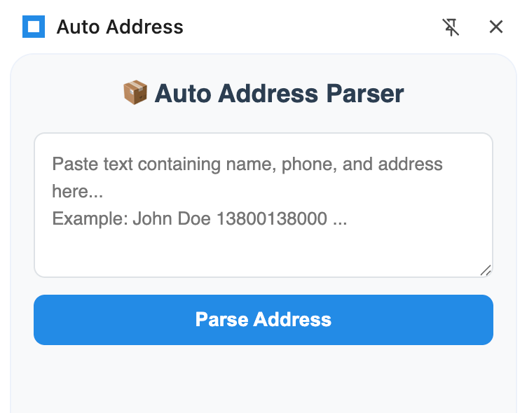
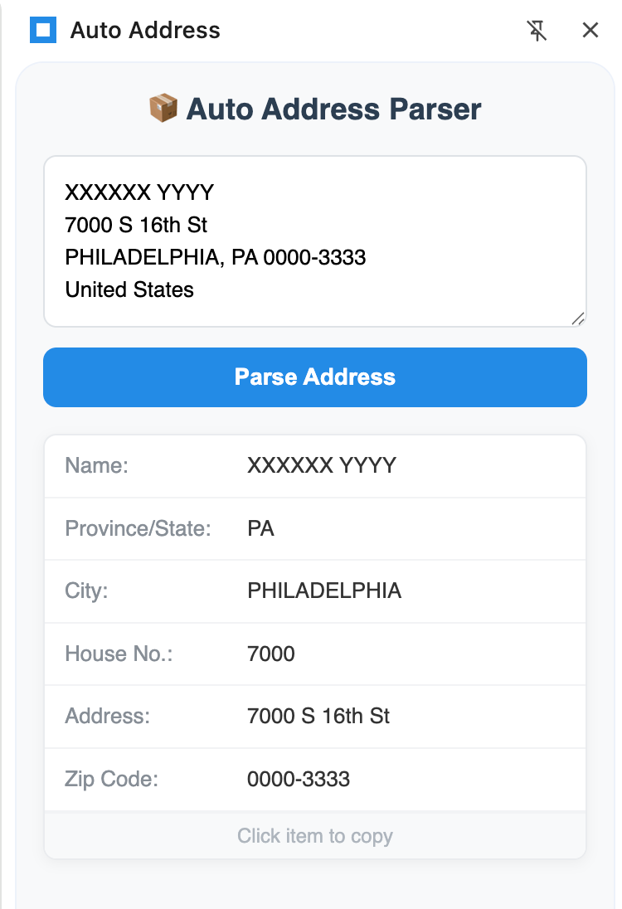
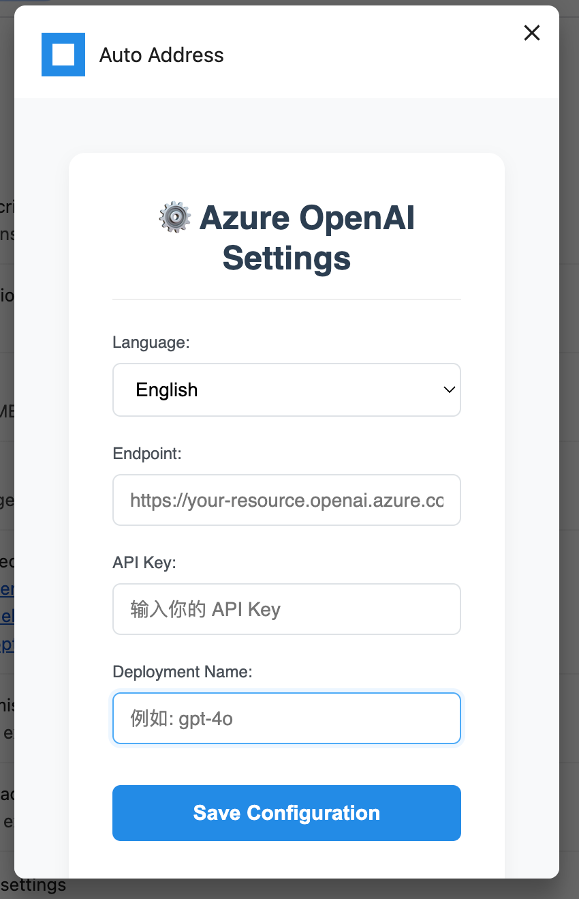

In the e-commerce and logistics sectors, there is an overlooked but extremely time-consuming pain point: **entering complex address formats correctly into fixed fields in logistics systems**. Addresses sent by customers come in all sorts of strange formats—sometimes comma-separated, sometimes all in one line, with completely random orders, and often missing key information like province or state.

In this article, I want to share how I built **Auto Address**, a Chrome and Edge browser extension that leverages the power of **Azure OpenAI** to solve this problem. Its interface and usage are extremely simple.



## The Problem: Unstructured Data

Imagine receiving this text:
> "Zhang San 13800138000 3rd Floor, R2-B, South District, Science and Technology Park, Nanshan District, Shenzhen, Guangdong Province"

To ship, you need to break it down into:

- **Name**: Zhang San
- **Phone**: 13800138000
- **Address**: 3rd Floor, R2-B, South District, Science and Technology Park
- **City**: Shenzhen
- **Province**: Guangdong Province
- **Country**: China

Manually processing hundreds or thousands of orders is tedious and error-prone. Regular expressions (Regex) can handle some cases, but they are often powerless when formats change or users make typos.

## The Solution: LLM as a Parser



Large Language Models like Azure OpenAI (e.g., GPT-4 or GPT-5) excel at understanding context. They can distinguish between street names and city names not because of rigid rules, but because they understand the **semantics** of addresses.

I chose **Azure OpenAI** for this project for two main reasons:

1. **Enterprise-grade Privacy**: Data sent to Azure OpenAI is not used to train public models.
2. **Reliability**: Stable uptime and performance.

## Under the Hood: How It Works

The core logic of the plugin is surprisingly simple. It takes user input and sends it along with a set of very specific instructions to the Azure OpenAI API.

### 1. System Prompt

The "magic" lies in the system prompt. We need to tell the model exactly what to do and, more importantly, how to format the output.

Here is the actual prompt used in the code:

```javascript
{
  role: "system", 
  content: "You are an address parser. Return ONLY a raw JSON object (no markdown code blocks) with keys: name, province, city, address, zip_code, country. If province/state is missing in the input, infer it from the city. Do not separate house number, include it in the address field."
}
```

**Key techniques used here:**

- **Role Definition**: "You are an address parser."
- **Output Constraints**: "Return ONLY a raw JSON object". This prevents the model from adding fluff like "Here is your JSON:".
- **Schema Definition**: We explicitly list the keys we want (`name`, `province`, etc.).
- **Logic Injection**: "If province/state is missing... infer it." This offloads logic processing to the AI.

### 2. API Call

The extension uses the standard `fetch` API to communicate with your Azure deployment.

```javascript
const url = `${baseUrl}openai/deployments/${azureDeployment}/chat/completions?api-version=2024-05-01-preview`;

const response = await fetch(url, {
  method: 'POST',
  headers: {
    'Content-Type': 'application/json',
    'api-key': azureApiKey
  },
  body: JSON.stringify({
    messages: [ /* ... prompt ... */ ],
    temperature: 0.1 // for consistent, deterministic results
  })
});
```

We use a low `temperature` (0.1) because we don't need creativity; we need precision.

### 3. Smart Province Inference ("Double Check")

Sometimes, even the best models miss details, or the input is too vague. A common issue is missing province/state information.

I implemented a "fallback" mechanism in `popup.js`. If the parsed result has a city but no province, the extension initiates a **second targeted API call**:

```javascript
if ((!addr.province || addr.province === '') && addr.city) {
  // ... second call ...
  messages: [
    {
      role: "system", 
      content: "You are a geography helper. Return ONLY the province/state name for the given city. Do not return JSON, just the name."
    },
    {
      role: "user", 
      content: `Which province/state is the city "${addr.city}"${countryContext}?`
    }
  ]
}
```

This ensures that the data is as complete as possible before the user sees it.

## Chrome / Edge Extension Architecture

### Manifest V3 and Side Panel

The extension is built on **Manifest V3**, the latest iteration of the Chrome / Edge extension platform.

Instead of a traditional popup that closes on click, I used the **Side Panel API** (`"permissions": ["sidePanel"]`). This allows the extension to stay on one side of the browser window. This is crucial for workflow: users can view the shipping order page on the left while viewing the parsed address data on the right.

### Privacy First

Before using it, you need to configure the Azure OpenAI information you want to use via the options interface:



The main design decision is **zero intermediate servers**.

- The extension uses `chrome.storage.sync` to store your API key locally in the browser.
- Requests go directly from **your browser** -> **Azure OpenAI**.
- The extension developer collects no data.

## Conclusion

By combining the flexibility of Chrome / Edge extensions with the intelligence of Azure OpenAI, we can transform tedious data entry tasks into one-click operations.

The code is open source. Feel free to check it out, Fork it, and build your own AI-driven tools!

**GitHub Repo**: [https://github.com/wilsonwu/autoaddr](https://github.com/wilsonwu/autoaddr)

If you are using the Microsoft Edge browser, you can install the latest version of this plugin via the extension marketplace: [Edge Browser Extension](https://microsoftedge.microsoft.com/addons/detail/auto-address-smart-ship/ieaphpecggbaiineilddheaghcolkbba)
