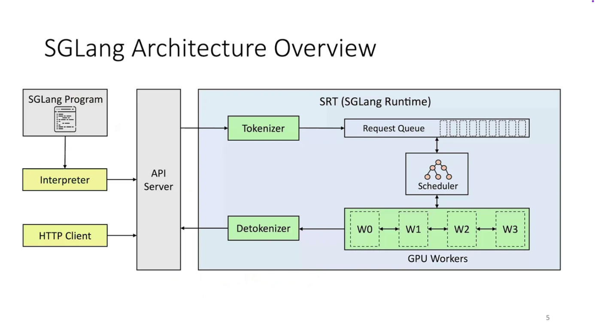

As large language models (LLMs) grow in popularity, the focus for enterprises and individuals has shifted from training to inference (in other words, moving from “building wheels” to practical usage). In the field of inference, the two hottest frameworks are undoubtedly vLLM and SGLang. As a rising star, SGLang has also attracted attention. Today, we’ll explore SGLang through a beginner-friendly tutorial to help more people understand both LLM inference and the SGLang framework.

## Introduction to SGLang

SGLang is a high-performance inference framework for large language models (LLMs) and vision-language models (VLMs). It combines a carefully designed backend runtime with a flexible frontend language to make model interaction more efficient and controllable. Its core advantages include:

* **Efficient Backend Runtime**: Implements innovative RadixAttention technology for prefix caching; supports speculative decoding, zero-overhead CPU scheduling, continuous batching, paged attention, tensor parallelism, FlashInfer kernels, chunked prefill, and multiple quantization methods (FP8/INT4/AWQ/GPTQ), greatly improving inference efficiency.
* **Flexible Frontend Language**: Provides intuitive and powerful LLM programming interfaces, supporting chainable generation calls, advanced prompt engineering, complex control flow, multimodal input, parallel execution, and external system interaction.
* **Broad Model Compatibility**: Supports mainstream generative models (Llama, Gemma, Mistral, QWen, DeepSeek, LLaVA, etc.), embedding models (e5-mistral, gte), and reward models (Skywork), with a simple mechanism for extending new models.
* **Vibrant Open-Source Ecosystem**: Backed by a fast-growing community and recognized widely in the industry (as of March 17, 2025, the GitHub repository had over 12,000 stars).

Its technical architecture is illustrated below:



For beginners, several additional features are worth noting:

* **OpenAI-Compatible API**: Use the OpenAI Python SDK or cURL directly—no need to change your application code.
* **High Throughput & Low Latency**: Combines continuous batching and prefix caching so requests with the same prefix can reuse computation.
* **Production-Friendly**: Supports concurrency, streaming output, and direct integration with Hugging Face model hub.

## Environment Preparation

Before starting, prepare the following environment:

* **OS**: Linux recommended (Ubuntu 20.04+ commonly used). WSL2 can also be tried.
* **Python**: Version 3.10 or 3.11 recommended.
* **GPU**: NVIDIA GPUs recommended. 24GB VRAM can handle 7B/8B models (e.g., Llama 3.1 8B). Without a GPU, you can still run small or quantized models, but performance is limited.
* **Model Source**: Hugging Face (e.g., meta-llama/Llama-3.1-8B-Instruct) or a local path.

## Installing SGLang

Once the environment is ready, install via pip (ensure pip is installed; using a virtual environment is optional):

```bash
pip install sglang openai huggingface-hub
```

If you need to download private or restricted models from Hugging Face automatically, log in or set your token first:

```bash
huggingface-cli login
# or
export HF_TOKEN=your_token
```

## Starting the SGLang Service

There are two ways to start the SGLang service. CLI arguments may differ between versions—if you see mismatched arguments, run `--help` to check supported parameters in your version.

### Start via Launcher

```bash
python -m sglang.launcher \
  --model meta-llama/Llama-3.1-8B-Instruct \
  --host 0.0.0.0 \
  --port 30000 \
  --tp 1 \
  --max-model-len 8192
```

Key parameters:

* `--model`: Hugging Face model name or local weight path
* `--host/--port`: Service listen address and port
* `--tp`: Tensor parallelism degree (1 for single GPU; 2, 4, etc. for multi-GPU)
* `--max-model-len`: Maximum context length

Notes:

* For Hugging Face models, the first run will download weights—ensure a stable network connection.
* If VRAM is insufficient, try a smaller model or reduce `--max-model-len`.

### Start via `sglang` Command

If your version supports the `sglang serve` command, you can also start with:

```bash
sglang serve -m meta-llama/Llama-3.1-8B-Instruct --host 0.0.0.0 --port 30000
```

## Quick Verification

Once started, the OpenAI-compatible API can be tested with:

```bash
curl http://127.0.0.1:30000/v1/chat/completions \
  -H "Content-Type: application/json" \
  -H "Authorization: Bearer EMPTY" \
  -d '{
    "model": "meta-llama/Llama-3.1-8B-Instruct",
    "messages": [
      {"role": "system", "content": "You are a helpful assistant."},
      {"role": "user", "content": "Introduce yourself in two sentences."}
    ],
    "max_tokens": 128,
    "temperature": 0.2
  }'
```

If successful, you’ll get a standard ChatCompletion JSON response.

## Using the Python OpenAI SDK

**Non-streaming call (simple Q\&A):**

```python
from openai import OpenAI

client = OpenAI(
    base_url="http://127.0.0.1:30000/v1",
    api_key="EMPTY"  # local services usually don’t validate
)

messages = [
    {"role": "system", "content": "You are a helpful assistant who answers in Chinese."},
    {"role": "user", "content": "Please introduce Pareto optimality in three sentences."}
]

resp = client.chat.completions.create(
    model="meta-llama/Llama-3.1-8B-Instruct",
    messages=messages,
    temperature=0.2,
    max_tokens=256
)

print(resp.choices[0].message.content)
```

**Streaming output (generate as you print):**

```python
from openai import OpenAI

client = OpenAI(base_url="http://127.0.0.1:30000/v1", api_key="EMPTY")

messages = [
    {"role": "system", "content": "You are a helpful assistant that speaks Chinese."},
    {"role": "user", "content": "Briefly explain the core idea of Transformer and give a real-world analogy."}
]

stream = client.chat.completions.create(
    model="meta-llama/Llama-3.1-8B-Instruct",
    messages=messages,
    temperature=0.2,
    max_tokens=300,
    stream=True
)

for chunk in stream:
    if chunk.choices and chunk.choices[0].delta:
        delta = chunk.choices[0].delta.content
        if delta:
            print(delta, end="", flush=True)

print("\n[Done]")
```

With these methods, you can build your own inference service applications or connect them to open-source software such as Open-WebUI.

## FAQ & Troubleshooting

* **Out of memory (CUDA OOM)**

  * Try smaller models (7B/8B), reduce `--max-model-len`, or lower concurrency.
  * For multi-GPU setups, increase `--tp` to distribute memory load.

* **Model download failure or slow speed**

  * Run `huggingface-cli login`; or download weights manually and specify local path in `--model`.

* **API reports `Unknown argument`**

  * CLI arguments may differ by version. Run `python -m sglang.launcher --help`.
  * Adjust argument names accordingly (e.g., `--model` / `--model-path`, `--tp` / `--tensor-parallel-size`).

* **Python client `401/Key` error**

  * Local services usually don’t validate keys—just pass a placeholder like `EMPTY`.

* **Streaming output doesn’t print**

  * Ensure `stream=True` is set; fetch `choices[0].delta.content` during iteration.

* **Concurrency performance not as expected**

  * Use an async client for parallel requests; avoid serial blocking in single threads.
  * Check GPU utilization and ensure no CPU/GPU bottlenecks.

## Conclusion

By now, you have completed:

* Installing and starting the SGLang service
* Running non-streaming and streaming inference via the OpenAI-compatible API

Enjoy experimenting with SGLang! If you encounter mismatches in CLI or API arguments, refer to your local `--help` output and the official documentation for quick adaptation.
