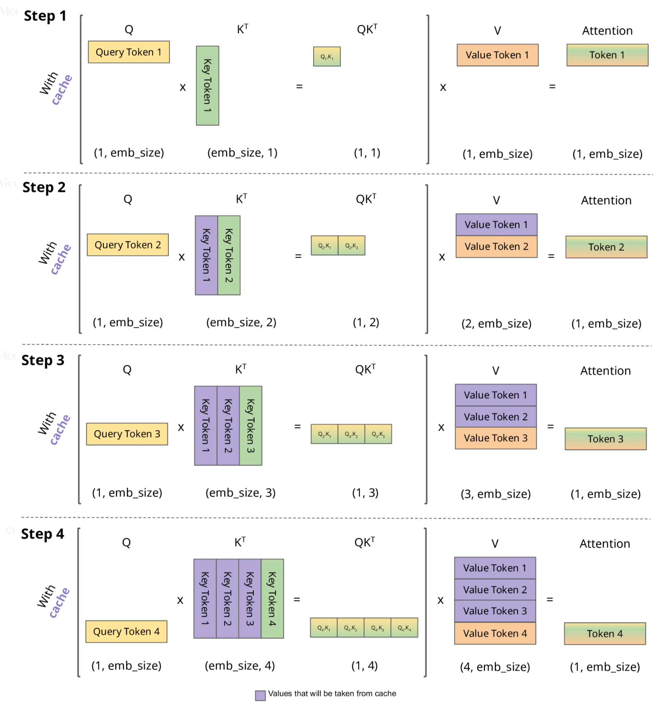

As large language models (LLMs) continue to grow in scale, the cost of inference has skyrocketed. To enable models to respond to user requests faster and more economically, various optimization techniques have emerged. Among them, **KV-Cache (Key-Value Cache)** stands out as one of the most critical and impactful inference acceleration mechanisms, widely adopted by all major inference frameworks (e.g., vLLM, TensorRT-LLM, LLama.cpp, llm-d, OpenAI Triton Transformer Engine, etc.).

This article provides a comprehensive introduction to what KV-Cache is, how it works, why it significantly improves inference efficiency, its impact on the industry, and best practices for its use.

## What is KV-Cache?

First, here is its working principle illustrated:

Understanding it is straightforward, though the details combined with complexity calculations can be somewhat abstract.

KV-Cache, short for **Key-Value Cache**, is a method for caching intermediate results in the **self-attention layers** of the Transformer decoder during LLM inference.

The autoregressive generation method of Transformers dictates that:
**Each time a new token is generated, its attention relationship with all historical tokens must be recalculated.**

If the Key and Value of all past tokens are recalculated each time, the computational cost is:

> Inference time complexity: O(n²)
> (n is the context length)

To avoid redundant calculations, KV-Cache saves the computed **Key (K)** and **Value (V)** for each generated token. This allows subsequent token generation to directly reference the past Key/Value without recalculating the historical part.

This drastically reduces the time complexity to:

> Inference time complexity: O(n)

In summary, KV-Cache caches the Key/Value of historical tokens during autoregressive decoding, enabling subsequent generations to reuse past attention results, thereby reducing time complexity from O(n²) to O(n), saving significant costs.

## How does KV-Cache work?

Using the current mainstream decoding process as an example, let’s compare scenarios with and without KV-Cache.

### Without KV-Cache

Each time a new token is generated, the following steps are required:

1. Re-embed the entire historical sequence
2. Recalculate K/V through all Transformer layers
3. Perform self-attention with the entire sequence
4. Generate and output the new token

The process is illustrated as follows:

### With KV-Cache

During the first inference (prefill phase):

1. Compute all prompt tokens
2. Calculate all K/V and save them in the KV cache

For each subsequent step (decode phase):

1. Compute K/V for the current new token only
2. Perform attention with cached K/V to get the result
3. Write back to the cache

Thus, the computational cost for generating each token shifts from **full sequence scale → approximately constant overhead**, with greater benefits for longer contexts.

The process is illustrated as follows:

## What impact does KV-Cache have?

### Inference speed increases by tens of times

This is particularly evident for long-context models (8k / 32k / 128k tokens).

For example, with a 32k token context, without KV-Cache:

* Each token generation requires traversing the 32k historical sequence
* This results in *repeating the massive workload 32k times*

With KV-Cache:

* The historical part is computed only once
* The per-step decode overhead becomes fixed (a few hundred dimensions of KV and attention dot products)

The acceleration ratio typically reaches:

> 10x to 100x
> (depending on prompt length, model size, hardware)

### Inference costs drop significantly

The cost of large model inference mainly consists of:

* **Compute power** (matrix multiplication)
* **Memory usage**
* **Bandwidth**

KV-Cache significantly reduces redundant compute, leading to proportional cost savings.

This is why:

* OpenAI, Anthropic, Meta, Mistral
* All major cloud inference services
* All open-source inference frameworks

have adopted KV-Cache as the default inference method.

### But memory usage increases

KV consists of the results for each layer and each token, so the cache itself requires **significant memory**.

For example:
Llama-3 70B model, 64K context, KV for 1 token occupies about 1.5KB.

Thus, for 64K tokens: **approximately 96MB × 80 layers ≈ 7.6GB of KV-cache**

When you see inference cards running out of 80GB memory, it’s often because the KV is full, not because the model weights are too large.

### Influences model architecture design and industry direction

The importance of KV-Cache is so high that **model architectures are optimized around it.**

Examples include:

* Mistral’s **Sliding Window Attention (SWA)**
* Meta’s **Grouped Query Attention (GQA)**
* DeepSeek’s **Multi-head Latent Attention (MLA)**
* Google’s **Multi-Query Attention (MQA)**

The primary goal of these techniques is:

> Reducing KV-Cache memory usage

Fewer queries → Smaller KV → Lower memory pressure.

Thus, **KV-Cache is not just a technical point but a key factor influencing model architecture.**

## Key factors for KV-Cache performance

### KV size differences across attention architectures

| Attention Type | KV Size | Advantages | Disadvantages |
| -------------- | ------- | ---------- | ------------- |
| MHA (Multi-Head Attention) | Largest  | Best compatibility | High memory usage |
| MQA (Multi-Query Attention) | Much smaller | More efficient | Slightly less flexible |
| GQA (Grouped Query Attention) | Moderate | Good performance | More complex structure |
| MLA | Smallest | Fastest | Limited model support |

### Different performance barriers for prefill and decode

* **Prefill phase**: Computing K/V is compute-intensive, requiring good GPUs.
* **Decode phase**: Memory bandwidth is prioritized, as batch sizes are usually small during generation.

This also affects optimization strategies for inference frameworks.

### KV-Cache layout and management

Examples include:

* **PagedAttention** (core technology of vLLM)
* **Block-sparse KV management** (TensorRT-LLM)
* **Dynamic cache allocation** (llama.cpp)
* **Continuous vs. chunked KV memory**

Excellent allocation strategies can significantly reduce fragmentation and memory waste.

## Best practices for KV-Cache

### Minimize context length

Longer contexts → Larger KV → Slower and more expensive inference.

If the business allows:

* Use **RAG** to split long documents
* Use **compression models**
* Use **short instruction templates**
* Guide the model to reduce “fluff” in output

### Choose the right attention architecture

When customizing, fine-tuning, or deploying models:

* For efficient inference → Prefer **MQA / GQA / MLA**
* For broad task compatibility → MHA remains the most stable

### Use professional inference frameworks

Prioritize:

* **vLLM (the leading inference framework in both commercial and open-source domains)**
* **TensorRT-LLM (NVIDIA official)**
* **llm-d (high cost-effectiveness for SMEs)**
* **OpenAI Triton Engine (internal use)**

These frameworks have deep optimizations for KV-Cache management.

### Pay attention to KV distribution in multi-GPU inference

KV introduces:

* **Multi-GPU synchronization overhead**
* **All-reduce bandwidth bottlenecks**

Some frameworks offer:

* KV sharding
* Pipeline parallelism
* Block-sparse KV sharing

Proper settings can significantly improve throughput.

### Batch processing strategies have a huge impact

Batching strategies adapted to KV-Cache include:

* Continuous batching
* Block scheduling
* Prompt+decode mixed batching

Correct batching often brings **>10× throughput improvement**.

## Future prospects for KV-Cache

In the coming years, KV-Cache will remain a core mechanism in model inference development.

We will see:

* Lighter KV structures (fewer heads, smaller dimensions)
* Smarter KV reuse mechanisms
* Cross-request KV sharing (multi-query serving)
* Partial KV offloading to CPU/NVMe
* Push-down Attention (reducing GPU bandwidth requirements)

In short, KV-Cache will continue to drive inference performance improvements and remains one of the most important infrastructures in the LLM inference domain.

## Conclusion

KV-Cache is not an “optional optimization” but the **core foundation** of modern large language model inference.
It brings massive speed improvements but also increases memory pressure, influencing model architectures, inference framework designs, and even the entire industry’s technical trajectory.

By understanding KV-Cache, you’ll understand:

* Why inference is so expensive
* Why longer contexts slow down models
* Why new-generation models are changing attention structures
* Why inference framework competition is so intense
