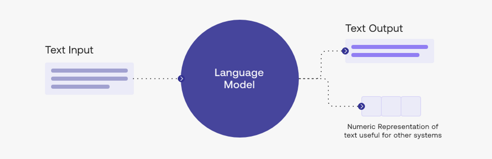
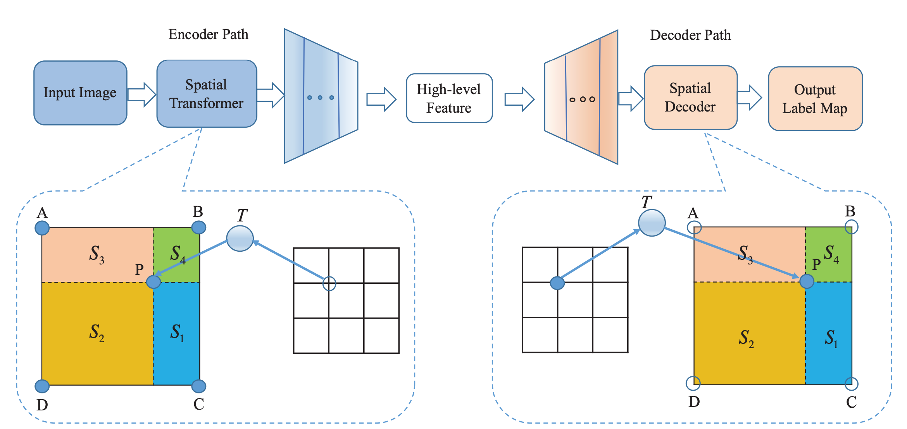
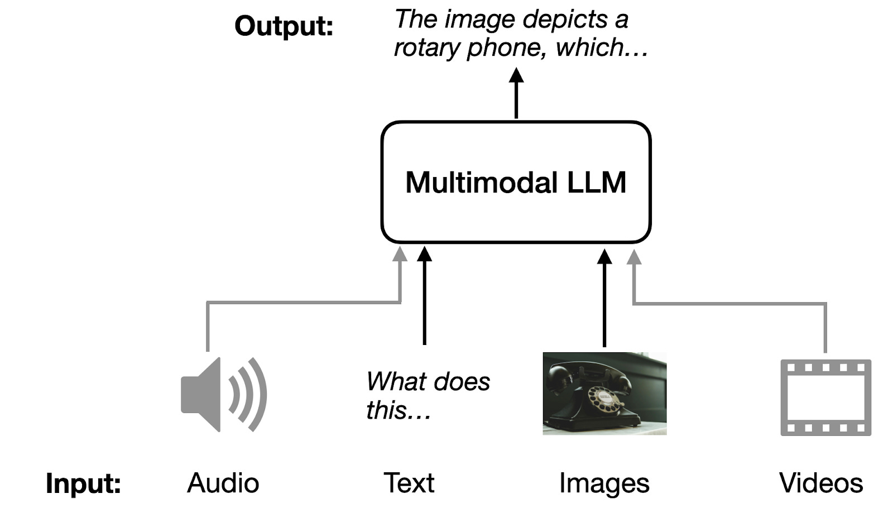
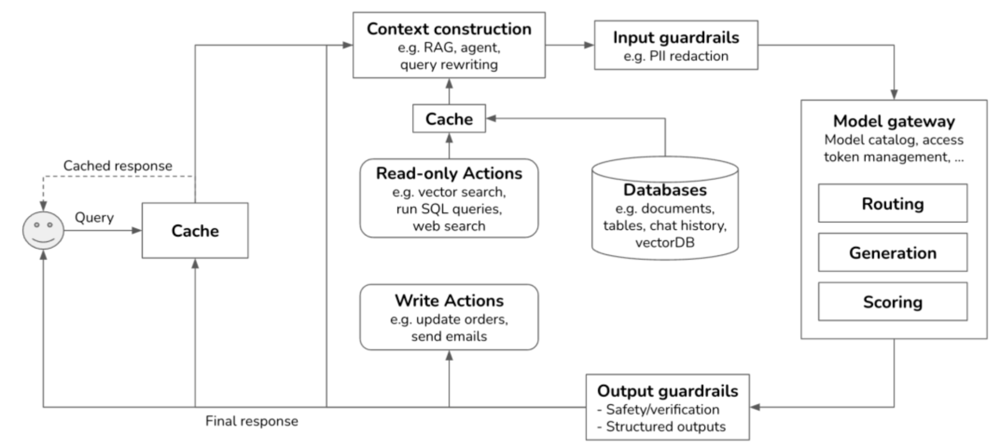
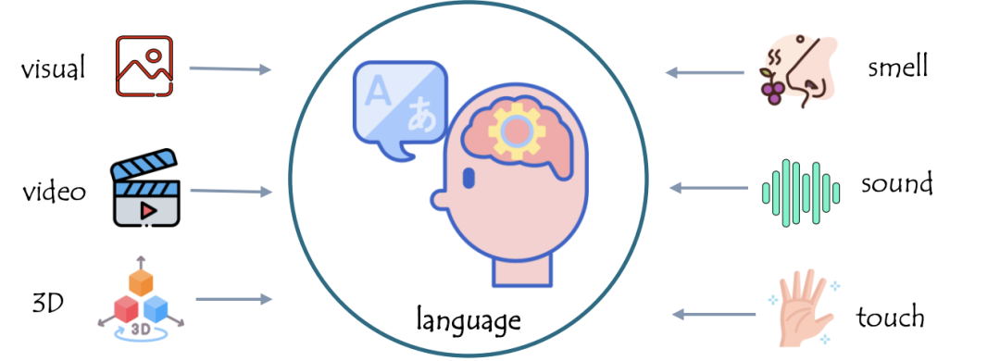
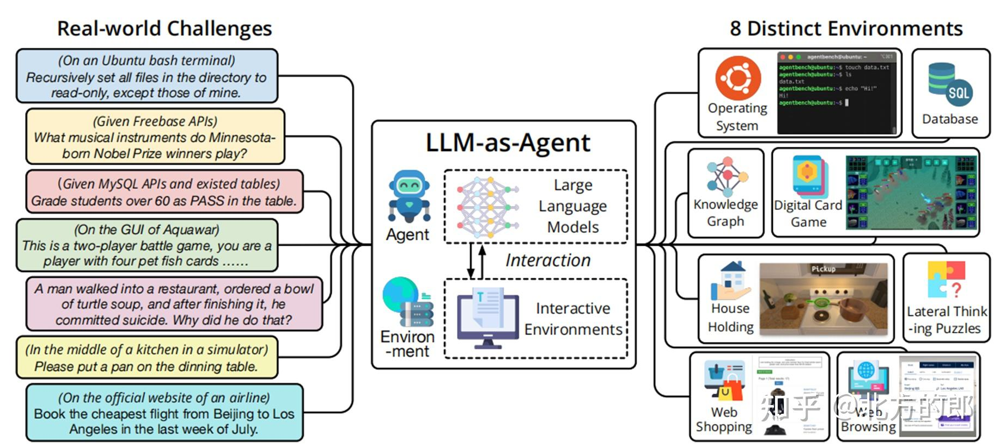

Over the past five years, the development of Large Language Models (LLMs) has almost completely reshaped the technological landscape of artificial intelligence. From GPT to LLaMA, from Transformer to Mixture-of-Experts (MoE), and from monolithic models to large-scale distributed parameter server systems, architectural evolution has directly driven leaps in capability.

This article will systematically review the mainstream technical paths of LLMs from an architectural perspective, and analyze their pros, cons, and suitable scenarios from an application perspective, providing a reference for technical selection for R&D and business teams. It also hopes to open a door for beginners to enter the world of large models!

## Mainstream LLM Architecture Systems

Current LLM architectures can be roughly categorized into the following types:

1. **Traditional Transformer (Dense Transformer)**
2. **Mixture-of-Experts (MoE) Architecture**
3. **Multimodal Extension Architecture (Vision-Language / Audio-Language)**
4. **Retrieval-Augmented Generation (RAG) and Hybrid Inference Architecture**
5. **Agentic Architecture for System-Level LLMs**
6. **Ultra-Large-Scale Distributed Training Architecture (e.g., Parameter Server / Fully Sharded)**

Let's explore them one by one.

## Traditional Transformer: The Foundation of Mainstream LLMs {#dense-transformer}

The Dense Transformer is the foundation of the vast majority of LLMs, including the GPT series, LLaMA, Mistral, Qwen, etc.

### Architecture {#dense-transformer-architecture}

Simply put, it's "brute force works wonders":

* All tokens are calculated through fully connected attention;
* All parameters are activated during each forward inference;
* The structure is relatively regular, and training is stable;
* Model scale scales linearly by stacking layers and increasing hidden size.

### Advantages {#dense-transformer-advantages}

* Inference path is stable and predictable;
* Training process is mature with rich ecosystem support;
* General-purpose for all tasks, requiring no extra routing mechanisms.

### Limitations {#dense-transformer-limitations}

* High inference cost when parameter scale is large (all parameters activated);
* The cost of extending model capabilities is almost linearly related to parameter scale.

### Application Scenarios {#dense-transformer-scenarios}

| Scenario | Applicability |
| :--- | :--- |
| General Conversation | High |
| Coding, Mathematical Reasoning | High |
| Real-time Applications (Low Latency) | Lower |
| Resource-Constrained Devices (Edge Inference) | Average, can be mitigated by quantization |

The Dense model remains the first choice for most enterprises when adopting LLMs for the first time.

## Mixture-of-Experts (MoE): Key Technology for Efficient Scaling {#moe}

MoE is one of the most important new architectures currently, with representative models including:

* Google Switch Transformer
* DeepSeek-V2/V3
* Mixtral Series
* GPT-4 technical paper implies it has MoE structural components

### Architecture {#moe-architecture}

MoE no longer involves all parameters in every calculation but uses a **Routing** mechanism to activate only a few Expert layers for each token.

For example, a massive 300B parameter model might actually only use 30B parameters for each inference.

### Advantages {#moe-advantages}

* **Extremely strong training scalability**: Parameter scale can be increased to hundreds of billions or even trillions at a lower cost.
* **Significantly reduced inference cost**: Activating fewer experts reduces inference FLOPs.
* **Excels in complex reasoning and multi-task capabilities**.

### Limitations {#moe-limitations}

* Routing training is complex and requires higher stability;
* Inference parallelism scale is larger, requiring high system engineering standards;
* Not suitable for extreme low-latency scenarios due to extra overhead from expert scheduling.

### Application Scenarios {#moe-scenarios}

| Scenario | Applicability |
| :--- | :--- |
| Multi-domain Tasks (Code/Math/Language Mix) | Extremely High |
| Ultra-Large Scale Models (10B+) | Extremely High |
| Edge Devices, Small Models | Low |
| Multi-tenant Large-scale Online Inference | Depends on implementation |

MoE has become the mainstream trend for large commercial LLMs.

## Multimodal LLM Architecture: Extending Capabilities to Perception {#multimodal}

Representative models: GPT-4o, Gemini, Qwen-VL, LLaVA, Yi-VL

### Architecture {#multimodal-architecture}

Multimodal LLMs introduce additional encoders on top of the Transformer base to map signals like vision, audio, and video into token representations.

Typical structures usually include:

* Vision Encoder (e.g., ViT)
* Projection Layer
* Unified Transformer
* Multimodal Attention Mechanism

### Advantages {#multimodal-advantages}

* Significant expansion of input capabilities: Integrated processing of images, audio, video, and documents;
* Extremely suitable as the perception module for general AI Agents.

### Limitations {#multimodal-limitations}

* Higher cost than pure text LLMs;
* High cost of constructing multimodal data;
* Stability of output and high-fidelity image/video understanding still have limits.

### Application Scenarios {#multimodal-scenarios}

| Scenario | Applicability |
| :--- | :--- |
| OCR / Document Understanding | Extremely High |
| Multimodal Search | High |
| Video Understanding | Medium (Depends on model) |
| Compact Device Deployment | Low |

With the popularization of GPT-4o's omni-modal input, multimodal LLMs have become an essential capability layer for enterprise AI transformation.

## RAG + LLM Hybrid Architecture: System Form Centered on Knowledge Enhancement {#hybridrag}

RAG (Retrieval-Augmented Generation) solves the problem of LLMs being unable to persistently update and store large amounts of facts by integrating external knowledge bases into inference.

### Architecture {#hybridrag-architecture}

Consists of three core components:

* Vector Database (Retriever)
* Document Preprocessing Pipeline (Chunking, Indexing)
* Core LLM (Generator)

### Advantages {#hybridrag-advantages}

* Models can continuously update knowledge without retraining;
* Significantly enhances long-tail knowledge and factual capabilities;
* Data is controllable, facilitating enterprise-level governance.

### Limitations {#hybridrag-limitations}

* Depends on retrieval quality;
* High requirements for prompt engineering and pipeline engineering;
* Multi-hop retrieval has latency overhead.

### Application Scenarios {#hybridrag-scenarios}

| Scenario | Applicability |
| :--- | :--- |
| Enterprise Knowledge Base Q&A | Extremely High |
| High Accuracy Applications like Law, Medicine | High |
| Real-time LLM Applications (Latency Sensitive) | Lower |

RAG is the most common architecture in enterprise LLM implementation.

## Agent-based Architecture: System-Level LLM Architecture Based on Intelligent Agents {#agentic}

Representatives: AutoGPT, GPT-o1, GPT-o3, DeepSeek-R1, Autonomous Reasoning Agent Frameworks

As models acquire Planning, Acting, and Reflection capabilities, Agent architecture is becoming mainstream at the application layer.

### Architecture {#agentic-architecture}

* Tool Integration (Tool Use)
* Workflow Management
* Multi-round Sub-task Planning
* Memory and External State Management

### Advantages {#agentic-advantages}

* Can execute complex task chains;
* Enhances model controllability;
* Tool capabilities extend the model's own limitations.

### Limitations {#agentic-limitations}

* System complexity increases significantly;
* High requirements for reliability, traceability, and verifiability;
* Scheduling capability directly affects actual results.

### Application Scenarios {#agentic-scenarios}

| Scenario | Applicability |
| :--- | :--- |
| Automated Operations | Extremely High |
| Data Analysis Assistant | High |
| Multi-step Computational Tasks | High |
| Answer-type Q&A | Average |
| Ultra-low Latency Scenarios | Not Suitable |

Agent architecture represents the future direction of LLM applications.

## Distributed Training Architecture: Underlying Engineering Supporting Trillion-Parameter Models {#distributed-training}

These solutions usually don't have a specific architectural model. Depending on different needs, technology vendors evolve various solutions, such as:

* ZeRO / FSDP (Fully Sharded Data Parallel)
* Megatron-LM (Tensor / Pipeline Parallelism)
* DeepSpeed
* Colossal-AI
* Parameter Server (SageMaker, Ray, DeepSeek in-house)

### Advantages {#distributed-training}

* Efficiently train ultra-large models;
* Maximize throughput using GPU clusters;
* Optimize VRAM usage.

### Limitations {#distributed-training}

* Extremely high engineering complexity;
* Expensive deployment costs;
* Highly dependent on GPU cluster architecture.

### Application Scenarios {#distributed-training}

Mainly suitable for enterprises or research teams developing their own large models or running thousand-card GPU training tasks.

## Comparison of Architecture Focus and Advantages

Here is a comprehensive comparison table:

| Architecture Type | Advantages | Disadvantages | Application Focus |
| :--- | :--- | :--- | :--- |
| Dense Transformer | Stable, mature, simple inference chain | Cost increases linearly with scale | General models, edge deployment |
| MoE | Efficient scaling, high cost-performance ratio | Complex routing, high engineering threshold | Large-scale models, mixed tasks |
| Multimodal LLM | Strong input capability | High cost, complex training | Document/Image/Video/Audio scenarios |
| RAG | Strong factuality, updatable | High retrieval dependency | Enterprise knowledge base, Law/Medicine |
| Agent | Strong tool capability, task chain execution | Complex system | Automated tasks, data analysis |
| Distributed Architecture | Supports trillion-parameter models | High cost and complexity | Training infrastructure |

## How to Choose the Right LLM Architecture?

Based on the LLM architectures introduced above, we have a preliminary understanding of the architecture of large language models themselves and some solution architectures superimposed on application scenarios. In real-world application scenarios where LLMs are combined with various industries, architectures are far more than these. Combined with existing computer system architectures, LLM architectures are also constantly evolving and enriching. Below, based on application requirements, the following paths are recommended:

### Goal: Develop an Enterprise Q&A System

Dense Transformer + Enhanced RAG: Reliable, controllable, low cost, sustainable updates.

### Goal: Build an All-Around Foundation Model System

MoE is the preferred choice: Both performance and cost-effectiveness.

### Goal: Build a Document/Image/Video AI System

Multimodal LLM: e.g., GPT-4o, Qwen-VL, Gemini.

### Need Automated Task Execution

Agent-based Architecture: The model itself doesn't need to be particularly large, but requires good tool interfaces and planning capabilities.

### Need to Train and Run In-House Models

FSDP / Megatron / PS-based Distributed Architecture. The range of choices for such needs is actually very wide. Since it is a training and inference integrated solution, you can just use mature integrated solutions on the market without spending a lot of time on compatibility between training and inference frameworks.

## Summary

The evolution of Large Language Model architectures has entered a stage of blossoming. Dense models provide a stable foundation, MoE architectures bring breakthroughs in cost and capability, Multimodal extends the boundaries of AI perception, while RAG and Agent architectures push LLMs into the era of truly controllable and executable intelligent agents.

For enterprises, choosing the right architecture is more important than blindly pursuing "larger models". Choosing an architecture based on actual needs, engineering capabilities, and budget can not only optimize results but also ensure long-term maintainability.
