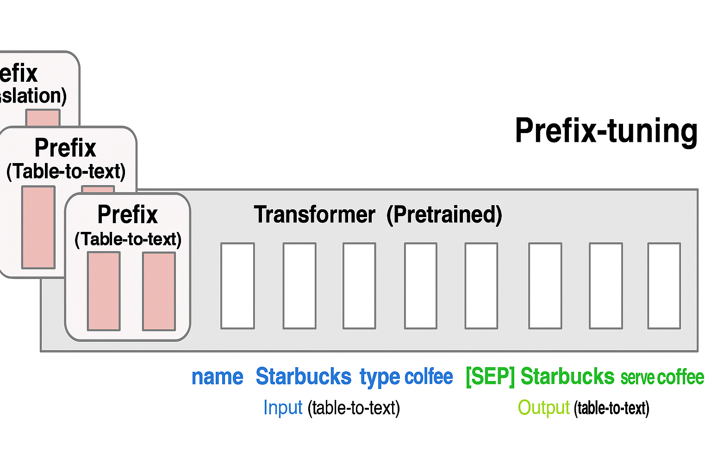
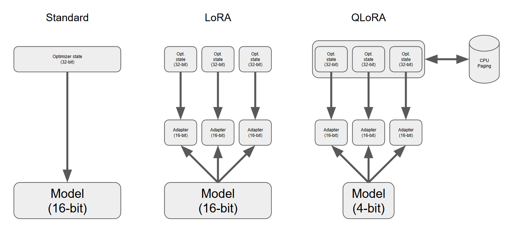
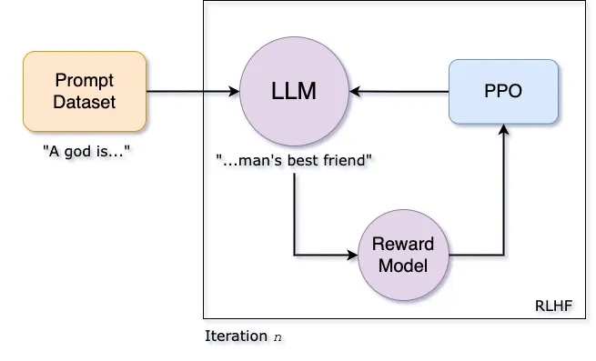

As enterprises build AI-powered applications, **fine-tuning large language models (LLMs)** has become essential for delivering customized capabilities. Over the years, fine-tuning techniques have evolved from traditional full-parameter training to efficient, low-cost approaches such as LoRA, QLoRA, Adapters, supervised fine-tuning (SFT), reward modeling (RM), and RLHF.

This article provides a systematic overview of major fine-tuning methods, compares their strengths and weaknesses, and offers guidance on when each method is most suitable.

## Why Fine-Tune an LLM?

Although pretrained LLMs are powerful, they often fall short in real-world business scenarios:

* Inadequate understanding of domain-specific terminology (finance, law, healthcare, etc.)
* Responses that do not match a company’s style or workflow
* Need for specialized abilities (e.g., SQL generation, code generation with specific constraints)
* Poor performance on structured output tasks
* Suboptimal multi-turn dialogue performance

Therefore — **you need fine-tuning**.

## Overview of Main Fine-Tuning Methods

### 1. Full Fine-Tuning (Full-Parameter Training)

**Concept:**
Updates all model parameters (billions) using domain data — essentially “retraining with a head start.”

**Pros:**

* Best possible performance
* Deep customization of model knowledge and behavior

**Cons:**

* Very expensive
* Requires large GPU memory
* Needs substantial training data

**Best for:**

* Large enterprises, research labs
* Deep domain expertise (law, medicine, engineering)

### 2. Adapter / Prefix Tuning

**Concept:**
Freeze most model parameters and insert small trainable layers (Adapters) into the existing architecture.

**Pros:**

* Lightweight and modular
* Easy to manage multiple tasks (one model, many adapters)
* Good performance in many cases

**Cons:**

* Slightly weaker than LoRA or full fine-tuning in difficult tasks

**Best for:**

* Companies running multiple departments or workloads on the same model
* Modular, plug-and-play fine-tuning

### 3. LoRA (Low-Rank Adaptation)

**Concept:**
Instead of training the full weight matrices, LoRA learns low-rank updates (A, B) to adjust model behavior.

This is the most widely adopted method today.

**Pros:**

* Very low GPU memory usage
* Near full-fine-tuning performance
* Strong open-source ecosystem (HuggingFace PEFT, etc.)

**Cons:**

* Slightly weaker on extremely complex tasks
* Sensitive to some model architectures

**Best for:**

* Most enterprise applications
* Instruction tuning, domain adaptation
* Projects requiring cost control

### 4. QLoRA

**Concept:**
An enhanced version of LoRA that **quantizes base model weights to 4-bit**, greatly reducing memory usage.

**Pros:**

* Video memory demand further decreased
* Allows fine-tuning large models on a single consumer GPU

**Cons:**

* Slight training speed reduction
* Small performance drop in some cases

**Best for:**

* Small teams or individual developers
* Rapid experimentation
* Cost-sensitive enterprises

### 5. SFT (Supervised Fine-Tuning)

**Concept:**
Train the model with paired instruction → output data to shape model behavior.

**Pros:**

* Simple and effective
* Great for style, formatting, and task control

**Cons:**

* Does not ensure optimal alignment
* Can still hallucinate on complex tasks

**Best for:**

* Task-oriented models (customer service, Q&A systems)
* Summarization, rewriting, and formatting tasks
* Corporate workflow automation

### 6. RM（Reward Model）+ RLHF / PPO

**Concept:**
Train a reward model (RM) to judge response quality, then use reinforcement learning (RLHF/PPO) to optimize the LLM.

**Pros:**

* Achieves “natural,” human-aligned conversational behavior
* Fixes many limitations of SFT alone

**Cons:**

* Complex pipeline
* Expensive and requires high-quality preference data

**Best for:**

* Building a ChatGPT-style assistant
* Safety-critical enterprise applications
* High-alignment, high-quality dialogue tasks

## Comparison Table of Fine-Tuning Methods

| Method               | Cost  | Performance | Data Requirement     | Ideal Use Case                    |
| -------------------- | ----- | ----------- | -------------------- | --------------------------------- |
| **Full Fine-Tuning** | ⭐⭐⭐⭐⭐ | ⭐⭐⭐⭐⭐       | Large                | Deep domain customization         |
| **Adapter**          | ⭐⭐    | ⭐⭐⭐         | Medium               | Multi-task modular workloads      |
| **LoRA**             | ⭐⭐    | ⭐⭐⭐⭐        | Medium               | Most enterprise applications      |
| **QLoRA**            | ⭐     | ⭐⭐⭐⭐        | Medium               | Low-budget single-GPU training    |
| **SFT**              | ⭐⭐    | ⭐⭐⭐         | Paired data required | Instruction tasks, formatting     |
| **RLHF / PPO**       | ⭐⭐⭐⭐⭐ | ⭐⭐⭐⭐⭐       | High                 | Chat assistants, safety alignment |

## How to Choose the Right Fine-Tuning Method?

### Scenario 1: Customer Service Bots, Business Q&A

→ **LoRA / QLoRA + SFT**
Low cost, structured data, strong performance.

### Scenario 2: Injecting Domain Expertise (Law, Medicine)

→ **Full Fine-Tuning or LoRA with large domain corpus**
Deep knowledge adaptation required.

### Scenario 3: Multi-Department Enterprise AI

→ **Adapter Tuning**
One base model, multiple adapters.

### Scenario 4: Building a ChatGPT-like Assistant

→ **SFT → RM → RLHF pipeline**
Ensures alignment, safety, and conversational quality.

### Scenario 5: Limited Budget, One GPU

→ **QLoRA**
Best price-performance ratio.

### Scenario 6: Text Generation (Writing, Summaries, Rewriting)

→ **LoRA + SFT**
Best for formatting, style, and controlled generation.

## Summary

There is no single “best” fine-tuning method — only the method that fits your needs.
Choose based on three principles:

1. **Budget** → Choose QLoRA or LoRA for cost efficiency
2. **Task Type** → Use SFT for structured/instruction tasks; RLHF for chat alignment
3. **Depth of Customization** → Use full fine-tuning for deep domain expertise
