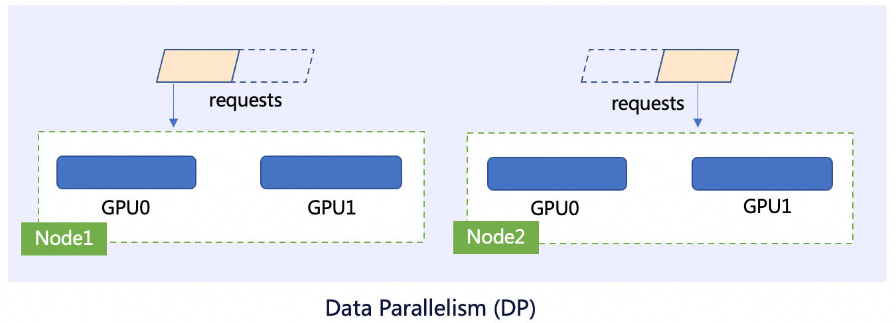
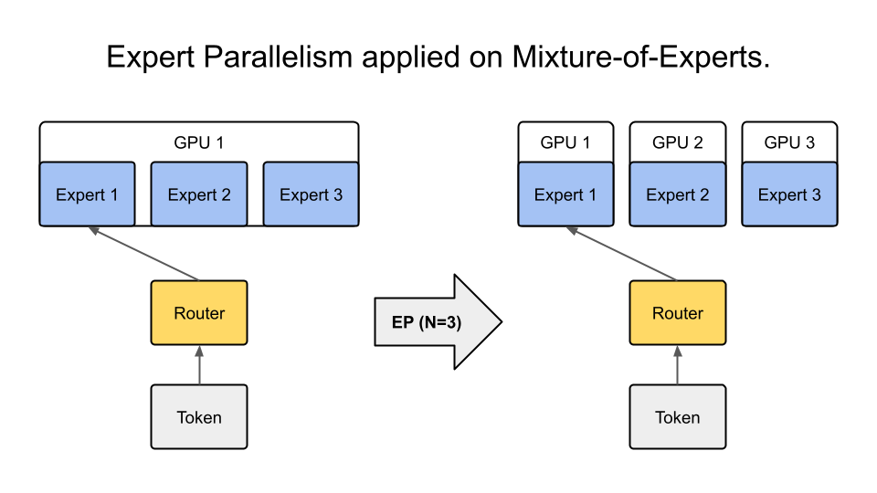

When the parameter scale of Large Language Models (LLMs) crosses the multi-billion threshold, one fact becomes unavoidable: **the era of single-card is over**. Whether for training or inference, the parameter scale of the model itself, the growth speed of KV Cache, and the memory and compute pressure brought by concurrent requests in real business scenarios all dictate that large models must run in multi-GPU or even multi-node environments.


However, **running a model with multiple cards** is not simply a matter of stacking resources. In practice, engineering teams quickly discover that **different splitting methods can lead to performance differences of orders of magnitude**. Some configurations have extremely low TTFT but stall quickly under high concurrency; some solutions have amazing throughput but struggle to meet latency requirements for online services; and some combinations seem reasonable in theory but are completely swallowed by communication costs in real hardware topologies.

In the training and inference stages, the industry has gradually settled on four core parallelism strategies:

* **TP (Tensor Parallelism)**
* **DP (Data Parallelism)**
* **PP (Pipeline Parallelism)**
* **EP (Expert Parallelism, mainly for MoE)**


## Basics of Four Core Parallelism Strategies for LLMs

### Tensor Parallelism (TP): Operator-Level Splitting

Core Idea: Split the matrix calculation (such as Linear / Attention) within a single layer along dimensions to multiple GPUs for parallel calculation.

Typical Splitting Methods:

* Linear layer split by `hidden_size` or `num_heads`
* Attention Q / K / V or FFN intermediate layer splitting


Pros:

* Significant reduction in single-layer memory usage
* Low single-token latency (suitable for inference)

Cons:

* Every layer requires **All-Reduce / All-Gather**
* Frequent communication, high dependence on NVLink / IB

Applicable Scenarios:

* Single model is too large but not too many layers
* Online inference sensitive to **TTFT (Time To First Token)**

### Data Parallelism (DP): Request-Level Replication

Core Idea: The model is fully replicated to multiple GPUs, and each GPU processes different requests or batches.



Pros:

* Simple implementation
* No intra-model communication
* Linear throughput scaling

Cons:

* Highest memory requirement (one full model per card)
* Single request latency remains unchanged

Applicable Scenarios:

* Model fits in a single card
* Offline inference / High concurrency throughput

### Pipeline Parallelism (PP): Layer-Level Splitting

Core Idea: Split the model by layers to multiple GPUs, and requests flow between GPUs in a **pipeline** manner.


Pros:

* Almost no intra-layer communication
* High memory efficiency (better than DP)

Cons:

* Pipeline bubble causes idle time
* Latency increases significantly with small batches

Applicable Scenarios:

* Ultra-deep models (e.g., 70B+)
* Long sequence inference or training

### Expert Parallelism (EP): MoE Exclusive Parallelism

Core Idea: In MoE (Mixture of Experts) models, different Experts are distributed on different GPUs, and only activated Experts participate in the calculation.



Pros:

* Large parameter scale but sparse computation
* Extremely high performance/parameter ratio

Cons:

* Token routing and load imbalance
* Complex communication patterns

Applicable Scenarios:

* MoE models (e.g., Mixtral, DeepSeek-MoE)
* High parameter scale, acceptable scheduling complexity

## Parallelism Strategies Are Not Mutually Exclusive, But Composable

In real systems, parallelism strategies are usually **combined**:

| Combination | Typical Usage |
| --- | --- |
| TP × DP | Most common combination for inference |
| TP × PP | Ultra-large model training / inference |
| TP × EP | MoE inference |
| DP × EP | High throughput MoE service |
| TP × PP × DP | Large-scale distributed clusters |

The question is not **whether it can be used**, but: **different combinations have vastly different performance under real inference loads.**

This is exactly why vLLM is very suitable for verification.

## Overview of Parallelism Capabilities in vLLM

vLLM is an engine designed for **high-performance LLM inference**, with core advantages including:

* Efficient KV Cache management (PagedAttention)
* Native support for **TP / PP**
* Friendly to DP (multi-instance, multi-replica)
* Support for EP in MoE models (dependent on model implementation)

In vLLM, parallelism configuration is mainly controlled through **startup parameters + resource topology**.

## Configuration Examples of Parallelism Strategies Based on vLLM

### Tensor Parallelism (TP)

```bash
vllm serve meta-llama/Llama-2-70b-hf \
  --tensor-parallel-size 4
```

Meaning:

* Each layer of the model is split to 4 GPUs
* Suitable for single request low latency verification

### Pipeline Parallelism (PP)

```bash
vllm serve meta-llama/Llama-2-70b-hf \
  --pipeline-parallel-size 2 \
  --tensor-parallel-size 2
```

Meaning:

* 2-stage pipeline
* 2-way TP within each stage
* Total GPUs = 4

### Data Parallelism (DP)

vLLM itself does not explicitly declare DP, but implements it through **multi-instance deployment**:

```bash
# GPU 0-3
CUDA_VISIBLE_DEVICES=0,1,2,3 vllm serve ...

# GPU 4-7
CUDA_VISIBLE_DEVICES=4,5,6,7 vllm serve ...
```

Then implement DP through upper-layer load balancing (such as Kubernetes / Gateway).

### Expert Parallelism (EP)

For MoE models (such as Mixtral):

```bash
vllm serve mistralai/Mixtral-8x7B-Instruct \
  --tensor-parallel-size 4
```

vLLM will automatically distribute Experts to GPUs within the TP group (model internal implementation EP).

## How to "Verify" the Real Performance of Parallelism Combinations in vLLM

### Core Evaluation Metrics

It is recommended to focus on at least the following metrics:

| Metric | Meaning |
| --- | --- |
| TTFT | Time To First Token |
| Tokens/s | Generation throughput |
| GPU Utilization | Parallel efficiency |
| KV Cache Hit Rate | Long context efficiency |
| Communication Overhead | TP / EP cost |

### Recommended Comparison Experiment Matrix

Taking 8 GPUs as an example:

| Scheme | TP | PP | DP | Applicable Goal |
| -- | -- | -- | -- | ---- |
| A | 8 | 1 | 1 | Lowest latency |
| B | 4 | 2 | 1 | Memory balance |
| C | 2 | 2 | 2 | Throughput priority |
| D | 1 | 1 | 8 | Max concurrency |

By fixing input length and request concurrency, comparing the above schemes will yield clear conclusions.

### Practical Experience Conclusions (Common Laws)

* **The larger the TP, the lower the TTFT, but the heavier the communication**
* **PP improves memory utilization, but is extremely unfriendly to small batches**
* **DP is the only linear amplification means for throughput**
* **MoE's EP may actually slow down under low concurrency**

## Summary

There is no **optimal solution** for parallelism strategies, only the **most suitable solution**. TP / DP / PP / EP are not in competition, but rather:

> **Engineering trade-offs under the constraints of model scale, request pattern, and hardware topology.**

vLLM provides a platform extremely suitable for **parallelism strategy verification and comparison experiments**. The truly valuable work is not "what parallelism is supported", but:

* On your model
* On your hardware
* Under your real request load

**Verifying which combination is the optimal solution.**
