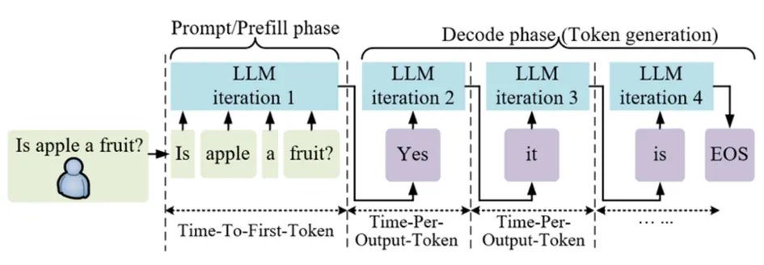

As Large Language Models (LLMs) are widely deployed in dialogue systems, intelligent assistants, and Agent scenarios, the core challenge for inference systems has shifted from "can it run" to "**how to run with lower latency, higher throughput, and greater stability**". Against this backdrop, **PD Disaggregated (Prefill / Decode Decoupling)** has gradually become a key architectural concept in large-scale online inference systems.

This article will systematically explain what PD Disaggregated is, why it is needed, and the core advantages it brings to LLM inference systems from the perspective of **model inference execution flow**, without relying on any specific inference framework.

## The Two Essential Phases of LLM Inference

The inference process of all autoregressive large language models can essentially be broken down into two phases:

### Prefill Phase

The Prefill phase is responsible for processing the user's complete Prompt. Its main tasks include:

* Performing a complete forward calculation on the input sequence;
* Building the corresponding KV Cache for the context;
* Generating the first output Token.

This phase has the following characteristics:

* **Compute-bound**
* Dominated by large-scale Matrix Multiplication (GEMM)
* Sequence length is usually long
* Highly friendly to Batching

### Decode Phase

The Decode phase enters a token-by-token generation process, where each step involves:

* Inputting the previously generated Token;
* Reading the historical KV Cache;
* Generating the next Token until the termination condition is met.

Its characteristics are distinctly different from Prefill:

* **Memory-bound**
* Small calculation scale, but frequent KV Cache access
* Strong latency sensitivity
* Execution steps grow linearly with generation length

## Root of the Problem: "Heterogeneity" of Prefill and Decode

Prefill and Decode are not the same type of workload; they exhibit **significant heterogeneity** across multiple dimensions:

| Dimension | Prefill | Decode |
| :--- | :--- | :--- |
| Compute Pattern | Large operators, dense computation | Small operators, frequent memory access |
| Batching Need | Large batch works best | Excessive batch increases latency |
| Latency Tolerance | Relatively high | Extremely low |
| Resource Bottleneck | Compute Power | VRAM Bandwidth / KV Cache |

If these two phases are **mixed in deployment and unified in scheduling**, it leads to structural inefficiency in resource usage.

## What is PD Disaggregated

**PD Disaggregated (Prefill / Decode Decoupling)** refers to the inference system architecture level:

> **Treating Prefill and Decode as two different types of workloads and decoupling them in design regarding scheduling, resource allocation, and even deployment topology.**

It is important to emphasize that:

* This is not a split of the model structure;
* Nor is it a split of parameters;
* It is the **decoupling of the inference execution path and resource usage**.

The core idea of PD Disaggregated is:
**Let Prefill serve throughput, and let Decode serve latency.**

## Why PD Decoupling is Necessary

### Structural Waste of GPU Utilization

Common phenomena during mixed execution include:

* Decode phase operators are too small, leaving GPU compute power underutilized;
* Large operators in the Prefill phase block Decode;
* The result is that overall GPU utilization "looks not low, but efficiency is poor".

After PD decoupling, different scheduling and batching strategies can be adopted for different phases, significantly improving effective compute utilization.

### Unpredictable Latency, Worsening Tail Latency

In online inference scenarios, the Decode phase directly determines user experience:

* Time To First Token (TTFT)
* Time Per Output Token (TPOT)
* P99 / P999 Latency

If Decode is blocked by Prefill, even if throughput increases, user experience will significantly degrade.
PD Disaggregated can **isolate latency-sensitive paths** at the architectural level.

### Limited Scalability

In a mixed architecture:

* Prefill and Decode can only be scaled in the same proportion;
* It is impossible to independently scale a specific phase based on actual load characteristics.

In real business:

* Chat and Agent scenarios have a very high proportion of Decode;
* Offline generation and batch processing have a higher proportion of Prefill.

PD decoupling makes **independent scaling by phase possible**.

## Typical Architectural Forms of PD Disaggregated

In engineering practice, PD Disaggregated usually manifests in one of the following forms:

### Scheduling-Level Decoupling (Soft Disaggregation)

* Prefill and Decode share model parameters;
* But they are treated differently at the scheduling level;
* Decode has higher priority.

This is the most lightweight and easiest form to implement.

### Resource-Level Decoupling (Resource Disaggregation)

* Prefill and Decode use different GPU resource pools;
* Prefill GPUs lean towards compute power;
* Decode GPUs lean towards VRAM bandwidth and KV Cache capacity.

This pattern is particularly common in large-scale clusters.

### Service-Level Decoupling (Service Disaggregation)

* Prefill and Decode become independent services;
* Connected via KV Cache or state handles in between;
* Can be independently scaled and scheduled.

This is the "complete form" of PD Disaggregated and also the most complex one.

## Core Advantages of PD Disaggregated

### Coexistence of Higher Throughput and Lower Latency

Traditional architectures often require a trade-off between throughput and latency, while PD decoupling allows:

* Extreme batching for Prefill;
* Extreme low latency for Decode.

### More Stable Tail Latency

Decode is no longer blocked by large-scale Prefill, significantly improving P99 / P999 latency, which is crucial for production systems.

### More Reasonable Resource Utilization

Matching different resource types to different phases avoids structural waste like "running memory-bound tasks on compute-heavy GPUs".

### Stronger System Evolution Capability

PD Disaggregated opens up space for future optimizations, such as:

* Tiered storage for KV Cache;
* Dedicated hardware for Decode;
* Long-session optimization for Agents.

## Summary

PD Disaggregated is not a feature of a specific framework, but an **abstraction and redesign of the essence of LLM inference**:

* Prefill and Decode are naturally heterogeneous in computational form;
* Forced mixing only masks efficiency problems;
* Decoupling is the inevitable path to scalable, high-quality inference services.

It is foreseeable that as model scale continues to grow and application forms become increasingly complex, **PD Disaggregated will evolve from an "advanced optimization" to a default architectural assumption for LLM inference systems**.
