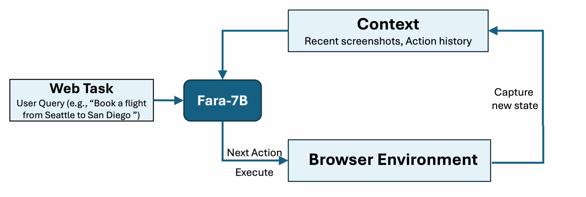
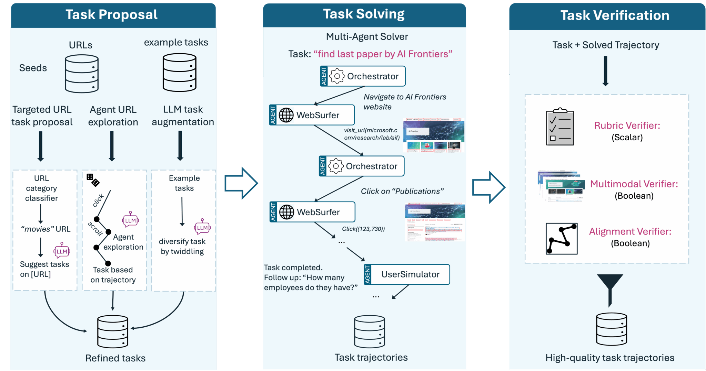

Microsoft Research recently released **Fara-7B**, an Agentic Small Language Model (SLM) designed specifically for Computer Use. Unlike traditional chat models, Fara-7B is designed to complete tasks by using a mouse and keyboard just like a human.

## What is Fara-7B?

Fara-7B is a 7 billion parameter model built on [Qwen2.5-VL-7B](https://arxiv.org/abs/2502.13923). Its key features include:

* **Visual Perception**: It operates by visually perceiving web pages (screenshots), without relying on Accessibility Trees or additional parsing models.
* **Efficient and Compact**: Despite having only 7B parameters, it achieves state-of-the-art performance in its class, even competing with larger models on certain benchmarks.
* **On-Device Execution**: Due to its small size, it can run locally on devices, reducing latency and improving privacy.



## Core Technology

Fara-7B's training utilized a synthetic data generation pipeline developed by Microsoft, based on the [Magentic-One](https://www.microsoft.com/en-us/research/articles/magentic-one-a-generalist-multi-agent-system-for-solving-complex-tasks/) framework. It executes tasks through an "observe-think-act" loop.

In each step, the model receives:

1. User instructions
2. Complete operation history
3. The three most recent screenshots

It then outputs a reasoning message ("thinking" about the next action), followed by calling tools (such as `click(x,y)`, `type()`, etc.) to execute the action.



## Performance

Fara-7B demonstrates strong performance on benchmarks like WebVoyager and Online-Mind2Web. For instance, on WebVoyager, it achieved a task success rate of 73.5%, surpassing UI-TARS-1.5-7B (66.4%) and GPT-4o (SoM Agent, 65.1%).

## How to Use Fara-7B with vLLM

Fara-7B is available on [Hugging Face](https://huggingface.co/microsoft/Fara-7B). Since it is based on Qwen2.5-VL, we can use vLLM for efficient deployment and inference.

### Install vLLM

First, ensure you have the latest version of `vllm` installed:

```bash
pip install vllm
```

### Python Code Example

Here is a Python script example using vLLM to load Fara-7B and perform inference:

```python
from vllm import LLM, SamplingParams
from PIL import Image
import requests
from io import BytesIO

def run_fara_7b():
    # Model name
    model_name = "microsoft/Fara-7B"

    # Initialize LLM
    # Fara-7B is based on Qwen2.5-VL, so we use similar configuration
    llm = LLM(
        model=model_name,
        trust_remote_code=True,
        max_model_len=4096,  # Adjust based on GPU memory
        limit_mm_per_prompt={"image": 1},
        mm_processor_kwargs={
            "min_pixels": 28 * 28,
            "max_pixels": 1280 * 28 * 28,
        },
    )

    # Load example image (This is for demonstration, use screenshots in practice)
    image_url = "https://upload.wikimedia.org/wikipedia/commons/thumb/d/dd/Gfp-wisconsin-madison-the-nature-boardwalk.jpg/2560px-Gfp-wisconsin-madison-the-nature-boardwalk.jpg"
    response = requests.get(image_url)
    image = Image.open(BytesIO(response.content))

    # Build Prompt
    # Note: Fara-7B uses a specific Prompt format
    prompt = (
        "<|im_start|>system\nYou are a helpful assistant.<|im_end|>\n"
        "<|im_start|>user\n<|vision_start|><|image_pad|><|vision_end|>"
        "Describe this image in detail.<|im_end|>\n"
        "<|im_start|>assistant\n"
    )

    # Prepare input
    inputs = {
        "prompt": prompt,
        "multi_modal_data": {
            "image": image
        },
    }

    # Sampling parameters
    sampling_params = SamplingParams(temperature=0.2, max_tokens=512)

    # Generate result
    outputs = llm.generate([inputs], sampling_params=sampling_params)

    for o in outputs:
        print(f"Generated text: {o.outputs[0].text}")

if __name__ == "__main__":
    run_fara_7b()
```

### Launch API Service via Command Line

If you want to start an OpenAI API compatible service, you can use the following command:

```bash
vllm serve microsoft/Fara-7B \
  --trust-remote-code \
  --limit-mm-per-prompt image=1 \
  --mm-processor-kwargs '{"min_pixels": 784, "max_pixels": 1003520}'
```

Note: `min_pixels` corresponds to 28x28, and `max_pixels` corresponds to 1280x28x28.

## Summary

Fara-7B is a significant attempt by Microsoft in the field of agentic small models, proving that small models can also perform excellently in complex computer operation tasks. With open weights, developers can more easily explore and build GUI-based automation agents.
