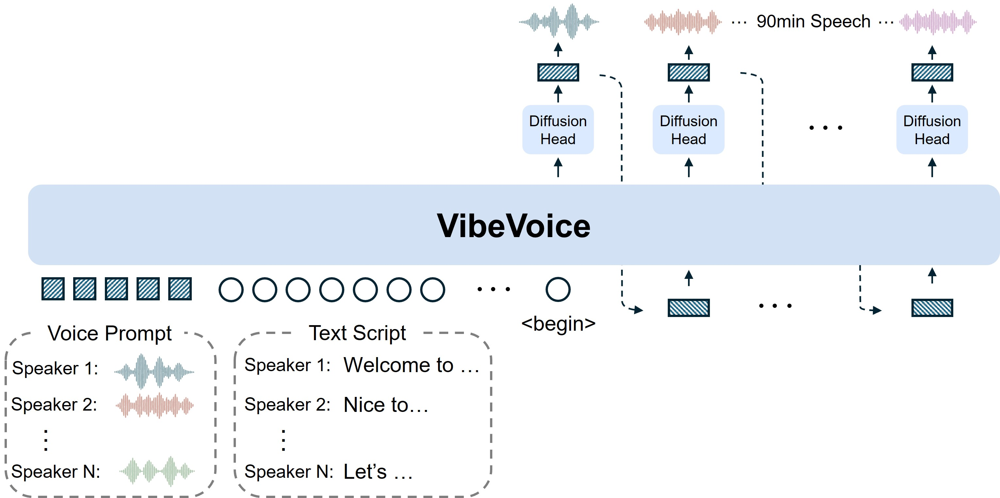

## What is VibeVoice?

**[VibeVoice](https://microsoft.github.io/VibeVoice/)** is a research framework released by Microsoft Research for **long-form, multi-speaker, conversational** speech synthesis. Target scenarios include entire podcast episodes, audio dramas, or interviews: it can maintain speaker consistency within a single generation and handle natural turn-taking.

The model family includes multiple scales (e.g., 1.5B, 7B, etc.) and is available on Hugging Face as [`microsoft/VibeVoice-1.5B`](https://huggingface.co/microsoft/VibeVoice-1.5B), along with model cards, weights, installation guides, and responsible use notes.

It addresses several pain points of traditional TTS systems, such as:

* Difficulty in maintaining **speaker consistency** in long conversations.
* Poor naturalness of **turn-taking** between multiple speakers.
* Low efficiency — generating long text with multiple speakers consumes large amounts of resources.

## Core Innovations and Architecture

Key design highlights of VibeVoice:

| Component                                              | Function / Purpose                                                                                                                                                                                |
| ------------------------------------------------------ | ------------------------------------------------------------------------------------------------------------------------------------------------------------------------------------------------- |
| **Continuous Speech Tokenizers** (acoustic + semantic) | Compress audio into low-frame-rate (7.5 Hz) representations while retaining both semantic and acoustic quality. The acoustic tokens capture sound details, while semantic tokens capture content. |
| **LLM Backbone** (Large Language Model)                | Uses Qwen2.5-1.5B in this version to process text, speaker information, and dialogue context.                                                                                                     |
| **Diffusion Head**                                     | Predicts acoustic VAE features, generating high-fidelity sound details. It is relatively lightweight (\~4 layers) and applies diffusion techniques (e.g., denoising) during inference.            |
| **Context Length & Multi-Speaker Support**             | Can generate up to **90 minutes** of speech with a maximum of **4 speakers**.                                                                                                                     |

Architecture diagram:



---

## Advantages and Limitations

### Advantages

1. **Long-form conversation** — can generate nearly 90 minutes of continuous dialogue while preserving speaker consistency.
2. **Multi-speaker support** — supports up to 4 speakers with natural turn-taking.
3. **High compression efficiency** — 7.5 Hz speech tokenizer achieves strong compression while maintaining quality.
4. **Semantic + acoustic separation** — semantic tokens handle content, acoustic tokens handle sound details, working in tandem.

### Limitations

1. **Limited language support** — currently English and Chinese are the main supported languages; cross-lingual abilities are under research.
2. **No background music / effects** — focused purely on speech synthesis without music or overlapping speakers.
3. **[Repository temporarily closed](https://github.com/microsoft/VibeVoice)** — Microsoft disabled the repo citing “uses beyond intended scope / non-compliance with responsible use.” The source code and full features may not be immediately accessible.
4. **Hardware requirements** — while efficient, generating long multi-speaker, high-fidelity speech still requires strong GPUs.
5. **Potential misuse risks** — risks of voice cloning, impersonation, and deepfake misuse. Microsoft’s documentation explicitly warns about responsible use.

## Quick Start

Below is a step-by-step setup and usage guide. Note: since the official repo currently lacks full scripts, inference often relies on community implementations or Hugging Face Spaces/Colab demos.

### Prerequisites

* Python 3.8+; recommended to use a virtual environment (venv / conda).
* GPU: NVIDIA GPU with CUDA (VRAM/performance requirements see section 5). Apple Silicon/macOS users can check community discussions and scripts.
* Tools to install (example):

  ```bash
  pip install huggingface_hub transformers accelerate torch soundfile torchaudio numpy einops
  ```

  * `ffmpeg` is required locally (for audio splitting/merging and format conversion).

  > Choose package versions according to PyTorch’s official site or community repos. Refer to community requirements for compatibility.

### Download Model Weights

```python
from huggingface_hub import snapshot_download
model_dir = snapshot_download("microsoft/VibeVoice-1.5B")
print("Model downloaded to", model_dir)
```

Note: `snapshot_download` pulls Hugging Face model files and cards. Large models require sufficient disk space and bandwidth.

### Use Community Inference Scripts

Many community repos or Hugging Face Spaces provide scripts such as `demo/inference_from_file.py`. Example:

```bash
# In Colab / local environment
git clone https://huggingface.co/technicalheist/vibevoice-1.5b
cd vibevoice-1.5b

# Install dependencies (check "Requirements" section on model page)
pip install torch transformers soundfile ffmpeg-python  # plus others

# Create a transcript file
echo "Speaker 1: Hello, how are you doing?
Speaker 2: I'm good, thanks. What about you?" > transcript.txt

# Run demo script
python demo/inference_from_file.py \
  --model_path /path/to/technicalheist/vibevoice-1.5b \
  --txt_path transcript.txt \
  --speaker_names "Alice,Bob"
```

Community repos such as `technicalheist/vibevoice-1.5b` or `shijincai/VibeVoice` provide runnable examples. Always check the README for dependencies and usage instructions. Script names and parameters may vary.

### Simple Example

```txt
Speaker 1: Hello, welcome to our podcast.
Speaker 2: Thanks — happy to be here. Let's talk about VibeVoice.
Speaker 1: Sure, start with the key idea...
```

Save this as `transcript.txt` and pass it to `--txt_path`. The script will parse speaker labels and generate corresponding voice tracks. Community implementations often allow customizing voices/styles per speaker.

## Conclusion

Microsoft’s VibeVoice is an exciting advancement in TTS and speech synthesis. It makes breakthroughs in **long-form speech + multi-speaker** generation, especially in dialogue flow and speaker consistency. Its design (low-frame-rate dual tokenizers + next-token diffusion + LLM backbone) is technically cutting-edge.

For podcasts, audiobooks, or scripted dialogues, it could be a powerful tool and research foundation. But for commercial deployment or sensitive use cases involving voice identity/legal concerns, special care must be taken regarding responsible use, licensing, and risk assessment.
