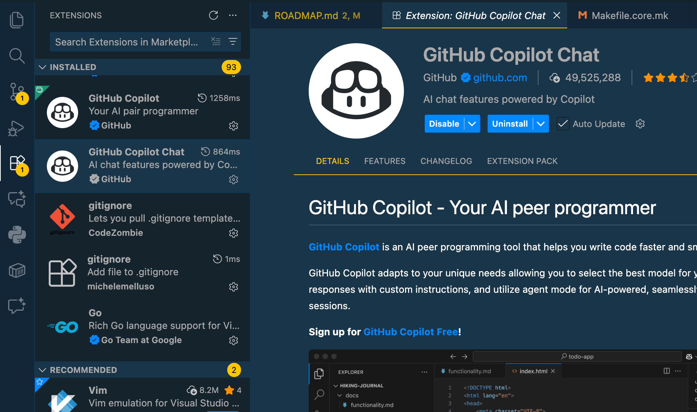
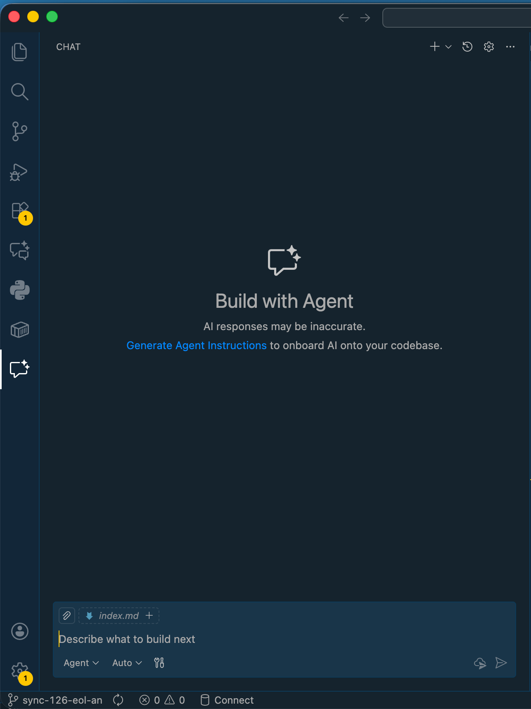
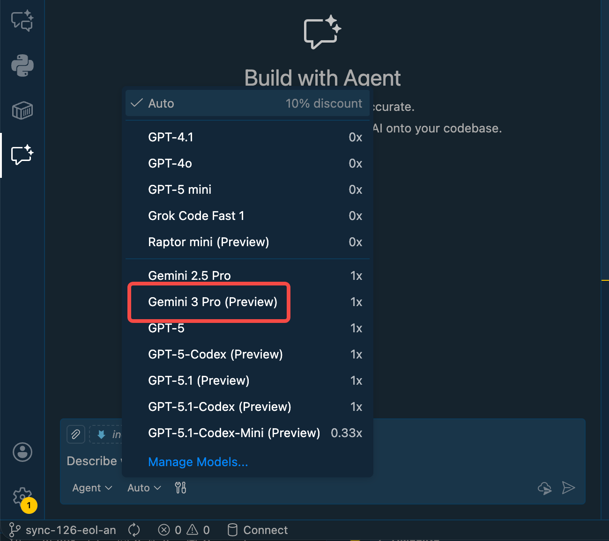

As AI coding assistants continue to evolve, GitHub Copilot keeps introducing more powerful models for developers to choose from. Recently, GitHub Copilot announced support for Google's latest **Gemini 3 Pro** model (Preview). As a developer who uses Copilot daily, I tried it out immediately and found it surprisingly good at logical reasoning and long context understanding.

In this post, I'll guide you through switching to Gemini 3 Pro in VS Code and share some of my insights.

## Why care about Gemini 3 Pro?

Gemini 3 Pro is Google's latest multimodal large model. In the field of code generation and understanding, it shows strong competitiveness:

1. **Stronger Reasoning**: For complex algorithmic problems or architecture design, Gemini 3 Pro often provides deeper analysis.
2. **Ultra-long Context Window**: It can understand more project code context, which is crucial for large-scale refactoring and bug fixing.
3. **Response Speed**: Despite the massive model parameters, the response speed in Copilot remains very fluid.

## How to Enable Gemini 3 Pro in GitHub Copilot

The process is very simple, just ensure your VS Code and Copilot extension are up to date.

### Step 1: Update Environment

Ensure your Visual Studio Code and GitHub Copilot Chat extension are updated to the latest versions. VS Code usually updates automatically, but you can also check manually.

### Step 2: Open Copilot Chat

Click the GitHub Copilot icon in the VS Code sidebar to open the chat window.

### Step 3: Switch Model

At the bottom of the chat input box, you will see the name of the model currently in use (usually defaulting to Auto or GPT-4o).

Click on the model name, and in the dropdown menu that appears, select **Gemini 3 Pro (Preview)**.

Once selected, you can start chatting with Gemini 3 Pro!

Check out the results!

## Hands-on Experience: Where does Gemini 3 Pro excel?

### 1. Complex Logic Code Explanation

I tried asking it to explain a piece of complex asynchronous concurrency control code. Gemini 3 Pro not only explained the surface meaning of the code but also pointed out potential deadlock risks and offered optimization suggestions. This ability to "think one step ahead" is very helpful during Code Reviews.

### 2. Cross-file Context Understanding

When handling a refactoring task involving multiple modules, I added several relevant files to the context (using `@workspace` or manual referencing). Gemini 3 Pro was able to connect the dependencies between these files very well, and the generated modification suggestions rarely had "hallucinations" or references to non-existent variables.

## Conclusion

GitHub Copilot's introduction of Gemini 3 Pro provides developers with more choices. Different models have different "personalities" and areas of strength. I suggest trying to switch models when dealing with different types of tasks:

* **Daily simple code completion**: The default model is usually fast and sufficient.
* **Complex architecture design or tricky Bug troubleshooting**: Try **Gemini 3 Pro**, it might bring you new perspectives.

Go try it out and feel the coding power of Google's latest AI model!
