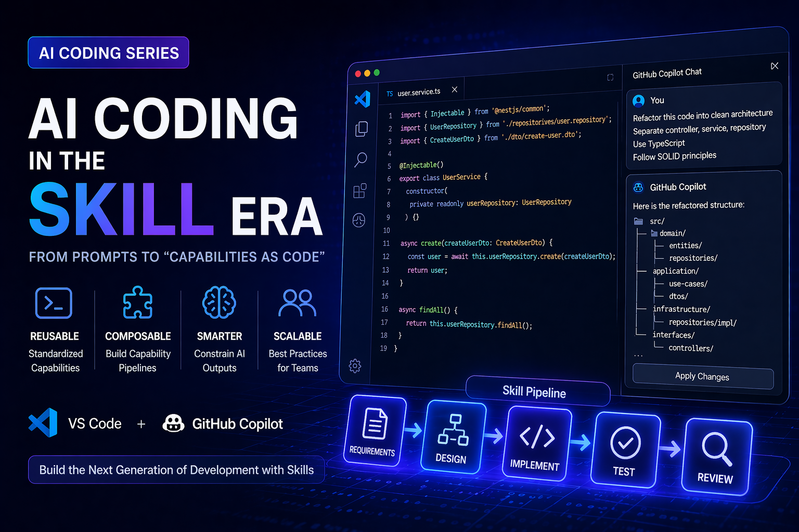

Over the past year, the mainstream way developers interact with AI for programming has gone through a clear evolution:

> Prompt -> Prompt Engineering -> Context Engineering -> **Skill (Capability Packaging)**

If a prompt is a one-off invocation of model capability, then **a Skill is essentially a reusable intelligent capability module**. It enables AI to evolve from "answering questions" to "executing tasks."

This article will systematically explain:

* What a Skill means in the context of AI programming
* The fundamental difference between a Skill and a prompt
* How to apply Skill thinking in VS Code + GitHub Copilot Chat
* Real engineering-level examples

## What Is a Skill?

In the context of AI programming, **Skill = structured prompt + context + execution constraints + output format**.

A more engineering-oriented definition would be:

```text
Skill = f(Instruction, Context, Constraints, Output Schema)
```

It is not just a single prompt. It is a reusable capability interface.

### A Simple Comparison

| Approach            | Characteristic | Problem                     |
| ------------------- | -------------- | --------------------------- |
| Prompt              | Ad hoc input   | Not reusable, not stable    |
| Prompt Engineering  | Better wording | Still one-off               |
| Skill               | Capability packaging | Reusable, composable, governable |

## Why Do Skills Matter?

In real development work, AI usage quickly runs into a few bottlenecks:

### 1. Prompts Are Unstable

The same question can produce different results when phrased differently.

### 2. Teams Cannot Reuse Experience

Everyone ends up with their own private set of prompts.

### 3. AI Output Is Hard to Control

Format, style, and boundaries are difficult to standardize.

## The Value of Skills

* **Standardize capabilities**
* **Preserve team best practices**
* **Reduce cognitive load**
* **Improve output consistency**

At its core, a Skill is the "function" or "API" of the AI era.

## How Skills Can Be Implemented in VS Code

Although VS Code itself does not officially define a "Skill" concept, you can implement the same idea through the following mechanisms:

### 1. `.github/copilot-instructions.md`

This is the closest thing to a global Skill mechanism.

What it does:

* Provides **long-lived context** for Copilot
* Constrains how the AI should behave

Example:

```markdown
# Backend Coding Guidelines

- Use clean architecture
- Follow RESTful API design
- Add unit tests for all services
- Use dependency injection

# Code Style

- Prefer TypeScript over JavaScript
- Use async/await instead of callbacks
```

This is effectively a global Skill injector.

### 2. Project-Level Skills (README / project.md)

You can define project-specific Skills like this:

```markdown
# AI Skill: API Generator

When generating APIs:
- Use OpenAPI 3.0 spec
- Include request/response schema
- Add validation rules
- Provide curl examples
```

### 3. Session-Level Skills (Copilot Chat)

In Chat, you can define a one-off Skill:

```text
You are a senior backend architect.

Task:
- Refactor code to hexagonal architecture
- Keep business logic pure
- Extract adapters

Output:
- Folder structure
- Example code
```

## How to Use Skills in GitHub Copilot Chat

Copilot Chat is the most direct place to apply Skill thinking.

Below are a few **engineering-grade real-world examples**.

### Example 1: Refactoring Skill

#### Input (Skill)

```text
Act as a senior software architect.

Refactor this code:
- Apply clean architecture
- Separate domain, application, infrastructure
- Add dependency inversion

Output:
1. Folder structure
2. Refactored code
3. Explanation
```

#### Result

AI is no longer just "editing code." Instead, it can:

* Output structural design
* Propose a layered architecture
* Explain the design decisions

It shifts from a completion tool to an architecture assistant.

### Example 2: Test Generation Skill

```text
You are a QA engineer.

Generate unit tests:
- Use Jest
- Cover edge cases
- Include mocks
- Ensure >80% coverage

Output:
- Test file
- Coverage explanation
```

Advantages:

* Stable output structure
* Consistent testing style
* Reusable across the team

### Example 3: API Documentation Skill

```text
Act as an API documentation generator.

Given code:
- Extract endpoints
- Generate OpenAPI spec
- Add request/response examples

Output in YAML
```

This can directly produce usable API documentation.

### Example 4: Code Review Skill (Highly Recommended)

```text
Act as a senior code reviewer.

Review this code:
- Check performance issues
- Identify security risks
- Suggest improvements

Output:
- Issues list
- Severity level
- Fix suggestions
```

This Skill is extremely valuable in team settings.

## Advanced: Skill Composition (Skill Pipeline)

The real power does not come from a single Skill, but from **combining Skills**:

```text
Requirement -> API Skill -> Implementation Skill -> Test Skill -> Review Skill
```

This forms an AI-powered development pipeline:

1. Generate the API
2. Generate the implementation
3. Generate the tests
4. Run an automated review

In essence, this is an AI-driven Dev Pipeline.

## Best Practices

### 1. Skills Must Be Structured

Do not write this:

```text
Help me optimize this code
```

Write this instead:

```text
Optimize code:
- Reduce time complexity
- Improve readability
- Add comments

Output:
- Before/After
- Explanation
```

### 2. Force an Output Format

```text
Output in JSON:
{
  "issues": [],
  "fixes": []
}
```

This is especially important for automation.

### 3. Constrain the Role (Role Prompting)

```text
Act as:
- Staff Engineer
- Security Expert
- Performance Engineer
```

### 4. Skills Should Be Reproducible

It is a good idea to keep them in a shared location such as:

* `.github/copilot-instructions.md`
* `docs/ai-skills.md`
* Internal wiki

## Skill vs. Agent (A Common Confusion)

| Concept | Essence |
| ------- | ------- |
| Skill   | A single capability |
| Agent   | Multiple Skills + autonomous decision-making |

Skills are building blocks.
Agents are robots.

## Summary

AI programming is shifting from:

> "How do I ask AI?" -> "How do I design AI capabilities?"

The emergence of Skills means:

* Prompts are no longer the core
* **Capability design is the new core**
* AI is becoming part of the development infrastructure

> In the future, great engineers will not just be people who write code. They will be the ones who **design AI capabilities**.
