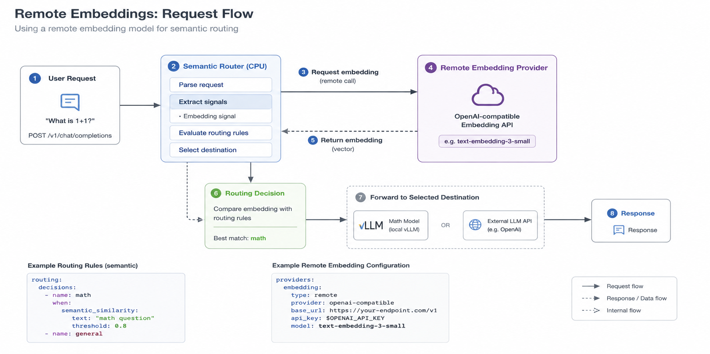
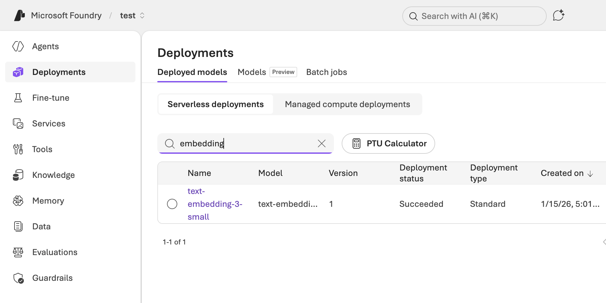

## 1. Introduction

In the design of vLLM Semantic Router, embedding is one of the core signals driving semantic routing.

The official tutorial has already demonstrated how to use **Remote Embedding Providers** to replace local embedding inference services:

👉 [https://vllm-sr.ai/docs/tutorials/global/remote-embeddings/](https://vllm-sr.ai/docs/tutorials/global/remote-embeddings/)

However, in real production environments, a more critical question arises:

> How can we use enterprise-grade, scalable embedding services to support semantic routing?

This article is based on the official tutorial scenario and combines **Microsoft Foundry embedding models** to demonstrate how to build a:

- No GPU required  
- No local embedding deployment required  
- Production-ready  

intelligent routing system.

## 2. Recap: Remote Embedding Providers

In vLLM Semantic Router, the Router runs on CPU and does not rely on GPU inference capabilities.

Through Remote Embedding Providers:

```text
Router → Remote Embedding API → Vector
```

We can:

- Fully offload embedding to cloud services  
- Unify multi-model semantic capabilities  
- Decouple routing and inference  

## 3. Tutorial Scenario (reusing official test scenario)

In the official tutorial, the core flow is:



### Step 1: Define semantic routing

```yaml
routing:
  decisions:
    - name: math
      when:
        semantic_similarity:
          text: "math question"
          threshold: 0.8

    - name: general
```

### Step 2: Send request

```bash
curl http://localhost:8888/v1/chat/completions \
  -d '{
    "model": "MoM",
    "messages": [{"role": "user", "content": "What is 1+1?"}]
  }'
```

Router will:

1. Generate embedding
2. Perform semantic matching
3. Select target model

## 4. Step 0: Create an Embedding Model in Microsoft Foundry

Before integrating with vLLM Semantic Router, we first need to provision an embedding model in Microsoft Foundry.

### 4.1 Create a Foundry project

1. Go to **Microsoft Foundry Portal**
2. Create a new project (or select an existing one)
3. Ensure the project is linked to an Azure subscription

### 4.2 Deploy an embedding model

In the model catalog:

1. Search for **embedding models**
2. Select a supported model (e.g. `text-embedding-3-small`)
3. Click **Deploy**

After deployment, you will get:

* Endpoint URL
* API Key
* Model name

Example:

```text
Endpoint: https://<your-foundry-resource>.inference.ai.azure.com
Model: text-embedding-3-small
API Key: ******
```

### 4.3 Validate embedding API

You can test the endpoint directly:

```bash
curl https://<your-foundry-endpoint>/v1/embeddings \
  -H "api-key: <your-api-key>" \
  -H "Content-Type: application/json" \
  -d '{
    "input": "Hello world"
  }'
```

If successful, you will receive a vector response.

## 5. Upgrade: Replace Local Embedding with Microsoft Foundry

Now, we replace the embedding provider in the tutorial with:

> ✅ Microsoft Foundry embedding model



## 6. Why Microsoft Foundry Embedding

Microsoft Foundry provides:

* High-quality embeddings (stronger semantic understanding)
* Hosted API (no deployment required)
* Global availability + enterprise SLA
* Seamless integration with Azure AI ecosystem

More importantly:

> It can directly serve as the “semantic brain” of Semantic Router

## 7. Integration: Microsoft Foundry as Remote Provider

### 7.1 Configure embedding provider

```yaml
providers:
  embedding:
    type: remote
    provider: openai-compatible
    base_url: https://<your-foundry-endpoint>
    api_key: <your-api-key>
    model: text-embedding-3-small
```

Explanation:

* Foundry provides OpenAI-compatible API
* Can directly reuse semantic-router remote provider
* No additional adaptation required

### 7.2 Router workflow

```text
User Request
   ↓
Semantic Router
   ↓
Microsoft Foundry Embedding API
   ↓
Vector Similarity
   ↓
Routing Decision
   ↓
Target Model (vLLM / API)
```

## 8. Key Improvement Over Tutorial

Compared to the official tutorial:

| Capability       | Original Solution           | Microsoft Foundry Solution |
| ---------------- | --------------------------- | -------------------------- |
| embedding source | local / mock                | cloud high-quality model   |
| deployment cost  | model or container required | zero ops                   |
| scalability      | single environment          | multi-region               |
| semantic quality | medium                      | enterprise-grade           |

## 9. Real Impact

### 🚀 1. Truly “No GPU Architecture”

Router itself runs on CPU

embedding + inference are fully externalized:

* Foundry → embedding
* vLLM / API → inference

### 🧠 2. More accurate semantic routing

In tutorial scenarios:

```text
"What is 1+1?" → math route  
"Tell me a joke" → general route
```

With Foundry embedding:

* More stable semantic understanding
* Better multilingual support
* More accurate edge cases

### 🌐 3. Unified multi-model entry point

Combined with Semantic Router:

* Microsoft Foundry (embedding)
* vLLM (self-hosted inference)
* OpenAI / other APIs

Enables true:

> **Multi-Provider Intelligent Routing**

## 10. Architectural Insight

The essence of this upgrade is:

```text
Before:
Router = Infra + Intelligence

After:
Router = Intelligence
Foundry = AI Capability
```

Forming a clear layered architecture:

```text
[ AI Capability Layer ] → Microsoft Foundry  
[ Routing Layer       ] → Semantic Router  
[ Inference Layer     ] → vLLM / APIs  
```

## 11. Conclusion

By combining the official Remote Embeddings tutorial with Microsoft Foundry, we achieve a production-ready architecture:

* No local embedding required
* No GPU required
* High-quality semantic capability
* Enterprise-grade reliability

This is not just a feature enhancement, but a key evolution of Semantic Router:

> From a “local tool” to a “cloud-native AI routing layer”
