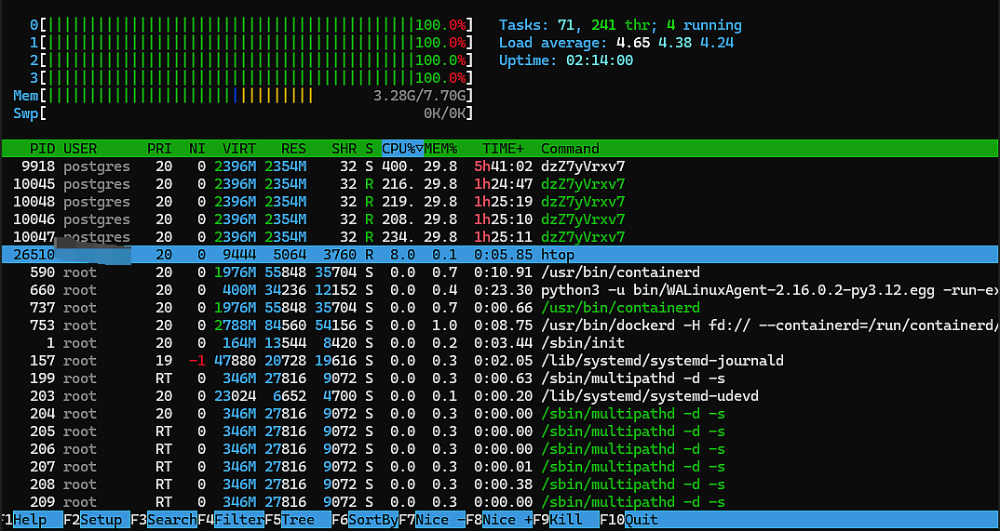

## Background


Recently, a Linux server deployed on Azure suddenly started showing sustained 100% CPU usage. After investigation, I found a malicious program running as the `postgres` user, with persistence maintained through a `cron` scheduled task.

The PostgreSQL installation on this server had the following characteristics:

- Port `5432` was not exposed to the public internet through Azure NSG;
- PostgreSQL was not used by the current business workload;
- The actual business workload used local MySQL;
- However, the PostgreSQL service was still installed and running;
- The system still retained the `postgres` user, home directory, cron jobs, and historical scripts.

This incident shows that:

> PostgreSQL not being exposed to the public internet does not mean that PostgreSQL-related components on the server are completely risk-free.

It is important to clarify that the current evidence only proves that the malicious program used the `postgres` operating system user and its directories for persistence. It **does not prove that the attacker necessarily entered the server through PostgreSQL port 5432**. The initial entry point could also have been historical configuration, SSH, a web application, containers, an old image, or another vulnerability.

If a production environment truly needs PostgreSQL, but there is no special requirement to self-host the database server, I recommend prioritizing:

> **Azure Database for PostgreSQL, accessed through a private network with public network access disabled.**

This can reduce the risks introduced by self-hosting a database, including operating system users, SSH, cron, systemd, patching, backups, and host intrusion.

## Discovering the Issue: Sustained 100% CPU Usage

The abnormal behavior was first noticed while running `htop` on the server.



From the screenshot, we can see that:

- The server had 4 CPU cores;
- All 4 cores reached `100%`;
- The load average stayed around 4 for a long time;
- Multiple processes were running as the `postgres` user;
- The process name was a random string, `dzZ7yVrxv7`;
- A single process used more than `200%` CPU;
- The process consumed a large amount of memory.

I then ran:

```bash
sudo ps -eo user,pid,ppid,lstart,etime,%cpu,%mem,stat,comm,args \
  --sort=-%cpu | head -20
```

One of the main processes looked like this:

```text
USER       PID   PPID  %CPU  %MEM  STAT  COMMAND
postgres   9918     1   377  29.8  Ssl   dzZ7yVrxv7
```

This was not a normal PostgreSQL process.

Under normal circumstances, PostgreSQL process names are usually similar to:

```text
postgres
postgres: checkpointer
postgres: background writer
postgres: walwriter
postgres: autovacuum launcher
```

This process had several abnormal characteristics:

- Its name was a random string;
- It was running as the `postgres` user;
- Its CPU usage was close to all 4 cores;
- Its parent process had become PID 1;
- Its memory usage was unusually high.

Therefore, the initial assessment was that this was not normal database load, but a suspected mining program or another type of malware.

## Analyzing the Issue: Confirming the Malware Source

### 1. Check the Real Process File

Linux process names can be modified or disguised, so the `COMMAND` field alone is not trustworthy. The real executable should be checked through `/proc/<PID>/exe`.

I ran:

```bash
sudo sh -c '
echo "EXE:"
ls -l /proc/9918/exe

echo "CWD:"
ls -l /proc/9918/cwd

echo "CMDLINE:"
tr "\0" " " < /proc/9918/cmdline
echo

echo "CGROUP:"
cat /proc/9918/cgroup
'
```

The output was:

```text
EXE:
/proc/9918/exe -> /dev/shm/gJppJl6TbG (deleted)

CWD:
/proc/9918/cwd -> /var/lib/postgresql

CMDLINE:
dzZ7yVrxv7

CGROUP:
0::/system.slice/cron.service
```

These pieces of information are critical.

### The Executable Was Located in `/dev/shm`

The real program path was:

```text
/dev/shm/gJppJl6TbG
```

`/dev/shm` is a memory-backed temporary filesystem. Malware often downloads files there and executes them from the in-memory filesystem to reduce traces on disk.

### The Original File Had Already Been Deleted

The path ended with:

```text
(deleted)
```

This means that after the program started, the original file on disk was deleted. However, because the process still held the file, the program could continue running.

This behavior, deleting itself after startup, is a common malware hiding technique.

### The Working Directory Belonged to the PostgreSQL User

The process working directory was:

```text
/var/lib/postgresql
```

This indicates that the malware was related to the `postgres` user's home directory.

### The Process Was Started by Cron

The cgroup showed:

```text
/system.slice/cron.service
```

This means the program was started through a scheduled task.

### 2. Save a Sample from the Running Process

Because the original file had already been deleted, killing the process immediately might have made it impossible to extract a sample. So I first saved the program from `/proc`:

```bash
sudo mkdir -p /root/incident
sudo chmod 700 /root/incident

sudo cp -L /proc/9918/exe \
  /root/incident/suspect-9918.bin

sudo chmod 600 \
  /root/incident/suspect-9918.bin
```

Then I checked the file type:

```bash
sudo file /root/incident/suspect-9918.bin
```

The result was:

```text
ELF 64-bit LSB shared object, x86-64,
statically linked, no section header
```

I calculated the SHA-256 hash:

```bash
sudo sha256sum /root/incident/suspect-9918.bin
```

The hash was:

```text
d32f9eef63c496a146a6a811677dd27e337db993d6f1a4b1af145c3135d391b3
```

This file had the following characteristics:

- Random file name;
- Located in `/dev/shm`;
- Statically linked;
- No section header;
- Deleted its original file after startup;
- Continuously consumed all CPU resources.

These behaviors further confirmed that it was not a normal PostgreSQL component.

### 3. Check the PostgreSQL User's Scheduled Tasks

Because the process was started from `cron.service`, I continued by checking the `postgres` user's crontab:

```bash
sudo crontab -u postgres -l
```

I found the following task:

```cron
24 * * * * /var/lib/postgresql/.dbus-XGodM5jOyL
```

This task executed a hidden script at minute 24 of every hour:

```text
/var/lib/postgresql/.dbus-XGodM5jOyL
```

The file name used a dot-prefixed hidden form and imitated D-Bus naming, making it easy to mistake for a system file.

I checked the cron logs:

```bash
sudo journalctl -u cron.service \
  --since "2026-08-15 07:15:00" \
  --until "2026-08-15 09:15:00" \
  --no-pager
```

The logs showed:

```text
Aug 15 07:24:01 CRON: (postgres) CMD (/var/lib/postgresql/.dbus-XGodM5jOyL)
Aug 15 08:24:01 CRON: (postgres) CMD (/var/lib/postgresql/.dbus-XGodM5jOyL)
```

This proves that the malicious script was executed at least at `07:24` and `08:24`.

### 4. Analyze the Malicious Startup Script

I checked the file:

```bash
sudo file /var/lib/postgresql/.dbus-XGodM5jOyL
sudo stat /var/lib/postgresql/.dbus-XGodM5jOyL
sudo sha256sum /var/lib/postgresql/.dbus-XGodM5jOyL
```

The result showed that it was a Bash script:

```text
Bourne-Again shell script, ASCII text executable,
with very long lines
```

Its SHA-256 hash was:

```text
36b1dcf43876f55aae2b8be7dada848b41f60ec61cd4ca7ab2a1278193f286f0
```

This script was responsible for downloading, starting, or restoring the malicious program. It was also the main persistence mechanism that allowed the malicious process to reappear periodically.

If the high-CPU process were killed without cleaning this cron job, the malware would appear again at minute 24 of the next hour.

### 5. Find a Second Malicious Downloader in the User Directory

After stopping and uninstalling PostgreSQL, I continued checking the remaining files under `/var/lib/postgresql`:

```bash
sudo find /var/lib/postgresql \
  -xdev -maxdepth 10 -ls
```

I found another suspicious file:

```text
/var/lib/postgresql/.config/systemd/user/
`-- systemd-tmpfiles-cleanup/
  `-- systemd-tmpfiles-cleanup-TNWow7.sh
```

This file used:

```text
systemd-tmpfiles-cleanup
```

as a directory name, trying to disguise itself as a normal systemd temporary file cleanup component.

I checked the file type and hash:

```bash
sudo file \
  /var/lib/postgresql/.config/systemd/user/systemd-tmpfiles-cleanup/systemd-tmpfiles-cleanup-TNWow7.sh

sudo sha256sum \
  /var/lib/postgresql/.config/systemd/user/systemd-tmpfiles-cleanup/systemd-tmpfiles-cleanup-TNWow7.sh
```

The result was:

```text
Bourne-Again shell script, ASCII text executable,
with very long lines
```

SHA-256:

```text
9962de5e0c68ea6e85879c5f62f2d0806360dbe186dc15e1d59abf8e4209de11
```

The script content was Base64-encoded, and the end of the script executed it directly:

```bash
base64 -d | bash
```

The decoded logic showed the following behaviors:

- Connects to external addresses through Tor, SOCKS5, or Tor2web;
- Retrieves the server's public IP address;
- Collects the current username, hostname, and kernel version;
- Reads the machine ID;
- Downloads additional programs from external locations;
- Tests and executes files in directories such as `/dev/shm`, `/tmp`, and `/var/tmp`;
- Deletes temporary files after starting programs.

This was no longer just a simple high-CPU process. It was a malware set with downloading, execution, hiding, and persistence capabilities.

## Why Is There Still Risk If PostgreSQL Is Not Exposed to the Public Internet?

At that time, the Azure network security group only allowed public access to:

- TCP 22;
- TCP 80;
- TCP 443.

It did not allow direct public access to PostgreSQL port `5432`.

However, when checking local listening sockets on the server, I found:

```bash
sudo ss -lntp | grep ':5432'
```

Output:

```text
LISTEN 0 244 0.0.0.0:5432 0.0.0.0:*
LISTEN 0 244 [::]:5432    [::]:*
```

This means PostgreSQL was listening on all IPv4 and IPv6 network interfaces at the operating system level.

Although Azure NSG did not allow public inbound access to `5432`, the following risks still existed.

### 1. Hosts in the Same Virtual Network Might Still Access It

Azure NSG has a default `AllowVnetInBound` rule. Other servers in the same virtual network may be able to access this port.

If another server in the same VNet is compromised, the attacker may continue attacking the database server through the internal network.

### 2. Local Applications or Containers Might Still Access It

Even if the public internet cannot connect to PostgreSQL, the following components running on the same server may still access it:

- Web applications;
- Docker containers;
- CI/CD agents;
- Other compromised services;
- Local malware.

A network security group cannot prevent local server processes from accessing the local database.

### 3. The Risk Does Not Only Come from the Database Port

In this incident, the actual persistence locations were:

- The `postgres` user's crontab;
- The `/var/lib/postgresql` user directory;
- User-level systemd configuration directories;
- The `/dev/shm` temporary execution directory.

Even if the PostgreSQL service is stopped, the malware may continue running as long as these users, directories, and scheduled tasks remain.

Therefore, the security boundary of a database is not only port `5432`. It also includes:

- Operating system accounts;
- Data directories;
- User home directories;
- cron;
- systemd;
- SSH;
- Software packages;
- Configuration files;
- Historical images and backups.

### 4. Unused Software Is Often Easier to Ignore

The business workload on this server actually used MySQL. PostgreSQL had no business purpose.

Because it was "unused," it was more likely to remain in the following state for a long time:

- Nobody checked its configuration;
- Nobody checked its system user;
- Nobody checked its database logs;
- Nobody checked the user's cron jobs;
- Nobody checked related directories;
- Nobody confirmed whether it was still needed;
- Nobody paid attention to its patches and version.

Therefore:

> Software that is unused but still installed and running is not standby capability. It is unmanaged attack surface.

## Resolving the Issue: Remove the Malware and Uninstall PostgreSQL

### 1. Pause the Malicious Process

After preserving evidence, I first paused the process:

```bash
sudo kill -STOP 9918
```

Then I checked the process state:

```bash
ps -p 9918 \
  -o user,pid,ppid,%cpu,%mem,stat,comm,args
```

The state showed `T`, meaning the process had been paused.

Pausing had several benefits:

- Immediately stopped further CPU consumption;
- Temporarily stopped potential network behavior;
- Kept the process available for continued investigation;
- Avoided losing the in-memory sample before evidence collection was complete.

### 2. Back Up and Delete the Malicious Cron Job

First, I saved the crontab:

```bash
sudo crontab -u postgres -l \
  > /root/incident/postgres-crontab.txt
```

Then I deleted it:

```bash
sudo crontab -u postgres -r
```

I confirmed that it had been removed:

```bash
sudo crontab -u postgres -l
```

Expected output:

```text
no crontab for postgres
```

### 3. Isolate the Malicious Startup Script

First, I backed up the script:

```bash
sudo cp -a \
  /var/lib/postgresql/.dbus-XGodM5jOyL \
  /root/incident/cron-payload
```

Then I moved it away from its original location:

```bash
sudo mv \
  /var/lib/postgresql/.dbus-XGodM5jOyL \
  /root/incident/original-dbus-XGodM5jOyL
```

I restricted permissions on the evidence files:

```bash
sudo chown root:root \
  /root/incident/original-dbus-XGodM5jOyL \
  /root/incident/cron-payload

sudo chmod 600 \
  /root/incident/original-dbus-XGodM5jOyL \
  /root/incident/cron-payload
```

### 4. Kill the Malicious Process

After confirming that the malicious cron job and startup script had been isolated, I killed the process:

```bash
sudo kill -KILL 9918
```

I checked whether the process had disappeared:

```bash
ps -p 9918 \
  -o user,pid,ppid,%cpu,%mem,stat,comm,args
```

Then I checked the system load:

```bash
uptime
```

After cleanup, the load became:

```text
load average: 0.36, 2.71, 3.68
```

The 1-minute load had dropped from above 4 to `0.36`.

The 5-minute and 15-minute loads were still high, which is normal because they reflect averages over a period of time and will gradually decrease.

### 5. Stop and Disable PostgreSQL

Because the business workload did not use PostgreSQL, I first stopped it and disabled it from starting at boot:

```bash
sudo systemctl disable --now postgresql
```

I confirmed the service status:

```bash
systemctl status postgresql --no-pager
```

I confirmed that the port was no longer listening:

```bash
sudo ss -lntp | grep ':5432' \
  || echo "Port 5432 is not listening"
```

The final result was:

```text
Port 5432 is not listening
```

### 6. Uninstall PostgreSQL

After confirming that the business workload was not affected, I removed the PostgreSQL-related packages:

```bash
sudo apt-get purge -y \
  postgresql \
  postgresql-14 \
  postgresql-client-14 \
  postgresql-client-common \
  postgresql-common \
  postgresql-contrib
```

It is important to note that:

> Uninstalling packages is not the same as completing malware cleanup.

You should continue checking the following locations:

```text
/var/lib/postgresql
/etc/postgresql
/etc/postgresql-common
/var/spool/cron
/tmp
/var/tmp
/dev/shm
/home/*/.config/systemd
```

The second malicious downloader in this incident was found while checking remaining directories after PostgreSQL had been uninstalled.

### 7. Isolate the Second Malicious Downloader

I moved the script that disguised itself as a systemd cleanup task into the evidence directory:

```bash
sudo mv \
  /var/lib/postgresql/.config/systemd/user/systemd-tmpfiles-cleanup/systemd-tmpfiles-cleanup-TNWow7.sh \
  /root/incident/systemd-tmpfiles-cleanup-TNWow7.sh
```

Then I restricted permissions:

```bash
sudo chown root:root \
  /root/incident/systemd-tmpfiles-cleanup-TNWow7.sh

sudo chmod 600 \
  /root/incident/systemd-tmpfiles-cleanup-TNWow7.sh
```

Then I searched for similar files:

```bash
sudo grep -RIlE \
  'TNWow7|XGodM5jOyL|tor2socks|tor2web|relay\.tor2socks' \
  /etc \
  /var/spool/cron \
  /var/lib/postgresql \
  /tmp \
  /var/tmp \
  /dev/shm \
  /home \
  2>/dev/null
```

## Azure Network Security Remediation

### 1. There Was No Need to Delete a Nonexistent 5432 Inbound Rule

There was originally no Azure NSG rule allowing public access to `5432`, so there was no PostgreSQL inbound rule that needed to be deleted.

After PostgreSQL was stopped and uninstalled, the server was no longer listening on `5432` locally either.

However, the absence of an NSG rule for `5432` does not mean the server is safe.

### 2. Restrict SSH Inbound Access

During the investigation, SSH logs showed multiple public IP addresses attempting passwords for the `postgres` user:

```text
Failed password for postgres from 172.83.83.194
Failed password for postgres from 101.36.110.41
```

These records show failed logins and do not prove that the attackers successfully logged in through SSH. However, they do show that the server's SSH service was being continuously scanned from the public internet.

The original Azure SSH rule was:

```text
Source: Any
Destination port: 22
Action: Allow
```

It is recommended to change it to:

```text
Source: administrator fixed public IP/32
Destination port: 22
Protocol: TCP
Action: Allow
```

More secure options include:

- Azure Bastion;
- VPN;
- Just-In-Time VM Access;
- Disabling SSH password login;
- Using SSH keys only;
- Disabling remote root login;
- Configuring failed-login alerts.

### 3. Restrict Server Outbound Access

The malicious script needed to connect to external addresses to download programs, while the Azure NSG allowed unrestricted outbound access at the time.

If business requirements allow it, the server's outbound scope should be restricted:

- Allow only necessary DNS;
- Allow only necessary package repositories;
- Allow only APIs required by the business workload;
- Use Azure Firewall or a centralized proxy;
- Record DNS and outbound network logs;
- Create alerts for Tor, proxies, mining pools, and abnormal domains.

Restricting inbound traffic alone is not enough. Once malware enters a server, it usually still needs outbound network access to download payloads, connect to command-and-control servers, or connect to mining pools.

## Why Use Azure Managed PostgreSQL?

If the business truly needs PostgreSQL, I recommend prioritizing:

```text
Azure Database for PostgreSQL
```

instead of installing PostgreSQL directly on an Azure VM.

### 1. Reduce the Operating System Attack Surface

When self-hosting PostgreSQL on a VM, you need to maintain:

- The Linux operating system;
- PostgreSQL packages;
- The `postgres` system user;
- SSH;
- cron;
- systemd;
- Data directory permissions;
- Security patches;
- Version upgrades;
- Network firewalls;
- Logs;
- Backups;
- High availability;
- Malicious process detection.

After using Azure managed PostgreSQL, users do not directly manage root access to the database host, and they do not create cron jobs, systemd services, or programs running from `/dev/shm` on the database host.

This can significantly reduce the host-level risks seen in this incident.

### 2. Use a Private Network and Disable Public Access

The recommended network architecture is:

```text
Azure VM / App Service / AKS
          |
      Private Network
          |
Azure Database for PostgreSQL
```

The database should be configured to:

- Disable public network access;
- Use Private Endpoint or private network integration;
- Allow access only from the application subnet;
- Avoid exposing the database port to the public internet;
- Perform database administration through VPN, Bastion, or a controlled network.

### 3. Automatic Backup and Maintenance

Azure managed PostgreSQL can provide:

- Automatic backups;
- Point-in-time restore;
- High availability options;
- Data encryption;
- Monitoring metrics;
- Logs and alerts;
- Platform maintenance;
- Security updates;
- Version support.

These capabilities can reduce risks caused by long-term lack of maintenance.

### 4. Clearer Responsibility Boundaries

Self-hosted PostgreSQL often leads to this situation:

> It was temporarily installed for testing. Later, the business stopped using it, but the service, user, and directories remained on the server.

A managed database has clearer resource boundaries:

- Create it when needed;
- Connect through a private network;
- Export data when it is no longer used;
- Delete the database instance;
- Delete access permissions and private connections;
- Avoid leaving database system users and historical scripts on business VMs.

### 5. Managed Service Does Not Mean Absolute Security

Azure managed PostgreSQL can reduce operating system and infrastructure maintenance risks, but you still need to properly manage:

- Database accounts;
- Strong passwords or identity authentication;
- Least privilege;
- Network access scope;
- SQL injection;
- Connection strings;
- Azure Key Vault;
- Log auditing;
- Data encryption;
- Application dependencies;
- Credential rotation.

The correct understanding is:

> Azure managed PostgreSQL reduces the security scope you need to manage yourself, but it does not eliminate security responsibility at the application and account layers.

## IOCs from This Incident

The following indicators can be used for internal server checks.

### Suspicious Processes and File Names

```text
dzZ7yVrxv7
gJppJl6TbG
.dbus-XGodM5jOyL
systemd-tmpfiles-cleanup-TNWow7.sh
```

### SHA-256

Malicious ELF program:

```text
d32f9eef63c496a146a6a811677dd27e337db993d6f1a4b1af145c3135d391b3
```

Malicious cron startup script:

```text
36b1dcf43876f55aae2b8be7dada848b41f60ec61cd4ca7ab2a1278193f286f0
```

Malicious downloader:

```text
9962de5e0c68ea6e85879c5f62f2d0806360dbe186dc15e1d59abf8e4209de11
```

### Behavioral Characteristics

- Runs as the `postgres` user;
- Executes randomly named files from `/dev/shm`;
- Deletes the original file after startup;
- Uses a user crontab for scheduled startup;
- Decodes Base64 and pipes it directly to Bash;
- Uses Tor, SOCKS5, or Tor2web;
- Collects public IP, username, hostname, and machine ID;
- Downloads additional programs from external locations;
- Executes programs in `/tmp`, `/var/tmp`, and `/dev/shm`;
- Continuously consumes all CPU resources;
- Disguises itself as D-Bus or systemd components.

## Final Summary

At first glance, this incident looked like a server CPU overuse problem.

After deeper investigation, the real issues included:

- A malicious program running as the `postgres` user;
- A random ELF file located in `/dev/shm`;
- A malicious cron job under the `postgres` user;
- A hidden startup script under `/var/lib/postgresql`;
- A malicious downloader disguised as a systemd component;
- Malicious logic capable of connecting to Tor and external download locations.

The most important point is:

> This server did not expose PostgreSQL port 5432 to the public internet through Azure NSG, and the business workload did not use PostgreSQL, but the PostgreSQL-related system user, home directory, cron jobs, and remaining files still created security risk.

Of course, the existing evidence does not prove that the initial intrusion point was PostgreSQL. The fact that the malware ran as the `postgres` user does not mean that the attacker necessarily entered through the PostgreSQL port.

Even so, this incident still illustrates several important principles.

### First, Unused Services Should Be Stopped and Uninstalled Immediately

Do not keep idle services for a long time just because they are not exposed to the public internet.

Unused software should be:

- Stopped;
- Disabled from starting at boot;
- Uninstalled;
- Checked for system users;
- Checked for cron jobs;
- Checked for systemd units;
- Checked for remaining directories and scripts.

### Second, Cloud Security Groups Are Not the Only Security Boundary

The fact that NSG did not expose `5432` only means the public internet could not directly connect to the database through that rule. It does not prevent:

- Internal network access;
- Local access;
- Container access;
- Historical persistence;
- User-level cron jobs;
- Local malware;
- SSH and application vulnerabilities.

### Third, Production PostgreSQL Should Prefer Azure Managed Services

If there is no clear requirement to self-host a database server, use:

> **Azure Database for PostgreSQL + private network + public access disabled.**

This can reduce maintenance risks around the database host operating system, SSH, system users, cron, systemd, patching, backups, and high availability.

### Fourth, Killing the Malicious Process Is Not a Complete Security Recovery

Ending the high-CPU process only solves the immediate resource consumption issue. You should continue to:

- Look for persistence;
- Investigate the intrusion entry point;
- Check successful SSH login records;
- Check web applications and containers;
- Rotate all credentials stored on the server;
- Check other hosts in the same VNet;
- Preserve logs and disk snapshots;
- Rebuild the server from a trusted image when necessary.

This incident can ultimately be summarized in one sentence:

> **Do not leave unused databases on servers. When PostgreSQL is needed, prefer Azure managed PostgreSQL and access it through a private network.**
