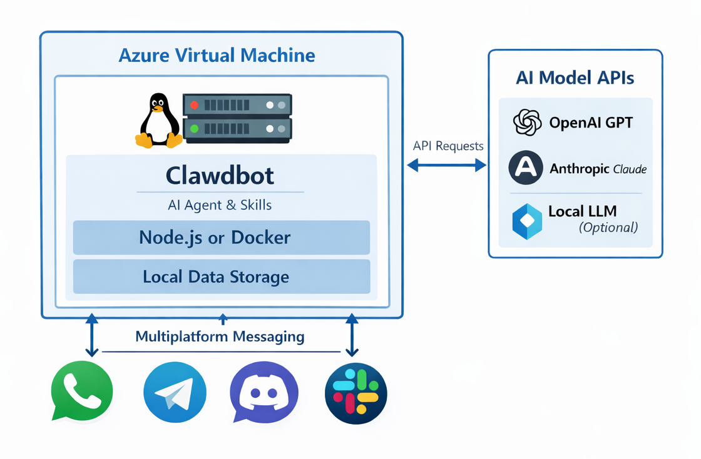

With the rapid development of generative AI and intelligent agents, self-hosted intelligent systems are gaining increasing attention from developers and technical teams. **Clawdbot** is one such open-source, self-hostable personal AI assistant. It not only engages in conversation with users but also executes tasks, integrates with messaging platforms, provides automation capabilities, and can be deployed on cloud platforms like Azure. This article will step-by-step introduce Clawdbot's capabilities, architecture, and how to deploy and start using it on **Microsoft Azure**.

## What is Clawdbot

**Clawdbot** is an open-source personal AI assistant project, essentially an intelligent agent framework that can:

* Interact with multiple messaging platforms, including WhatsApp, Telegram, Discord, Slack, Microsoft Teams, etc.
* Act as an intelligent conversation partner, task executor, and automated workflow handler, rather than just a simple chatbot.
* Support running on local or self-hosted servers, with data stored locally by default, enhancing privacy protection.
* Extend functionality through plugins/skills, enabling schedule reminders, file management, email processing, code generation, and more.

Clawdbot's core consists of **Gateway, Providers (Platform Integration), and Agents/Skills (Intelligent Task Execution Units)**. The Gateway is responsible for the message bus, Providers handle docking with various messaging platforms, and Agents/Skills actually execute user requests.

## Key Features of Clawdbot

1. **Multi-Platform Message Integration**
   Clawdbot supports receiving messages from WhatsApp, Telegram, Discord, Signal, Slack, Microsoft Teams, etc., by connecting to chat platform APIs, and passing these messages to AI models for processing.

2. **Privacy and Data Control**
   Unlike cloud-hosted chat AIs, Clawdbot can run on your own server or VPS, where all conversation history, configurations, and credentials can be stored and accessed on demand.

3. **Automated Execution Capabilities**
   Beyond conversation, Clawdbot can execute specific tasks, including browser control, file operations, data processing, sending reminders, etc., making it a more complex personal assistant platform.

4. **Extensible Model Support**
   Clawdbot supports various AI model providers (such as OpenAI GPT, Anthropic Claude, and even local LLM services like Ollama).

## Deploying Clawdbot on Azure VM

Although Clawdbot supports local execution or container platforms, **Azure VM is a very suitable deployment form** in the following scenarios:

1. **Full Control of Runtime Environment**

   * Freedom to choose OS (Ubuntu / Debian)
   * Freedom to install Node.js, Docker, GPU drivers, etc.

2. **Controllable Data and Privacy**

   * All conversation records, logs, and configuration files exist only within the VM
   * No dependence on third-party PaaS

3. **Suitable for Long-Running Agents**

   * 7×24 hours online
   * Automatic restart guaranteed via systemd or Docker

4. **Good Scalability**

   * Horizontal scaling (Multiple VMs + Load Balancer)
   * Vertical scaling (Larger CPU / GPU specs)

## Overall Deployment Architecture Overview

The typical architecture for running Clawdbot on an Azure VM is as follows:



## Create Azure VM

### VM Basic Configuration Suggestions

* **OS**: Ubuntu 22.04 LTS
* **Size**:
  * Lightweight use: Standard B2s / B4ms
  * Multi-Agent: D4s_v5 and above
* **Disk**: At least 64 GB
* **Network**:
  * Inbound: 22 (SSH)
  * Inbound: 3000 (or custom Clawdbot port)

### Log in to VM

```bash
ssh azureuser@<VM_PUBLIC_IP>
```

## Install Runtime Environment

### System Dependencies

```bash
sudo apt update && sudo apt upgrade -y
sudo apt install -y git curl build-essential
```

### Install Node.js (Recommended 20 LTS)

```bash
curl -fsSL https://deb.nodesource.com/setup_20.x | sudo -E bash -
sudo apt install -y nodejs
node -v
npm -v
```

## Install Clawdbot

### Global CLI + Local Run Directory

```bash
sudo npm install -g clawdbot
```

Create run directory:

```bash
mkdir ~/clawdbot
cd ~/clawdbot
```

Initialize configuration:

```bash
clawdbot onboard
```

Follow the steps to complete various configurations:


## Start Clawdbot

### Manual Start Verification

```bash
clawdbot gateway
```

Confirm that the log appears:

```text
🦞 Clawdbot 2026.1.24-3 (885167d) — I speak fluent bash, mild sarcasm, and aggressive tab-completion energy.
...
16:18:27 [heartbeat] started
16:18:27 [gateway] agent model: openai-codex/gpt-5.1
16:18:27 [gateway] listening on ws://127.0.0.1:18789 (PID 36888)
16:18:27 [gateway] listening on ws://[::1]:18789
16:18:27 [gateway] log file: \tmp\clawdbot\clawdbot-2026-01-27.log
16:18:27 [browser/server] Browser control listening on http://127.0.0.1:18791/
...
```

Open in browser: <http://127.0.0.1:18789/>


And you are ready to use!

## Conclusion

Clawdbot is a powerful open-source AI personal assistant that extends AI interaction to multiple messaging platforms and integrates rich execution capabilities. By deploying Clawdbot to Azure, you can build it into an enterprise-grade, self-hosted AI service, improving availability, security, and scalability. The steps above cover the entire process from creating an Azure VM to fully deploying Clawdbot, hoping to help you quickly build and run your own intelligent assistant.
