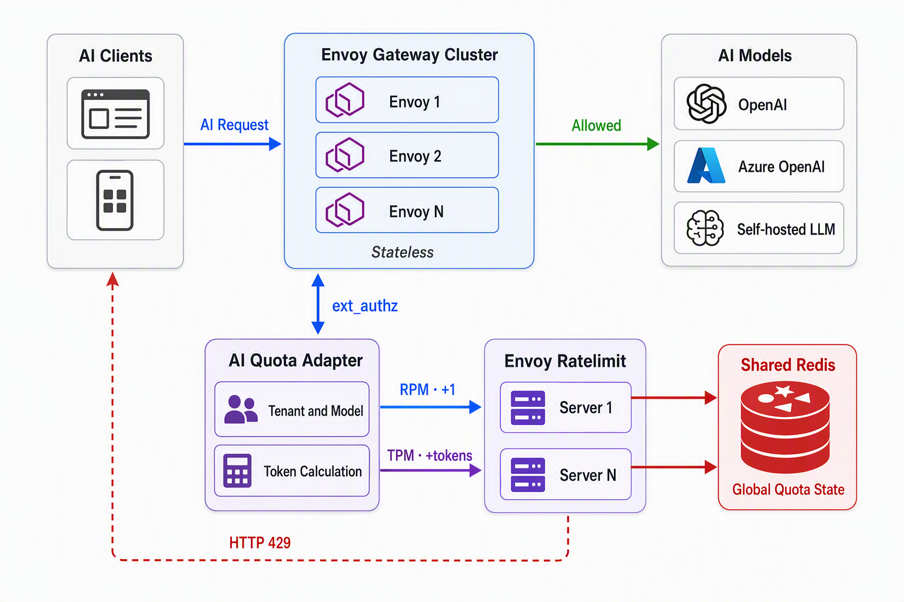

For conventional HTTP APIs, limiting the number of requests per minute is usually enough. For large language model APIs, however, limiting only the request count is far from sufficient: one request may consume only a few dozen tokens, while another may consume tens of thousands.

Therefore, a practical AI gateway usually needs to support all of the following:

- **RPM (Requests Per Minute)**: the number of requests per minute.
- **TPM (Tokens Per Minute)**: the number of tokens per minute.
- Separate metering by tenant, API key, model, or plan.
- Shared quotas across multiple Envoy instances.
- Protection against quota multiplication caused by per-instance counters under high concurrency.
- Consistent `429 Too Many Requests` responses and remaining-quota information.

This article explains how to build a distributed AI rate limiting system with [envoyproxy/ratelimit](https://github.com/envoyproxy/ratelimit), Redis, and Envoy.

## Why Envoy Local Rate Limit Is Not Enough

Envoy provides a Local Rate Limit Filter, but its counters reside in the current Envoy process by default.

Suppose we have four Envoy instances and configure the following limit for a tenant:

```text
RPM = 100
```

If every Envoy instance independently maintains a 100 RPM limit, the cluster as a whole may actually allow:

```text
4 × 100 = 400 RPM
```

That is clearly not the desired result.

Envoy's Global Rate Limit Filter can send rate limit requests to an external Rate Limit Service. `envoyproxy/ratelimit` is a commonly used global rate limit service in the Envoy ecosystem, and it stores counters in Redis.

The overall architecture looks like this:



This design adds a thin **AI Quota Adapter** to solve two primary problems:

1. Parse the model, tenant, and token count from the request body.
2. Check RPM and TPM separately with different `hits_addend` values.

## Why AI TPM Requires an Additional Adapter Layer

Standard Envoy rate limit rules usually treat one HTTP request as one hit:

```text
hits_addend = 1
```

This works for RPM, but not for TPM.

Consider these two requests:

```text
Request A: consumes 200 tokens
Request B: consumes 20,000 tokens
```

If both requests increase the counter by only one, TPM becomes meaningless. For TPM, each request must increment the counter by its token count:

```text
hits_addend = token_cost
```

For example:

```text
RPM request: hits_addend = 1
TPM request: hits_addend = 3200
```

The Rate Limit Service's `hits_addend` normally applies to the entire `RateLimitRequest`. RPM and TPM must therefore use two separate rate limit calls, or a custom adapter service must combine the checks.

The recommended processing order is:

1. Check and increment RPM with `hits_addend=1`.
2. If the RPM check passes, check and increment TPM with `hits_addend=token_cost`.
3. If either call returns `OVER_LIMIT`, the adapter returns a 429 response to Envoy.

With this pattern, Redis updates each dimension atomically, so multiple Envoy instances cannot multiply the available quota independently.

Note that the two calls do not form a transaction across counters. RPM may already have been incremented when TPM rejects the request. You should therefore define the counting semantics in advance:

- RPM counts every request attempt that enters the rate limiting flow; or
- Extend the service and use a Redis Lua script to check RPM and TPM together.

Most systems accept the first semantic because it is simpler and prevents malicious users from consuming gateway resources for free by repeatedly submitting oversized requests.

## Designing Rate Limit Descriptors

Rate limit dimensions usually include:

- `tenant`: a tenant, organization, or API key.
- `model`: the model name.
- `metric`: `rpm` or `tpm`.

The resulting Descriptor can be represented as:

```text
tenant = tenant-a
model  = gpt-4.1
metric = rpm
```

and:

```text
tenant = tenant-a
model  = gpt-4.1
metric = tpm
```

This makes it possible to configure:

```text
tenant-a + gpt-4.1 -> 60 RPM
tenant-a + gpt-4.1 -> 100,000 TPM
```

If quotas do not need to be separated by model, you can keep only:

```text
tenant + metric
```

In that case, all models share the same tenant quota.

## Configuring envoyproxy/ratelimit

Create `config/config.yaml`:

```yaml
domain: ai-gateway

descriptors:
  - key: tenant
    descriptors:
      - key: model
        descriptors:
          - key: metric
            value: rpm
            rate_limit:
              unit: minute
              requests_per_unit: 60

          - key: metric
            value: tpm
            rate_limit:
              unit: minute
              requests_per_unit: 100000
```

Here, `tenant` and `model` do not specify fixed values, so they can create separate buckets based on the Descriptor values in each request. Before deployment, validate the configuration with the validation tool provided by the selected ratelimit version.

The adapter sends the following RPM Descriptor:

```json
[
  {"key": "tenant", "value": "tenant-a"},
  {"key": "model", "value": "gpt-4.1"},
  {"key": "metric", "value": "rpm"}
]
```

It sends the following TPM Descriptor:

```json
[
  {"key": "tenant", "value": "tenant-a"},
  {"key": "model", "value": "gpt-4.1"},
  {"key": "metric", "value": "tpm"}
]
```

The Descriptor entries must appear in the same order as the nested path in the configuration.

### Different Quotas for Different Plans

If different tenants have different quotas, add a plan dimension:

```text
tenant -> plan -> model -> metric
```

For example:

```yaml
domain: ai-gateway

descriptors:
  - key: tenant
    descriptors:
      - key: plan
        value: standard
        descriptors:
          - key: model
            descriptors:
              - key: metric
                value: rpm
                rate_limit:
                  unit: minute
                  requests_per_unit: 60

              - key: metric
                value: tpm
                rate_limit:
                  unit: minute
                  requests_per_unit: 100000

      - key: plan
        value: enterprise
        descriptors:
          - key: model
            descriptors:
              - key: metric
                value: rpm
                rate_limit:
                  unit: minute
                  requests_per_unit: 1000

              - key: metric
                value: tpm
                rate_limit:
                  unit: minute
                  requests_per_unit: 2000000
```

The `tenant` value in a request isolates the counter, while `plan` selects the quota.

Do not use only `plan` as the counting dimension, or all Standard users may share the same counter.

## 5. Deploying with Docker Compose

The following is a simplified example:

```yaml
services:
  redis:
    image: redis:7-alpine
    command:
      - redis-server
      - --appendonly
      - "yes"
    volumes:
      - redis-data:/data
    ports:
      - "6379:6379"

  ratelimit:
    image: envoyproxy/ratelimit:<pinned-version>
    command: /bin/ratelimit
    environment:
      LOG_LEVEL: info

      REDIS_SOCKET_TYPE: tcp
      REDIS_URL: redis:6379

      RUNTIME_ROOT: /data
      RUNTIME_SUBDIRECTORY: ratelimit
      RUNTIME_WATCH_ROOT: "false"

      USE_STATSD: "false"
    volumes:
      - ./config:/data/ratelimit
    ports:
      - "8081:8081"
      - "6070:6070"
    depends_on:
      - redis

volumes:
  redis-data:
```

Do not use `master` or a floating tag in production. Pin the image to a verified release version.

Image ports and environment variables may differ between versions, so follow the example configuration in the repository for the specific version being deployed.

Start the services:

```bash
docker compose up -d
```

View the logs:

```bash
docker compose logs -f ratelimit
```

You can run multiple ratelimit replicas in production:

```text
ratelimit-1 ─┐
ratelimit-2 ─┼── Redis
ratelimit-3 ─┘
```

The ratelimit service itself can remain stateless as long as all replicas:

- Use the same configuration.
- Point to the same logical Redis cluster.
- Use a consistent Redis key prefix or namespace.

## Core Logic of the AI Quota Adapter

The adapter can be implemented as an Envoy `ext_authz` service. It receives request information forwarded by Envoy, identifies the caller, calculates the token count, and checks the quota.

The following simplified Go pseudocode illustrates the process:

```go
func CheckAIQuota(
    ctx context.Context,
    tenant string,
    model string,
    tokenCost uint32,
) error {
    // First call: RPM
    rpmResp, err := rateLimitClient.ShouldRateLimit(
        ctx,
        &ratelimitv3.RateLimitRequest{
            Domain: "ai-gateway",
            Descriptors: []*ratelimitv3.RateLimitDescriptor{
                {
                    Entries: []*ratelimitv3.RateLimitDescriptor_Entry{
                        {Key: "tenant", Value: tenant},
                        {Key: "model", Value: model},
                        {Key: "metric", Value: "rpm"},
                    },
                },
            },
            HitsAddend: 1,
        },
    )
    if err != nil {
        return err
    }

    if rpmResp.OverallCode ==
        ratelimitv3.RateLimitResponse_OVER_LIMIT {
        return ErrRPMExceeded
    }

    // Second call: TPM
    tpmResp, err := rateLimitClient.ShouldRateLimit(
        ctx,
        &ratelimitv3.RateLimitRequest{
            Domain: "ai-gateway",
            Descriptors: []*ratelimitv3.RateLimitDescriptor{
                {
                    Entries: []*ratelimitv3.RateLimitDescriptor_Entry{
                        {Key: "tenant", Value: tenant},
                        {Key: "model", Value: model},
                        {Key: "metric", Value: "tpm"},
                    },
                },
            },
            HitsAddend: tokenCost,
        },
    )
    if err != nil {
        return err
    }

    if tpmResp.OverallCode ==
        ratelimitv3.RateLimitResponse_OVER_LIMIT {
        return ErrTPMExceeded
    }

    return nil
}
```

The actual protobuf package names and field types should match the Envoy API version pinned by the project.

The adapter's complete processing flow is:

```text
1. Identify the tenant from the Authorization header or API key
2. Read the model from the JSON request body
3. Calculate input_tokens with the tokenizer for that model
4. Calculate token_cost according to policy
5. Call RLS to check RPM
6. Call RLS to check TPM
7. If both checks pass, return OK
8. If either limit is exceeded, return 429
```

## Integrating the Adapter with Envoy

If the adapter implements Envoy's `ext_authz` gRPC protocol, configure it in Envoy as follows:

```yaml
http_filters:
  - name: envoy.filters.http.ext_authz
    typed_config:
      "@type": type.googleapis.com/envoy.extensions.filters.http.ext_authz.v3.ExtAuthz

      transport_api_version: V3

      grpc_service:
        envoy_grpc:
          cluster_name: ai_quota_adapter
        timeout: 0.5s

      with_request_body:
        max_request_bytes: 1048576
        allow_partial_message: false
        pack_as_bytes: true

      failure_mode_allow: false

  - name: envoy.filters.http.router
    typed_config:
      "@type": type.googleapis.com/envoy.extensions.filters.http.router.v3.Router
```

The corresponding Cluster configuration is:

```yaml
clusters:
  - name: ai_quota_adapter
    type: STRICT_DNS
    connect_timeout: 0.25s

    http2_protocol_options: {}

    load_assignment:
      cluster_name: ai_quota_adapter
      endpoints:
        - lb_endpoints:
            - endpoint:
                address:
                  socket_address:
                    address: ai-quota-adapter
                    port_value: 9000
```

Token calculation requires access to the JSON request body, so `with_request_body` must be configured.

Limit the maximum request body size to prevent attackers from submitting oversized prompts that create memory pressure in Envoy or the adapter.

## How TPM Should Be Calculated

The definition of RPM is straightforward: increment the counter by one for each request.

TPM is more complicated because, when a request begins, only the input token count is usually known. The number of tokens the model will eventually generate is still unknown.

### Option 1: Count Only Input Tokens

```text
token_cost = input_tokens
```

Advantages:

- It can be calculated exactly before the request starts.
- It is the simplest approach to implement.
- It works for both streaming and non-streaming APIs.

Disadvantages:

- It cannot limit output tokens.
- A user can submit a short prompt and request a very large output.

This approach is suitable for systems that define TPM as an input-token quota.

### Option 2: Reserve the Maximum Output Tokens

```text
token_cost = input_tokens + requested_max_output_tokens
```

For example:

```text
input_tokens = 1200
max_tokens   = 4096
token_cost   = 5296
```

Advantages:

- It supports strict admission control before the model is called.
- It prevents unknown output token counts from exceeding the quota.
- It works well with streaming responses.

Disadvantages:

- If the model produces only 300 tokens, the system still reserves 4,096 tokens.
- Without refunds, quota utilization will be lower.

This is the easiest way to guarantee that the quota is never exceeded.

The gateway must enforce a server-side upper bound on `max_tokens` rather than trusting the client completely:

```text
effective_max_tokens = min(client_max_tokens, server_model_limit)
```

Otherwise, a client could submit an abnormally large `max_tokens` value and quickly exhaust its own quota or the entire tenant's quota.

### Option 3: Reserve First, Then Settle Based on Actual Usage

The complete process is:

1. Reserve tokens when the request starts:

```text
input_tokens + max_output_tokens
```

2. Obtain the actual output token count when the response finishes.
3. Refund the unused portion:

```text
refund = max_output_tokens - actual_output_tokens
```

However, the standard `envoyproxy/ratelimit` call is primarily designed to increment counters and does not natively provide a complete reserve-commit-refund transaction model.

If the business requires precise refunds, you will usually need to:

- Implement an additional Redis Lua script in the adapter.
- Use separate reservation records with expiration times.
- Commit or refund after the request finishes.
- Use a request ID to guarantee idempotency.

In this design, `envoyproxy/ratelimit` can still handle RPM or basic TPM, but the settlement logic has become part of a custom quota service.

### Option 4: Incremental Charging for Streaming Responses

For streaming output, the system can:

1. Charge for input tokens when the request starts.
2. Increment the TPM counter for each batch of output tokens generated.
3. Terminate the upstream stream as soon as the quota is exceeded.

For example, charge once every 32 or 128 tokens.

This approach requires visibility into the response stream, so request-stage `ext_authz` alone is not sufficient. You need one of the following:

- Envoy `ext_proc`;
- a Wasm Filter;
- a custom HTTP Filter;
- or an AI Gateway that proxies and reads the streaming response itself.

Smaller batches provide more precise control but also increase the number of gRPC and Redis calls.

## How Multiple Envoy Instances Share a Quota

Suppose a tenant has the following limits:

```text
RPM = 100
TPM = 200,000
```

Requests may be distributed randomly across different Envoy instances:

```text
Request 1 -> Envoy A
Request 2 -> Envoy B
Request 3 -> Envoy C
```

However, all rate limit requests ultimately access the same Redis counters:

```text
ai-gateway / tenant-a / gpt-4.1 / rpm
ai-gateway / tenant-a / gpt-4.1 / tpm
```

The quota is therefore shared across the cluster rather than maintained separately by each Envoy instance.

The following components can be scaled horizontally:

- Envoy.
- AI Quota Adapter.
- envoyproxy/ratelimit.

The counter state for a given quota key cannot be split arbitrarily. If you use multiple completely independent Redis instances, you must ensure that the same tenant, model, and metric always route to the same shard. Otherwise, the effective quota will be multiplied again.

## Returning Standard Rate Limit Responses

When a limit is exceeded, the adapter should return a 429 response through Envoy:

```http
HTTP/1.1 429 Too Many Requests
Content-Type: application/json
Retry-After: 12
```

The response body can follow the OpenAI style:

```json
{
  "error": {
    "message": "Rate limit exceeded for tenant tenant-a",
    "type": "rate_limit_error",
    "code": "tpm_limit_exceeded"
  }
}
```

It is helpful to expose RPM and TPM information separately:

```http
X-RateLimit-Limit-Requests: 60
X-RateLimit-Remaining-Requests: 12
X-RateLimit-Reset-Requests: 18

X-RateLimit-Limit-Tokens: 100000
X-RateLimit-Remaining-Tokens: 24580
X-RateLimit-Reset-Tokens: 18
```

To avoid synchronized retry storms, SDKs should use exponential backoff with random jitter:

```text
sleep = random(0, min(cap, base × 2^retry_count))
```

## Defining the Boundaries of "Precise Rate Limiting"

Shared Redis counters solve quota multiplication across instances, but the exact meaning of "precise" still needs to be defined.

### 1. It Usually Uses Fixed Time Windows

The following configuration:

```yaml
unit: minute
```

usually represents a one-minute fixed window, which is not equivalent to a strict sliding window.

A user could send 100 requests just before one window ends and immediately send another 100 after the next window begins. From the perspective of any continuous 60-second interval, traffic may approach twice the configured limit.

This solution therefore guarantees that:

> All Envoy instances share the same fixed-window counter.

It does not automatically guarantee that:

> The limit is never exceeded during any continuous 60-second interval.

If the business requires a strict sliding window, use a Redis Sorted Set, a sliding-window counter, or a dedicated quota algorithm.

### 2. Output Tokens Are Unknown When the Request Starts

If TPM includes output tokens, the final token usage cannot be known before generation.

Strict control usually means either:

- Reserving `max_tokens`; or
- Charging incrementally during streaming generation.

Simply reporting actual token usage after the response finishes can support billing and analytics, but it cannot prevent the current request from exceeding TPM.

### 3. RPM and TPM Are Not One Atomic Transaction

The `hits_addend` value in a standard RLS request applies uniformly, while RPM and TPM require different increments. They therefore usually require two calls.

If the requirement is to check and increment RPM and TPM together, while ensuring that neither counter changes if either check fails, implement a custom service and perform the transaction with a single Redis Lua script.

## Key Production Considerations

### 1. Request Retries and Duplicate Charges

Rate Limit Service counter updates are generally not idempotent at the business level.

If the adapter retries the same request after a timeout:

```text
The first call updates Redis, but its response is lost
The second call increments the counter again
```

the request will be charged twice.

Recommendations:

- Do not blindly retry rate limit calls.
- Use Envoy's `x-request-id` or a business request ID.
- For strict metering, implement idempotency records in the adapter.
- Set the idempotency record expiration time to cover at least the rate limit window and the maximum request duration.

### 2. Fail Open or Fail Closed

When Redis or the ratelimit service is unavailable, you can choose one of two behaviors.

**Fail Open:**

```text
Allow requests when the rate limiting system is unavailable
```

This provides higher availability but may cause costs to become uncontrolled.

**Fail Closed:**

```text
Reject requests when the rate limiting system is unavailable
```

This protects costs, but a failure in the rate limiting components will affect the application.

AI inference is usually expensive, so Fail Closed is generally a better choice for paid APIs exposed to external users. A short Fail Open period may be acceptable in low-risk internal environments when combined with circuit breakers and alerts.

### 3. The Tokenizer Must Match the Model

Different models may use different tokenizers. A simple character-count ratio cannot provide strict TPM enforcement.

Maintain a mapping such as:

```text
model -> tokenizer
```

For example:

```text
gpt-family       -> cl100k/o200k-style tokenizer
llama-family     -> corresponding SentencePiece/BPE tokenizer
custom model     -> the model's actual tokenizer.json
```

If a tokenizer is unavailable, you can use a conservative estimate, but it must include an error margin:

```text
estimated_tokens = ceil(raw_estimate × safety_factor)
```

### 4. Normalize Model Names

Clients may use names such as:

```text
gpt-4.1
gpt-4.1-2025-04-14
my-gpt-alias
```

Map these names to a canonical quota name before applying rate limits:

```text
my-gpt-alias -> gpt-4.1
```

Otherwise, users may bypass a shared model quota by switching aliases.

### 5. Do Not Trust Client-Provided Token Counts

Do not allow a client to submit:

```http
X-Token-Cost: 1
```

and charge based on that value.

Token counts must be calculated by a trusted component or verified against usage returned by the upstream model. Client declarations may be used as hints, but never as the source of truth for billing.

### 6. Configuration Releases Must Be Consistent

If different ratelimit replicas load different configurations, you may end up with:

```text
Replica A: RPM 100
Replica B: RPM 200
```

Even with a shared Redis instance, the results will become unpredictable.

Production environments should:

- Use versioned configurations.
- Validate configurations before startup.
- Preserve backward compatibility during rolling deployments.
- Add configuration version numbers and monitoring metrics.

## Monitoring Metrics

At a minimum, monitor the following metrics.

### Envoy

- Number of `ext_authz` calls.
- Number of `ext_authz` timeouts and failures.
- Number of HTTP 429 responses.
- Number of upstream requests and concurrent requests.
- Number of request body buffering failures.

### AI Quota Adapter

- RPM allow and reject counts.
- TPM allow and reject counts.
- Token calculation latency.
- RLS gRPC latency.
- Tokenizer load failures.
- Token usage aggregated by model and tenant.
- Duplicate request or idempotency hit counts.

### Ratelimit

- Counts of `OK`, `OVER_LIMIT`, and error responses.
- Redis request latency.
- Redis connection pool utilization.
- Configuration load status.
- Hit counts for each rate limit rule.

### Redis

- CPU and memory usage.
- Command latency.
- Connection count.
- Key count.
- Key expiration rate.
- Primary-replica replication lag.
- Number of failovers.

High-cardinality tenant IDs should not be used directly as Prometheus labels. Doing so can cause severe metric cardinality problems when there are many tenants. Detailed per-tenant usage is better written to logs, ClickHouse, or a dedicated metering system.

## Recommended Final Architecture

For most AI API gateways, the following combination works well:

```text
Envoy
  └── ext_authz
        └── AI Quota Adapter
              ├── Parse the tenant and model
              ├── Calculate input_tokens with a trusted tokenizer
              ├── Normalize and limit max_tokens
              ├── RPM: RLS hits_addend = 1
              └── TPM: RLS hits_addend =
                       input_tokens + max_output_tokens
                        └── envoyproxy/ratelimit
                              └── Redis
```

This solution has the following characteristics:

- Multiple Envoy instances share a unified quota.
- RPM and TPM are counted separately.
- Quotas can be isolated by tenant, model, and plan.
- Admission control happens before the request reaches the model service.
- Reserving the maximum output tokens prevents streaming output from exceeding TPM.
- Envoy, the adapter, and the ratelimit service can all be scaled horizontally.

If actual output token usage must be settled precisely, add the following components:

```text
reservation records + response usage collection + commit/refund + request idempotency
```

At that point, the system has evolved from a rate limiting service into a complete distributed AI quota and metering service.

## Summary

`envoyproxy/ratelimit` is well suited to solving global shared rate limiting across multiple Envoy instances. It keeps counters centrally in Redis, preventing each gateway instance from calculating quotas independently.

AI workloads require token-aware behavior in addition to standard HTTP rate limiting:

- Use `hits_addend=1` for RPM.
- Use `hits_addend=token_cost` for TPM.
- Build Descriptors from the tenant, model, and metric.
- Perform admission control at request time by counting input tokens or reserving the maximum output tokens.
- Have multiple Envoy instances, adapter instances, and RLS replicas share the same Redis counter space.

It is important to recognize that distributed shared counters, fixed time windows, combined RPM/TPM transactions, and settlement based on actual output tokens are four separate problems. Understanding these boundaries is essential to building an AI rate limiting system that both protects model costs and remains stable under high concurrency.