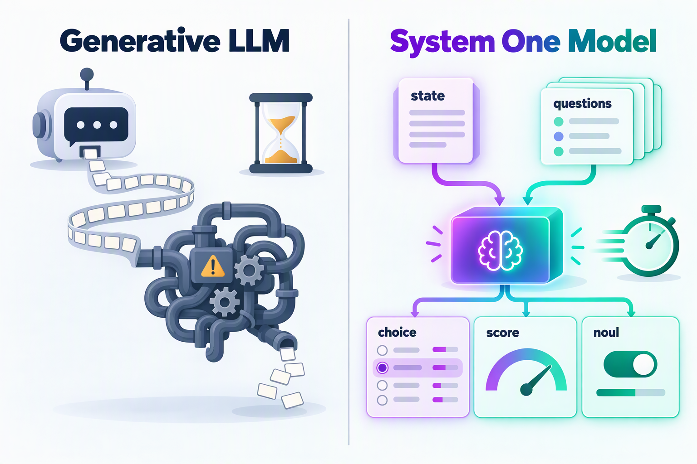
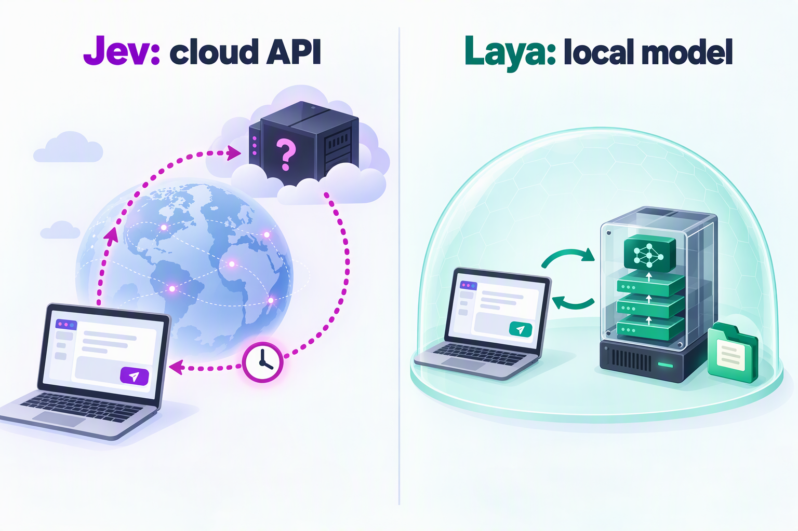

## Introduction

In September 2026, a new kind of model that "doesn't talk" suddenly became the talk of the AI world.

On September 15, TypeSafe AI, founded by former OpenAI researcher Diogo Almeida, released **Jev**. It doesn't chat, write articles, or generate code. It takes a piece of state and a set of predefined questions, and directly returns structured decisions with calibrated probabilities.

Just three days later, on September 18, independent researcher Nandakishor M (Convai Innovations) open-sourced **Laya**. It is also a non-autoregressive System 1 decision model. It is licensed under Apache 2.0, its weights can be downloaded straight from Hugging Face, it passed 6,000 GitHub stars within three days, and the community quickly dubbed it "the open-source Jev".

On one side is a ready-to-use closed API backed by a $40 million seed round; on the other, a 421M-parameter open-source model that runs on a single T4 or even a MacBook. Social media is full of claims like "Laya beats Jev" and "Jev's moat lasted two days", but a careful read of what both sides have published shows that the story is far from that simple.

This article covers:

1. What a decision model is and which problem it solves
2. The technical approaches of Jev and Laya
3. The key differences and how to read the benchmark numbers
4. The strengths and weaknesses of each
5. Use cases and selection advice

## What Is a Decision Model (System One Model)?

### 1. Where the Name Comes From

"System One" comes from Daniel Kahneman's *Thinking, Fast and Slow*: System 1 is fast, intuitive judgment, while System 2 is slow, deliberate reasoning. In this analogy, generative LLMs (especially reasoning models) are more like System 2, while decision models handle millisecond-level "gut reactions".

As a side note, Jev is named after the economist William Stanley Jevons. TypeSafe believes machine intelligence will replay the "Jevons paradox": just as more efficient steam engines increased the demand for coal, every order-of-magnitude drop in the price of intelligence will unlock orders of magnitude more use cases.

### 2. The Pain of Using LLMs for "Multiple-Choice Questions"

In real-world AI engineering, many decisions are "small" ones:

* Which team should handle this ticket?
* Is this email a phishing attempt?
* Does this prompt contain an injection attack?
* Which tool should the agent call next? Did the previous step succeed?

The common approach today is to hand these questions to an LLM that is good at writing, and then dig the answer out of the text it generates. This leads to a series of problems:

| Problem | Symptom |
| --- | --- |
| High latency | Token-by-token generation takes hundreds of milliseconds to seconds, and reasoning models are even slower |
| High cost | Both input and output are billed, and output tokens are usually more expensive |
| Parsing required | You need JSON parsing, schema validation, and retry logic |
| Type errors | The model may add an explanation or even return an option that doesn't exist |
| Untrustworthy confidence | A `"confidence": 0.95` written by the model is just text that "sounds confident", with no statistical calibration behind it |

### 3. How Decision Models Work

Decision models simply remove the "generation" step. TypeSafe sums it up in one sentence:

> **Unstructured state in, typed probabilistic decisions out.**



The caller only needs to submit two things:

* `state`: the current state to be judged, as a string, a JSON object, or an array of text values
* `questions`: a set of typed questions, where the caller defines every candidate answer in advance

The model answers all questions in parallel and returns only numbers and probabilities. Jev and Laya use exactly the same three question primitives:

| Primitive | Question it answers | What it returns | Typical uses |
| --- | --- | --- | --- |
| `choice` | Pick one of the given options | The chosen option, per-option probabilities, confidence | Ticket routing, intent detection, tool selection |
| `score` | Rate on an ordered scale | Probability-weighted expected score, level distribution, confidence | Urgency, emotional intensity, risk level |
| `noul` | Yes / no judgment | Probability of "yes" (0–1) | Phishing detection, jailbreak detection, refund requests |

Because the output space is defined in advance, the model **cannot return type errors or made-up options**. Keep in mind, however, that **type safety does not mean the judgment is correct**: the model can still pick the wrong option among the valid ones, a point this article returns to repeatedly.

### 4. Where It Fits in a System

Decision models are not meant to replace LLMs. Instead, they move LLMs out of positions they were never well suited for. A reasonable division of labor looks like this:

```
Code (deterministic logic)
  └─ orchestration, permissions, math and date calculations, executing actions
        │  hits a "fuzzy if-statement" that needs semantic understanding
        ▼
Decision model (System 1: Jev / Laya)
  └─ classify, route, score, verify, guardrail; returns typed answers + probabilities
        │  low confidence, or text generation / complex reasoning needed
        ▼
LLM (System 2: GPT / Claude / DeepSeek, etc.)
  └─ long-context understanding, planning, writing, code generation
```

With calibrated confidence, program control flow is no longer just "yes / no"; it can be split into three tiers: **act automatically on high confidence, send medium confidence to a stronger model for review or ask the user to confirm, and hand low confidence to a human**. This is where the real value of decision models lies: speed is only the surface, and confidence you can put in an `if` statement is what really matters.


## The Two Contenders

### Jev: TypeSafe AI's Closed-Source Cloud Service

**Basics**

* Released: September 15, 2026, in early access
* Team: TypeSafe AI is a San Francisco company. Founder Diogo Almeida did research at Google Brain and OpenAI, and is one of the authors of the InstructGPT paper and the GPT-4 technical report. On launch day, the company also announced a $40 million seed round led by DCVC
* Product: closed source, available only through an API (`POST https://api.typesafe.ai/v1/systemone`) and Python / JavaScript SDKs
* Current version: Jev 1.13 (`jev-1.13.0`), alias `jev-latest`

**Technical Approach**

TypeSafe says it rebuilt the entire stack for automation: a new model architecture, a parallel sampler built for maximum efficiency, and a training method called **RLCD (Reinforcement Learning for Calibrated Decisions)**. Unlike RLHF, which optimizes for human preference, and RLVR, which optimizes for verifiable rewards, RLCD aims to make the model give **epistemically honest probabilities** along with its answers.

However, TypeSafe has not disclosed the model architecture, parameter count, or training data. Many in the community believe it is closer to an encoder model like BERT, but that is only speculation.

**Key Specs**

| Item | Spec |
| --- | --- |
| Price | $0.042 per million input tokens; output is free |
| Latency | 70–500 ms end to end, according to TypeSafe |
| Context | 64k tokens per request; the state plus the longest single question must fit in 32k tokens |
| Input | Text only (strings, JSON objects, arrays of text); no images, audio, or video |
| Options | Up to 255 options per `choice` |
| Rate limits | 250,000 tokens/s and 1,200 requests/min (TypeSafe says these adjust dynamically) |
| Language | English is the primary training language; Chinese and other CJK text works, but accuracy may drop |
| Customization | No fine-tuning or LoRA; every customer uses the same weights |

At this price, if each decision consumes 1,000 input tokens on average, 1 million decisions cost only about $42.

**Ecosystem**

Jev took off quickly after launch: LangChain soon published an integration guide, Vercel added it to its AI Gateway, and the community produced plenty of experiments, such as fast-jev-compaction, which uses Jev to score the relevance of Claude Code's tool-call outputs and compress the context accordingly.

### Laya: Convai Innovations' Open-Source Local Model

**Basics**

* Released: September 18, 2026
* Author: independent researcher Nandakishor M (Convai Innovations)
* License: Apache 2.0, with the code, weights, training method, and fine-tuning notebook all public
* Getting it: `pip install laya` (Python 3.10+); the weights are hosted on Hugging Face at `convaiinnovations/laya`

There is a backstory behind Laya. In 2025, the author had already published two related papers (arXiv:2503.23303 and arXiv:2510.01237) on training non-autoregressive decision models with reinforcement learning, originally to predict conversion rates in sales conversations. After seeing Jev launched as a "breakthrough", he fixed every architectural limitation of his old approach and built this general-purpose open-source version.

**Architecture**

Laya uses a "bidirectional encoder + decision head" design with 421M parameters in total:

```
State (text or JSON) + typed questions and options
        │ packed as: [CLS] question [SEP] [MASK] option1 [MASK] option2 ... [SEP] state [SEP]
        ▼
ModernBERT-large encoder (395M, 28 bidirectional attention layers)
        ▼
Decision-head Transformer (~25M, 2 layers)
        ├─ Option scorer: hidden state at each [MASK] → logit → temperature scaling → softmax
        └─ Act / Escalate head: [CLS] + distribution stats → "act automatically" or "escalate"
```

Each option is preceded by a `[MASK]` marker. After the bidirectional encoder, the hidden states at those marker positions are extracted and scored. Multiple questions about the same state are collated into one batch and computed in a single forward pass.

**Three Checkpoints + a Router**

| Checkpoint | Encoder | Params | Default context | Use for |
| --- | --- | --- | --- | --- |
| `laya` | ModernBERT-large | 421M | 512 | English |
| `laya-multilingual` | mmBERT-base | 322M | 1024 | 100+ languages, about 2x faster |
| `laya-typed-decisions` | ModernBERT-large | 421M | 1024 | Fine-tuned for the typed-decisions workflows |

Laya ships with a pure-Python `Router` that detects the script and language of the input in under a millisecond before the forward pass, then picks the right checkpoint automatically. It exists because the English checkpoint is "confidently wrong" on non-Latin scripts: on Khmer it scores 0 accuracy at 0.952 confidence. No confidence threshold can catch that.

**An Open RLCD Implementation**

Laya adopts the RLCD name and publishes exactly how it works: **strictly proper scoring rules** (a combination of the logarithmic, spherical, and ranked probability scores) are used as the reward, and the model is trained with a GRPO-style group-baseline policy gradient, with no supervised cross-entropy loss at all. A strictly proper scoring rule gives the highest expected reward only when the model reports its true probabilities, which "forces" the model to be honest.

The Act / Escalate head is trained with a cost matrix: +1 for a correct action, -3 for a wrong one, and -0.5 for escalating to a human. It follows that acting automatically only beats escalation when the chance of being right exceeds 62.5%, so the model learns to "hand it over when unsure".

Laya also provides ready-made workflow presets (model routing, prompt guardrails, content moderation, and ticket triage), plus a fine-tuning notebook that runs on Kaggle's free 2×T4 GPUs: 4 epochs over about 30,000 questions take 4–5 hours.

## Key Differences at a Glance



| Dimension | Jev | Laya |
| --- | --- | --- |
| Publisher | TypeSafe AI (a company) | Convai Innovations (independent researcher) |
| Openness | Closed source, API only | Apache 2.0, weights and code fully open |
| Deployment | Hosted cloud (the service currently runs on the US West Coast) | Local, private cloud, or air-gapped; runs on GPU, Mac MPS, or CPU |
| Architecture | Undisclosed | ModernBERT / mmBERT encoder + decision head |
| Parameters | Undisclosed | 322M–421M |
| Training | RLCD (details undisclosed) | RLCD (strictly proper scoring rules + group-baseline policy gradient, published) |
| Primitives | choice / score / noul | choice / score / noul, with a nearly identical request format |
| Context length | 64k tokens | 512 / 1024 tokens by default (the encoder supports up to 8192) |
| Options | Up to 255 | Accuracy drops noticeably beyond 20 |
| Zero-shot ability | Strong, ready out of the box | Weak; the base checkpoints need fine-tuning |
| Customization | Only through state, instructions, and criteria | Fine-tune on your own data and fit calibration temperatures |
| Languages | Mostly English | Multilingual checkpoint + automatic routing; 45 of 51 tested languages are usable |
| Single-question latency | 70–500 ms officially; third-party p50 of 236–276 ms | About 33–40 ms on a T4 GPU |
| Cost | $0.042 per million input tokens | The model is free; you only pay for compute |
| Data compliance | Data is sent to TypeSafe; zero data retention for enterprise plans | Data never leaves your machine |
| Operations | Fully managed | You deploy, scale, monitor, and version it yourself |

## How to Read the Benchmarks

### 1. The Comparison Published by Laya

Laya's README includes a comparison table against Jev 1.13.0 (the Laya numbers are measured results after routing):

| Metric | Jev 1.13.0 | Laya (routed) |
| --- | --- | --- |
| typed-decisions accuracy (2,000 decisions) | 0.727 | **0.766** |
| AG News accuracy (4 labels) | 0.910 | **0.950** |
| DAIR Emotion accuracy (6 labels) | 0.480 | **0.595** |
| Banking77 accuracy (72 / 77 labels) | **0.870** | 0.425 |
| ECE calibration error (lower is better) | 0.246 | **0.081** |
| Single-question p50 latency | 236–276 ms | **32.8 ms** |
| Cost | $0.042 per million tokens | $0 self-hosted |

At first glance, Laya wins almost across the board. But drawing conclusions from this table alone is a trap.

### 2. Five Things to Keep in Mind

**First, the Jev numbers were not measured side by side.** The Laya author states clearly that he has no access to the TypeSafe API. Every Jev number in the table comes from published third-party results, with different sample sizes and prompts.

**Second, Laya's high scores come from targeted fine-tuning.** The 0.766 on typed-decisions was achieved by `laya-typed-decisions` after fine-tuning on that benchmark's own training split. The two base checkpoints without fine-tuning score only 0.34–0.36, close to random guessing (0.318) and even below the "always guess the most common class" baseline (0.461), whereas Jev reaches 0.727 without any training. The author puts it bluntly: **Laya is a fast base to specialize, not a zero-shot decision engine.** In other words, the table compares a fine-tuned specialist with a zero-shot generalist.

**Third, the calibration advantage requires extra temperature fitting.** The 0.081 ECE in the table comes after refitting temperatures on held-out domain data; out of the box it is 0.466. On the same typed-decisions benchmark, the fine-tuned Laya checkpoint has an ECE of 0.213, which is actually higher than Jev's 0.144. On "soft accuracy", which measures how well the probability distribution matches the reference distribution, Jev also leads with 0.580 versus Laya's 0.471. Jev isn't flawless either: according to the data cited by the Laya author, on DAIR Emotion Jev assigned zero probability to the true label for 16% of examples, a hard failure for any system that branches on confidence.

**Fourth, the latency comparison is really a comparison of deployment models.** Jev's latency includes the network round trip from the client to TypeSafe's cloud (TypeSafe runs most of its evaluations from the US West Coast), while Laya's 32.8 ms is inference time on a local T4 GPU. For users far from the US West Coast, such as in Asia, cross-region network latency comes on top of that. Conversely, if you deploy Laya as a remote service, you have to count the network overhead too.

**Fifth, Jev's own marketing numbers deserve a discount as well.** The "193.6x faster, 444.6x cheaper" claims on TypeSafe's website come from four workflow evaluations designed by its own team, with reference answers taken from the average of two frontier models, GPT-6 Astra and Fable 5.1, and TypeSafe itself admits these numbers are at the high end of real-world gains. A third-party test published by the automation company AY Automate shows Jev being about 2–3.6x faster than the models it was compared with; on cost, it saves about 4.7–7.5x versus cheap small models and only reaches 40–49x versus expensive frontier models.

### 3. Community Tests

Within days of the launch, the community ran plenty of comparisons, mostly in high-frequency interactive scenarios:

* **Snake**: with the same decision logic, the 421M Laya running locally averaged 86.5 decisions per second over 30 seconds at a P50 latency of about 9 ms; the cloud-hosted Jev managed only 3.2 decisions per second, with an API round trip of about 317 ms
* **An M5 Pro test**: median times of 15.3 ms and 298.1 ms respectively, a gap of almost 20x
* **An Apple Silicon port**: the community project laya-mlx ports the model to MLX, uses at most about 1 GB of memory at runtime, and reaches 60 decisions per second when playing Snake on an M3 Max

These tests mainly reflect the difference between local inference and a cloud round trip. For real-time scenarios that need dozens of decisions per second, the gap is decisive; for routing a single ticket, users can barely tell the difference between 30 ms and 300 ms.

### 4. Takeaway

A fair conclusion: **Jev is stronger when you need something that works out of the box, with long context or complex option spaces; on vertical tasks with labeled data, a fine-tuned Laya can be faster, more accurate, and cheaper.**

## Jev: Strengths and Weaknesses

### Strengths

1. **Ready out of the box with strong zero-shot ability**: no training data needed; write the state and the questions and you're done. TypeSafe says Jev reaches intelligence levels similar to existing frontier LLMs on System One tasks, and Karpathy commented that it sits at a long-underrated spot on the LLM Pareto curve: tasks that don't need elaborate thinking, just reliable enough judgments at low latency.
2. **Long context and high-cardinality options**: the 64k context can take long email threads, contract clauses, or agent execution traces as-is; `choice` supports up to 255 options and still reaches 0.870 accuracy on fine-grained intent classification such as Banking77.
3. **Calibrated out of the box**: no temperature fitting required; the returned probabilities can be used directly for threshold-based routing, and the official docs include best practices for setting thresholds by risk level.
4. **Fully managed with a mature ecosystem**: a hosted service plus official SDKs, already integrated with LangChain, Vercel AI Gateway, and more, so teams don't have to worry about GPUs, scaling, or model upgrades.
5. **Extremely low unit price**: at 1,000 input tokens per decision, 1 million decisions cost about $42; for most businesses, model cost is no longer the bottleneck.

### Weaknesses

1. **A closed black box**: the architecture, parameter count, and training data are all undisclosed. Decision models don't explain themselves either; as Simon Willison pointed out, all Jev may leave developers with is a number, which makes it hard to ask why a judgment went wrong.
2. **Data must leave your environment**: every state is sent to TypeSafe's cloud, and zero data retention (ZDR) is only offered to enterprise customers, a deal-breaker for finance, healthcare, government, and similar scenarios. According to media reports, Jev is also not yet available in mainland China.
3. **Network latency can't be eliminated**: a round trip of a few hundred milliseconds is fast enough for business workflows, but still too slow for game AI, real-time risk control, and other scenarios that need dozens of decisions per second.
4. **No fine-tuning**: all customers share the same weights, and you can only steer it through state, instructions, and criteria, which may fall short of a dedicated model in highly specialized domains.
5. **English first**: TypeSafe states that English is the primary training language, so always validate with your own data for Chinese or other non-English workloads.
6. **Early-stage uncertainty**: rate limits are still adjusted dynamically; TypeSafe expects prices to go down rather than up, but admits it can't yet prove current pricing isn't subsidized; the `jev-latest` alias moves with new releases, so tuned thresholds may need recalibrating; and there is vendor lock-in risk.
7. **Known "jagged" edges**: the official docs list several failure modes of Jev 1.13, including reading questions too literally, unreliable counting and arithmetic, unreliable date comparison, weak multi-hop indirection, lower accuracy when the state is full of irrelevant content, and being swayed by adversarial content in the state (such as prompt injection). Even some "common-sense" consistency isn't guaranteed: asking a question and its negation as two separate nouls can yield probabilities that sum to 1.19 instead of 1.

## Laya: Strengths and Weaknesses

### Strengths

1. **Fully open source**: Apache 2.0, with the architecture, training method, evaluation scripts, and fine-tuning notebook all public; it can be audited, reproduced, and extended, with no vendor lock-in.
2. **Data stays in your environment**: deploy it locally, in a private cloud, or even air-gapped, which naturally satisfies data-residency and privacy requirements.
3. **Very low latency and high throughput**: about 33–40 ms per question on a T4, about 7 ms per question when batching with the multilingual checkpoint, and roughly 100–330 questions per second on a single GPU; a clear advantage for real-time interactive applications.
4. **Near-zero marginal cost**: at 100–300 questions per second on a single T4, 1 million decisions take only 1–3 GPU hours.
5. **Fine-tunable and specializable**: after fine-tuning on your own data it can beat Jev (0.766 vs 0.727 on typed-decisions), and the whole process runs on Kaggle's free GPUs.
6. **Multilingual with automatic routing**: `laya-multilingual` covers more than 100 languages, and the Router picks the right checkpoint before inference, which makes it friendlier to non-English workloads such as Chinese (still, test it yourself).
7. **Designed for production**: the Act / Escalate head directly suggests whether to act automatically or escalate to a human; there are built-in presets for guardrails, moderation, and triage; and the docs candidly list the model's weaknesses.

### Weaknesses

1. **Weak zero-shot ability**: the base checkpoints are close to random on typed-decisions, so getting good results requires labeled data and fine-tuning. For a team without data, what you download is essentially a "base waiting to be trained".
2. **Short context**: the English checkpoint defaults to only 512 tokens (about 320 of them for the state), and the multilingual and typed-decisions checkpoints to 1,024 tokens (about 768 for the state). Long documents and long conversations must be truncated, summarized, or chunked first. The encoder supports up to 8,192 tokens, but raising the limit increases latency, and you have to verify the quality yourself.
3. **Struggles with high-cardinality options**: all options share a fixed token budget, so with 77 options each one gets only 3–4 tokens, and accuracy on Banking77 drops to 0.425. You need to raise `head_max_len`, shortlist candidates with embeddings first (`predict_shortlist`), or split the question into a coarse and a fine one.
4. **Calibration takes extra work**: the shipped checkpoints are overconfident, so you need to fit temperatures on held-out in-domain data (ECE drops from 0.466 to 0.081); the multilingual checkpoint ships with no fitted temperatures at all.
5. **`score` is the weakest primitive**: ordinal scoring performs worst; for example, five-level sentiment classification on SST-5 reaches only 0.372 accuracy.
6. **Language pitfalls**: the English checkpoint is confidently wrong on non-Latin scripts, so you must use the Router or pick the right checkpoint yourself. Also, in the default lazy-loading mode, switching languages triggers a 7–10 second model reload, so enable preloading in production.
7. **Operations and project maturity**: you are responsible for GPU resources, scaling, monitoring, and model versioning; the project has only just been released and is maintained mainly by an independent researcher, so its long-term evolution is uncertain.

## Use Cases and Selection Advice

### 1. Scenario Matrix

| Scenario | Recommendation | Why |
| --- | --- | --- |
| A quick PoC with no labeled data | Jev | Works zero-shot and takes minutes to integrate |
| Fine-grained intent classification (dozens to hundreds of options) | Jev | Supports up to 255 options; Laya needs extra shortlisting or a hierarchical design |
| Judgments over long text (contracts, long email threads, agent traces) | Jev | 64k context, versus Laya's default 512 / 1024 |
| Tool selection, completion checks, and retry decisions for cloud agents | Jev | Highly general and well integrated with LangChain, Vercel, and others |
| Data that can't leave your environment (finance, healthcare, government, data residency) | Laya | Deployed locally; the data never leaves your environment |
| High-frequency real-time decisions (game AI, real-time risk control, on-device apps) | Laya | Millisecond-level local inference with no network round trip |
| Very large batch jobs (massive classification, labeling, feature extraction) | Laya | Near-zero marginal cost |
| Vertical tasks with plenty of labeled data (spam, phishing detection, ticket triage, content moderation) | Laya (fine-tuned) | Faster, more accurate, and cheaper once specialized |
| Multilingual workloads, especially non-Latin scripts such as Chinese | Laya (multilingual checkpoint + Router) | Jev is English first; either way, validate with your own data |
| Prompt guardrails at the gateway layer | Laya | Local and low latency, a good first filter; but combine it with other defenses |

One more word on the last row: Laya scores about 0.698 on a held-out prompt-injection test set, and Jev's official docs acknowledge that adversarial content in the state can sway its judgment. A decision model can serve as a cheap first-line filter, but never as your only line of defense.

### 2. Questions to Answer When Choosing

Work through these questions in order:

```
1. Can the data be sent to a third-party cloud (possibly in another country)?
   └─ No → Laya (a hard constraint that overrides everything else)
2. Do you have labeled data, and are you willing to fine-tune?
   └─ No → Jev
3. Do you need dozens of real-time decisions per second, or on-device inference?
   └─ Yes → Laya
4. Is the state long (over 1k tokens), or are there many options (over 20)?
   └─ Yes → Jev (or Laya + chunking / shortlisting)
5. Will you make tens of millions of calls per month?
   └─ Yes → lean toward Laya; otherwise Jev usually has the lower total cost of ownership
```

A quick cost calculation: assuming 1,000 input tokens per decision, Jev costs about $42 per million decisions. A T4 instance running around the clock at roughly $0.50 per hour costs about $360 per month, which equals the price of about 8.5 million Jev decisions, and that's before counting high-availability redundancy and operations staff. So on cost alone, self-hosting Laya only pays off at high volumes. More often, the reasons to choose Laya should be **latency, compliance, and customizability**, not just saving money.

### 3. Use Both: You Don't Have to Pick One

In real projects, the two can work together:

1. **Phased migration**: launch quickly with Jev to validate your question decomposition, option design, and confidence thresholds, while collecting real data and human-reviewed labels. When volume grows or compliance requirements tighten, fine-tune Laya on those human labels and move to self-hosting. Because both use an almost identical request format (state + questions, and the same instructions / criteria structure for choice / score / noul), migration is cheap. Note that if you plan to use Jev's outputs directly as training labels, check TypeSafe's terms of service first; the Laya author also warns that training on model-generated labels only calibrates the new model to the "teacher's" mistakes.
2. **Tiered cascade**: let a local Laya handle high-frequency, simple, short-text decisions; escalate low-confidence or long-context requests to Jev; and pass whatever Jev is still unsure about to a reasoning LLM or a human.
3. **Routing by data sensitivity**: send requests involving personal or sensitive business data to the local Laya, and everything else to Jev.

### 4. Other Options

Beyond these two, the community has also taken a "zero-training replica" route: reading the token probabilities that an off-the-shelf open-source LLM assigns to each candidate to mimic Jev's output. For example, SemIf reads probabilities directly from an existing 4B open-source model and reportedly agrees with Jev about 85% of the time, while Kev builds three Jev-like models of 0.8B, 4B, and 9B parameters on top of Qwen 3.5. These approaches sit between the two in both effort and quality, and suit teams that want to try the idea cheaply first.

## Code Example: One Set of Questions, Two Ways to Call

Because Jev and Laya use almost the same question format, the same `state` and `questions` work with both:

```python
state = {
    "message": "I was charged twice for order A-104. Please refund the duplicate.",
    "order": {"charges": [49, 49]},
}

questions = {
    "department": {
        "type": "choice",
        "instructions": "Which team should handle this request?",
        "criteria": {
            "billing": "Payments, invoices, and refunds",
            "technical": "Bugs and integrations",
            "account": "Account access and profile issues",
        },
    },
    "urgency": {
        "type": "score",
        "instructions": "How urgent is this request?",
        "criteria": ["Not urgent", "Soon", "Critical or blocking"],
    },
    "refund_requested": {
        "type": "noul",
        "instructions": "Does the message request a refund?",
    },
}
```

Calling Jev in the cloud (pin the version so tuned thresholds don't break when the alias moves):

```python
import os
import requests

resp = requests.post(
    "https://api.typesafe.ai/v1/systemone",
    headers={"Authorization": f"Bearer {os.environ['TYPESAFE_API_KEY']}"},
    json={"model": "jev-1.13.0", "state": state, "questions": questions},
    timeout=5,
)
resp.raise_for_status()
answers = resp.json()["answers"]
```

Running Laya locally:

```python
from laya import Router

# Preload in production so switching languages doesn't reload models
router = Router(preload=True)
answers = router.predict(state, questions)["answers"]
```

Both return nearly the same structure: `choice` includes `choice`, `probabilities`, and `confidence`; `score` includes the expected score, the level probability distribution, and `confidence`; and `noul` directly returns the probability of "yes". The confidence-based routing logic can be reused as-is:

```python
dept = answers["department"]

if dept["confidence"] >= 0.9:
    route_to_team(dept["choice"])     # High confidence: act automatically
elif dept["confidence"] >= 0.6:
    review_with_llm(state, dept)      # Medium: review with a stronger model
else:
    send_to_human(state)              # Low: hand off to a human
```

The 0.9 and 0.6 here are only illustrative; always calibrate real thresholds with your own data.

## Common Pitfalls for Both

Whichever you choose, the following apply:

1. **Type safety ≠ correct judgment**: calibration describes the statistical behavior of a group of predictions and doesn't guarantee that any single answer is right, so thresholds must be calibrated with your own data.
2. **Break questions down**: instead of asking "how should this ticket be handled?", split it into atomic questions such as "is this a refund request?", "how urgent is it?", and "which business line does it belong to?", then combine the answers in code.
3. **Leave computation to code**: don't hand deterministic logic such as counting, arithmetic, or date comparison to the model.
4. **Keep the state lean**: include only the fields relevant to the question, since irrelevant content lowers accuracy; this matters even more for Laya's shorter context.
5. **Guard irreversible actions**: payments, data deletion, and medical or compliance approvals should never be executed automatically on the strength of a single probability.
6. **Watch out for injection**: the state is data, but malicious content in it can still sway the judgment, so never treat a decision model as your only line of defense.
7. **Pin versions and keep monitoring**: pin model versions (such as `jev-1.13.0` or a specific Laya checkpoint) and recalibrate thresholds after upgrades; once in production, keep logging probability distributions, review samples, and monitor calibration drift.

## Conclusion

In one sentence:

> **Jev is a ready-to-use generalist in the cloud; Laya is a local specialist you can fine-tune.**


* If you want to ship fast, have no labeled data, or deal with long context and complex option spaces, Jev is the easier choice;
* If you have data, compliance requirements, a need for millisecond-level real-time decisions or massive call volumes, and the ability to operate a small model, Laya is more worth the investment.

The two aren't substitutes for each other; they are different settings on the same "decision spectrum". What deserves more attention is the trend behind this face-off: AI systems are moving from "one big model does everything" toward a division of labor, where **code provides the skeleton, decision models make fast judgments, and LLMs do the deep thinking**. Jev defined the category, and Laya proved within three days that the open-source community can catch up fast. For developers, that means one more building block in the toolbox that is faster, cheaper, and easier to control.

## References

* [TypeSafe AI: Introducing System One Models & Jev](https://typesafe.ai/blog/introducing-system-one-models-and-jev)
* [TypeSafe docs: Models](https://docs.typesafe.ai/models)
* [TypeSafe docs: Jev 1.13 jaggedness](https://docs.typesafe.ai/model-jaggedness/jev-1.13)
* [TypeSafe docs: Confidence](https://docs.typesafe.ai/confidence)
* [TypeSafe Workflow Evals](https://evals.typesafe.ai/)
* [Laya GitHub repository](https://github.com/NandhaKishorM/laya)
* [Laya on Hugging Face](https://huggingface.co/convaiinnovations/laya)
* [Nandakishor M: I Built Non-Autoregressive Decision Models a Year Ago. Then a Frontier Lab Called It a "Breakthrough".](https://dev.to/nandakishor_m_6cc0adfde9f/i-built-non-autoregressive-decision-models-a-year-ago-then-a-frontier-lab-called-it-a-18me)
* [Huxiu (in Chinese): The "200x faster" Jev model still can't take over LLMs' big jobs](https://www.huxiu.com/article/4893173.html)
