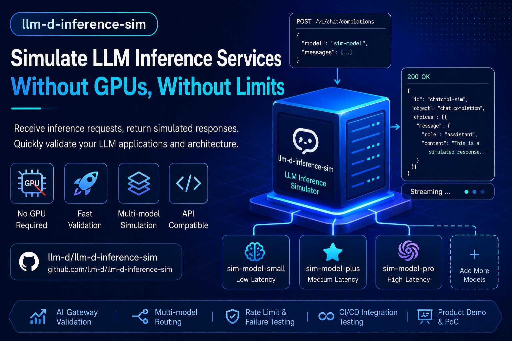

As large language model applications are being adopted at speed, the **engineering capabilities around inference services** are often more complex than the model itself: model scheduling, routing strategies, rate limiting, canary releases, gateway governance, and many other concerns all need to be validated against realistic inference interfaces. However, LLM inference depends on GPUs and expensive compute resources, which keeps the barrier to development and testing high.

If you want to **validate inference architecture designs in an environment without GPUs or with limited resources**, this tool is worth a look:

[llm-d-inference-sim GitHub project](https://github.com/llm-d/llm-d-inference-sim?utm_source=chatgpt.com)

This article walks through the tool's capabilities, design ideas, and practical engineering value.

## Tool Positioning: A Simulator Built for Inference Engineering

**llm-d-inference-sim** is a tool designed specifically to simulate LLM inference services. Its core capabilities include:

* Providing interfaces consistent with real LLM inference services, such as OpenAI-style APIs
* Receiving inference requests, including prompts and messages
* Generating "simulated responses" based on configuration
* Supporting simulated deployments with multiple instances and multiple models

In short, it does not actually perform model inference. Instead, it:

> **Simulates "inference service behavior", not "inference computation itself"**

## Why Do We Need Inference Simulation?

In real-world projects, we often run into the following problems.

### 1. Inference Resources Are Expensive

* GPU costs are high, especially for A100 and H100 instances
* Inference service deployment is complex, whether using vLLM, TensorRT-LLM, or SGLang
* Test environments are hard to replicate at production scale

### 2. Engineering Validation Depends on Real Services

Many key capabilities must be validated against inference interfaces, for example:

* API gateway routing strategies, such as Envoy and Istio
* Multi-model scheduling and fallback mechanisms
* Embedding plus intent routing
* Rate limiting, circuit breaking, and timeout control
* Canary releases and A/B testing

But these capabilities **do not depend on model "correctness"**. They only depend on one thing:

> "Whether there is a service that behaves like an LLM"

## The Core Value of llm-d-inference-sim

### 1. No GPU Dependency

Developers can use it directly in environments such as:

* A local MacBook
* CI/CD environments
* Kubernetes test clusters
* Cloud virtual machines without GPUs

There is no need to deploy any real model.

### 2. Highly Controllable Response Simulation

It can simulate:

* Fixed responses for stable tests
* Latency to mimic inference time
* Token generation cadence for streaming
* Error responses for fault tolerance testing

This makes it especially suitable for:

> **Load testing, fault tolerance testing, and end-to-end pipeline validation**

### 3. Support for Multiple Model Instances

You can quickly deploy multiple "simulated models":

* A GPT-4 simulation service
* An embedding model simulation
* Different latency and performance profiles

This can be used to validate:

* Multi-model routing strategies
* Intelligent gateways, such as AI Gateway
* Fallback logic

### 4. Compatibility with Real APIs

Its API style is usually compatible with:

* OpenAI API, such as `/v1/chat/completions`
* Streaming output

This means:

> **It can seamlessly replace real model services during engineering validation**

## Typical Use Cases

### Scenario 1: AI Gateway and Service Mesh Validation

For example, when building an AI Gateway with Envoy or Istio, you may need to:

* Route different models based on paths or headers
* Use embedding-based routing
* Run canary releases

The question is: what if you do not have real models?

By using llm-d-inference-sim to simulate multiple model backends, you can validate the complete request path.

### Scenario 2: Multi-Model Scheduling System Development

When building systems such as:

* vLLM-aware schedulers
* KV Cache aware routing
* Model load balancers

You need:

* Multiple model endpoints
* Different response latencies
* Controllable behavior

The simulator can quickly construct these environments.

### Scenario 3: CI/CD Automated Testing

Real model services are difficult to integrate into CI:

* They are expensive
* They are unstable
* They start slowly

With the simulator:

* Startup is fast
* Behavior is predictable
* Mock responses are supported

This makes it very suitable for integration tests.

### Scenario 4: Product Demonstrations and Demo Environments

In presales or internal demos:

* You do not need a real model
* You only need something that "looks runnable"

The simulator can help you:

* Quickly deploy multiple model services
* Build stable demo environments
* Avoid GPU costs

## A Brief Look at How It Works

The design of llm-d-inference-sim can be understood as follows.

### Request Flow

1. Receive an HTTP request, such as `/v1/chat/completions`
2. Parse the input, such as prompts or messages
3. Generate a response according to configuration rules
4. Return JSON or streaming output

### Simulation Capabilities Usually Include

* **Response templates**

  * Fixed text
  * Parameterized generation

* **Latency injection**

  * Simulating inference time, such as 200 ms or 2 seconds

* **Streaming**

  * Returning tokens in chunks
  * Simulating the output cadence of a real LLM

* **Error injection**

  * 500 errors or timeouts
  * Testing retry mechanisms

## Relationship with Real Inference Services

| Dimension | Simulator | Real Models, such as vLLM |
| ------ | ------- | ------------ |
| GPU | Not required | Required |
| Cost | Very low | High |
| Response realism | No semantic capability | Yes |
| API compatibility | Yes | Yes |
| Engineering validation | Yes | Yes |

> **A simulator is not a replacement for models. It complements the engineering validation stage.**

## Best Practice Recommendations

### 1. Use It with a Gateway

Recommended combination:

* Envoy or Istio
* AI Gateway
* llm-d-inference-sim

Use these together to build a complete inference traffic path.

### 2. Build Multi-Model Topologies

For example:

* model-a, with low latency
* model-b, with higher quality and higher latency
* model-fallback

Use this to validate intelligent routing strategies.

### 3. Inject Failure Scenarios

Actively simulate:

* Timeouts
* High latency
* Error responses

This helps improve system robustness.

### 4. Use It in the Early Development Stage

Prioritize the simulator in stages such as:

* Architecture design
* API design
* Routing strategy validation

Then connect to real models in later stages.

## Conclusion

**llm-d-inference-sim** solves an underestimated but critical problem:

> How can we move LLM engineering forward when no model is available?

Its core value is not in "simulating the model", but in:

* Lowering the development barrier
* Improving validation efficiency
* Decoupling compute resources from engineering work

For teams building AI infrastructure, such as AI gateways, inference platforms, or multi-model scheduling systems, this is a very practical tool.
