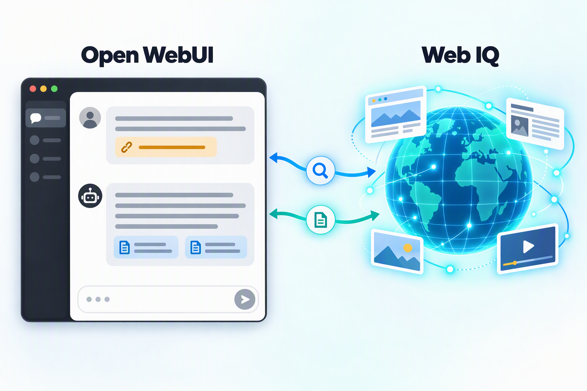
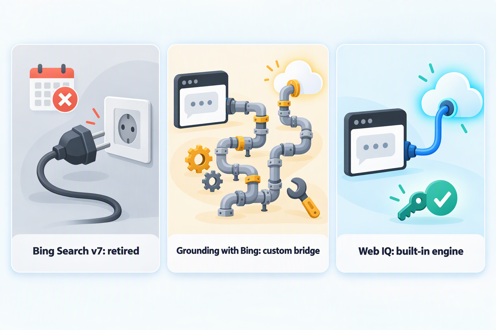
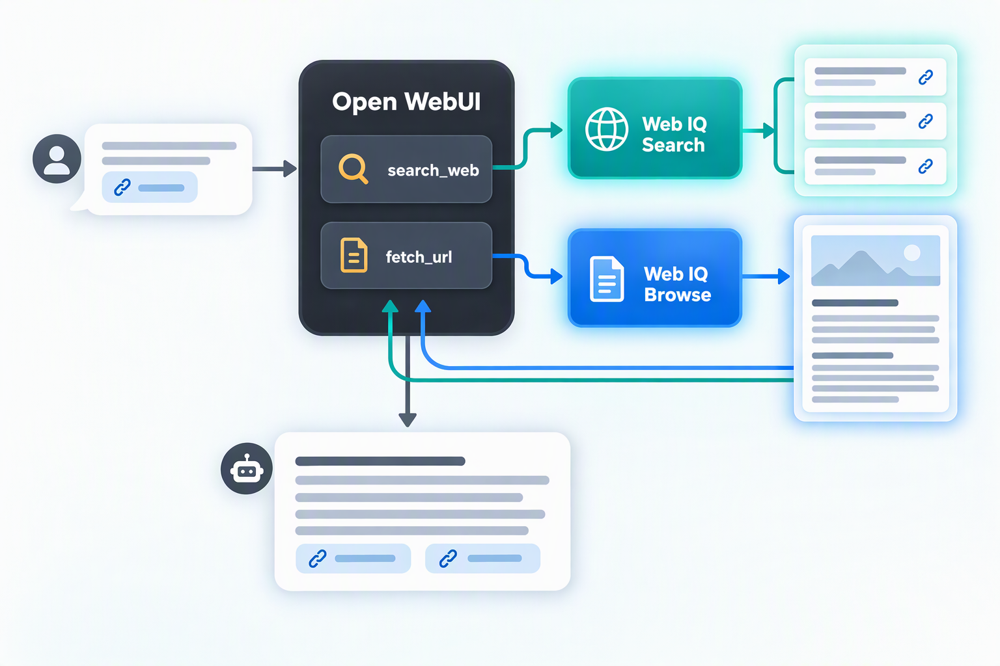
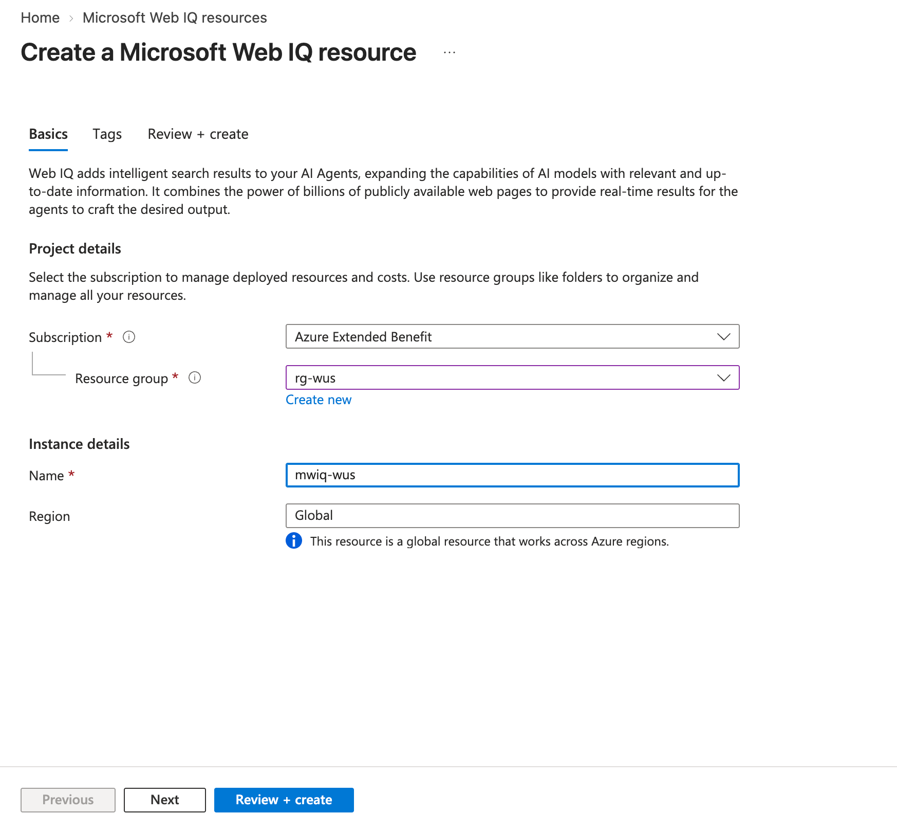
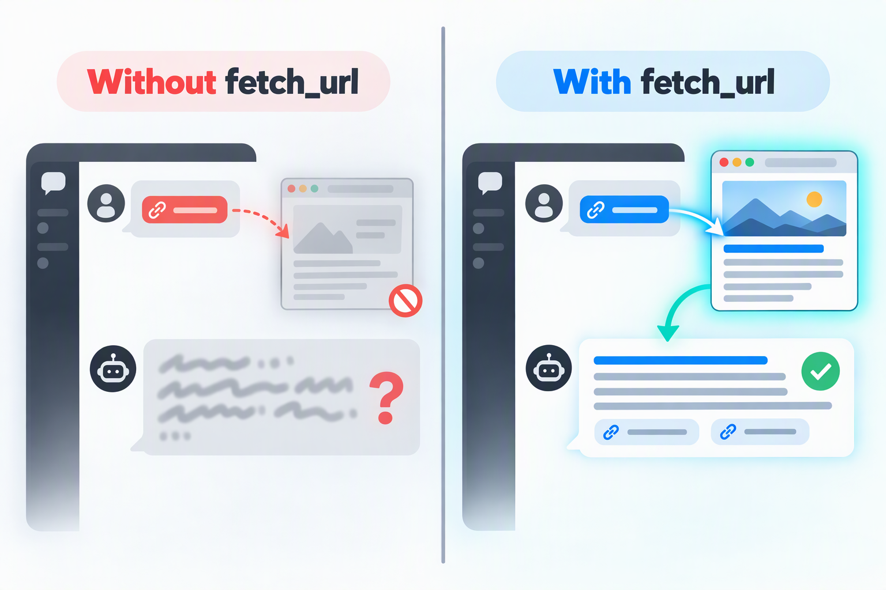

In my [previous article](/en/blog/2026/migrate-openwebui-to-azure-pg/), I migrated the OpenWebUI database to Azure Database for PostgreSQL. In my day-to-day use of OpenWebUI, I kept running into two problems:

1. **No access to the latest information**: Models have a knowledge cutoff. When I ask about recent releases, news, or prices, they either can't answer or get it wrong.
2. **Pasted links are never opened**: When I paste the URL of an article, a document, or a GitHub page into the chat and ask the model to summarize, translate, or compare it, the model doesn't read the link at all. Sometimes it even guesses content that "looks plausible" from the URL alone.

Both problems can be solved with OpenWebUI's web capabilities. In this article, I use Microsoft's new **Microsoft Web IQ** as the web search engine, and let the model automatically detect URLs in messages and read the pages before answering. All it takes is creating a Web IQ resource in the Azure portal and then configuring OpenWebUI in its admin UI. **No code to write and no extra services to deploy.**

> This article is based on Open WebUI v0.11.4 (released in September 2026). The API keys in this article are placeholders.

## The End Result

Once everything is configured:

- When a question involves recent information, the model calls `search_web` on its own, Web IQ returns search results, and the answer includes reference links.
- When a message contains an `http://` or `https://` link, the model calls `fetch_url` on its own, reads the page content through Web IQ, and then answers. The pages it has read appear in the citations.
- The two can be combined in a single answer, for example reading the document you provided first and then searching for the latest change notes to compare.

## Why Microsoft Web IQ



In OpenWebUI, open **Settings → Admin → Web Search** and you'll find `bing` under **Web Search Engine**. After selecting it, you need to fill in **Bing Search V7 Endpoint** and **Bing Search V7 Subscription Key**. It looks like entering the key of a Bing resource on Azure is all it takes, but this path no longer works:

- The Bing Search v7 API (including Bing Custom Search) was **retired on August 11, 2025**. All existing instances have been shut down, and new resources can no longer be created.
- The Bing resource you can create on Azure today is **Grounding with Bing Search**. It can only be used as a tool for Microsoft Foundry agents, and its key can't be used to call a search API directly. To connect it to OpenWebUI, you would have to build a bridge service yourself.

**Microsoft Web IQ** is a set of APIs for AI applications that Microsoft released in June 2026. It provides models with real-time information from the web (grounding), and you can think of it as "a search engine for AI agents":

- It is built on Bing's global index and redesigned for the multi-step retrieval that agents perform.
- Instead of just a list of links, it returns relevant passages with their sources. They can go straight into the model's context, producing better answers with fewer tokens.
- It covers web pages, news, images, videos, and more, and supports more than 100 languages and markets.

More importantly, OpenWebUI already has a built-in `microsoft_web_iq` engine. It works both as a **search engine** and as a **web loader engine** for reading pages, and all it needs is an API key.

| Option | How it connects to OpenWebUI | Status |
| --- | --- | --- |
| Bing Search v7 | Built-in `bing` engine | Retired, no longer available |
| Grounding with Bing Search | Build your own bridge service and call it through Foundry | Mainly for Foundry agents |
| Microsoft Web IQ | Built-in `microsoft_web_iq` engine, just enter an API key | Released in June 2026, currently in limited access |

## How It Works



```text
User message
  │
  ▼
OpenWebUI (the model uses native tool calling)
  │
  ├── search_web: web search
  │     └── Web IQ /search/web: returns titles, links, and relevant passages
  │
  └── fetch_url: reads the links in the message
        └── Web IQ /browse: reads the page and returns its content as Markdown
```

A few notes:

- `search_web` and `fetch_url` are two of OpenWebUI's built-in tools. Both belong to the Web Search category, and the model decides on its own when to call them.
- Both tools rely on native tool calling (Native Function Calling), which has been the default mode since v0.10.0.
- Once the web loader engine is also set to Web IQ, pages are read by Web IQ, so even pages that require JavaScript rendering can be read. Files such as PDFs are still downloaded and parsed by OpenWebUI itself.

## Step 1: Create a Web IQ Resource and Get the API Key

Web IQ is provided as an Azure resource. In the Azure portal, search for **Microsoft Web IQ**, go to **Microsoft Web IQ resources**, click **Create**, and fill in the **Basics** tab:

- **Subscription** and **Resource group**: the subscription and resource group used for management and billing.
- **Name**: the resource name.
- **Region**: fixed to **Global**. This is a global resource that works across Azure regions.



Click **Review + create** to create the resource, then copy the API key from the resource page. You will need it in the next step.

Web IQ is still in **limited access**. If you can't find or create this resource in the Azure portal, you can first apply by clicking **Join the waitlist** on the [Microsoft Web IQ website](https://www.microsoft.com/en-us/WebIQ).

## Step 2: Configure Web IQ for Search and Page Reading

Sign in to OpenWebUI as an administrator, click your avatar in the bottom-left corner, and go to **Settings → Admin → Web Search**.

### 1. The Search section

| Setting | Value | Notes |
| --- | --- | --- |
| Web Search | On | Global switch |
| Web Search Engine | `microsoft_web_iq` | The next three fields appear once it's selected |
| Microsoft Web IQ API Base URL | `https://api.microsoft.ai/v3` | Keep the default |
| Microsoft Web IQ API Key | `<WEB_IQ_API_KEY>` | The API key from Step 1 |
| Language | `en` | Language code of the search results, `en` by default |
| Search Result Count | `5` | Number of results returned per search |
| Fetch URL Content Length Limit | `50000` | Maximum number of characters `fetch_url` returns; leave empty for no limit |

A few notes:

- **Microsoft Web IQ API Base URL**: OpenWebUI fills it in for you, and you usually don't need to change it. If your Web IQ resource page shows a different endpoint, use the one on the resource page.
- **Language**: `en` usually works best for technical content. If you mainly look up content in another language, change it accordingly, for example `zh` for Chinese (check which language codes Web IQ supports).
- **Fetch URL Content Length Limit**: Content isn't truncated by default, and very long pages can take up a lot of context, so setting a limit is recommended.
- **Web Search Confirmation**: Optional. When enabled, users see a confirmation prompt before using web search in a chat, such as the default "Your query will be sent to the configured web search provider.", which reminds them that their queries are sent to an external service.

### 2. The Loader section

| Setting | Value | Notes |
| --- | --- | --- |
| Web Loader Engine | `microsoft_web_iq` | Pages are also read by Web IQ, using the same API key as search |

Click **Save**. The configuration takes effect immediately, and there's no need to restart the container.

You can also leave Web Loader Engine at **Default** and let the OpenWebUI server fetch pages itself. However, the default loader can't read content that requires JavaScript rendering, and its User-Agent is easily blocked by some websites. Letting Web IQ read pages saves a lot of trouble.

## Step 3: Let the Model Detect and Read URLs in Messages



### 1. Model settings

Go to **Settings → Admin → Models** and edit the model you use for chats:

| Location | Setting |
| --- | --- |
| Capabilities | Check **Web Search**, **Builtin Tools**, **Citations**, and **Status Updates** |
| Builtin Tools | Make sure **Web Search** (Search the web and fetch URLs) is checked |
| Default Features | Check **Web Search** so that web search is on by default in new chats |
| Advanced Params | Set **Function Calling** to **Native** (the default) |

**Default Features** is the key setting here. In native mode, `search_web` and `fetch_url` are only offered to the model when the model has the Web Search capability enabled and web search is turned on in the current chat. Without it, users have to turn on web search manually from the **+** menu in the input box every time; otherwise, pasted links won't be read.

Native mode requires a model with reliable tool calling. Use a recent model; models that are too small or too old may not call tools correctly.

### 2. System prompt

Whether to call `fetch_url` is up to the model. To make its behavior more consistent, add the following rules to the **System Prompt** on the same page:

```text
You can use two tools: search_web and fetch_url.
1. When the user's message contains a link that starts with http:// or https://, call fetch_url to read it first, then answer based on what you read. If there are multiple links, read them one by one.
2. When the question involves time-sensitive information such as recent news, versions, or prices, or when you are not sure about the answer, call search_web. If the snippets in the search results are not enough, use fetch_url to open the most relevant result.
3. If a link cannot be accessed or its content is empty, tell the user honestly. Do not guess the page content from the URL.
4. List the reference links at the end of your answer.
```

Rule 3 keeps the model from "making up" content when reading fails. Rule 4 is needed because in native mode, `search_web` results don't appear in the citations (only pages read by `fetch_url` do), so the model has to write them into the answer.

### 3. Attaching web pages manually

If you want to make sure a link gets read, you can also attach it manually:

- Type `#` in the input box, paste the link, and then select the page.
- Or add the link from the **+ → Attach Webpage** menu in the input box.

With both methods, OpenWebUI reads the page directly (also using the web loader engine configured above), without relying on the model's judgment.

## Verifying the Results

### 1. Reading a link

Start a new chat and enter:

```text
Summarize the key points of this document: https://docs.openwebui.com/features/chat-conversations/web-search/providers/microsoft-web-iq
```

Expected:

- The response shows that the model called `fetch_url`.
- The document appears in the citations below the answer.
- The answer matches the document instead of being generic.

### 2. Web search

```text
What is the latest Open WebUI release, and what are the main updates?
```

Expected:

- The model calls `search_web`, and the results come from Web IQ.
- If the snippets aren't enough, the model goes on to call `fetch_url` to open the release notes page.
- Reference links are listed at the end of the answer.

### 3. Combined use

```text
First read https://github.com/open-webui/open-webui/releases, then search for community feedback on the latest release, and finally tell me whether I should upgrade.
```

The model should read the provided link first, search as many times as needed, and then combine both sources of information into a recommendation.

### 4. Troubleshooting

If things don't work as expected, start with the OpenWebUI logs:

```bash
docker logs --since 10m open-webui 2>&1 |
grep -Ei 'web iq|microsoft browse|fetch_url|blocked'
```

Common log messages:

- `Error searching with Microsoft Web IQ API`: the search request failed, usually because the API key is wrong or access hasn't been granted yet.
- `Error browsing ... with Microsoft Web IQ`: Web IQ failed to read the page.
- `Blocked ...`: the link points to an internal address or is on the filter list, so OpenWebUI blocked it.

You can also verify the API key directly with curl. The request below uses the same format that OpenWebUI sends:

```bash
curl -sS https://api.microsoft.ai/v3/search/web \
  -H "x-apikey: $WEB_IQ_API_KEY" \
  -H "Content-Type: application/json" \
  -d '{"query": "Open WebUI", "maxResults": 3, "language": "en", "contentFormat": "passage"}'
```

A successful response is JSON containing `webResults`, where each result has a `url`, `title`, and `content`.

## Things to Keep in Mind

- **Data is sent to Web IQ**: Search queries and the links to be read are sent to the Web IQ API (`api.microsoft.ai`), and how the data is handled is governed by Web IQ's terms of service. For sensitive chats, you can turn off web search or enable Web Search Confirmation to remind users.
- **Requests include user information**: Based on the v0.11.4 source code, when OpenWebUI calls Web IQ search, it includes the current user's name, ID, email, and role in the request headers (`X-OpenWebUI-User-*`), and this currently can't be turned off through configuration. If your organization has requirements around this, evaluate it before going live.
- **Internal links can't be read**: Before reading a link, OpenWebUI validates the URL and blocks internal addresses and cloud metadata addresses by default. These protections are on by default and need no extra configuration, and Web IQ itself can't reach internal pages anyway.
- **Number of calls and cost**: Every `search_web` or `fetch_url` call is one Web IQ call, and in native mode the model may make several calls in a row for a single question. Keep Search Result Count at 3–5, and only make Web Search a default feature on the models that need it. Web IQ charges are billed to the Azure subscription you chose when creating the resource, so you can set a budget alert on the resource group.

## FAQ

| Symptom | Possible cause | Fix |
| --- | --- | --- |
| The model says it can't access a pasted link | Web search is off in the chat, or the model doesn't have the Web Search capability and builtin tools enabled | Check the model's Capabilities and Default Features, and the web search toggle in the chat |
| The model makes up content from the URL | `fetch_url` wasn't called | Make sure Function Calling is Native, and add the system prompt |
| Regular users don't see the web search toggle | Their user group lacks the Web Search feature permission | Allow Web Search in the user group's feature permissions |
| Search never returns results | The API key is wrong or access hasn't been granted | Check the logs and verify the API key with curl |
| Search results are in an unexpected language | Language doesn't match the language of the queries | Change Language |
| Some pages fail to load | The page requires sign-in, blocks crawling, or the link points to an internal address | Use a publicly accessible link, or paste the text directly into the chat |

## Summary

With the Bing Search API retired, OpenWebUI's built-in `bing` engine no longer works. With OpenWebUI's built-in `microsoft_web_iq` engine, all you need is a Web IQ resource on Azure and its API key, and you can set up web search entirely in the admin UI:

- Search and page reading are both handled by Web IQ, which returns passages and page content that can go straight into the model's context.
- In native tool calling mode, `search_web` handles search and `fetch_url` reads the links in messages.
- With the model's Default Features and a system prompt, the model automatically detects URLs, reads before answering, and includes reference links in its answers.

The whole process doesn't require a single line of code. Whether you're asking about the latest information or simply dropping in a link for the model to summarize, you can now do it all in OpenWebUI.

## References

- [Announcing Microsoft Web IQ](https://blogs.bing.com/search/2026/6/Announcing-Microsoft-Web-IQ/)
- [Microsoft Web IQ](https://www.microsoft.com/en-us/WebIQ)
- [Open WebUI: Microsoft Web IQ](https://docs.openwebui.com/features/chat-conversations/web-search/providers/microsoft-web-iq)
- [Open WebUI: Agentic Web Search & URL Fetching](https://docs.openwebui.com/features/chat-conversations/web-search/agentic-search)
- [Open WebUI: Bing](https://docs.openwebui.com/features/chat-conversations/web-search/providers/bing)
- [Open WebUI: Hardening](https://docs.openwebui.com/getting-started/advanced-topics/hardening)
