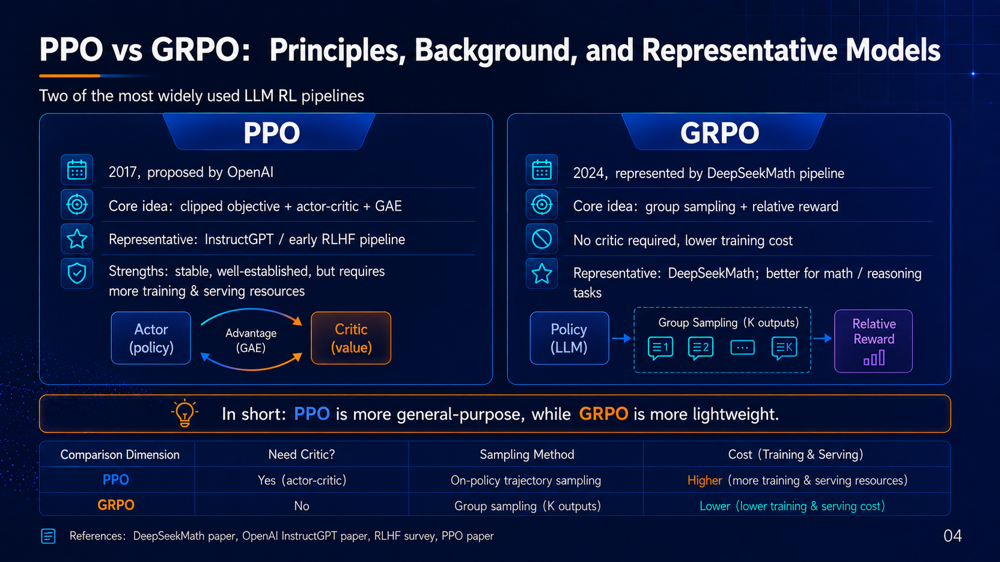

## Introduction

In the post-training stage of large language models, reinforcement learning (RLHF / RLAIF) has become one of the key factors that determines the upper bound of model capability. Recently, GLM-5.2 switched its training algorithm from the GRPO (Generalized Reward Policy Optimization) used in GLM-5.1 to the more classical PPO (Proximal Policy Optimization), bringing a clear improvement in results.

This change is not a simple "algorithm replacement". It is a systematic upgrade in **stability, generalization, and training controllability**.

This article analyzes the topic from three angles:

1. The core principles of PPO and GRPO
2. The key differences between the two algorithms
3. Why PPO can bring a "qualitative improvement"

## How PPO (Proximal Policy Optimization) Works

### 1. Background

PPO is a policy gradient method proposed by OpenAI in 2017. It is an engineering-friendly simplification of TRPO (Trust Region Policy Optimization), and it has become the de facto standard in RLHF training.

### 2. Core Idea

The core goal of PPO is:

> **While optimizing the policy, limit the shift between the new and old policies to prevent unstable training.**

Its optimization objective is:

$$
L^{PPO}(\theta) = \mathbb{E}\left[\min\left(r_t(\theta) A_t,\ \text{clip}(r_t(\theta), 1-\epsilon, 1+\epsilon) A_t\right)\right]
$$

Where:

* $r_t(\theta) = \frac{\pi_\theta(a|s)}{\pi_{\theta_{old}}(a|s)}$
* $A_t$: advantage function
* $\epsilon$: clipping coefficient, usually 0.1 to 0.2

### 3. Key Mechanisms

PPO's stability comes from three mechanisms:

#### Clipping

Limits the size of policy updates and prevents over-optimization.

#### Advantage Estimation (GAE)

Reduces variance and improves training stability.

#### Multi-Epoch Updates

Optimizes multiple times on the same batch of data, improving sample efficiency.

### 4. Role in Large Language Models

In LLM training, PPO is commonly used for:

* Aligning with human preferences (RLHF)
* Controlling generation style, including safety, format, and reasoning behavior
* Balancing exploration and exploitation

## How GRPO (Generalized Reward Policy Optimization) Works

### 1. Background

GRPO is an optimization method proposed for RLHF scenarios that removes the value function, meaning it does not use a critic. Its goal is:

> **Simplify the PPO training pipeline, reduce engineering complexity, and improve throughput.**

### 2. Core Idea

The key idea behind GRPO is:

* Do not train a value model
* Do not compute advantages, or use a simplified substitute
* Directly perform relative optimization based on rewards

A typical workflow is:

1. Sample multiple outputs for the same prompt, using N samples
2. Score them with a reward model
3. Normalize or rank the scores
4. Update the policy using relative rewards

It can be represented as:

$$
L^{GRPO} = \mathbb{E}\left[\log \pi_\theta(a|s) \cdot \hat{R}(a)\right]
$$

Where:

* $\hat{R}(a)$: normalized reward, such as rank-based or mean-centered reward

### 3. Key Characteristics

#### No Critic Architecture

Avoids the instability of value model training.

#### In-Batch Contrastive Learning

Relies on the relative quality of multiple samples under the same prompt.

#### High Throughput

Better suited for large-scale parallel training, especially multi-GPU inference sampling.

## PPO vs GRPO: Key Differences

| Dimension | PPO | GRPO |
| --- | --- | --- |
| Uses a value model | Yes | No |
| Advantage calculation | GAE | None, or simplified |
| Stability | 5/5 | 3/5 |
| Training complexity | High | Low |
| Sample efficiency | High | Medium |
| Parallelization friendliness | Medium | High |
| Dependence on reward quality | Medium | High |
| Sensitivity to data quality | Medium | High |

## Why Did GLM-5.2 Switch from GRPO to PPO?

This is the core question of the article.

### 1. The Bottlenecks of GRPO

Although GRPO is simpler from an engineering perspective, it has several key issues.

#### Amplification of Reward Noise

GRPO strongly depends on the relative ranking of rewards. When:

* The reward model is not accurate enough
* The differences among multiple samples are small

It can lead to:

> Extremely unstable gradient signals

#### Lack of Long-Term Credit Assignment

GRPO does not have a value function:

* It cannot model long-term returns
* It is less friendly to long-chain reasoning, such as CoT

#### Training Is Prone to Collapse

In some cases:

* The model overfits the reward model
* Outputs become patterned, leading to mode collapse

### 2. How PPO's Advantages Show Up in GLM-5.2

#### A More Stable Optimization Path

PPO's clipping and advantage estimation:

* Avoid policy oscillation
* Ensure gradual improvement, or monotonic improvement

#### Better Reasoning Capability

PPO's value function:

* Can implicitly model intermediate steps
* Is better suited for chain-of-thought and multi-step reasoning

#### Lower Dependence on the Reward Model

Compared with GRPO:

* PPO does not rely entirely on reward ranking
* PPO is more robust to reward noise

#### Stronger Generalization

At its core, PPO optimizes:

> **A policy distribution, not a sample ranking**

As a result, it is more stable in scenarios such as:

* Unseen tasks
* Long-form generation
* Tool calling

## An Intuitive Analogy: Ranking vs Regression

An analogy can make the difference easier to understand:

* **GRPO is like ranking learning**

  * Which answer is better?
  * It strongly depends on pairwise or listwise comparisons

* **PPO is like regression optimization**

  * How far is the current policy from the optimal policy?
  * It has a continuous optimization direction

The conclusion is:

> GRPO is faster. PPO is more stable and more precise.

## Summary

The switch from GRPO to PPO in GLM-5.2 is essentially a shift:

> **From engineering efficiency first to model capability first**

### Key Takeaways

1. GRPO is suitable for:

   * Fast training
   * Large-scale parallelism
   * Tasks with clear rewards

2. PPO is better suited for:

   * High-quality alignment
   * Complex reasoning tasks
   * Long-context generation

3. At the current stage of LLM development:

> **Stability, generalization, and reasoning capability matter more than training throughput**

Therefore, the return to PPO has become an almost inevitable choice.

## Closing Thoughts

The choice of reinforcement learning algorithm is becoming a key dividing line in model capability. The shift from GRPO to PPO is not only an algorithm switch. It also shows that large model training is moving:

> **From "it can run" to "it can run well and run stably."**

In the future, we are likely to see:

* Hybrid PPO + DPO paradigms
* New off-policy RL methods
* Even reward-free alignment

But at the current stage:

> **PPO remains the most robust industrial-grade choice.**