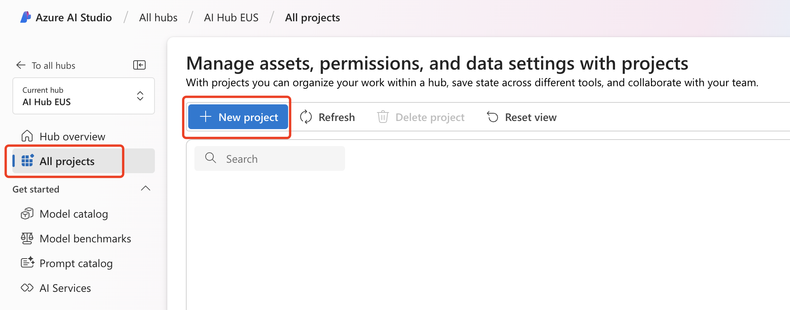

日常使用 ChatGPT 来帮助我们解决工作和生活中的问题已经变成习惯，但偶尔重度使用官方 GPT-4o 后发现会出现临时限额问题，今天我们就来手把手教大家如何轻松通过 Azure OpenAI 服务构建一个专属 ChatGPT 应用。

## 先决条件

在开始之前，请确保您拥有 Azure 国际版订阅服务，如果您还没有 Azure 订阅，可以通过 [Pay-as-you-go](https://azure.microsoft.com/en-us/pricing/purchase-options/pay-as-you-go/?wt.mc_id=MVP_373702) 轻松开启一个 Azure 订阅：

注意：开启 Pay-as-you-go Azure 订阅必须绑定国际信用卡，对于新用户还有 200 美金的免费额度，我们完全可以使用这些额度充分使用 Azure 的各项服务。

下面介绍的内容除了与 GPT-4o 交互产生的费用外，其他都是免费的，日常不适用的话不会产生任何费用，GPT-4o 的费用也可以完全使用免费额度覆盖，所以大家不用担心信用卡被刷爆。

成功拥有 Azure 订阅后，然我们开始吧！

## 步骤 1：创建 Azure AI Studio 服务

在 Azure 订阅主页上方搜索栏中输入 azure ai，找到 Azure AI Studio：

点击进入 Azure AI Studio 资源页面：

点击 + New Azure AI Hub 进入创建页面：

从界面可以看到创建 Azure AI Hub 共分为 7 个步骤，这里按照指引一路 Next 都选择默认即可，其中需要注意的是区域建议选择 East US，由于免费订阅有一些资源使用限制，目前根据经验来看 East US 区域的使用便利性更佳。

另外是费用问题，可以参考 [Azure OpenAI 费用详情](https://azure.microsoft.com/en-us/pricing/details/cognitive-services/openai-service/?wt.mc_id=MVP_373702)页面来查看各个模型的收费情况：

创建完成后返回 Azure AI Studio 资源页面：

可以看到我们创建了一个 Azure AI hub 和一个配套的 Azure AI services 资源。

## 步骤 2：开始使用 Azure AI Studio

点击打开我们在第一步中创建的 Azure AI Hub 资源，我们会看到详情中醒目的 Launch Azure AI Studio 按钮：

点击后进入一个全新的 Azure AI Studio 界面：

这里将是我们主要工作的区域，点击列表中我们刚创建好的 AI Hub，当然在这里我们依然可以创建新的 AI Hub：

在 AI Hub 中，我们可以看到其相关联的所有资源：

首先我们需要创建一个 Project，点击左侧菜单中的 All projects，然后选择列表上方的 + New Project 按钮：

创建 Project 非常简单，只需要输入名称即可：

创建完成后将自动进入 Project 详情页面：

现在可以熟悉一下 AI Studio，Hub，Project 的界面，接下来我们来部署大语言模型！

## 步骤 3：部署 GPT-4o 大语言模型

依然在 Project 界面，在左侧菜单栏下放找到 Deployments 菜单，点击进入后选择 + Create Deployment 按钮：

在创建界面中我们看到 Azure 为我们提供了 1000 多重大语言模型可供使用，当然，它们要求的计算资源也各不相同，有兴趣可以逐个尝试（注意信用卡不要刷爆），这里我们选择 GPT-4o 模型：

选定后进入部署页面，按需修改相关选项，确认后点击 Deploy 进行部署：

部署成功后我们可以看到 GPT-4o 已经出现在我们的部署列表中：

## 步骤 4：部署专属 ChatGPT Web 应用

确认模型部署正常后，我们进入项目左侧菜单中的 Chat，并选择我们刚才创建的 GPT-4o 模型：

在 Chat 界面我们可以选择大语言模型，简单测试问答功能等，确认一些无误后，我们就可以开始创建专属 Web App 了，选择顶部菜单中的 Deploy to a web app：

在部署配置中输入名称，选择 Web App 想要部署的订阅，区域等信息，如果希望保存 ChatGPT 的聊天历史，可以开启最下方的选项，但会额外创建 CosmosDB 数据库服务，会产生额外费用：

确认部署后等待完成即可，如果部署正确，那么在 Chat 界面中会有一个 Launch 按钮：

点击后会打开您的专属 ChatGPT Web 界面：

注意：默认情况下我们部署的 Web App 是基于您订阅中的账户（IAM）来做用户验证的，如果您自己使用可以保持这个默认行为。

如果您有技术能力且希望对这个专属 ChatGPT Web App 做定制开发，可以前往 [Git Repo](https://github.com/microsoft/sample-app-aoai-chatGPT?wt.mc_id=MVP_373702) 查看所有实现细节，可以按需修改为适合自己使用的版本。

## 总结

通过 Azure AI 相关的服务我们可以实现很多人工智能相关的实用业务场景，让我们对 AI 和 大语言模型的了解不仅只停留在铺天盖地的消息和无尽的想象，也可以亲身接触实践！
