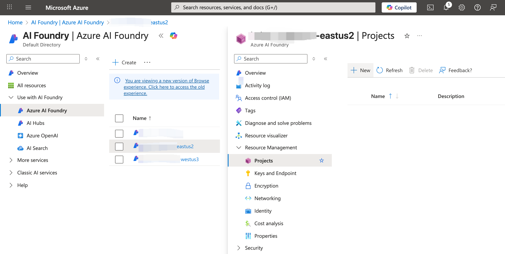
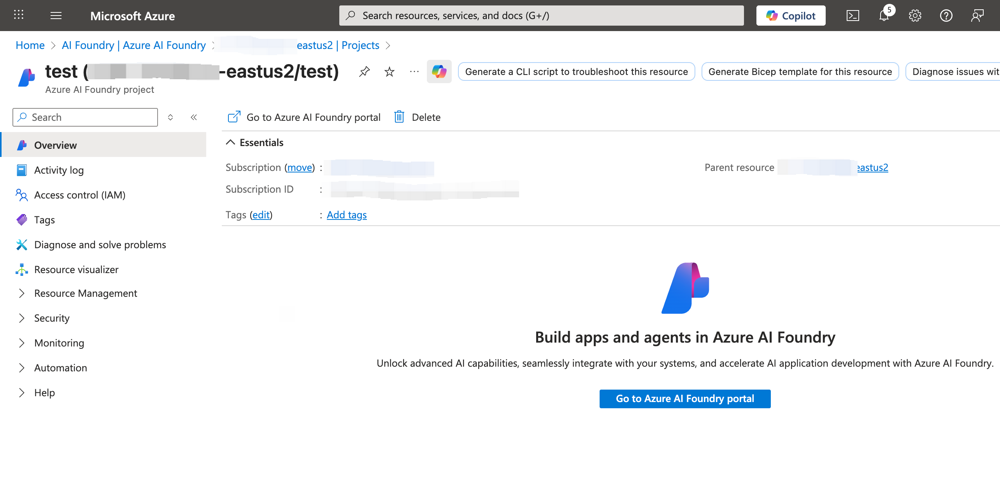
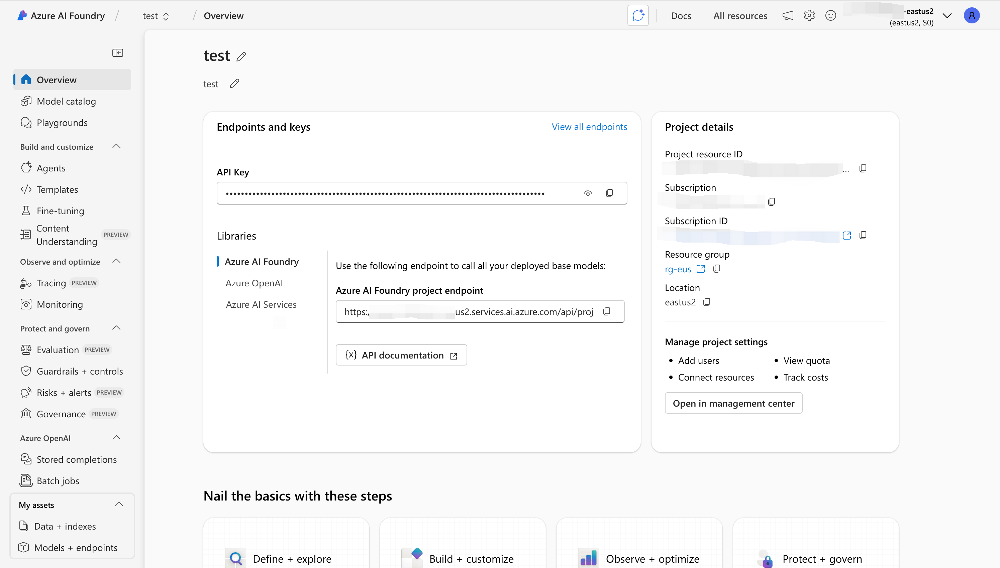
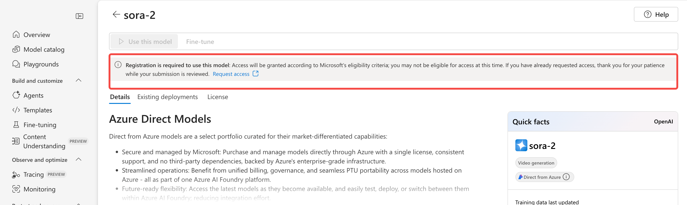
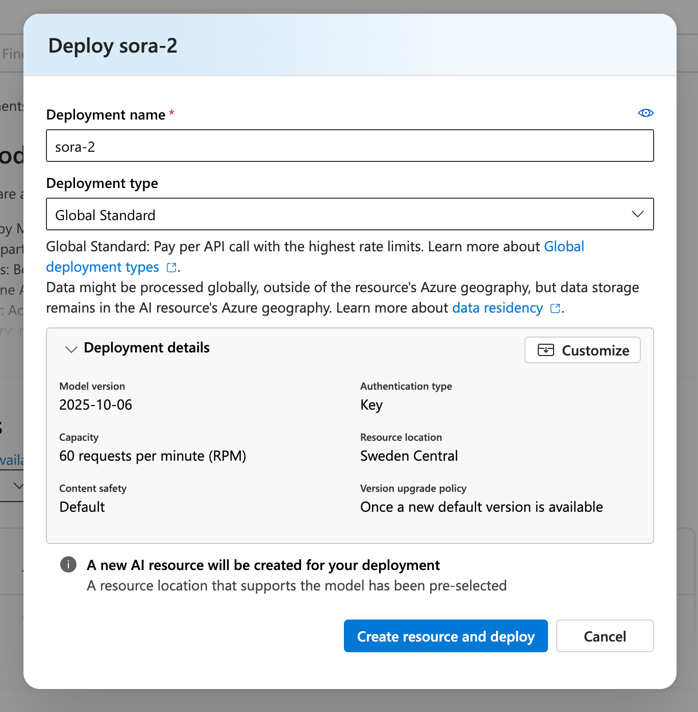
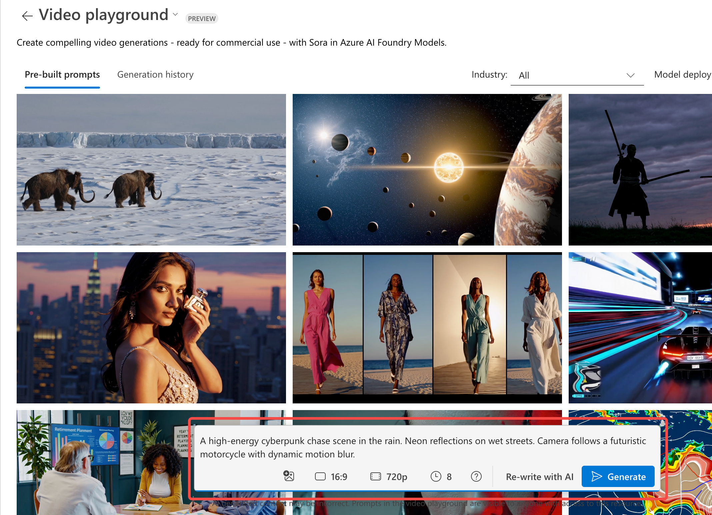
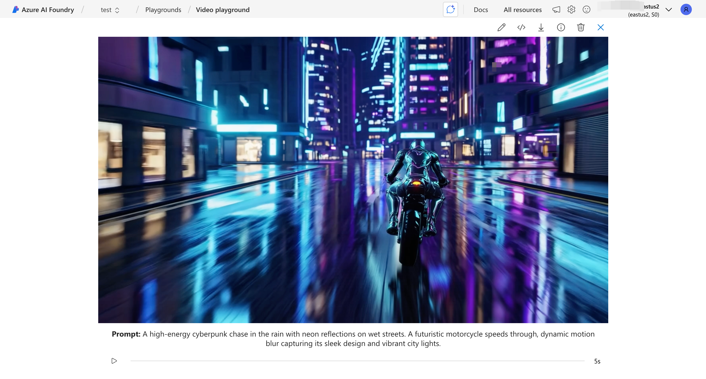

随着 Azure AI Foundry 开放对 **Sora 2（OpenAI 生成式视频模型）**的支持，开发者现在可以在企业级合规、可管控的环境中使用顶尖的视频生成能力。本教程将带你从零开始，通过 **Playground** 和 **Python SDK** 两种方式调用 Sora 2，完成「文本生成视频」的流程。

## 准备工作

在开始之前，你需要：

### 获取 Azure 订阅

拥有一个 **Azure 订阅**，如果您不清楚如何获取 Azure 订阅，可以参考[之前文章中的注册 Azure 订阅内容](/blog/2024/build-own-chatgpt-on-azure/#先决条件)进行操作。

### 创建 Azure AI Foundry

首先进入您的 Azure 订阅中的 AI Foundry，展开左侧 All Resources，找到 Azure AI Foundry，点击 Create 创建一个 Azure AI Foundry：


创建时注意区域选择，由于 Sora 2 模型并未在所有 Azure 区域开放预览，这里建议选择 East US 2 区域：


### 1. 创建 Azure AI Foundry Project

创建完成后进入您的 Azure AI Foundry 在 All Resources 中找到 Projects，点击 New 创建一个新的 Project：



### 2. 打开 Azure AI Foundry Protal

创建完成 Project 后，打开您的 Project，点击 Go to Azure AI Foundry protal：



正常情况下 Azure AI Foundry Protal 如下：



### 3. 启用和部署 Sora 2 模型

又有 Sora 2 模型在本文发布时仍然处于预览状态，所以我们首先需要申请权限，后续开放使用后可调过本步骤，首先点击左侧的 Model catalog，可以看到 Sora 2 模型的标签，点击 Check out model：


也可以在下方的模型列表找到想要的模型进行使用。

如果您没有使用 Sora 2 模型的权限，进入 Sora 2 模型介绍界面后将如下所示：



请点击 Request access 链接进行权限申请。

如您已经拥有 Sora 2 访问权限，可以点击 Use this model 进行模型部署：


部署过程非常简单，默认保持各类选项即可进行创建部署：



部署完成后，切换左侧菜单至 Models + endpoints，查看模型列表：


至此您就拥有了属于自己的 Sora 2 模型，可以开始使用！

## 通过 Azure AI Foundry Playground 使用 Sora 2

Azure AI Foundry 提供了强大的可视化界面，你可以无需写代码就生成视频。

### 1. 进入 Playground

打开 Azure AI Foundry 左侧菜单中的 Playgrounds，选择 Video playground：


进入 Playground 后选择 Sora 2 模型：


### 2. 填写提示词 Prompt

示例 Prompt：

```text
A high-energy cyberpunk chase in the rain with neon reflections on wet streets. A futuristic motorcycle speeds through, dynamic motion blur capturing its sleek design and vibrant city lights.
```


### 3. 设置选项

可调节选项包括：

| 选项               | 说明                  |
| ---------------- | ------------------- |
| **Attach an image** | 可以附加图片进行相视频的生成              |
| **Aspect ratio**   | 视频长宽比，默认为 16:9 |
| **Resolution**   | 分辨率，当前只提供 720p |
| **Duration**     | 输出视频时长（如 5s、10s），默认 8s    |



### 4. 生成视频

设置好后，点击 Generate 进行视频生成，视频生成成功后，你可以在 Generation history 中预览或下载视频：



## 通过 Python 调用 Sora 2

Azure 为 OpenAI 模型提供统一的接口，可以直接在你的后端调用。

### 1. 安装 SDK

```bash
pip install azure-ai-openai
pip install python-dotenv
```

### 2. 配置环境变量

创建 `.env` 文件：

```bash
AZURE_OPENAI_ENDPOINT=https://<your-resource-name>.openai.azure.com/
AZURE_OPENAI_KEY=<your-key>
AZURE_OPENAI_API_VERSION=2024-10-01-preview
```

### 3. Python 调用示例：文生视频

下面是最简可运行示例：

```python
import os
from dotenv import load_dotenv
from azure.ai.openai import OpenAIClient
from azure.core.credentials import AzureKeyCredential

load_dotenv()

client = OpenAIClient(
    endpoint=os.getenv("AZURE_OPENAI_ENDPOINT"),
    credential=AzureKeyCredential(os.getenv("AZURE_OPENAI_KEY")),
    api_version=os.getenv("AZURE_OPENAI_API_VERSION")
)

prompt = """
A cinematic shot of a spaceship flying through a nebula filled with colorful cosmic clouds.
"""

response = client.get_video(
    model="sora-2",
    prompt=prompt,
    duration=5,              # seconds
    resolution="1080p",
)

# 保存视频
video_bytes = response.video
with open("output.mp4", "wb") as f:
    f.write(video_bytes)

print("Video generated: output.mp4")
```

### 4. 使用结构化 payload

Sora 还支持更多控制，例如镜头、分镜头脚本、环境细节。

```python
payload = {
    "prompt": "A cute corgi running on a beach during sunset.",
    "duration": 8,
    "resolution": "720p",
    "motion": "medium",
    "style": "realistic"
}

response = client.get_video(
    model="sora-2",
    **payload
)

with open("corgi_beach.mp4", "wb") as f:
    f.write(response.video)
```

## 生成最佳视频的技巧

### 1. 提示词结构推荐（General Prompt Template）

```text
[主体对象] + [场景环境] + [动作] + [镜头效果] + [光影] + [风格]
```

示例：

```text
A high-energy cyberpunk chase in the rain with neon reflections on wet streets. A futuristic motorcycle speeds through, dynamic motion blur capturing its sleek design and vibrant city lights.
```

### 2. 控制一致性

* 使用 **seed** 可重复生成风格一致的视频
* 合理设置 motion level 获得更自然的动作
* 提供清晰场景描述可减少模型误解

## 常见问题（FAQ）

### 1. 我试了但看不到 Sora 2？

目前需要访问权限。你需要：

* 联系 Azure 管理员
* 到模型页面确认已启用

### 2. 视频最大时长是多少？

具体限制依区域会有不同，通常为 **≤ 10 秒**。

### 3. Python 生成的视频过小或无内容？

确保保存时使用 `response.video` 而不是错误字段。

## 总结

本文介绍了在 **Azure AI Foundry** 中使用 **Sora 2 文生视频模型**的两种方式：

* 使用可视化 **Playground** 快速体验
* 使用 **Python SDK** 在生产环境自动生成视频

Azure 的企业级安全合规能力让 Sora 2 成为企业落地视频生成的重要选择。
