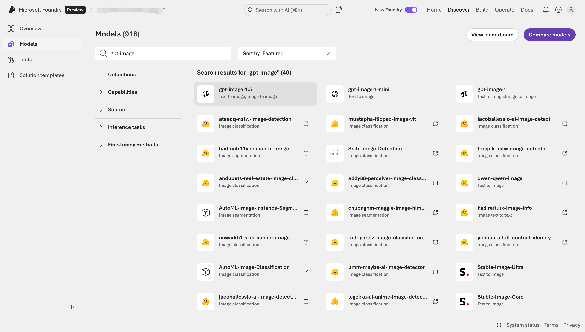
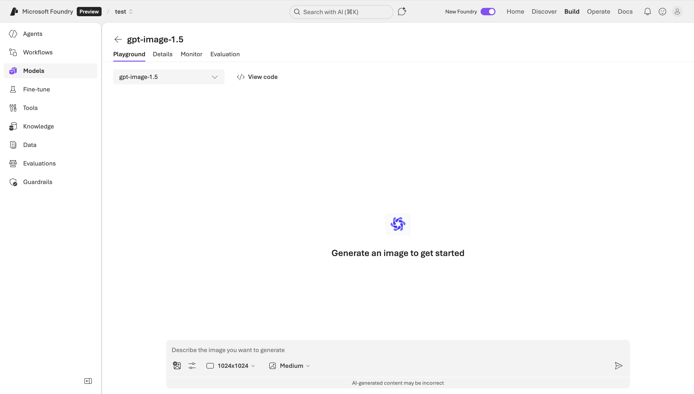
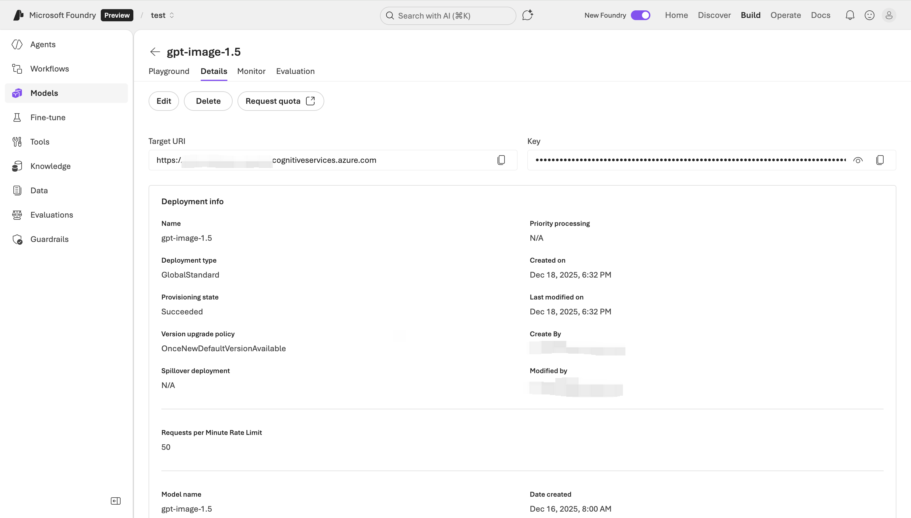

近年来，生成式 AI 技术迅速演进。在自然语言处理之外，**图像生成与编辑能力成为 AI 创新的重要前沿**。在这一趋势下，OpenAI 推出了 GPT Image 系列模型，在 Azure OpenAI 服务内同样可用。而其中最新发布的 **GPT-Image-1.5** 可视为图像生成领域的新旗舰，在性能、效率和可控性方面均有显著提升。

## 什么是 GPT-Image-1.5

GPT-Image-1.5 是 OpenAI 最新发布的**多模态图像生成模型**，属于 GPT Image 系列，目前是效果最佳的版本。与前代（如 GPT-Image-1）相比，它在指令遵循能力、图像质量、生成速度和成本效率方面都有明显提升。

官方定义上，GPT Image 模型是**原生多模态语言模型（natively multimodal），能接收文本和图像输入，并生成图像输出**。在功能上，它不仅支持从纯文本生成图像，还可以对已有图像进行编辑、修改、风格化转换等操作。

简而言之：

* **多模态**：同时理解文本和图像输入。
* **图像生成与编辑**：支持从文本生成全新图像，也支持对已有图像进行局部修改和增强。
* **高质量与高效**：相比前代生成更精细、更快速，同时成本更低。

## 核心能力与特点

### 1. 指令遵循及表达精准

GPT-Image-1.5 在理解自然语言提示方面得到显著提升，尤其擅长：

* **对复杂描述的视觉表达**，细节理解更准确
* **在图像中生成清晰可读的文本内容**
* **遵循用户指令进行定制化修改和组合**

相比最初的图像生成模型（例如 DALL·E 系列），这类 GPT Image 系列模型对于提示语的响应更直观、可控性更高。

### 2. 图像质量与生成速度提升

GPT-Image-1.5 的生成速度比上一代快得多（据报道最高可达大约 4 倍提升），这对于需要快速迭代视觉内容的场景（如设计、产品原型等）尤为重要。

此外，图像生成结果在细节、现实感和一致性方面表现更好，尤其是在脸部、纹理、光影等关键元素上有显著进步。

### 3. 编辑与增强功能

GPT-Image-1.5 同时支持图像编辑，包括：

* **局部修改**：对选中区域进行变更
* **添加或移除元素**
* **风格化调整与概念转换**

无需完全重新生成整幅图像，大幅提升工作流效率。

### 4. 成本与效率优化

GPT-Image-1.5 在 API 调用成本上较前代降低约 20%，使得高质量图像生成在更大范围内可持续使用，特别适合企业级批量生成需求。

### 5. 安全性与合规性

作为 Azure OpenAI 服务的一部分，GPT-Image-1.5 的使用受 Azure 的**安全性、合规性和内容过滤体系**保障，支持多种定制化审核与责任使用防护。

## 在 Microsoft Foundry 中部署与使用 GPT-Image-1.5

随着 **Microsoft Foundry** 的推出（当前为预览版），微软正在将 Azure OpenAI、模型目录、推理端点、Playground 与企业治理能力整合为**统一的 AI 应用构建平台**。在该预览版中，**GPT-Image-1.5 已作为一等模型（first-class model）被直接纳入 Foundry 的模型体系**，无需再通过传统的 “Azure AI Foundry / Azure AI Studio” 路径进行管理。

### 1. 在 Microsoft Foundry 中部署 GPT-Image-1.5

在 Preview 版 Foundry 中，模型部署流程更接近“产品级模型托管”而非传统 Azure 资源配置：

首先进入 **Microsoft Foundry（Preview）控制台**。在左侧选择 **Models**（模型库）。在模型列表中找到 **GPT-Image-1.5**（Image / Multimodal 分类）。



打开模型详情页后，点击 **Deploy**，创建一个新的推理部署。


选择默认部署，简单选择 **Region** 后即可完成部署，整个过程非常简单：


部署完成后会自动进入 GPT-Image-1.5 的 Playground：



完成后，Foundry 会自动生成：

* 一个可调用的 **Inference Endpoint**
* 与之绑定的身份、配额与监控策略

这一流程强调的是**模型即服务（Model as a Service）**，开发者不再需要直接关心底层 Azure OpenAI 资源的复杂配置。

### 2. 使用 Foundry Playground 进行图像生成与 Prompt 验证

Microsoft Foundry（Preview）内置了统一的 **Playground**，用于对 GPT-Image-1.5 进行交互式试验。

在 Playground 中，你可以：

* 直接输入文本 Prompt 生成图像
* 调整图像尺寸、质量等级等参数
* 快速验证复杂描述、风格化指令的效果
* 对比不同 Prompt 的生成结果

这一能力特别适合以下角色协作使用：

* 产品经理：验证视觉创意可行性
* 设计师：探索生成风格与构图
* 工程师：在写代码前固化 Prompt 模板

Playground 在 Preview 版 Foundry 中的定位是 **Prompt 即资产**，验证通过的 Prompt 可以直接迁移到生产代码中使用。

生成图片后效果如下：


### 3. 从 Foundry 到应用代码的集成方式

在应用层面，**Microsoft Foundry（Preview）部署的 GPT-Image-1.5 本质上仍然以标准推理 Endpoint 的形式对外提供服务**：

* 代码侧只需要关心：

  * Endpoint URL
  * Deployment Name
  * 身份认证方式

* 不再直接依赖模型原始名称或版本号

在企业实践中，常见模式是：

* 开发 / 测试 / 生产环境使用不同 Deployment
* 模型版本升级（例如 GPT-Image-1.5 → 后续版本）在 Foundry 层完成
* 应用代码保持不变，仅消费稳定的 Endpoint

这种模式显著降低了 **模型演进对业务系统的侵入性**。

## 在 Azure OpenAI 中如何使用 GPT-Image-1.5

你可以通过 Azure OpenAI 提供的 API、SDK 或 Azure AI Foundry 平台来调用 GPT-Image-1.5。基本流程如下：

### 1. 获取访问权限与部署模型

在模型的详情页可以查看通过代码嗲用 GPT-Image-1.5 的所有信息：



### 2. 使用 REST API 生成图像

使用 `POST` 请求调用图像生成端点：

```sh
POST https://<your_resource>.openai.azure.com/openai/deployments/<your_deployment>/images/generations?api-version=<api_version>
Content-Type: application/json
api-key: <your_api_key>

{
  "prompt": "一位穿宇航服的猫在火星表面散步",
  "size": "1024x1024",
  "n": 1,
  "quality": "high"
}
```

常见参数说明：

* `prompt`: 文本描述
* `size`: 图像尺寸（如 1024x1024）
* `n`: 生成图像数量
* `quality`: 生成质量（low/medium/high）

### 3. 图像编辑（若支持）

上传已有图片并通过 prompt 指令结合修改：

```sh
POST /images/edits
```

此类调用可以指定 mask、输入图片等字段来控制局部变化。

### 4. SDK 与开发环境

Azure 支持多种语言 SDK（例如 Python、C#），可借助 Azure Identity 认证库、安全地调用 API 并处理生成结果。

## 总结

GPT-Image-1.5 在图像生成领域代表了下一阶段 AI 创意工具的能力边界。它在指令理解、生成速度、图像质量、成本效率与多模态处理方面均显著提升，为开发者和企业提供了一套强大且可扩展的视觉 AI 解决方案。

对于希望构建中长期 AI 能力平台的团队而言，Foundry + GPT-Image-1.5 是比直接裸用 API 更具工程化和可持续性的选择。

Azure OpenAI 服务结合了模型能力与企业级安全合规，让 GPT-Image-1.5 不仅适用于实验探索，也能支撑生产级应用。

如果你正在构建需要视觉理解或自动创意生成的应用，无论是批量生成还是交互式体验，GPT-Image-1.5 都值得深入实践。
