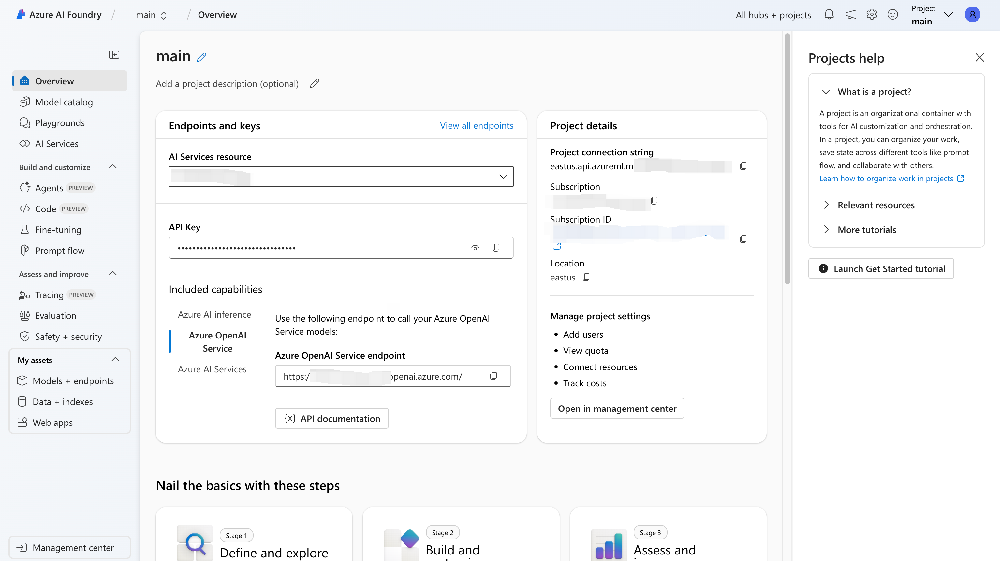
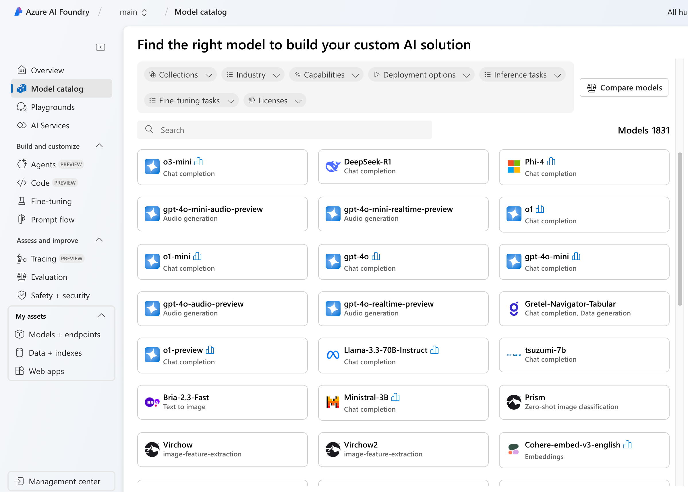
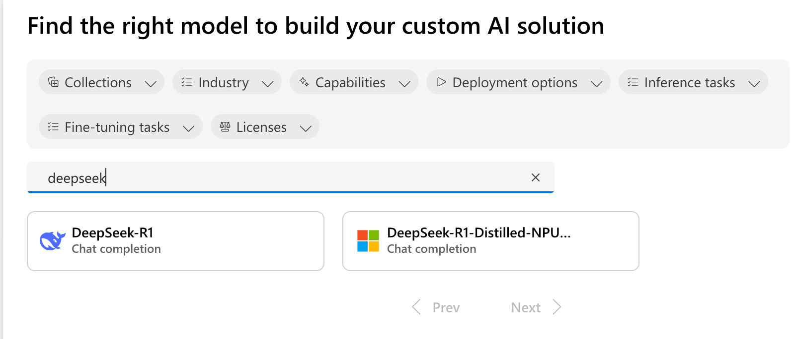
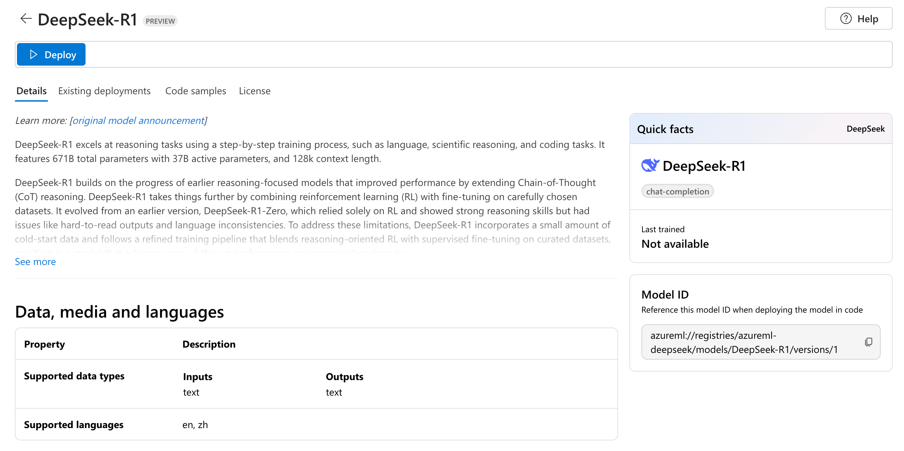
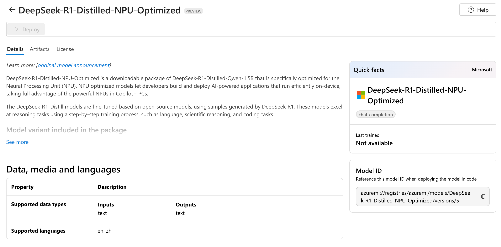
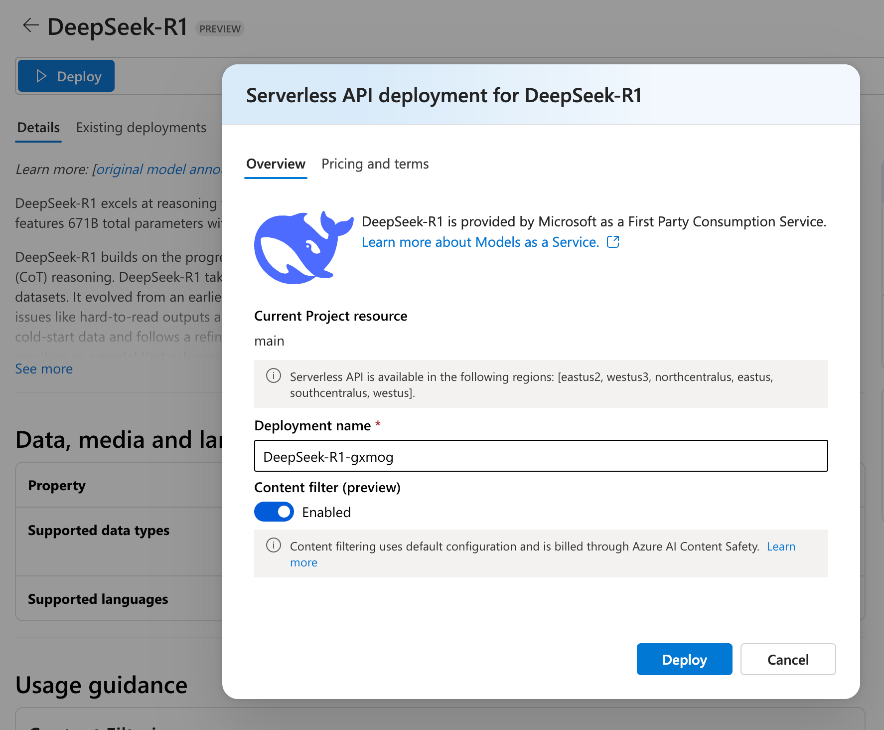
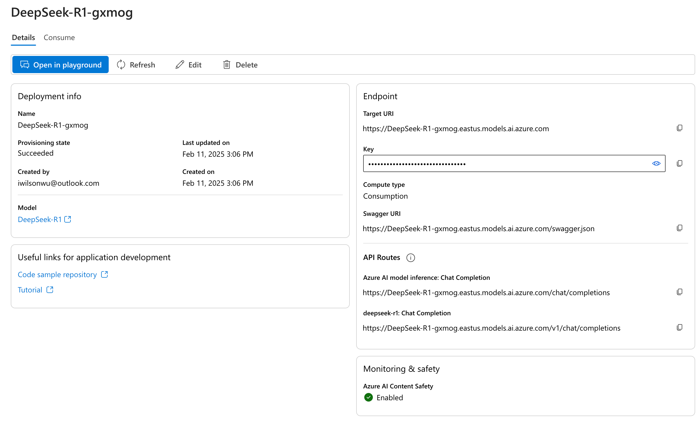
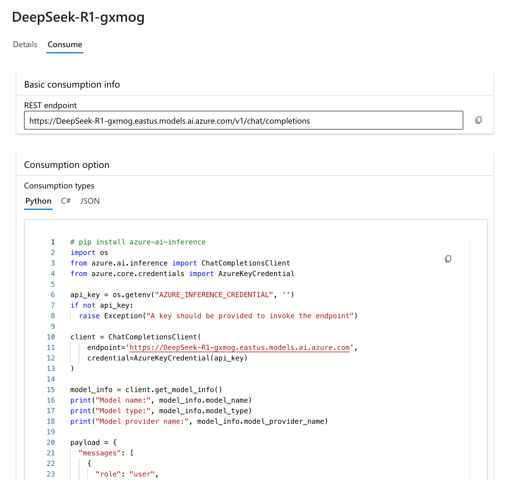

DeepSeek 的爆火让人们再一次看到了 AI 的魅力，而随之而来的不仅不是对算力需求的减少，而是在低成本亲民化人工智能中构建更多 AI 业务场景带来的另一波算力需求。今天我们来通过 Azure AI Foundry（原 Azure AI Studio）快速体验 DeepSeek 的风采。

## 先决条件

首先需要拥有 Azure 订阅，新用户参考[玩转大语言模型：无需任何代码通过 Azure OpenAI 服务构建个人专属 ChatGPT](https://wilsonwu.me/blog/2024/build-own-chatgpt-on-azure/#%E5%85%88%E5%86%B3%E6%9D%A1%E4%BB%B6)中步骤进行开通。然后在 Azure 订阅中创建 AI Foundry 及相关资源，可以参考[创建 Azure AI Foundry 服务](https://wilsonwu.me/blog/2024/build-own-chatgpt-on-azure/#%E6%AD%A5%E9%AA%A4-1%E5%88%9B%E5%BB%BA-azure-ai-studio-%E6%9C%8D%E5%8A%A1)中的步骤，这里不再赘述。

一切完成后进入 Azure AI Foundry 首页，并打开名为 main 的 Project，界面如下：



## 部署 DeepSeek-R1 大语言模型

点击左侧菜单中的 Model catalog 进入模型列表页：



这里可以看到 Azure 提供了超过 1800 种模型，满足用户全方位的需求。

在搜索框输入 DeepSeek 来查看 Azure 支持的 DeepSeek 模型种类：



其中，第一个是全量版 DeepSeek-R1 610B 模型：



另一个是经过 NPU 优化的基于 Qwen 的 DeepSeek-R1 1.5B 蒸馏版：



我们选择 610B 版本进行部署尝试，进入模型详情后点击 Deploy 进行部署确认：



再点击 Deploy 完成部署，部署结束后会自动跳转至 My assets 中的 Models + endpoints 详情中：



至此 DeepSeek-R1 610B 部署完成，整个过程非常简单。

## 调用 DeepSeek-R1 进行推理

接下来我们尝试调用一下刚才部署的模型进行对话，进入刚才部署的模型详情中，点击 Consume Tab：



这里我们选择 Python 代码来进行尝试，代码如下：

```python
# pip install azure-ai-inference
import os
from azure.ai.inference import ChatCompletionsClient
from azure.core.credentials import AzureKeyCredential

api_key = os.getenv("AZURE_INFERENCE_CREDENTIAL", '这里填写该部署在详情页面看到的 Key 值')
if not api_key:
  raise Exception("A key should be provided to invoke the endpoint")

client = ChatCompletionsClient(
    endpoint='https://DeepSeek-R1-gxmog.eastus.models.ai.azure.com',
    credential=AzureKeyCredential(api_key)
)

model_info = client.get_model_info()
print("Model name:", model_info.model_name)
print("Model type:", model_info.model_type)
print("Model provider name:", model_info.model_provider_name)

payload = {
  "messages": [
    {
      "role": "user",
      "content": "我即将前往北京，我能在那里看到什么景色？"
    },
    {
      "role": "assistant",
      "content": "北京，中国的首都"
    },
    {
      "role": "user",
      "content": "关于 #1 有哪些令人惊叹的内容？"
    }
  ],
  "max_tokens": 2048
}
response = client.complete(payload)

print("Response:", response.choices[0].message.content)
print("Model:", response.model)
print("Usage:")
print("	Prompt tokens:", response.usage.prompt_tokens)
print("	Total tokens:", response.usage.total_tokens)
print("	Completion tokens:", response.usage.completion_tokens)
```

创建一个 .py 文件（如：ds-demo.py），将上面的代码粘贴到其中，替换部署自身的 Key 到 api_key 变量中，然后执行如下命令安装依赖包：

```bash
pip install azure-ai-inference
```

然后执行代码：

```bash
python ds-demo.py
```

正常情况下输出结果类似如下内容：

```text
Model name: deepseek-r1
Model type: chat-completion
Model provider name: DeepSeek
Response: <think>

</think>

北京作为中国的首都，拥有悠久的历史和丰富的文化遗产，同时也是现代化大都市的典范。以下是一些您在北京可以体验到的精彩内容：

1. **历史文化景点**：
   - **故宫（紫禁城）**：明清两代的皇家宫殿，世界文化遗产，展示了中国古代建筑和宫廷文化的精华。
   - **天坛**：明清皇帝祭天的场所，以其独特的建筑风格和象征意义闻名。
   - **长城（如八达岭、慕田峪段）**：世界奇迹之一，是中华民族的象征，登临可感受壮丽的山川与历史厚重感。

2. **现代都市风貌**：
   - **北京CBD**：国贸大厦、中央电视台总部大楼（“大裤衩”）等现代建筑群，体现了北京的经济发展活力。
   - **奥林匹克公园**：2008年奥运会主会场，鸟巢、水立方等标志性建筑夜晚灯光璀璨。

3. **文化体验**：
   - **胡同与四合院**：南锣鼓巷、什刹海周边保留了老北京的传统居住形态，可体验胡同骑行或品尝京味小吃。
   - **京剧与杂技表演**：老舍茶馆、梨园剧场等地可欣赏中国传统艺术。

4. **自然景观**：
   - **颐和园**：皇家园林典范，融合江南园林设计与北方山水，适合泛舟昆明湖或漫步长廊。
   - **香山公园**：秋季红叶漫山，是赏秋热门目的地。

5. **美食推荐**：
   - **北京烤鸭**：全聚德、大董等名店提供地道的烤鸭体验。
   - **涮羊肉**：东来顺等老字号以铜锅涮肉为特色。
   - **小吃街**：牛街、簋街汇聚各类京味及全国风味小吃。

6. **其他亮点**：
   - **798艺术区**：旧工厂改造的当代艺术聚集地，适合摄影和艺术爱好者。
   - **国家博物馆**：馆藏丰富，可系统了解中华文明五千年历史。

北京融合了古老与现代，传统与创新，无论是对历史感兴趣，还是想感受都市繁华，都能在这里找到独特的体验。建议根据季节选择合适的游览时间（如秋季气候宜人），并提前规划行程以避开高峰人流。
Model: deepseek-r1
Usage:
        Prompt tokens: 31
        Total tokens: 522
        Completion tokens: 491
```

## 总结

DeepSeek 的优势在于其强大的自然语言处理能力和高效的推理性能。通过 Azure AI Foundry 部署，用户可以快速上手并体验其强大的功能。DeepSeek-R1 提供了多种模型版本，满足不同需求，从全量版到经过优化的蒸馏版，用户可以根据实际应用场景选择合适的模型。
