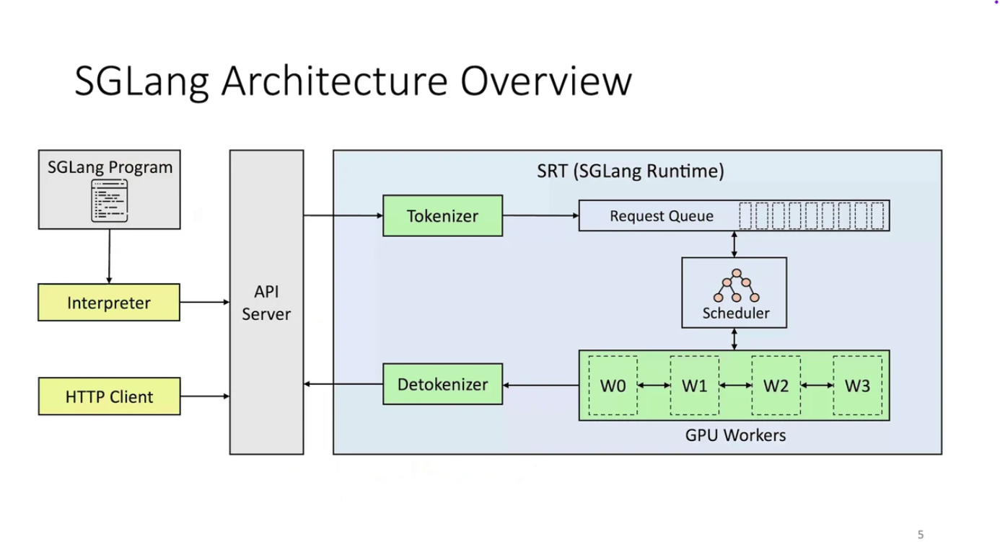

随着大语言模型热度的升级，企业和个人使用者的研究重心逐步从训练转移至推理（说白了是由造轮子转变为务实的使用）。而在模型推理领域，最炙手可热的两大框架无疑是 vLLM 和 SGLang，而作为后起之秀的 SGLang，其表现也值得大家关注，今天就基于 SGLang 为大家带来一篇入门教程文章，希望能帮助更多希望了解大语言模型及 SGLang 框架的朋友。

## SGLang 简介

SGLang 是一款面向大语言模型（LLM）和视觉语言模型（VLM）的高性能推理框架，通过精心设计的后端运行时与前端语言协同工作，使模型交互更加高效且可控。其核心优势包括：

- **高效后端运行时：**采用创新的 RadixAttention 技术实现前缀缓存，支持跳跃式受限解码、零开销 CPU 调度、连续批处理、令牌注意力（分页注意力）、张量并行、FlashInfer 内核、分块预填充以及多种量化技术（FP8/INT4/AWQ/GPTQ），显著提升推理效率。
- **灵活前端语言：**提供直观且强大的 LLM 编程接口，支持链式生成调用、高级提示工程、复杂控制流、多模态输入、并行处理及外部系统交互。
- **广泛模型兼容性：**支持多种主流生成式模型（Llama、Gemma、Mistral、QWen、DeepSeek、LLaVA 等）、嵌入模型（e5-mistral、gte）及奖励模型（Skywork），并提供简便的新模型扩展机制。
- **活跃开源生态：**拥有蓬勃发展的社区支持，已获得广泛业界认可（截至 2025 年 3 月 17 日，GitHub 累计星标超过 12,000）。

其技术架构如下：



除此之外，对于初学者，需要了解其以下特性：

- **OpenAI 兼容 API：**直接用 openai Python SDK 或 cURL 调用，不用改你的上层业务代码。
- **高吞吐与低延迟：**结合连续批处理与前缀缓存等技巧，让相同前缀的请求复用计算。
- **生产友好：**支持多并发、流式输出、可与 Hugging Face 模型库直接对接。

## 环境准备

工欲善其事必先利其器，要完成本文的新手实验，需准备如下环境：

- 操作系统：建议 Linux（常用为 Ubuntu 20.04+）。WSL2 也可尝试。
- Python：建议 3.10 或 3.11。
- GPU：建议 NVIDIA 显卡，24GB 显存可跑 7B/8B 级（如 Llama 3.1 8B）。没有 GPU 也能跑小模型或量化模型，但性能有限。
- 模型来源：Hugging Face（如 meta-llama/Llama-3.1-8B-Instruct）或本地路径。

## 安装 SGLang

环境就绪后，使用 pip 安装 SGLang（确保已安装 pip、可选创建虚拟环境）。

```python
pip install sglang openai huggingface-hub
```

如果你需要从 Hugging Face 自动下载私有或受限模型，请先登录或设置 Token：

```bash
huggingface-cli login
# 或
export HF_TOKEN=您的Token
```

## 启动 SGLang 服务

可以通过以下两种启动方式进行 SGLang 服务的启动。不同版本的 SGLang 命令行参数可能略有差异，如果出现参数名称不匹配，先执行 --help 查看本机版本支持的参数。

### 通过 launcher 启动

```bash
python -m sglang.launcher \
  --model meta-llama/Llama-3.1-8B-Instruct \
  --host 0.0.0.0 \
  --port 30000 \
  --tp 1 \
  --max-model-len 8192
```

其中常用参数说明如下：

- --model：Hugging Face 模型名称或本地模型权重路径
- --host/--port：服务监听地址与端口
- --tp：Tensor Parallel 并行度（单卡设为 1；多卡可根据需要设为 2、4 等）
- --max-model-len：上下文最大长度

另外需要注意以下两点：

- 如果使用的是 Hugging Face 模型，首次运行会下载模型权重，请确保网络通畅。
- 如果显存吃紧，可优先尝试更小模型，或减少 --max-model-len。

### 通过 sglang 命令启动

如果您使用的版本提供 sglang serve 命令，也可使用如下命令进行启动：

```bash
sglang serve -m meta-llama/Llama-3.1-8B-Instruct --host 0.0.0.0 --port 30000
```

## 快速验证

服务启动后，OpenAI 兼容接口即可使用：

```bash
curl http://127.0.0.1:30000/v1/chat/completions \
  -H "Content-Type: application/json" \
  -H "Authorization: Bearer EMPTY" \
  -d '{
    "model": "meta-llama/Llama-3.1-8B-Instruct",
    "messages": [
      {"role": "system", "content": "You are a helpful assistant."},
      {"role": "user", "content": "用两句话介绍一下你自己。"}
    ],
    "max_tokens": 128,
    "temperature": 0.2
  }'
```

如果运行正常，将返回标准的 ChatCompletion JSON 响应。

## 使用 Python OpenAI SDK 进行调用

非流式调用（最简单的问答）：

```python
from openai import OpenAI

client = OpenAI(
    base_url="http://127.0.0.1:30000/v1",
    api_key="EMPTY"  # 本地服务通常不校验
)

messages = [
    {"role": "system", "content": "You are a helpful assistant who answers in Chinese."},
    {"role": "user", "content": "请用三句话介绍帕累托最优。"}
]

resp = client.chat.completions.create(
    model="meta-llama/Llama-3.1-8B-Instruct",
    messages=messages,
    temperature=0.2,
    max_tokens=256
)

print(resp.choices[0].message.content)
```

流式输出（边生成边打印）：

```python
from openai import OpenAI

client = OpenAI(base_url="http://127.0.0.1:30000/v1", api_key="EMPTY")

messages = [
    {"role": "system", "content": "You are a helpful assistant that speaks Chinese."},
    {"role": "user", "content": "简述 Transformer 的核心思想，并给出一个现实类比。"}
]

stream = client.chat.completions.create(
    model="meta-llama/Llama-3.1-8B-Instruct",
    messages=messages,
    temperature=0.2,
    max_tokens=300,
    stream=True
)

for chunk in stream:
    if chunk.choices and chunk.choices[0].delta:
        delta = chunk.choices[0].delta.content
        if delta:
            print(delta, end="", flush=True)

print("\n[Done]")
```

通过以上两种方式，我们可以构建自己的推理服务应用，也可以通过市面上开源的软件来接入您部署的推理服务，如 Open-WebUI 等。

## 常见问题与排错

- 启动时报显存不足（CUDA OOM）
  - 尝试更小的模型（如 7B/8B）、减小 `--max-model-len`、或降低并发。
  - 如果有多卡，增加 --tp 并用多卡分摊显存。
- 拉取模型失败或速度慢
  - 先执行 `huggingface-cli login`；或提前手动把模型权重下载到本地路径，并在 `--model` 里填本地路径。
- API 报 `Unknown argument`
  - 不同版本的命令行参数可能有差异。请运行：`python -m sglang.launcher --help`
  - 根据你安装的版本调整参数名，如 `--model` / `--model-path`、`--tp` / `--tensor-parallel-size` 等。
- Python 客户端 `401/Key` 错误
  - 本地服务通常不校验 Key，只要带上一个占位即可（如 `EMPTY`）。
- 流式输出不打印
  - 确认传了 `stream=True`；迭代 chunk 时取 `choices[0].delta.content`。
- 并发性能不达预期
  - 尝试用 Async 客户端并发请求；避免在单线程里串行等待。
  - 检查 GPU 利用率；确认没有 CPU/GPU 数据传输瓶颈。

## 总结

至此，你已经完成了：

- 安装与启动 SGLang 服务
- 用 OpenAI 兼容接口进行非流式与流式推理

祝你上手顺利，玩得开心！如果遇到命令行参数或 API 的小差异，参考本地版本的 --help 与官方文档进行快速适配即可。
