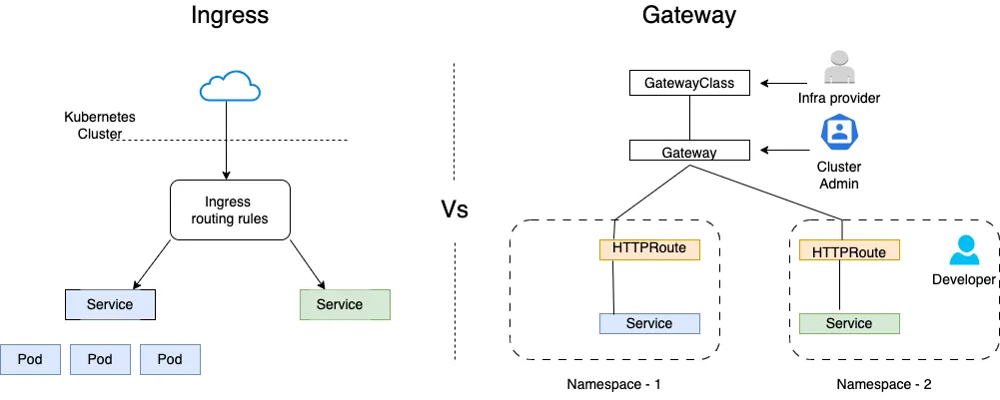
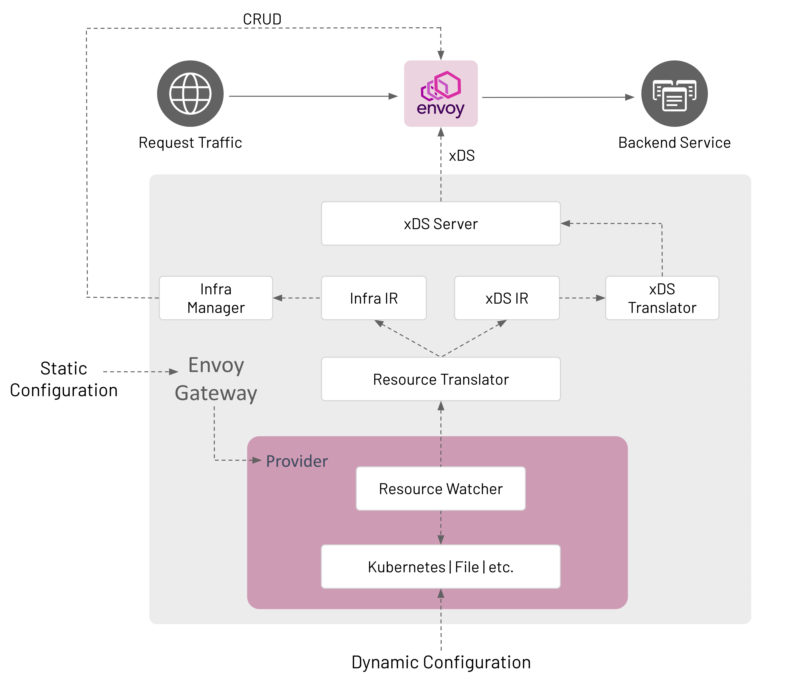

Kubernetes 官方在 **2025 年 11 月 11 日**发布博客，正式宣布 **Ingress NGINX 项目进入退役（Retirement）阶段**，并将于 **2026 年 3 月**彻底停止维护。

这一举措标志着 Kubernetes 在集群入口与流量管理方面正式进入 **Gateway API 时代**。对于正在使用 Ingress NGINX 的团队，这不仅是一次技术升级，更是一项需要尽快规划的风险管理工作。

本文将基于 Kubernetes 官方退役公告、Gateway API 最新生态与社区最佳实践，系统介绍：

* 为什么 Ingress NGINX 被退休？
* Ingress 模型的根本局限与 Gateway API 的优势
* 新的推荐替代方案：Envoy Gateway（基于 Gateway API）
* 如何从 Ingress 迁移到 Gateway API（完整迁移路径）
* 关键注意事项与生产实践建议

## Ingress NGINX 为什么从 Kubernetes 正式退役？

根据官方博客（2025–11–11），Ingress NGINX 的退役原因包括：

### ● 1. 项目长期缺乏维护者

虽然 Ingress NGINX 使用极广，但维护压力巨大，而核心维护者数量越来越少，社区贡献下滑。项目经过数月讨论，确定无法持续投入。

### ● 2. 无法跟上 Kubernetes 网络模型的发展

Ingress 诞生于 Kubernetes 早期，仅支持 HTTP(s) 基础路由；而随着 Service Mesh、多协议服务、网关统一治理等场景爆发，Ingress 模型难以满足现代需求。

### ● 3. 功能严重依赖 Controller 私有扩展

如 NGINX Ingress 的大量 Annotation、Rewrite、Header 管理等，使得 Ingress 配置在不同控制器之间高度不兼容，难以形成云原生网络的统一抽象。

### ● 4. Gateway API 已经成熟，能够全面替代

Gateway API 于 2023–2024 进入 GA，解决了 Ingress 的所有痛点，是 Kubernetes SIG-Network 未来 10 年的官方战略方向。

> 官方公告明确：
>
> * **从 2026 年 3 月起将不再提供任何补丁，包括安全补丁。**
> * 项目代码、容器镜像、Helm Chart 虽然仍可访问，但不会再更新。
> * 官方建议用户“尽快迁移”。

## Ingress 的局限性：为什么它必须退出历史舞台？

Ingress 的设计非常简单，只能做最基础的 L7 HTTP(s) 路由：

| 能力                   | Ingress           | Gateway API |
| -------------------- | ----------------- | ----------- |
| Host / Path 路由       | ✔                 | ✔           |
| Header 匹配            | ❌                 | ✔           |
| Query 匹配             | ❌                 | ✔           |
| HTTP Method 匹配       | ❌                 | ✔           |
| 流量拆分 / 灰度发布          | ❌                 | ✔           |
| 多监听端口                | ❌                 | ✔           |
| TCP / UDP / gRPC 多协议 | ❌                 | ✔           |
| 多租户 / RBAC 边界        | 弱                 | 强           |
| 可扩展性                 | Annotation 混乱且不兼容 | CRD 标准扩展    |

Ingress 的能力已无法支撑现代云原生系统的需求，而且控制器之间的行为极不一致。Gateway API 的出现正是为了解决上述所有问题。



## 推荐替代方案：Envoy Gateway + Gateway API

目前官方推荐的方向是：**转向 Gateway API，并选择任意兼容的 Gateway 实现**。

在众多实现中，我们推荐 **Envoy Gateway**，原因包括：

### 1. 对 Gateway API 支持最完整

完美支持 HTTPRoute / TCPRoute / GRPCRoute 这是 Ingress 无法做到的。

### 2. 基于 Envoy Proxy，性能与可扩展性行业领先

Envoy 是 CNCF 毕业项目，得到大规模生产验证。

### 3. 社区活跃，长期维护无风险

与 Ingress NGINX 的“维护者不足”相比，Envoy Gateway 是明确的长期支持项目。

### 4. 与 Service Mesh（如 Istio）原生兼容

Gateway API 未来将成为 Service Mesh 入口的新标准。

换句话说：**Envoy Gateway 是最稳妥的迁移目标**。



## 迁移路径：从 Ingress NGINX → Gateway API（Envoy Gateway）

大多数企业推荐采用 **双栈迁移**：

```text
Ingress（旧） 和 Gateway API（新） 并存 → 服务逐个迁移 → 完全切流 → 卸载 Ingress NGINX
```

以下是完整步骤。

## 步骤 1：安装 Gateway API 和 Envoy Gateway

安装标准 Gateway API CRD：

```bash
kubectl apply -f https://github.com/kubernetes-sigs/gateway-api/releases/latest/download/standard-install.yaml
```

然后安装 Envoy Gateway 控制器（官方提供 Helm / YAML）。

## 步骤 2：创建 Gateway（替代 Ingress Controller + LoadBalancer）

```yaml
apiVersion: gateway.networking.k8s.io/v1
kind: Gateway
metadata:
  name: main-gateway
  namespace: infra
spec:
  gatewayClassName: envoy
  listeners:
  - name: http
    port: 80
    protocol: HTTP
  - name: https
    port: 443
    protocol: HTTPS
    tls:
      mode: Terminate
      certificateRefs:
      - name: demo-cert
```

这相当于原来的：

* Ingress Controller
* * LoadBalancer Service
* * TLS 配置

## 步骤 3：把 Ingress 转换为 Gateway API 路由

原 Ingress：

```yaml
apiVersion: networking.k8s.io/v1
kind: Ingress
metadata:
  name: demo
spec:
  rules:
  - host: demo.example.com
    http:
      paths:
      - path: /
        pathType: Prefix
        backend:
          service:
            name: demo-svc
            port:
              number: 80
```

新 HTTPRoute：

```yaml
apiVersion: gateway.networking.k8s.io/v1
kind: HTTPRoute
metadata:
  name: demo
spec:
  parentRefs:
    - name: main-gateway
      namespace: infra
  hostnames:
    - "demo.example.com"
  rules:
  - matches:
      - path:
          type: PathPrefix
          value: "/"
    backendRefs:
      - name: demo-svc
        port: 80
```

## 步骤 4：灰度切流（可选但强烈推荐）

Gateway API 支持权重：

```yaml
backendRefs:
  - name: demo-svc-v1
    port: 80
    weight: 90
  - name: demo-svc-v2
    port: 80
    weight: 10
```

用于：

* 灰度发布
* 蓝绿切换
* 测试新网关
* 逐步迁移流量

这是 Ingress 以前必须靠 Nginx snippet 才能做到的。

## 步骤 5：服务逐个迁移 → 最终替换所有 Ingress

建议迁移顺序：

1. 无状态服务
2. 内部服务（非公网）
3. 低风险流量
4. 高风险 / 主业务
5. 全局入口流量
6. 完成后卸载 Ingress NGINX

## 迁移注意事项（生产环境必读）

### 1. Annotation 不会自动迁移

Ingress 的 Annotation（rewrite、headers、timeouts 等）要重写为 Gateway API 的 Policy / Filter。

### 2. TLS 配置方式不同

Gateway API 是 Listener 层统一处理 TLS。

### 3. 流量切换建议逐步进行

不要一次性替换大量入口。

### 4. 建议提前半年开始迁移

要赶在 2026 年 3 月停止维护前完成迁移。

## 总结：Gateway API 是 Kubernetes 入口的未来

Ingress NGINX 的退役并不是坏事，而是 Kubernetes 网络体系完成演进的标志。

**Ingress → Gateway API**
是必然趋势，也是一次全面升级：

* 更强的路由能力
* 更清晰的多租户设计
* 更丰富的现代云原生场景支持
* 更长期的社区维护保障

对于已经依赖 Ingress NGINX 的团队，**现在就应该开始迁移规划**。

Gateway API + Envoy Gateway 是当前生态最稳、最现代、最推荐的方案。
