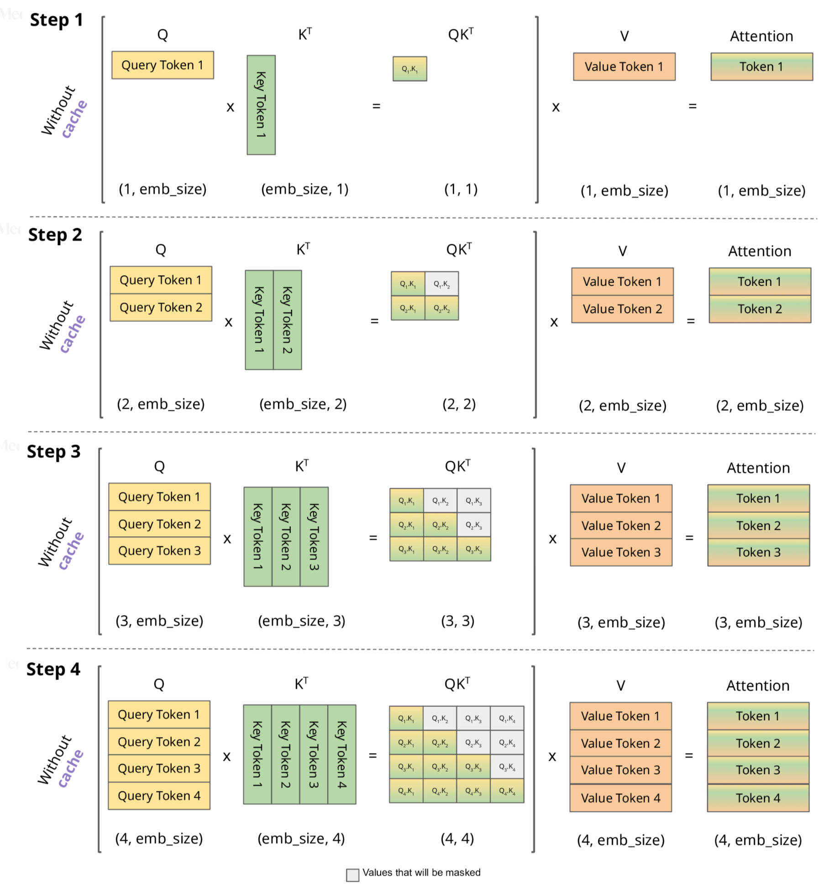

随着大语言模型（LLM）规模不断增长，推理成本也随之飙升。为了让模型在响应用户请求时更快、更经济地运行，各类优化技术不断涌现。其中，**KV-Cache（Key-Value Cache）**是目前最关键、影响最深远的推理加速机制之一，被所有主流的推理框架（如 vLLM、TensorRT-LLM、LLama.cpp、llm-d、OpenAI Triton Transformer Engine 等）广泛使用。

这篇文章将全面介绍什么是 KV-Cache、它如何工作、为什么它能极大提升推理效率、它对行业带来了什么影响，以及在实际使用中的最佳实践。

## KV-Cache 是什么？

首先，其工作原理架构图如下：

理解起来非常简单，单其中细节结合复杂度计算还是略有抽象。

KV-Cache，全称 **Key-Value Cache**，是在 LLM 推理过程中对 Transformer 解码器中**自注意力层（Self-Attention）**的中间结果进行缓存的一种方法。

Transformer 的自回归生成方式决定了：
**每生成一个新 token，就需要重新计算它与全部历史 token 的注意力关系**。

如果每次都把过去所有 token 的 Key 和 Value 重新计算一遍，其计算量是：

> 推理时间复杂度：O(n²)
> （n 为上下文长度）

为了避免重复计算，KV-Cache 会在每步生成 token 时，将计算后的 **Key（K）** 和 **Value（V）** 保存下来，这样之后再生成下一步 token 时就能直接引用过去的 Key/Value，而无需重新计算历史部分。

这让时间复杂度大幅下降为：

> 推理时间复杂度：O(n)

所以简单总结一下，KV-Cache 是在自回归解码中缓存历史 token 的 Key/Value，让后续生成直接复用过去的注意力结果，从而把时间复杂度从 O(n²) 降到 O(n)，节省的成本非常巨大。

## KV-Cache 是如何工作的？

以当前主流的解码流程为例，我们以是否使用 KV-Cache 来做一个简单的对比。

### 如果没有 KV-Cache

每次生成新 token 时需要做：

1. 重新对全部历史序列做 embedding
2. 通过所有 Transformer 层重新计算 K/V
3. 根据新 token 与整个序列做自注意力
4. 得到新 token 并输出

具体流程图示如下：

### 使用 KV-Cache

第一次推理（prefill 阶段）：

1. 对所有提示词（prompt tokens）进行计算
2. 计算所有 K/V，并将它们保存在 KV 缓存中

之后的每一步（decode 阶段）：

1. 只计算当前新 token 的 K/V
2. 与缓存中的 K/V 做注意力，得到结果
3. 写回缓存

这样，每生成一个 token 的计算量从**全序列规模 → 近似常数开销**，越长的上下文收益越大。

其流程图示如下：

## KV-Cache 带来了什么影响？

### 推理速度提升数十倍

对长上下文模型（8k / 32k / 128k tokens）尤其明显。

例如对 32k token 的上下文，如果没有 KV-Cache：

* 每生成一个 token 需要遍历 32k 历史序列
* 整体是 *重复 32k 次的巨量工作*

有了 KV-Cache：

* 历史部分只算一次
* 单步 decode 的开销变成固定量（几百维 KV 与注意力点积）

通常加速比可达到：

> 10 倍至 100 倍不等
> （取决于提示词长度、模型大小、硬件）

### 推理成本大幅降低

大模型推理的成本主要由这几个部分构成：

* **算力**（矩阵乘法）
* **显存占用**
* **带宽**

KV-Cache 能大幅降低重复算力，因此成本成比例下降。

这就是为什么：

* OpenAI、Anthropic、Meta、Mistral
* 各大云推理服务
* 所有开源推理框架

都把 KV-Cache 作为默认推理方式。

### 但是显存占用会变高

KV 是每一层每个 token 的结果，因此缓存本身需要**巨大的显存**。

例如：
Llama-3 70B 模型，64K context，对 1 token 的 KV 占用约 1.5KB。

那么 64K token 就是：**约 96MB × 80 层 ≈ 7.6GB 的 KV-cache**

当你看到推理卡 80GB 显存不够时，很大概率是因为 KV 满了，而不是模型权重太大。

### 影响了模型的架构设计与行业走向

KV-Cache 的重要性高到：**模型架构都围绕它做优化。**

包括：

* Mistral 的**滑动窗口注意力（SWA）**
* Meta 的 **Grouped Query Attention（GQA）**
* DeepSeek 的 **Multi-head Latent Attention（MLA）**
* Google 的 **Multi-Query Attention（MQA）**

这些技术主要目的之一就是：

> 降低 KV-Cache 的显存占用

因为 Q 数少 → KV 也变少 → 显存压力更低。

所以 **KV-Cache 不只是一个技术点，而是影响模型架构的重要因素**。

## KV-Cache 的性能关键因素

### 不同 Attention 架构带来的 KV 大小差异

| Attention 类型 | KV 大小 | 优点    | 缺点     |
| ------------ | ----- | ----- | ------ |
| MHA（多头注意力）   | 最大    | 兼容性最好 | 显存占用高  |
| MQA（多查询注意力）  | 小很多   | 更高效   | 灵活性略差  |
| GQA（分组注意力）   | 居中    | 性能好   | 结构更复杂  |
| MLA          | 更小    | 更快    | 模型支持有限 |

### Prefill 和 Decode 性能壁垒不同

* **Prefill 阶段**：算 K/V 很耗算力，需要好 GPU。
* **Decode 阶段**：显存带宽优先，因为每步生成通常 batch 很小。

这也影响推理框架的优化策略。

### KV-Cache 的布局与管理

例如：

* **PagedAttention**（vLLM 的核心技术）
* **Block-sparse KV 管理**（TensorRT-LLM）
* **动态缓存分配**（llama.cpp）
* **连续 vs 分块 KV 内存**

优秀的分配策略可以极大减少 fragmentation 和显存浪费。

## KV-Cache 的最佳实践

### 尽量减少上下文长度

上下文越长 → KV 越大 → 推理越慢、越贵。

如果业务允许：

* 使用 **RAG** 把长文档拆分
* 使用**压缩模型（compressor）**
* 使用**短指令模板**
* 引导模型减少“废话”输出

### 选择合适的 Attention 架构

如果你在自定义模型、微调或部署模型：

* 需要高效推理 → 优选 **MQA / GQA / MLA**
* 需要兼容许多任务 → MHA 仍然最稳定

### 使用专业推理框架

优先使用：

* **vLLM（商业与开源界第一推理框架）**
* **TensorRT-LLM（NVIDIA 官方）**
* **llm-d（中小型企业的极高性价比框架）**
* **OpenAI Triton 引擎（内部使用）**

它们都在 KV-Cache 管理上有深度优化。

### 多卡推理时注意 KV 分布问题

KV 会引发：

* **多卡同步开销**
* **all-reduce 带宽瓶颈**

部分框架提供：

* KV sharding
* pipeline parallelism
* block-sparse KV sharing

合理设置可显著提升吞吐量。

### 批处理策略影响巨大

适配 KV-Cache 的批处理策略包括：

* continuous batching
* block scheduling
* prompt+decode 混合 batch

正确 batching 通常带来 **>10× 吞吐提升**。

## KV-Cache 的未来展望

未来几年，模型推理的发展趋势中，KV-Cache 会继续是核心机制。

我们将看到：

* 更轻量的 KV 结构（更少头、更小维度）
* 更智能的 KV 重用机制
* KV 的跨请求共享（multi-query serving）
* 部分 KV 的 CPU/NVMe offload
* Push-down Attention（降低 GPU 带宽要求）

总之，KV-Cache 将继续驱动推理性能提升，是 LLM 推理领域最重要的基础设施之一。

## 总结

KV-Cache 并不是一个“可选优化”，而是现代大语言模型推理的 **核心基石**。
它带来巨大的速度提升，但也带来显存压力，影响模型架构、推理框架设计乃至行业整个技术路线。

理解 KV-Cache，你就理解了：

* 为什么推理这么贵
* 为什么上下文越长模型越慢
* 为什么新一代模型都在改注意力结构
* 为什么推理框架竞争如此激烈
