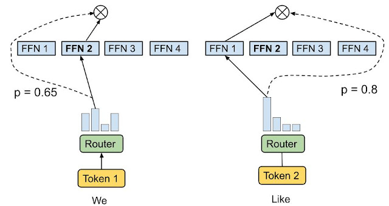
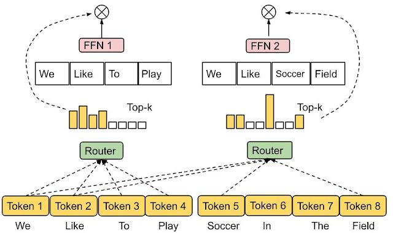
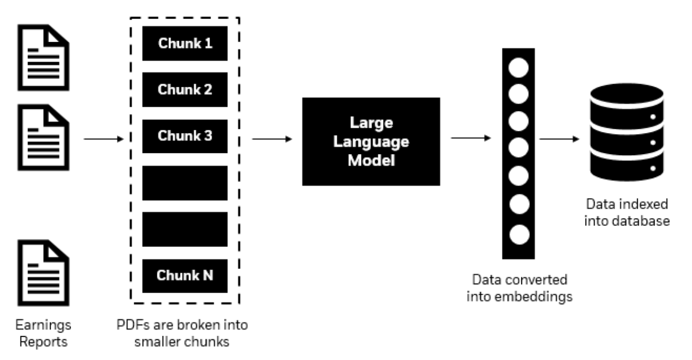
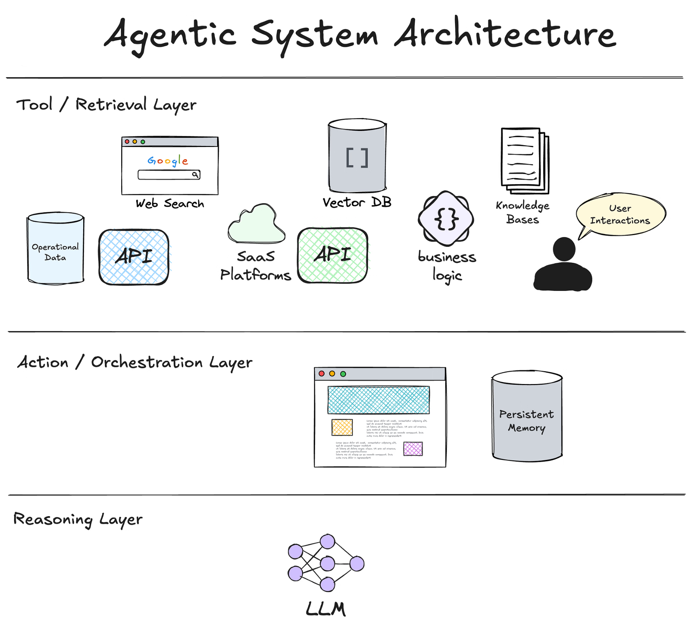
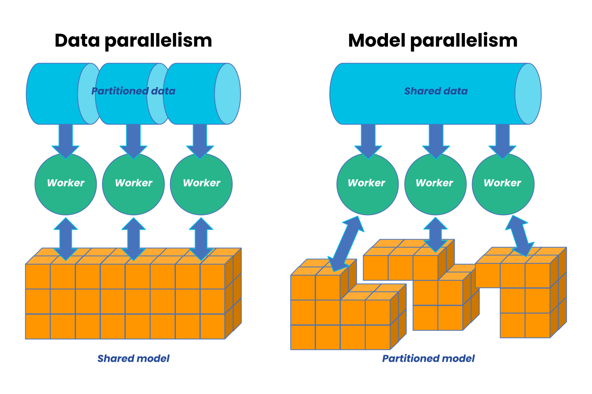
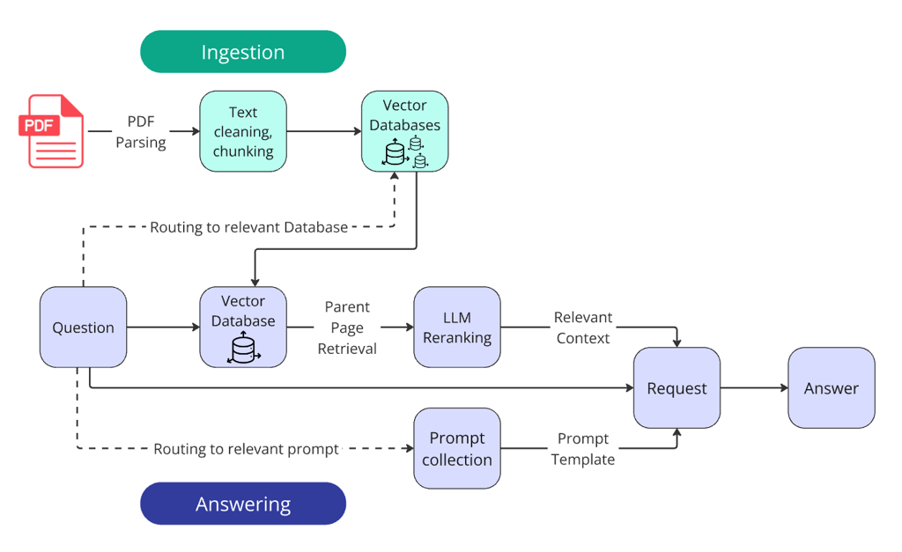
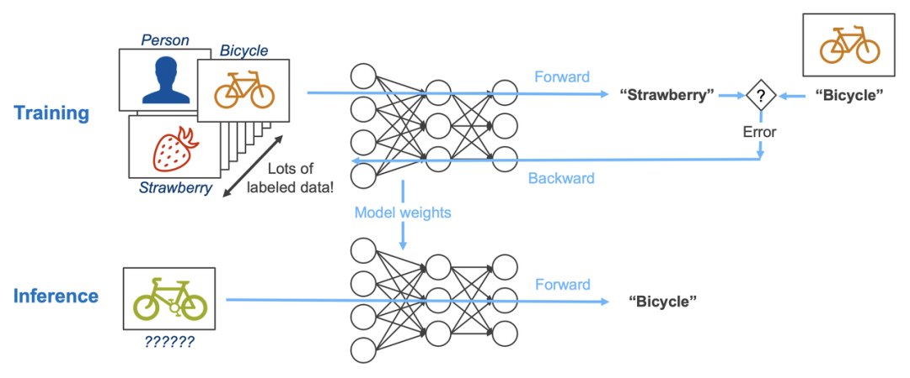

过去五年，大语言模型（Large Language Models, LLMs）的发展几乎完全重塑了人工智能的技术版图。从 GPT 到 LLaMA，从 Transformer 到 Mixture-of-Experts（MoE），从单体模型到大规模分布式参数服务器体系，架构演进直接推动了能力跃迁。

本文将从架构层面系统梳理 LLM 的主流技术路径，并从应用视角分析其优劣及适配场景，为研发与业务团队提供技术选型参考。同时也希望可以为初学者们打开迈入大模型世界的一条门缝！

## 大语言模型的主流架构体系

目前的 LLM 架构，大概可以分为这么几类：

1. **传统 Transformer（Dense Transformer）**
2. **Mixture-of-Experts（MoE）架构**
3. **多模态扩展架构（Vision-Language / Audio-Language）**
4. **检索增强生成（RAG）与混合推理架构**
5. **基于代理（Agentic）架构的系统级 LLM**
6. **超大规模分布式训练架构（例如 Parameter Server / Fully Sharded）**

下面逐一展开。

## 传统 Transformer：主流 LLM 的基础架构 {#dense-transformer}

Dense Transformer 是绝大多数 LLM 的基座，包括 GPT 系列、LLaMA、Mistral、Qwen 等。

### 架构 {#dense-transformer-architecture}

简单来说，就是“大力出奇迹”：

* 所有 token 通过全连接注意力进行计算；
* 全部参数在每次前向推理中都会被激活；
* 结构相对规则，训练稳定；
* 模型规模靠堆叠层数与扩大 hidden size 线性提升。

### 优势 {#dense-transformer-advantages}

* 推理路径稳定、可预测；
* 训练过程成熟，生态支持丰富；
* 对所有任务通用，不需要额外路由机制。

### 局限 {#dense-transformer-limitations}

* 参数规模大时推理成本高（全部参数激活）；
* 扩展模型能力的成本几乎与参数规模线性相关。

### 应用场景 {#dense-transformer-scenarios}

| 场景             | 适用性       |
| -------------- | --------- |
| 通用对话           | 高         |
| 编程、数学推理        | 高         |
| 对实时需求强的应用（低延迟） | 较低        |
| 资源受限设备（边缘推理）   | 一般，可用量化缓解 |

Dense 模型依然是绝大多数企业首次采用 LLM 时的首选。

## Mixture-of-Experts（MoE）：高效扩展能力的关键技术 {#moe}

MoE 是当前最重要的新架构之一，代表模型包括：

* Google Switch Transformer
* DeepSeek-V2/V3
* Mixtral 系列
* GPT-4 技术论文暗示其有 MoE 结构成分

### 架构 {#moe-architecture}

MoE 不再让所有参数参与每次计算，而是通过**路由（Routing）**机制让每个 token 只激活若干专家层（Expert）。

举个例子，一个 300B 参数的庞然大物，实际每次推理可能只动用了 30B 的参数。

### 优势 {#moe-advantages}

* **训练扩展性极强**：参数规模可以以更低成本提升到数千亿甚至上万亿。
* **推理成本显著降低**：激活专家减少推理 FLOPs。
* **擅长复杂推理与多任务能力**。

### 局限 {#moe-limitations}

* 路由训练复杂，稳定性需求更高；
* 推理并行规模更大，对系统工程要求高；
* 不适合极端低延迟场景，因为专家调度带来额外开销。

### 应用场景 {#moe-scenarios}

| 场景                | 适用性   |
| ----------------- | ----- |
| 多领域任务（代码/数学/语言混合） | 极高    |
| 超大规模模型（百亿+）       | 极高    |
| 边缘设备、小型模型         | 低     |
| 多租户大规模在线推理        | 依实现而定 |

MoE 已成为大型商业 LLM 的主流趋势。

## 多模态 LLM 架构：模型能力向感知延伸 {#multimodal}

代表模型：GPT-4o、Gemini、Qwen-VL、LLaVA、Yi-VL

### 架构 {#multimodal-architecture}

多模态 LLM 通过在 Transformer 基座上引入额外编码器，将视觉、音频、视频等信号映射为 token 表示。

典型结构通常包含：

* 视觉编码器（Vision Encoder，比如 ViT）
* 投影层（Projection Layer）
* 统一的 Transformer
* 多模态注意力机制

### 优势 {#multimodal-advantages}

* 输入能力扩展显著：图像、音频、视频、文档统合处理；
* 极适合作为通用 AI Agent 的感知模块。

### 局限 {#multimodal-limitations}

* 成本比纯文本 LLM 更高；
* 多模态数据构建成本大；
* 输出的稳定性与高保真图像/视频理解仍有上限。

### 应用场景 {#multimodal-scenarios}

| 场景         | 适用性     |
| ---------- | ------- |
| OCR / 文档理解 | 极高      |
| 多模态搜索      | 高       |
| 视频理解       | 中（依赖模型） |
| 紧凑型设备部署    | 低       |

随着 GPT-4o 全模态输入的普及，多模态 LLM 已成为企业 AI 转型的必备能力层。

## RAG + LLM 混合架构：以知识增强为核心的系统形态 {#hybridrag}

RAG（Retrieval-Augmented Generation）通过将外部知识库融合到推理中解决 LLM 本身无法持久更新和存储大量事实的问题。

### 架构 {#hybridrag-architecture}

由三个核心组件构成：

* 向量数据库（Retriever）
* 文档预处理管线（Chunking, Indexing）
* 核心 LLM（Generator）

### 优势 {#hybridrag-advantages}

* 模型无需重新训练即可持续更新知识；
* 显著增强长尾知识与事实性能力；
* 数据可控，便于企业级治理。

### 局限 {#hybridrag-limitations}

* 依赖检索质量；
* 对 prompt 工程与 pipeline 工程化要求高；
* 多跳检索在 latency 上存在开销。

### 应用场景 {#hybridrag-scenarios}

| 场景               | 适用性 |
| ---------------- | --- |
| 企业知识库问答          | 极高  |
| 法律、医疗等高准确性应用     | 高   |
| 实时 LLM 应用（对时延敏感） | 较低  |

RAG 是企业级 LLM 落地中最常见的架构。

## 基于代理的架构：基于智能体的系统级 LLM 架构 {#agentic}

代表：AutoGPT、GPT-o1、GPT-o3、DeepSeek-R1、自主推理 Agent Framework

随着模型具备规划（Planning）、执行（Acting）和反思（Reflection）能力，Agent 架构正在成为应用层主流。

### 架构 {#agentic-architecture}

* 多工具整合（Tool Use）
* 工作流管理
* 多轮子任务规划
* Memory 与外部状态管理

### 优势 {#agentic-advantages}

* 可执行复杂任务链；
* 强化模型可控性；
* 工具能力扩展模型本身的局限。

### 局限 {#agentic-limitations}

* 系统复杂度显著增加；
* 可靠性、可追踪性和可验证性要求高；
* 调度能力直接影响实际效果。

### 应用场景 {#agentic-scenarios}

| 场景      | 适用性 |
| ------- | --- |
| 自动化运营   | 极高  |
| 数据分析助手  | 高   |
| 多步骤计算任务 | 高   |
| 回答型问答   | 一般  |
| 超低延迟场景  | 不适合 |

Agent 架构代表了 LLM 应用的未来方向。

## 分布式训练架构：支撑万亿参数模型的底层工程 {#distributed-training}

这类方案通常没有特定的架构模型，依照不同的需求，技术厂商会演进出各类方案，比如：

* ZeRO / FSDP（Fully Sharded Data Parallel）
* Megatron-LM（Tensor / Pipeline 并行）
* DeepSpeed
* Colossal-AI
* Parameter Server（SageMaker、Ray、DeepSeek 自研）

### 优势 {#distributed-training}

* 高效训练超大模型；
* 利用 GPU 集群最大化吞吐；
* 优化显存占用。

### 局限 {#distributed-training}

* 工程复杂度极高；
* 部署成本昂贵；
* 对 GPU 集群架构高度依赖。

### 应用场景 {#distributed-training}

主要适用于自研大模型或千卡级 GPU 训练任务的企业或科研团队。

## 各架构侧重点及优势对比

以下为一张综合对比表：

| 架构类型              | 优势          | 劣势         | 应用重点          |
| ----------------- | ----------- | ---------- | ------------- |
| Dense Transformer | 稳定、成熟、推理链简单 | 成本随规模线性提升  | 通用模型、边缘部署     |
| MoE               | 高效扩展、高性价比   | 路由复杂、工程门槛高 | 大规模模型、混合任务    |
| 多模态 LLM           | 输入能力强       | 成本高、训练复杂   | 文档/图像/视频/音频场景 |
| RAG               | 强事实性、可更新    | 检索依赖高      | 企业知识库、法律/医疗   |
| Agent             | 工具能力强、任务链执行 | 系统复杂       | 自动化任务、数据分析    |
| 分布式架构             | 支撑万亿模型      | 成本与复杂度高    | 训练基建          |

## 如何选择适合的 LLM 架构？

基于上述介绍的 LLM 架构，我们初步了解了大语言模型本身的架构以及叠加一些应用场景的方案架构，而在 LLM 结合各个行业的真实应用场景中，架构远远不止这些，结合已有的计算机系统架构，LLM 的架构也在不断进化和丰富中，下面简单根据应用需求，推荐如下路径：

### 目标是开发一个企业级问答系统

Dense Transformer + 强化 RAG：可靠、易控、低成本、可持续更新。

### 目标是打造一个全能基础大模型系统

MoE 是优选：性能与性价比兼得。

### 目标是构建文档/图像/视频 AI 系统

多模态 LLM：例如 GPT-4o、Qwen-VL、Gemini。

### 需要自动化任务执行

基于代理的架构：模型本身不需要特别大，但需要良好的工具接口和规划能力。

### 需要训练和运行自研模型

FSDP / Megatron / PS-based 分布式架构，这类需求其实可选范围非常广，由于是训推整体方案，只要沿用市面成型的一体方案即可，不需要花大量时间在训练和推理框架之间做兼容。

## 总结

大语言模型架构的演进已经进入百花齐放阶段。Dense 模型提供稳定基座，MoE 架构带来成本与能力的突破，多模态扩展了 AI 的感知边界，而 RAG 与 Agent 架构将 LLM 推向真正可控、可执行的智能体时代。

对企业而言，选对架构比盲目追求“更大模型”更重要。依据实际需求、工程能力和预算进行架构选择，既能优化效果，也能确保长期可维护性。
