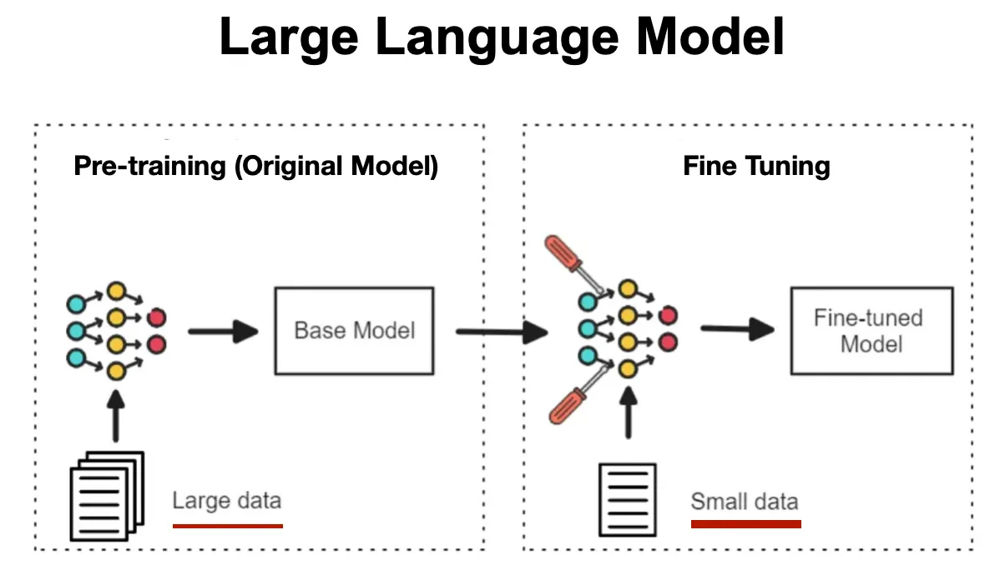
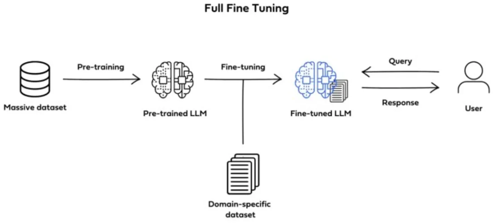
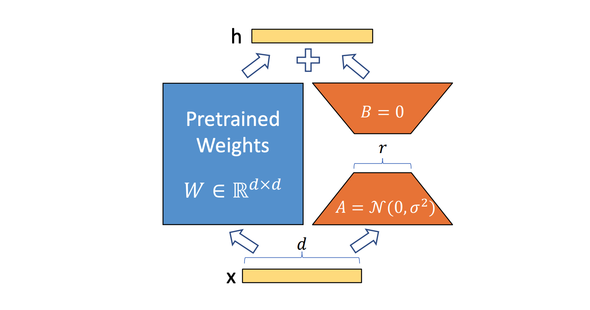

在构建 AI 应用的过程中，**大语言模型（LLM）的微调**是企业和开发者实现“定制化能力”的核心手段。随着行业快速发展，微调技术已经从最早的传统全参数微调，演进到高效、低成本的多种方法，比如 LoRA、QLoRA、Adapters、指令微调（SFT）、奖励模型训练（RM）与 RLHF 等等。

本文将系统介绍主流微调方法，并对比它们的优缺点，最后给出“什么场景适合什么方法”的决策指南，帮助您在项目中做出正确选择。

## 为什么需要微调 LLM？

预训练大模型虽然功能强大，但在具体业务中往往会出现：

* 行业术语理解不够（如金融、法律、医疗）
* 回答不符合企业风格或业务逻辑
* 需要模型具备专门技能（如 SQL 生成、代码风格限定）
* 数据结构化能力不佳
* 多轮对话表现不符合行业预期

因此 —— **您需要微调**。

## 主流微调方法概览

### 1. 全参数微调（Full Fine-tuning）

**原理：**
更新模型中的所有参数（数十亿级），直接用业务数据对大模型做“重训练风格的修改”。

**优点：**

* 效果最好，可深度定制
* 可改变模型内在知识结构

**缺点：**

* 昂贵（训练成本高）
* 需要大量显存
* 对数据量要求大

**适用场景：**

* 超大企业、科研机构
* 需要深度改造模型知识，例如专业领域（法律、医学）的专家模型

### 2. Adapter / Prefix Tuning

**原理：**
冻结大部分模型，只在中间层插入小的“微调模块”（Adapter），只训练这些模块。

**优点：**

* 轻量、可插拔
* 多任务共存方便（一个模型挂多个 Adapter）
* 效果通常不错

**缺点：**

* 极端任务下效果不如 LoRA / 全参数

**适用场景：**

* 企业想在一个模型上运行多个不同业务
* 需要模块化、可管理的微调方式

### 3. LoRA 微调（Low-Rank Adaptation）

**原理：**
不训练大模型的全量矩阵，而是训练低秩矩阵（A、B），通过“低秩更新”改变模型行为。

这是目前最主流的微调技术。

**优点：**

* 显存需求极低
* 效果接近全参数微调
* 开源生态成熟（如 HuggingFace PEFT）

**缺点：**

* 针对极难任务时略弱于全参数微调
* 对某些结构（如 KV cache）敏感

**适用场景：**

* 绝大多数企业项目
* 指令微调、垂直领域知识注入
* 全部希望“成本可控”的模型开发

### 4. QLoRA

**原理：**
LoRA 的升级版，**把模型权重量化到 4bit**，大幅降低显存占用，同时保持高微调效果。

**优点：**

* 显存需求进一步下降
* 允许在单卡（甚至消费级 GPU）微调大型模型

**缺点：**

* 训练速度受量化影响
* 对某些任务有小幅精度损失

**适用场景：**

* 单卡/小规模设备的开发者团队
* 调研性质的快速实验
* 成本敏感型企业

### 5. SFT（Supervised Fine-tuning，监督式指令微调）

**原理：**
用成对的指令→输出的数据训练模型的行为。

**优点：**

* 建模简单，效果直观
* 对风格/格式控制非常有效

**缺点：**

* 不能保证模型“对齐”到最优行为
* 会在不稳定任务中出现幻觉

**适用场景：**

* 构建任务型模型（如客服、知识问答）
* 文本生成任务（如摘要、改写）
* 企业业务流程规范化

### 6. RM（Reward Model）+ RLHF / PPO

**原理：**
用奖励模型（Reward Model）评估 LLM 输出质量，然后用强化学习（如 PPO）调整模型行为。

**优点：**

* 能塑造“符合价值观”“更自然”的对话
* 可解决 SFT 本身的局限

**缺点：**

* 架构复杂、成本高
* 数据标注要求很高

**适用场景：**

* 构建通用助手
* 构建开放式对话大模型
* 企业要训练“高安全性、高对齐”的模型

## 微调方法对比表

| 微调方式           | 成本       | 效果    | 数据要求   | 适用场景        |
| -------------- | -------- | ----- | ------ | ----------- |
| **全参数微调**      | ⭐⭐⭐⭐⭐（高） | ⭐⭐⭐⭐⭐ | 大      | 专业领域深度定制    |
| **Adapter**    | ⭐⭐       | ⭐⭐⭐   | 中等     | 多业务挂载、模块化开发 |
| **LoRA**       | ⭐⭐       | ⭐⭐⭐⭐  | 中等     | 绝大多数应用      |
| **QLoRA**      | ⭐        | ⭐⭐⭐⭐  | 中等     | 单卡、小预算项目    |
| **SFT**        | ⭐⭐       | ⭐⭐⭐   | 需要成对数据 | 指令任务、格式化任务  |
| **RLHF / PPO** | ⭐⭐⭐⭐⭐    | ⭐⭐⭐⭐⭐ | 高      | 通用助手、用户安全对齐 |

## 不同应用场景如何选择微调方式？

### 场景 1：打造客服机器人、业务问答系统

**建议：LoRA / QLoRA + SFT**
理由：成本低、数据一般是结构化问答，效果好。

### 场景 2：法律、医疗等专业知识注入

**建议：全参数微调 或 LoRA 微调 + 大规模领域语料**
理由：需要深度学习专业知识。

### 场景 3：企业想统一不同部门的 AI 角色

**建议：Adapter**
理由：一个模型挂多个部门的“工作流”。

### 场景 4：构建 ChatGPT 类通用对话助手

**建议：SFT → RM → RLHF（经典 pipeline）**
理由：需要安全性、价值观对齐、对话自然度。

### 场景 5：预算有限但想训练自己的模型

**建议：QLoRA**
理由：单卡即可训练，大幅降低门槛。

### 场景 6：生成类任务（写作、摘要、改写）

**建议：LoRA + SFT**
理由：格式、风格任务的最佳方案。

## 总结

大语言模型微调方法众多，并不存在“最好的方法”，只有“最适合的方案”。
选择微调方式时，可以按以下三条原则：

1. **看预算** → 小预算选 QLoRA / LoRA
2. **看任务类型** → 结构化任务用 SFT，通用对话用 RLHF
3. **看效果需求** → 专业领域深度需求选全参数微调
