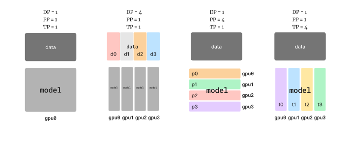
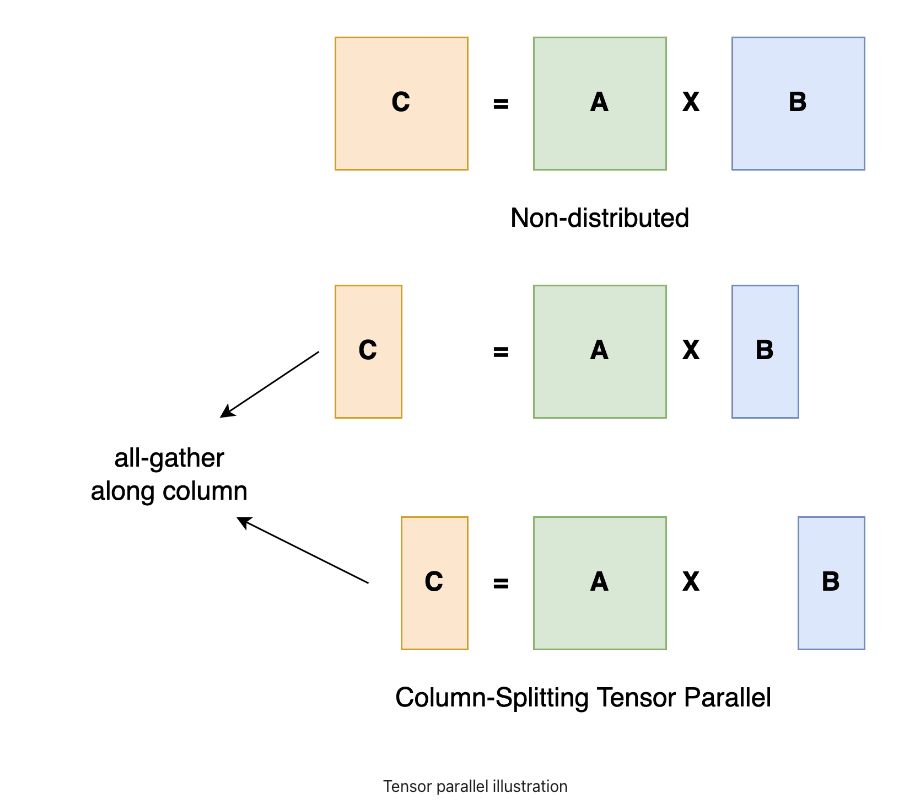
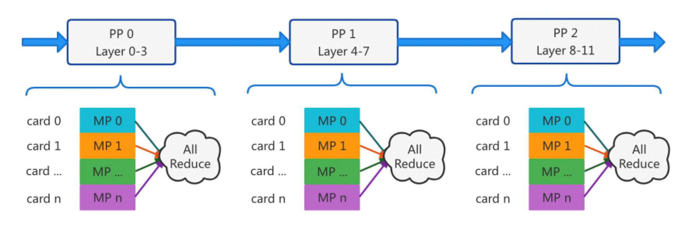

当大语言模型的参数规模跨过几十亿门槛之后，一个事实变得不可回避：**单卡时代已经结束**。无论是训练还是推理，模型本身的参数规模、KV Cache 的增长速度，以及真实业务中并发请求带来的显存与算力压力，都决定了大模型必须运行在多 GPU、甚至多节点的环境中。


然而，**用多张卡跑模型**并不是一个简单的资源堆叠问题。在实践中，工程团队很快会发现：**不同的拆分方式，带来的性能表现差异可能是数量级的**。有的配置 TTFT 极低，却在高并发下迅速失速；有的方案吞吐惊人，却难以满足在线服务对延迟的要求；还有一些组合在理论上看似合理，却在真实硬件拓扑下被通信成本完全吞噬。

在训练与推理阶段，业界逐步沉淀出四类核心并行策略：

* **TP（Tensor Parallelism，张量并行）**
* **DP（Data Parallelism，数据并行）**
* **PP（Pipeline Parallelism，流水线并行）**
* **EP（Expert Parallelism，专家并行，主要用于 MoE）**



## 大语言模型四种核心并行策略基础

### Tensor Parallelism（TP）：算子级拆分

核心思想：将单层内部的矩阵计算（如 Linear / Attention）沿维度切分到多张 GPU 上并行计算。

典型拆分方式：

* Linear 层按 `hidden_size` 或 `num_heads` 切分
* Attention 的 Q / K / V 或 FFN 的中间层拆分



优点：

* 单层显存占用显著下降
* 单 token 延迟较低（适合推理）

代价：

* 每一层都需要 **All-Reduce / All-Gather**
* 通信频繁，对 NVLink / IB 依赖高

适用场景：

* 单模型过大但层数不多
* 对 **TTFT（Time To First Token）**敏感的在线推理

### Data Parallelism（DP）：请求级复制

核心思想：模型完整复制到多张 GPU，每张 GPU 处理不同请求或 batch。


优点：

* 实现简单
* 无模型内部通信
* 吞吐线性扩展

代价：

* 显存需求最高（每卡一整模型）
* 单请求延迟不变

适用场景：

* 模型能放进单卡
* 离线推理 / 高并发吞吐

### Pipeline Parallelism（PP）：层级切分

核心思想：将模型按层切分到多张 GPU，请求在 GPU 间**流水线式**流动。



优点：

* 几乎无层内通信
* 显存效率高（比 DP 好）

代价：

* pipeline bubble（气泡）带来空转
* 小 batch 下延迟显著升高

适用场景：

* 超深模型（如 70B+）
* 长序列推理或训练

### Expert Parallelism（EP）：MoE 专属并行

核心思想：在 MoE（Mixture of Experts）模型中，不同 Expert 分布在不同 GPU 上，仅被激活的 Expert 参与计算。


优点：

* 参数规模大但计算稀疏
* 性能/参数比极高

代价：

* Token 路由与负载不均
* 通信模式复杂

适用场景：

* MoE 模型（如 Mixtral、DeepSeek-MoE）
* 高参数规模、可接受一定调度复杂度

## 并行策略并非互斥，而是可组合的

在真实系统中，并行策略通常**组合使用**：

| 组合方式 | 典型用途 |
| --- | --- |
| TP × DP | 推理最常见组合 |
| TP × PP | 超大模型训练 / 推理 |
| TP × EP | MoE 推理 |
| DP × EP | 高吞吐 MoE 服务 |
| TP × PP × DP | 大规模分布式集群 |

问题不在于**能不能用**，而在于：**不同组合，在真实推理负载下，性能表现差异极大。**

这正是 vLLM 非常适合做验证的原因。

## vLLM 中的并行能力概览

vLLM 是一个面向**高性能 LLM 推理**的引擎，其核心优势包括：

* 高效 KV Cache 管理（PagedAttention）
* 原生支持 **TP / PP**
* 对 DP 友好（多实例、多副本）
* MoE 模型中支持 EP（依赖模型实现）

在 vLLM 中，并行配置主要通过**启动参数 + 资源拓扑**控制。

## 基于 vLLM 的并行策略配置示例

### Tensor Parallelism（TP）

```bash
vllm serve meta-llama/Llama-2-70b-hf \
  --tensor-parallel-size 4
```

含义：

* 模型每一层被拆分到 4 张 GPU
* 适合单请求低延迟验证

### Pipeline Parallelism（PP）

```bash
vllm serve meta-llama/Llama-2-70b-hf \
  --pipeline-parallel-size 2 \
  --tensor-parallel-size 2
```

含义：

* 2-stage pipeline
* 每 stage 内 2-way TP
* 总 GPU 数 = 4

### Data Parallelism（DP）

vLLM 本身不显式声明 DP，而是通过**多实例部署**实现：

```bash
# GPU 0-3
CUDA_VISIBLE_DEVICES=0,1,2,3 vllm serve ...

# GPU 4-7
CUDA_VISIBLE_DEVICES=4,5,6,7 vllm serve ...
```

再通过上层负载均衡（如 Kubernetes / Gateway）实现 DP。

### Expert Parallelism（EP）

对于 MoE 模型（如 Mixtral）：

```bash
vllm serve mistralai/Mixtral-8x7B-Instruct \
  --tensor-parallel-size 4
```

vLLM 会自动将 Expert 分布到 TP 组内 GPU（模型内部实现 EP）。

## 如何在 vLLM 中“验证”并行组合的真实性能

### 核心评测指标

建议至少关注以下指标：

| 指标 | 含义 |
| --- | --- |
| TTFT | 首 token 延迟 |
| Tokens/s | 生成吞吐 |
| GPU 利用率 | 并行效率 |
| KV Cache 命中率 | 长上下文效率 |
| 通信开销 | TP / EP 成本 |

### 推荐对比实验矩阵

以 8 GPU 为例：

| 方案 | TP | PP | DP | 适用目标 |
| -- | -- | -- | -- | ---- |
| A | 8 | 1 | 1 | 最低延迟 |
| B | 4 | 2 | 1 | 显存均衡 |
| C | 2 | 2 | 2 | 吞吐优先 |
| D | 1 | 1 | 8 | 最大并发 |

通过固定输入长度与请求并发，对比上述方案即可得到清晰结论。

### 实际经验结论（常见规律）

* **TP 越大，TTFT 越低，但通信越重**
* **PP 提升显存利用率，但对小 batch 极不友好**
* **DP 是吞吐的唯一线性放大手段**
* **MoE 的 EP 在低并发下可能反而变慢**

## 总结

并行策略没有**最优解**，只有**最适解**，TP / DP / PP / EP 并不是竞争关系，而是：

> **在模型规模、请求模式、硬件拓扑三者约束下的工程权衡。**

vLLM 提供了一个极其适合做**并行策略验证与对比实验**的平台。真正有价值的工作不是“支持了什么并行”，而是：

* 在你的模型
* 在你的硬件
* 在你的真实请求负载下

**验证哪种组合，才是最优解。**
