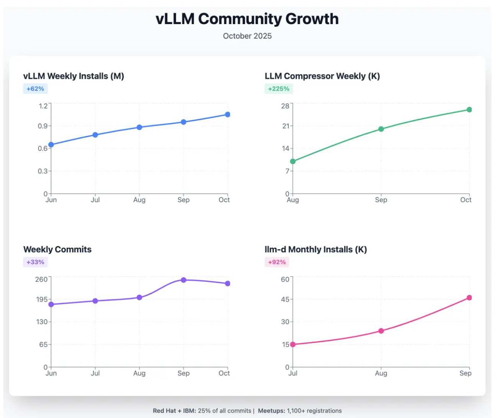
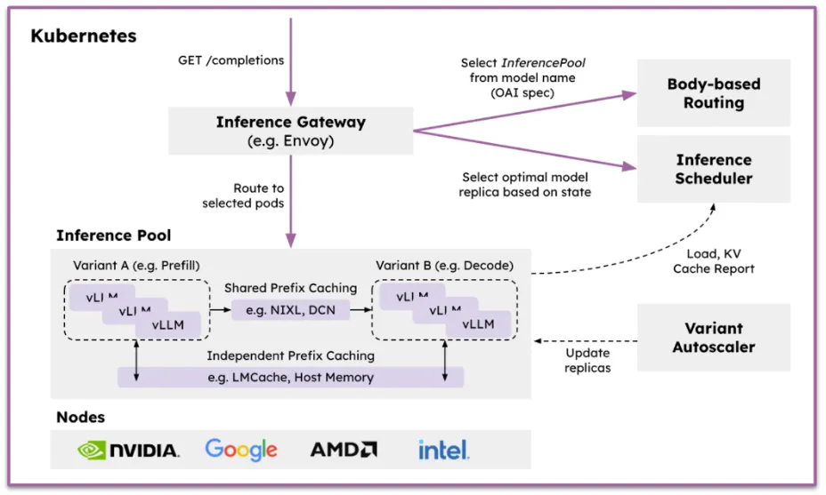
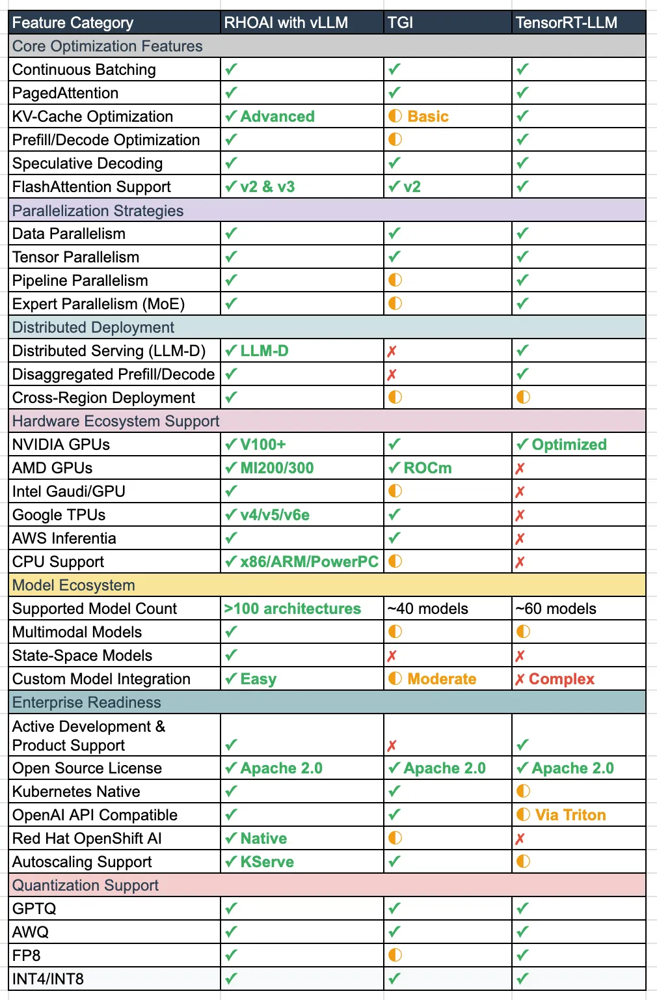

原文链接：[The Best Choice for AI Inference -> vLLM](https://medium.com/open-5g-hypercore/episode-xxx-the-best-choice-for-ai-inference-vllm-286b2af2df71)

> 注意：本译文已获得的原文作者翻译授权，为避免广告嫌疑，本文中移除了特定产品和品牌的商业宣传内容，仅保留技术特性及企业级产品功能描述，相关内容请以原文为准。


随着各组织从大语言模型（LLM）的试验阶段迈向生产部署，选择哪种推理平台就成了一项关键的业务决策。这个选择不仅影响性能，也影响灵活性、成本优化，以及应对快速变化业务需求的能力。

对于技术人员和方案架构师在评估 LLM 推理平台时，应该重点考虑以下三大因素：

1. **架构灵活性**：能否在不同硬件加速器和混合云环境间部署，而不会被某一家厂商锁定。
2. **运行可扩展性**：支持从单 GPU 部署扩展到分布式多节点的高级部署模式。
3. **生态开放性**：对最广泛的模型与内核支持，以及能与各种企业软件生态系统整合。

vLLM 在开源基础、先进内存管理能力，以及即将推出的分布式部署蓝图方面，独特地满足这些需求。与专有或硬件专用方案不同，这套组合提供了在成本、性能和运营需求上随时优化调整的自由。

本文将深入分析为何 vLLM 在其技术架构与能力上（尤其是其 KV-Cache 管理、并行策略，以及未来的 llm-d 分布式能力）提供了最可持续的生产级 LLM 部署路径。

---

## 开源优势

### 社区驱动的大规模创新

LLM 推理的发展，根本上受到开源创新的推动。过去一年半以来 [vLLM V1: A Major Upgrade to vLLM’s Core Architecture | vLLM 博客（英文版）](https://blog.vllm.ai/2025/01/27/v1-alpha-release.html)，vLLM 在支持多样模型、功能和硬件后端方面取得显著成绩，从伯克利大学的研究项目成长为开源 AI 生态中的事实标准之一 [vLLM 2024 Retrospective and 2025 Vision | vLLM 博客（英文版）](https://blog.vllm.ai/2025/01/10/vllm-2024-wrapped-2025-vision.html)。



> [vLLM 社区发展参考链接](https://inferenceops.substack.com/p/state-of-the-model-serving-communities-269)

vLLM 现在隶属于 PyTorch 基金会托管项目（[GitHub — vllm-project/vllm: A high-throughput and memory-efficient inference and serving engine for LLMs](https://github.com/vllm-project/vllm)），这保证了其长远的可持续性和治理机制。

### 企业支持与开源结合

许多企业及产品及解决方案对 vLLM 的态度类似于其对 Linux/OpenStack/Kubernetes 的策略：在社区驱动创新基础上，加入企业级支持、安全性和运维工具。这样模型即可部署在本地、公有云或混合云中，避免绑定。

这种方式带来的好处包括：

* **无厂商绑定**：用户可自由选择部署环境
* **透明开发**：安全漏洞与缺陷公开追踪与快速修复
* **社区贡献共享**：一个组织开发的功能惠及整个生态
* **可定制性**：源代码开放，可针对特定需求修改

此外，vLLM 在以下方面具备战略优势：

* **硬件无关性**：不局限于 NVIDIA，支持 AMD、Intel、TPU 等多种平台（[GitHub — vllm-project/vllm: A high-throughput and memory-efficient inference and serving engine for LLMs](https://github.com/vllm-project/vllm)）
* **快速功能迭代**：vLLM v1 对其核心模块（调度器、KV 缓存管理、worker、采样器、API 服务等）进行了全面重构（[vLLM V1: A Major Upgrade to vLLM’s Core Architecture | vLLM 博客（英文版）](https://blog.vllm.ai/2025/01/27/v1-alpha-release.html)）
* **生态整合**：原生兼容 Hugging Face、OpenAI API、Kubernetes 生态
* **成本优化**：可以为不同工作负载选择最具性价比的硬件

---

## 架构灵活性与并行化策略

### 理解并行化（Understanding Parallelization）

大型语言模型带来了特殊的扩展挑战。例如：一个拥有 70B 参数 的模型，仅其权重（使用 FP16 精度）就需约 140GB 内存，这远远超过单一卡片的容量。基于 vLLM 及相关产品和解决方案通过四种互补的并行化策略来应对这些挑战，每一种策略都解决不同类型的扩展问题。

### 数据并行（Data Parallelism, DP）：跨请求扩展

数据并行是最简单的一种扩展模式：在多个服务器上运行完整模型的多个副本，每个副本处理不同的请求批次。在这种模式下：

* **维护完整模型**：每个加速器／服务器保存整个模型的权重。
* **分配请求**：请求由负载均衡器分发给不同的副本。
* **支持线性扩展**：增加服务器数目可以线性提升吞吐量。
* **简化部署**：部署相对简单，不需要对模型进行切分（sharding）。

```code
          [负载均衡器]
               |
    ------------------------
    |          |           |
[Server1]  [Server2]  [Server3]
[Model A]  [Model A]  [Model A]
    |          |           |
[Batch 1]  [Batch 2]  [Batch 3]

关键：每台服务器都有完整的模型副本并行处理不同的请求
```

此模式与基于 KServe 的 Replica-Sets 用于模型副本服务很好的契合，能自动根据请求负载进行扩展，同时保有模型服务的简单性。

### 流水线并行（Pipeline Parallelism, PP）：按层分配

流水线并行将模型按照层（layers）分拆，不同的加速器处理不同的网络层：

* **顺序处理**：请求在 GPU 间依次通过模型层进行处理。
* **内存均衡**：内存需求在多个设备间较为均匀分布。
* **灵活部署**：部署灵活，可以跨多个节点，不一定依赖特别高速的互联。
* **微批处理**：通过微批处理（micro-batching）来保持 GPU 利用率。

```code
Request → [GPU1:NN-Layers 1-8] → [GPU2:NN-Layers 9-16] → [GPU3:NN-Layers 17-24] → Response
             ↓                     ↓                      ↓
          [Memory]              [Memory]               [Memory]
          
时间线：请求按顺序流经 GPU
```

但流水线并行在现代 LLM 应用中也面临一些限制：

* **“流水线气泡”（pipeline bubble）效率低下**：某些 GPU 在等待上游阶段的数据时处于空闲状态。
* **通信开销高**：阶段间数据传输成为瓶颈。
* **延迟敏感**：每个阶段都会增加延迟，对“第一个 token 的时间”（time-to-first-token）有负面影响。
* **对 MoE（Mixture of Experts，混合专家模型）不友好**：MoE 模型中只激活某些专家（非密集执行），这样无法很好地映射到按层划分的流水线结构中。

因为这些限制，很多生产环境更倾向于将张量并行（Tensor Parallelism）用于节点内部扩展，将数据并行（Data Parallelism）用于跨节点扩展。尽管如此，在内存受限或与其他并行策略组合使用的场景中，流水线并行仍然有价值。

### 张量并行（Tensor Parallelism, TP）：切分模型权重

当模型太大，单个加速器无法容纳其所有权重时，就使用张量并行来将模型权重拆分到多个 GPU 上：

* **水平层拆分**：每次矩阵乘法操作被分配到多个 GPU，按部分计算。
* **同步计算**：GPU 之间通过高速互联（如 NVLink、Infinity Fabric 等）进行同步和数据交换。
* **内存效率**：可使得模型可服务的规模比单个 GPU 容量大出约 4～8 倍。
* **低延迟**：如果硬件条件合适，通信开销低的话，张量并行还能保持较低的延迟。

```code
Original Matrix Operation:
[Large Weight Matrix] × [Input] = [Output]

With Tensor Parallelism:
[Weight Part 1] → GPU1 ↘
[Weight Part 2] → GPU2 → [Combine] → [Output]
[Weight Part 3] → GPU3 ↗

关键：单矩阵运算跨 GPU 拆分，需要高速互连（NVLink）
```

vLLM 的张量并行实现是硬件无关的，支持多种互联技术和不同类型的加速器。

### 专家并行（Expert Parallelism, EP）：MoE 模型中的专家分布策略

对于**混合专家模型（MoE）**，专家并行把不同的专家（experts）分配给多个 GPU 或多个节点，而不是让每个 GPU 都保存所有专家，由一个路由层（router layer）动态地将 token 分发给需要的专家：

* **分布式专家分片**：专家（experts）被分片（shard）分布在不同的 GPU／节点，使拥有上百个专家的模型能扩展到远超过单设备的内存容量。
* **动态 token 路由**：每个 token 只被发送到它应使用的一个或多个专家，以减少计算开销。
* **专家并行负载平衡（Expert Parallel Load Balancing, EPLB）**：防止某些热门专家／专家组被频繁调用导致不均匀负载，通过动态复制或分布专家，以分散负载。
* **分层调度（Hierarchical Scheduling）**：在多节点集群中，路由与复制先在节点间协调，再在节点内部的 GPU 间协调，确保整体利用率均衡且减少跨节点通信。
* **性能收益**：对大型的 MoE 模型，这种专家并行在具有高速互联（NVLink、InfiniBand 等）的环境中可以实现接近线性扩展的吞吐效率。

```code
               [Router Layer]
                      |
        ---------------------------------
        |          |          |         |
      GPU1        GPU2       GPU3      GPU4
    [Exp 1,2]   [Exp 3,4]  [Exp 5,6]  [Exp 7,8]
    
令牌流：路由器 → 选定专家 → 输出
```

### vLLM 的统一策略

vLLM 的区别与优势在于它能够无缝结合这些并行策略，为分布式推理提供高度灵活性，使组织能够：

1. **混合使用策略**：例如，在节点内部用张量并行，在节点间用流水线并行。
2. **根据硬件特性调整**：基于可用的互联速度、GPU 内存、延迟敏感性等因素做最优规划。
3. **动态扩展**：可以从单节点部署起步，随着需求增长扩展到多节点／多 GPU。
4. **保持 API 的一致性**：无论使用哪种并行策略，道线路径、调用接口等对使用者尽量透明，不需要因为并行方式不同而改很多逻辑。

这种灵活性在混合云环境中尤其关键，因为不同环境（本地、云端、不同厂商硬件）之间的配置可能大不相同。

```code
Hybrid TP+PP+EP+DP Deployment (MoE Model):

Pipeline Stage 1:               Pipeline Stage 2:              Pipeline Stage 3:
Node 1 (Attention Layers)       Node 2 (MoE FFN Layers)        Node 3 (Output Layers)
[Attn Part A] ←→ [Attn Part B]  [Router + Experts Subset]      [Out Part A] ←→ [Out Part B]
    GPU1           GPU2          GPU3: Experts 1-4                  GPU5            GPU6
         ↕ NVLink ↕              GPU4: Experts 5-8                       ↕ NVLink ↕
                                     ↕ NVLink ↕

Expert Distribution Detail (Node 2):
            [Router]
         GPU3  |  GPU4
        -------|-------
        Exp1   |  Exp5
        Exp2   |  Exp6  
        Exp3   |  Exp7
        Exp4   |  Exp8

Request Flow: → [Attention] → [MoE Layer/Router] → [Output] → Response
                              ↓
                    [Route to specific experts]

Parallelization Breakdown:
- Tensor Parallel (TP): Attention and Output layers split within nodes.
- Pipeline Parallel (PP): Different model stages across nodes .
- Expert Parallel (EP): MoE experts distributed across GPUs in Node 2.
- Data Parallel (DP): Entire pipeline can be replicated for more throughput.
```

---

## 更好的内存管理：KV-Cache（Key-Value 缓存）

### 在 LLM 推理中理解 KV-Cache

KV-Cache（键-值缓存）是 LLM 推理优化中最关键的特性之一。在注意力计算期间，模型必须访问先前 token 的表示 —— 随着序列长度增长，这个过程变得非常消耗内存。

高效的 KV-Cache 管理能决定同一硬件上能同时服务 10 个并发用户或 100 个并发用户，因为缓存复用将计算换成内存利用率。

```code
(Q * K^T) * V computation process with caching

Step 1 (Prefill Phase)
                    Keys Transpose
                          ↓
    Queries              Keys              Values            Results
       |                  |                  |                  |
    [  Q  ]      ×     [  K  ]      →    [Scores]     ×    [  V  ]    →    [Output]
       |                  |                  |                  |
      64                 64                                    64              64
                          ↓                                     ↓
                    [Storing K]                           [Storing V]
                          ↓                                     ↓
                    ←── Cache memory (stores both K and V) ──→

Step N (Decode Phase)
                    Keys Transpose
                          ↓
    Query              Cached K            Cached V          Results
       |                  |                  |                  |
    [  q  ]      ×   [K₁...Kₙ]      →    [Scores]     ×   [V₁...Vₙ]   →    [output]
    (new)             (from cache)                         (from cache)       (new)
       |                  |                  |                  |
       1                 64                                    64               1
                          ↑                                     ↑
                    ←── Reading from cache (both K and V) ──→

Key Points:
- Prefill: Computes K and V for all input tokens, stores both in cache
- Decode: For each new token, reads ALL previous K and V values from cache
- Both K and V matrices must be cached (not just V)
- Cache size grows with sequence length
```

### Prefill 阶段 vs Decode 阶段：两个截然不同的阶段

LLM 推理包含两个本质不同的阶段：

#### Prefill 阶段（Prompt 处理阶段）

* 并行处理所有输入 token。
* 计算密集型，GPU 利用率高。
* 为 prompt 中的所有 token 生成初始的 KV-Cache 条目。
* 延迟与 prompt 长度成正比。
* 大批量（larger batch sizes）带来好处。

#### Decode 阶段（Token 生成阶段）

* 一个 token 一个 token 顺序生成。
* 此阶段受限于内存带宽（memory-bandwidth bound）。
* 每新增一个 token，都要读取整个 KV-Cache 来自缓存的所有先前的 K 和 V。
* 延迟与输出 token 数量成正比。
* 依赖高效的缓存管理。

### PagedAttention：vLLM 的内存革命

vLLM 引入 PagedAttention，这是一种在 KV-Cache 管理方面的突破性设计，它将 GPU 内存视为类似操作系统中的虚拟内存（virtual memory）来处理，其关键设计包括：

* **非连续存储（Non-contiguous Storage）**：KV-Cache 块可以存储在 GPU 内存的任意地方，不必是连续的。
* **动态分配（Dynamic Allocation）**：随着序列长度增长时才分配内存。
* **内存共享（Memory Sharing）**：完全相同的 prompt 前缀（prompt prefixes）可以共享 KV-Cache 块。
* **几乎零浪费（Near-Zero Waste）**：消除静态分配中常见的内部碎片问题。

这种设计让 vLLM 可以维持更大的批量大小、更高的并发性、以及比那些依赖静态、大型 KV-Cache 缓冲区的系统更好的 GPU 利用率。

### 连续批处理（Continuous Batching）：最大化 GPU 利用率

vLLM 的连续批处理机制带来了几个举措：

* **动态请求加入**：新的请求可以在 decode 步骤之间加入正在运行的 batch。
* **提前完成处理**：已经完成的序列立即释放资源。
* **GPU 使用最优化**：通过混合处理 prefill 与 decode 操作以保持高利用率。
* **支持抢占（Preemption）**：可以暂停低优先级的请求以优先处理紧急请求。

### 在部署中的实际意义

这些内存管理上的创新在实际部署中带来了具体的效益：

1. **更高的并发性**：在相同硬件上服务更多用户。
2. **更佳的成本效率**：大幅减少基础设施需求。
3. **改善延迟**：通过高效调度缩短 time-to-first-token。
4. **灵活性**：可以处理变长的序列长度，而无需重新配置系统。

KV-Cache 优化在即将推出的 llm-d 分布式架构中变得尤为关键，因为高效的内存使用使得过去因内存约束而无法实现的新部署模式成为可能。

---

## 使用 llm-d 扩展：Kubernetes 原生的分布式推理

### 超越单服务器部署

虽然 vLLM 自身是高性能推理引擎，但在大规模生产环境中，还需要复杂的编排和智能请求调度。2025 年 5 月，红帽、Google Cloud、IBM 研究院、NVIDIA 和 CoreWeave 联手推出 llm-d，构建在 vLLM 之上的 Kubernetes 原生分布式推理栈。

llm-d 并不是 vLLM 的内置功能，而是一个补充的编排层。可以把它比作 Linux 与 Kubernetes 的关系：vLLM 负责推理引擎，llm-d 负责跨实例的调度与编排。它结合了三项开源技术：vLLM、Inference Gateway（AI 路由层）和 Kubernetes。

KServe 也在集成 llm-d，通过新的 [LLMInference CRD](https://docs.google.com/document/d/11ZQJ2VhTc42S9K4yau2dMs3Q3f4jqWJL_7Sq14C3hzY/edit?tab=t.0)，实现统一的服务接口，简化生成式 AI 的企业上手路径。



llm-d 将三大基础开源技术集成到一个统一的服务栈中：

* **vLLM** - 执行模型推理的高性能推理引擎。
* **推理网关（IGW）** - 一个官方 Kubernetes 项目，通过 AI 感知路由扩展了 Gateway API。
* **Kubernetes** - 用于部署和扩展的行业标准编排平台。

通过整合这些技术，llm-d 使企业能够在混合云环境中大规模部署 LLM 推理，并实现最快的价值实现时间和极具竞争力的性价比。

### 三项关键创新

传统的负载均衡采用简单的轮询（round-robin）路由，对所有服务器一视同仁。llm-d 的 **vLLM 感知调度程序**能够做出智能决策，将请求路由到具有匹配缓存前缀的实例，根据实例是处理计算密集型预填充操作还是内存密集型解码操作来分配负载，并使用来自 vLLM 的实时可观测数据来避免实例过载，同时优先处理低延迟路径。这种智能路由可将基础设施成本降低 30% 到 50%，同时保持延迟 SLO。

#### 解耦式服务（Disaggregated Serving）

llm-d 在生产规模上协调 vLLM 的本机分解服务（通过 KVConnector API），将预填充和解码分离到专门的工作节点中：

* **预填充工作节点**：负责计算密集型的提示处理，使用高性能 GPU（如 H100、MI300X），并可根据需求独立扩展。

* **解码工作节点**：专注于受内存带宽限制的 token 生成任务，使用具成本效益的 GPU（如 A100、L40S），并根据并发会话数进行弹性扩缩。

* **KV 缓存传输**：使用 NVIDIA NIXL 通过 UCX 提供高效的缓存移动，支持卸载到存储后端（未来交付）以及跨集群的全局缓存感知。

这允许适当规模的基础设施：昂贵的 GPU 仅用于预填充，成本优化的硬件可为数千个并发用户提供服务。

#### 分布式前缀缓存（Distributed Prefix Caching）

llm-d 将 vLLM 的前缀缓存扩展到多个实例之间，通过两种方式实现：

* **本地缓存**：在每个实例上将缓存卸载（offload）到内存或磁盘，几乎没有运维成本。

* **共享缓存（计划中）**：通过实例之间的 KV 传输实现共享，并使用全局索引实现集群范围的缓存感知。

---

#### 部署模式（Deployment Patterns）

llm-d 支持多种先进的企业部署模式：

* **异构硬件**：根据工作负载混合 GPU 供应商和代数——用于预填充的高端 GPU、用于解码的成本优化 GPU 或用于低频请求的 CPU 集群。

* **动态扩缩**：在高峰时段独立调整预填充容量，同时保持活动会话的稳定解码容量，并具有自动资源分配和故障转移功能。

* **地理分布（规划中）**：在主数据中心部署集中式预填充工作者，并在用户附近部署边缘解码工作者，以实现低延迟响应。

---

## 多加速器与混合云支持

### 摆脱硬件锁定

AI 加速器快速演进，使市场变得多样化。专优化 NVIDIA 的方案如 TensorRT-LLM 虽然性能优秀，但容易导致锁定。vLLM 的硬件中立设计则允许用户自由选择最适合的加速器。

### 广泛硬件支持

vLLM 支持 NVIDIA GPU（针对 H100 进行一流的优化，支持 V100 及更新版本的所有 NVIDIA GPU）、AMD GPU（MI200、MI300 和 Radeon RX 7900 系列）、Google TPU（v4、v5p、v5e 和最新的 v6e）、AWS Inferentia 和 Trainium（trn1/inf2 实例）、Intel Gaudi（HPU）和 GPU（XPU）以及支持 x86、ARM 和 PowerPC [vLLM 2024 Retrospective and 2025 Vision | vLLM 博客（英文版）](https://blog.vllm.ai/2025/01/10/vllm-2024-wrapped-2025-vision.html)。

这种广泛支持带来以下战略优势：

#### 成本优化

* 选择 AMD MI300X，在特定工作负载下实现高性价比。
* 使用 AWS Inferentia，在 AWS 上进行经济高效的推理。
* 在低吞吐量用例中，可部署在现有 CPU 基础架构上。

#### 供应链弹性

* 避免依赖单一 GPU 供应商的可用性。
* 通过多种选择协商更优惠的价格。
* 根据区域硬件可用性进行调整。

#### 工作负载匹配

* NVIDIA H100 可实现最佳性能。
* AMD GPU 适用于开源部署。
* TPU 适用于 Google Cloud 部署。
* Intel Gaudi 适用于特定企业协议。

### 混合云部署模式

在企业级产品及解决方案中，vLLM 支持真正的混合云：

#### 本地核心

* 在本地基础架构上处理敏感数据。
* 满足合规性要求的工作负载。
* 可预测的基线负载容量。

#### 云爆发式扩展

* 利用云资源处理峰值负载。
* 试用新硬件（H100s、TPU v6e）。
* 无需基础设施投资即可实现地域扩展。

#### 边缘推理

* 部署在适合边缘计算的硬件上。
* CPU 或更小的 GPU 推理。
* 与集中管理集成。

---

## 统一运维跨环境

借助企业级产品的相关功能，用户可从单一控制平面管理全部部署（公有云 + 私有云），主要从一下几个方面考虑。

* **单一控制平面**：通过统一界面管理所有部署。
* **一致的 API**：跨环境实现相同的应用程序集成。
* **统一监控**：跨混合部署的聚合指标。
* **策略执行**：一致的安全和合规策略。

---

## 模型生态与兼容性

### 支持广泛的开源模型体系

随着人工智能“淘金热”步伐的加快，vLLM 已发展到支持[超过 100 种模型架构](https://docs.vllm.ai/en/stable/models/supported_models.html#text-generation)的高性能推理：涵盖几乎所有著名的开源大型语言模型（LLM）、多模态模型（图像、音频、视频）、编码器-解码器模型、推测解码模型、分类模型、嵌入模型和奖励模型。[vLLM 2024 Retrospective and 2025 Vision | vLLM 博客（英文版）](https://blog.vllm.ai/2025/01/10/vllm-2024-wrapped-2025-vision.html)。与专注于有限模型系列的专业解决方案相比，这种全面的支持具有根本性的优势。

### 不只是传统 LLM

vLLM 的架构支持更多样的模型类型：

#### 语言模型

* Llama 系列。
* Mistral 和 Mixtral 多模态模型。
* Google 的 Gemma 模型。
* IBM 的 Granite 系列。
* 阿里巴巴的 Qwen 模型。

#### 多模态模型

* 视觉-语言模型（LLaVA, Qwen-VL）。
* 文档理解模型。
* 音频-语言模型。
* 视频理解能力。

#### 专用架构

* 状态空间语言模型的生产支持，探索非 Transformer 语言模型的未来。[vLLM 2024 Retrospective and 2025 Vision | vLLM 博客（英文版）](https://blog.vllm.ai/2025/01/10/vllm-2024-wrapped-2025-vision.html)。
* 混合专家（MoE）模型。
* 编码器-解码器架构。
* 嵌入和重排序模型。

---

## 模型集成简易流程

将新模型加入 vLLM 通常包括以下步骤：

1. **模型架构定义**：使用熟悉的 PyTorch 模式实现。
2. **Attention 后端集成**：利用现有的优化内核。
3. **Tokenizer 支持**：兼容 Direct Hugging Face。
4. **配置映射**：基于标准 YAML 的配置。

这样的标准化流程意味着组织能更快将新模型投入生产。例如，在 2025 年 8 月 GPT-OSS 发布后不久，vLLM 的 [v0.11.0 版本](https://github.com/vllm-project/vllm/releases/tag/v0.11.0)就加入了对其生产部署的支持。

---

## 与 Hugging Face 生态整合

vLLM 与 Hugging Face 的原生兼容带来了便捷性：

### 直接模型加载

* 直接从 Hugging Face Hub 和/或兼容 S3 的对象存储后端（例如 MinIO）加载模型。
* 支持私有模型库。
* 自动权重转换处理。

### 分词器兼容性

* 使用现有的分词器实现。
* 支持自定义分词器。
* 快速分词器优化

### 配置保存

* 尊重特定于模型的配置。
* 支持自定义模型参数。
* 兼容经过微调的变体。

---

## 生产级模型管理

在一些企业级产品和方案中增加了模型生命周期的企业功能：

### 模型注册集成

* 已部署模型的版本控制。
* A/B 测试功能。
* 回滚机制。

### 模型监控

* 每个模型的性能跟踪。
* 使用情况分析和成本归因。
* 偏差检测功能。

---

## 面向未来的模型支持

模型创新速度极快，推理平台必须具备适应能力：

### 社区贡献

* 活跃的社区不断添加新模型。
* 供应商中立的开发流程。
* 快速集成突破性架构。

### 灵活的架构

* 模块化设计支持新的模型范式。
* 不受特定模型假设的约束。
* 为后转型架构做好准备。

### 企业验证

* 企业的测试和认证流程。
* 模型工件的安全扫描。
* 跨硬件性能验证。

这种全面的模型支持确保组织能够在新模型出现时立即采用它们，而无需进行平台迁移或架构更改，这是人工智能领域持续快速发展的一项关键能力。

---

## 使用企业级产品进行企业部署

### 从第一天起就是生产级

大多数企业级产品提供了一个灵活、可扩展的 MLOps 平台，提供构建、部署和管理 AI 应用的工具。它采用开源技术构建，为团队提供值得信赖且操作一致的功能，用于实验、模型服务和交付创新应用。了解更多关于企业级产品如何应对这一挑战的信息。

### 与 KServe 的整合：智能模型服务

在许多产品和方案中对 vLLM 与 KServe 的集成提供了企业级服务功能：

#### GenAI 功能

* 使用 vLLM 服务运行时进行多节点/多 GPU 推理。
* 通过 vLLM + LMCache 集成卸载键值缓存。
* 通过模型缓存高效重用模型。
* 集成 KEDA，允许基于外部指标自动扩缩。
* 通过与 Envoy AI Gateway 集成实现速率限制和请求路由。
* 通过 LLMInferenceService CRD 访问 llm-d 功能。

#### 高级自动扩缩

* 基于请求的扩缩，实现资源利用率优化。
* 缩减​​至零功能，实现成本优化。
* 基于流量模式的预测性扩缩。
* 多指标扩缩（GPU 利用率、队列深度、延迟）。

#### 流量管理

* 金丝雀部署，确保模型更新安全。
* 蓝绿部署，实现即时回滚。
* A/B 测试，用于模型比较。
* 影子流量，用于验证。

#### 服务网格集成

* 使用 Istio 进行端到端加密。
* 高级路由和负载均衡。
* 熔断和重试逻辑。
* 用于调试的分布式跟踪。

#### 自动化运维

* 健康检查和自动恢复。
* 资源优化建议。
* 自动化证书管理。
* 日志聚合和分析。

### 安全与合规

在企业部署中，必须重视安全：

#### 访问控制

* RBAC 与企业身份提供商集成。
* 模型级访问权限。
* API 密钥管理。
* 所有操作的审计日志记录。

#### 数据保护

* 静态和传输中加密。
* 私有端点选项。
* 网络策略实施。
* 合规性报告工具。

#### 供应链安全

* 签名容器镜像。
* SBOM（软件物料清单）生成。
* 漏洞扫描。
* 基于策略的部署控制。

### MLPerf 验证的性能

一些企业级解决方案和产品与众多知名服务器原始设备制造商（OEM）合作，使用搭载 NVIDIA GPU 和 vLLM 推理运行时的产品发布了令人印象深刻的 MLPerf 推理结果，在应对这一挑战方面取得了重大进展。加速生成式 AI 的采用，这些结果验证了：

* 规模化生产级性能。
* 高效的资源利用率。
* 负载下一致的延迟。
* 多实例协调能力。

### 集成可观测性

无需额外工具即可进行全面监控：

#### 指标和仪表板

* 预建 Grafana 仪表板，用于 vLLM 指标。
* 预建 Grafana 仪表板，用于驱动路由决策的请求调度程序指标。
* 令牌生成率和延迟。
* GPU 利用率和内存使用率。
* 队列深度和拒绝率。

#### 警报和响应

* SLA 违规自动警报。
* 与企业监控系统集成。
* Runbook 自动化功能。
* 容量规划洞察。

### 成本管理与优化（未来交付）

专为企业成本控制设计的功能：

* **计费/显示**：按团队或项目跟踪使用情况。
* **资源配额**：防止成本失控。
* **竞价型实例支持**：降低批量工作负载的成本。
* **空闲检测**：自动缩减未使用的资源。

这个企业级平台将 vLLM 从高性能推理引擎转变为完整的生产解决方案，可用于关键任务部署。

---

## 特性对比：vLLM vs TGI vs TensorRT-LLM

✓ = 全面支持，◐ = 部分/有限支持，✗ = 不支持



---

## 企业级产品与开源 vLLM 的主要区别

* 硬件灵活性：最广泛的加速器支持，包括 AMD、Intel、Google TPU 和 CPU。
* 模型生态系统：支持超过 100 种模型架构，而其他替代方案仅有 25-40 种。
* 分布式架构：即将推出的 llm-d 支持分解式预填充/解码和系统级 kv-cache 路由，以实现分布式最优扩展。
* 企业集成：企业级产品集成 KServe 自动扩展。
* 内存效率：先进的 PagedAttention 和 KV-Cache 管理。
* 开放开发：PyTorch 基金会项目，社区创新迅速。

---

## 如何作出正确选择

文中给出一个简单的决策框架：对每个判断点打 “Yes”：

* **0–2 个 “Yes”**：可考虑专用方案（若其满足你的特定需求）
* **3–5 个 “Yes”**：vLLM 在你的场景中将提供显著优势
* **6+ 个 “Yes”**：基于 vLLM 的企业级产品是战略性选择

每个决策点都涉及基本的架构约束：

* **灵活性要求**决定您是否需要与硬件无关的解决方案。
* **运营复杂性**评估简化的运营是否值得采用开源技术。
* **模型与创新**评估快速发展是否需要一个适应性强的平台。
* **长期可持续性**考虑总体拥有成本和战略风险。

---

## 战略推荐

如果你对多个维度都倾向 “Yes”，那 vLLM + 企业级产品将提供：

* **最大的灵活性**：可在任何受支持的硬件上部署。
* **优秀的运维体验**：企业级平台，复杂性极低。
* **面向未来的能力**：支支持新兴模型和架构。
* **成本优化**：为每种工作负载选择最佳硬件。
* **风险控制**：开源基础，提供企业级支持。

这些因素的融合使得 vLLM 成为构建可持续人工智能基础设施的组织的战略选择。

---

## 采纳步骤建议

### 立即阶段

* 在开发环境部署 vLLM + 企业级产品
* 用自己的模型和工作负载进行测试
* 验证硬件灵活性与性能

### 短期阶段

* 实施 KServe 的自动扩缩能力
* 建立监控与可观察性体系
* 培训团队操作流程

### 中期阶段

* 设计生产部署架构
* 若需要，实施混合云模式
* 为 llm-d 分布式架构做准备

### 长期阶段

* 优化成本（选硬件、资源调度）
* 引入更高级部署模式
* 将自己的改进贡献给社区

---

## 总结

选择 LLM 推理平台代表着一项战略承诺，它将影响您组织未来几年的人工智能能力。

我们的分析表明，企业级产品上的 vLLM 独特地满足了企业 LLM 部署的三个关键要求：

1. **灵活性**：可在任意硬件与混合云环境部署
2. **可扩展性**：先进内存管理与 llm-d 架构使资源利用效率提升 10–100 倍
3. **可持续性**：开源基础 + 企业支持，避免陷入锁定

> 虽然 TensorRT-LLM 提供了 NVIDIA 专属优化，TGI 也提供了 Hugging Face 集成，但“只有 vLLM 能够提供快速发展的 AI 领域所需的架构灵活性”。
> 凭借对 100 多种模型架构的支持、与硬件无关的设计以及 PyTorch 和 Linux 基金会的支持，->“搭载 vLLM 的企业级产品为长期成功奠定了最坚实的基础”。
