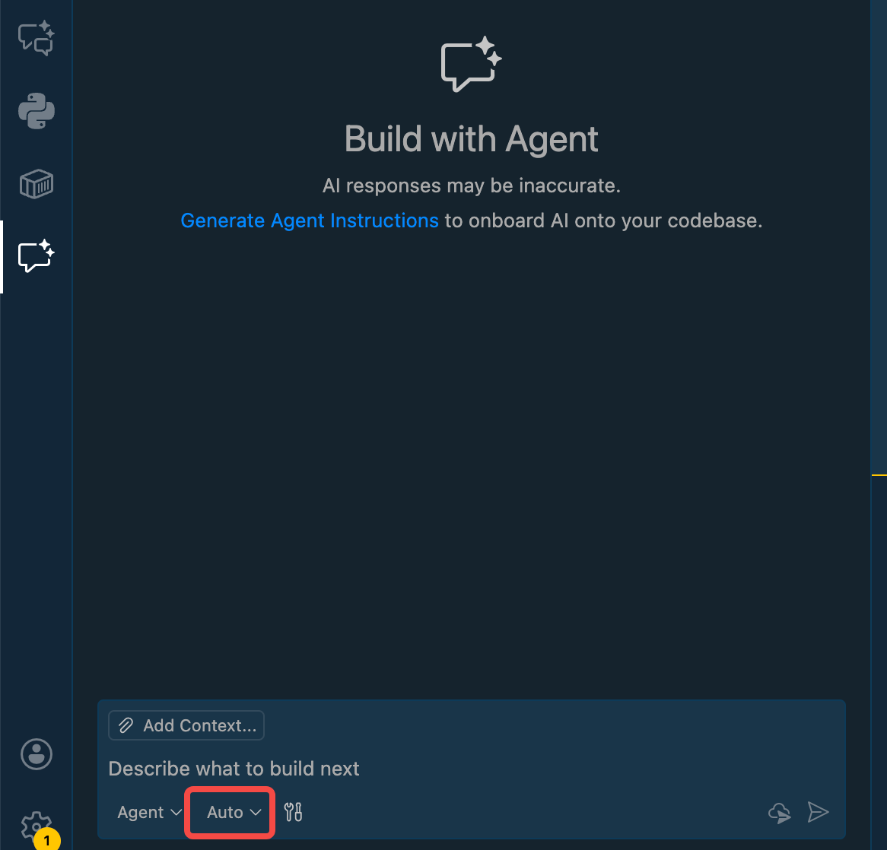
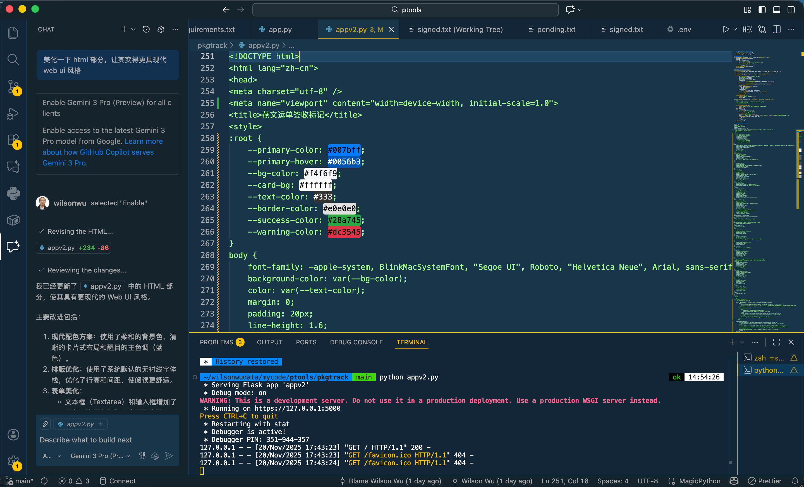

随着 AI 辅助编程工具的不断进化，GitHub Copilot 也在持续引入更多强大的模型供开发者选择。最近，GitHub Copilot 宣布支持 Google 最新的 **Gemini 3 Pro** 模型（预览版）。作为一个每天都在使用 Copilot 的开发者，我第一时间进行了体验，发现它在逻辑推理和长上下文理解方面有着令人惊喜的表现。

在这篇文章中，我将手把手教你如何在 VS Code 中切换到 Gemini 3 Pro，并分享一些使用心得。

## 为什么要关注 Gemini 3 Pro？

Gemini 3 Pro 是 Google 推出的最新一代多模态大模型。在代码生成和理解领域，它展现出了极强的竞争力：

1. **更强的推理能力**：面对复杂的算法问题或架构设计，Gemini 3 Pro 往往能给出更深入的分析。
2. **超长上下文窗口**：它能够理解更多的项目代码上下文，这对于大型项目的重构和 Bug 修复至关重要。
3. **响应速度**：尽管模型参数巨大，但在 Copilot 中的响应速度依然非常流畅。

## 如何在 GitHub Copilot 中启用 Gemini 3 Pro

启用过程非常简单，只需要确保你的 VS Code 和 Copilot 插件是最新版本。

### 步骤 1：更新环境

确保你的 Visual Studio Code 和 GitHub Copilot Chat 扩展都已经更新到最新版本。通常 VS Code 会自动更新，但你也可以手动检查一下。

### 步骤 2：打开 Copilot Chat

在 VS Code 侧边栏点击 GitHub Copilot 图标，打开聊天窗口。

### 步骤 3：切换模型

在聊天输入框的下方，你会看到当前使用的模型名称（通常默认是 Auto 或 GPT-4o）。

点击模型名称，在弹出的下拉菜单中，选择 **Gemini 3 Pro (Preview)**。

一旦选中，你就可以开始使用 Gemini 3 Pro 进行对话了！

看看他的效果吧！

## 实战体验：Gemini 3 Pro 强在哪里？

### 1. 复杂逻辑的代码解释

我尝试让它解释一段复杂的异步并发控制代码。Gemini 3 Pro 不仅解释了代码的表面含义，还指出了其中潜在的死锁风险，并给出了优化建议。这种“多想一步”的能力在 Code Review 时非常有帮助。

### 2. 跨文件上下文理解

在处理一个涉及多个模块的重构任务时，我将相关的几个文件都添加到了上下文中（使用 `@workspace` 或手动引用）。Gemini 3 Pro 能够很好地串联起这些文件之间的依赖关系，生成的修改建议很少出现“幻觉”或引用不存在的变量。

## 总结

GitHub Copilot 引入 Gemini 3 Pro 为开发者提供了更多的选择。不同的模型有不同的“性格”和优势领域。我建议大家在处理不同类型的任务时可以尝试切换模型：

* **日常简单代码补全**：默认模型通常够快够用。
* **复杂架构设计或疑难 Bug 排查**：试试 **Gemini 3 Pro**，它可能会给你带来新的思路。

快去试试吧，感受一下 Google 最新 AI 模型的编程实力！
