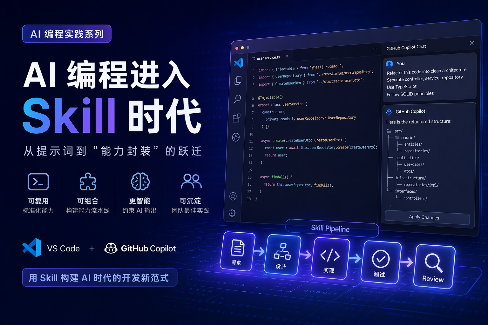

在过去一年里，AI 编程的主流交互方式经历了一个明显演进：

> Prompt → Prompt Engineering → Context Engineering → **Skill（能力封装）**

如果说 Prompt 是一次性调用模型能力，那么 **Skill 本质上是在构建“可复用的智能能力模块”**，它让 AI 从“会回答问题”，进化为“能执行任务”。

这篇文章将系统讲清：

* 什么是 AI 编程中的 Skill
* Skill 与 Prompt 的本质区别
* 如何在 VS Code + GitHub Copilot Chat 中使用 Skill 思维
* 实战案例（工程级）

## 什么是 Skill？

在 AI 编程语境下，**Skill = 结构化提示 + 上下文 + 执行约束 + 输出格式**

可以用一个更工程化的定义：

```text
Skill = f(Instruction, Context, Constraints, Output Schema)
```

它不是一句 prompt，而是一个“可复用的能力接口”。

### 对比理解

| 方式                 | 特点   | 问题          |
| ------------------ | ---- | ----------- |
| Prompt             | 临时输入 | 不可复用、不稳定    |
| Prompt Engineering | 优化表达 | 仍然是一次性      |
| Skill              | 能力封装 | 可复用、可组合、可治理 |

## 为什么 Skill 很重要？

在实际开发中，AI 使用很快会遇到几个瓶颈：

### 1. Prompt 不稳定

同一个问题，换个说法结果不同

### 2. 团队无法复用经验

每个人都有自己的“私有 prompt”

### 3. AI 输出不可控

格式、风格、边界难以统一

## Skill 的价值

* **标准化能力**
* **沉淀团队最佳实践**
* **降低认知负担**
* **提升输出一致性**

本质上：Skill 是 AI 时代的“函数”或“API”

## VS Code 中的 Skill 实现方式

虽然 VS Code 本身没有官方“Skill”概念，但可以通过以下机制实现：

### 1. `.github/copilot-instructions.md`

这是最接近“全局 Skill”的机制。

作用：

* 为 Copilot 提供**长期上下文**
* 约束 AI 的行为方式

示例：

```markdown
# Backend Coding Guidelines

- Use clean architecture
- Follow RESTful API design
- Add unit tests for all services
- Use dependency injection

# Code Style

- Prefer TypeScript over JavaScript
- Use async/await instead of callbacks
```

这相当于一个“全局 Skill 注入器”

### 2. 项目级 Skill（README / project.md）

你可以在项目中定义：

```markdown
# AI Skill: API Generator

When generating APIs:
- Use OpenAPI 3.0 spec
- Include request/response schema
- Add validation rules
- Provide curl examples
```

### 3. 会话级 Skill（Copilot Chat）

在 Chat 中你可以定义一次性 Skill：

```text
You are a senior backend architect.

Task:
- Refactor code to hexagonal architecture
- Keep business logic pure
- Extract adapters

Output:
- Folder structure
- Example code
```

## GitHub Copilot Chat 中的 Skill 用法

Copilot Chat 是 Skill 最直接的使用场景。

下面给你几个**工程级实战例子**。

### 示例 1：代码重构 Skill

#### 输入（Skill）

```text
Act as a senior software architect.

Refactor this code:
- Apply clean architecture
- Separate domain, application, infrastructure
- Add dependency inversion

Output:
1. Folder structure
2. Refactored code
3. Explanation
```

#### 效果

AI 不再只是“改代码”，而是：

* 输出结构设计
* 给出分层方案
* 解释设计决策

从“补全工具”变成“架构助手”

### 示例 2：测试生成 Skill

```text
You are a QA engineer.

Generate unit tests:
- Use Jest
- Cover edge cases
- Include mocks
- Ensure >80% coverage

Output:
- Test file
- Coverage explanation
```

优势：

* 输出结构稳定
* 测试风格统一
* 可团队复用

### 示例 3：API 文档生成 Skill

```text
Act as an API documentation generator.

Given code:
- Extract endpoints
- Generate OpenAPI spec
- Add request/response examples

Output in YAML
```

直接产出可用 API 文档

### 示例 4：代码评审 Skill（强烈推荐）

```text
Act as a senior code reviewer.

Review this code:
- Check performance issues
- Identify security risks
- Suggest improvements

Output:
- Issues list
- Severity level
- Fix suggestions
```

这个 Skill 在团队中极其高价值

## 进阶：Skill 组合（Skill Pipeline）

真正强大的不是单个 Skill，而是**Skill 组合**：

```text
需求 → API Skill → 实现 Skill → 测试 Skill → Review Skill
```

形成一个 AI 开发流水线：

1. 生成 API
2. 生成实现
3. 生成测试
4. 自动 review

本质：AI 驱动的 Dev Pipeline

## 最佳实践

### 1. Skill 必须结构化

不要写：

```text
帮我优化代码
```

要写：

```text
Optimize code:
- Reduce time complexity
- Improve readability
- Add comments

Output:
- Before/After
- Explanation
```

### 2. 强制输出格式

```text
Output in JSON:
{
  "issues": [],
  "fixes": []
}
```

这对自动化极其重要

### 3. 限定角色（Role Prompting）

```text
Act as:
- Staff Engineer
- Security Expert
- Performance Engineer
```

### 4. Skill 应该可复制

建议统一放在：

* `.github/copilot-instructions.md`
* `docs/ai-skills.md`
* 内部 wiki

## Skill vs Agent（很多人会混淆）

| 概念    | 本质             |
| ----- | -------------- |
| Skill | 单一能力           |
| Agent | 多 Skill + 自动决策 |

Skill 是积木
Agent 是机器人

## 总结

AI 编程正在从：

> “怎么问 AI” → “怎么设计 AI 能力”

Skill 的出现意味着：

* Prompt 不再是核心
* **能力设计才是核心**
* AI 正在变成“开发基础设施”

> 未来优秀的工程师，不只是写代码的人，而是**设计 AI 能力的人**
