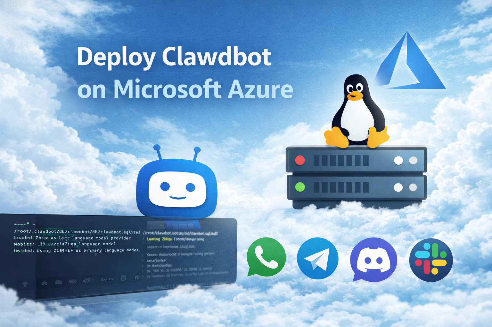
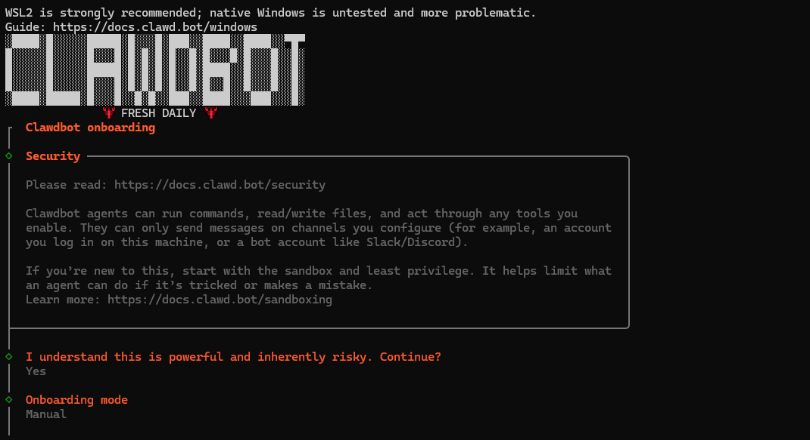
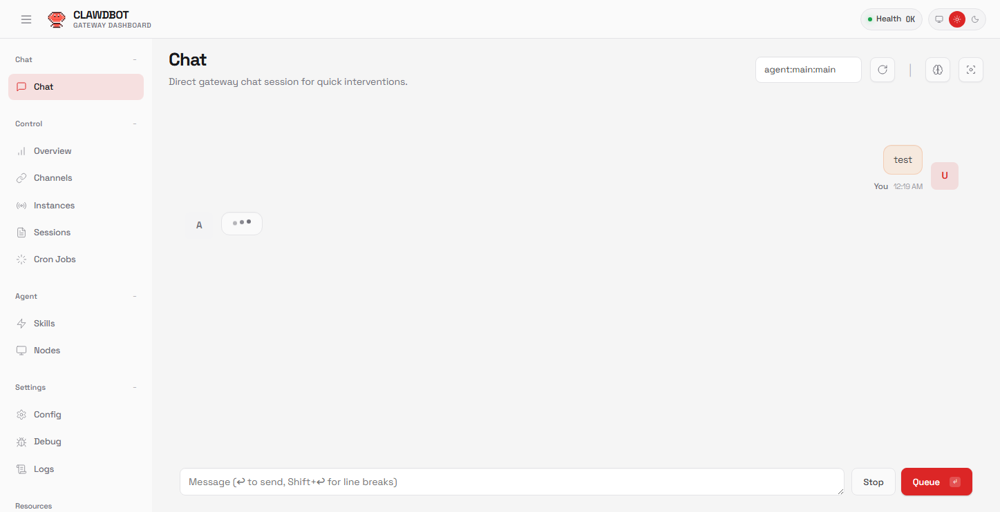

随着生成式 AI 与智能代理的快速发展，自托管的智能系统正变得越来越受开发者和技术团队关注。**Clawdbot** 就是这样一款开源、可自托管的个人 AI 助手，它不仅能与用户进行对话，还能执行任务、集成消息平台、提供自动化能力，并可部署在云平台上如 Azure。本文将逐步介绍 Clawdbot 的能力、架构以及如何在 **Microsoft Azure** 上部署并开始使用它。

## 什么是 Clawdbot

**Clawdbot** 是一个开源的个人 AI 助手项目，本质上是一个智能代理框架，它可以：

* 与多种消息平台进行交互，包括 WhatsApp、Telegram、Discord、Slack、Microsoft Teams 等。
* 承担智能对话、任务执行、自动化工作流的角色，而非单纯聊天机器人。
* 支持在本地或自托管服务器上运行，数据默认保存在本地，增强隐私保护。
* 通过插件/技能扩展，实现日程提醒、文件管理、邮件处理、代码生成等功能。

Clawdbot 的核心由 **Gateway、Providers（平台接入）、Agents/Skills（智能任务执行单元）**构成。Gateway 负责消息总线、Providers 负责与各消息平台对接，Agents/Skills 则实际执行用户请求。

## Clawdbot 的主要特性

1. **多平台消息接入**
   Clawdbot 支持通过连接聊天平台 API，接收来自 WhatsApp、Telegram、Discord、Signal、Slack、Microsoft Teams 等消息，并将这些消息传递给 AI 模型进行处理。

2. **隐私和数据控制**
   与云端托管的聊天 AI 不同，Clawdbot 可以运行在你自己的服务器或 VPS 上，所有对话历史、配置、凭据都可以按需存储和访问。

3. **自动化执行能力**
   除了对话，Clawdbot 还能执行具体任务，包括浏览器控制、文件操作、数据处理、发送提醒等，这使其成为一个更为复杂的个人助手平台。

4. **可扩展的模型支持**
   Clawdbot 支持多种 AI 模型提供者（如 OpenAI GPT、Anthropic Claude，甚至本地 LLM 服务如 Ollama）。

## 在 Azure VM 部署 Clawdbot

虽然 Clawdbot 支持本地运行或容器平台，但在以下场景中，**Azure VM 是非常合适的部署形态**：

1. **完全控制运行环境**

   * 自由选择 OS（Ubuntu / Debian）
   * 自由安装 Node.js、Docker、GPU 驱动等

2. **数据与隐私可控**

   * 所有对话记录、日志、配置文件仅存在于 VM 内
   * 不依赖第三方 PaaS

3. **适合长期运行的 Agent**

   * 7×24 小时在线
   * 可通过 systemd 或 Docker 保证自动重启

4. **可扩展性良好**

   * 可横向扩容（多 VM + 负载均衡）
   * 可纵向扩容（更大规格 CPU / GPU）

## 整体部署架构概览

在 Azure VM 上运行 Clawdbot 的典型架构如下：


## 创建 Azure VM

### VM 基础配置建议

* **OS**：Ubuntu 22.04 LTS
* **规格**：
  * 轻量使用：Standard B2s / B4ms
  * 多 Agent：D4s_v5 及以上
* **磁盘**：至少 64 GB
* **网络**：
  * 入站：22（SSH）
  * 入站：3000（或自定义 Clawdbot 端口）

### 登录 VM

```bash
ssh azureuser@<VM_PUBLIC_IP>
```

## 安装运行时环境

### 系统依赖

```bash
sudo apt update && sudo apt upgrade -y
sudo apt install -y git curl build-essential
```

### 安装 Node.js（推荐 20 LTS）

```bash
curl -fsSL https://deb.nodesource.com/setup_20.x | sudo -E bash -
sudo apt install -y nodejs
node -v
npm -v
```

## 安装 Clawdbot

### 全局 CLI + 本地运行目录

```bash
sudo npm install -g clawdbot
```

创建运行目录：

```bash
mkdir ~/clawdbot
cd ~/clawdbot
```

初始化配置：

```bash
clawdbot onboard
```

跟着步骤完成各类配置即可：



## 启动 Clawdbot

### 手动启动验证

```bash
clawdbot gateway
```

确认日志中出现：

```text
🦞 Clawdbot 2026.1.24-3 (885167d) — I speak fluent bash, mild sarcasm, and aggressive tab-completion energy.
...
16:18:27 [heartbeat] started
16:18:27 [gateway] agent model: openai-codex/gpt-5.1
16:18:27 [gateway] listening on ws://127.0.0.1:18789 (PID 36888)
16:18:27 [gateway] listening on ws://[::1]:18789
16:18:27 [gateway] log file: \tmp\clawdbot\clawdbot-2026-01-27.log
16:18:27 [browser/server] Browser control listening on http://127.0.0.1:18791/
...
```

通过浏览器打开：<http://127.0.0.1:18789/>



即可开始使用！

## 结语

Clawdbot 是一款功能强大的开源 AI 个人助手，可将 AI 交互扩展到多种消息平台，并集成丰富的执行能力。通过将 Clawdbot 部署到 Azure，你可以将它打造成一个企业级、自托管的 AI 服务，提高可用性、安全性和可扩展性。上述步骤覆盖了从创建 Azure Bot 到完整部署 Clawdbot 的全流程，希望能帮助你快速搭建并运行自己的智能助理。
