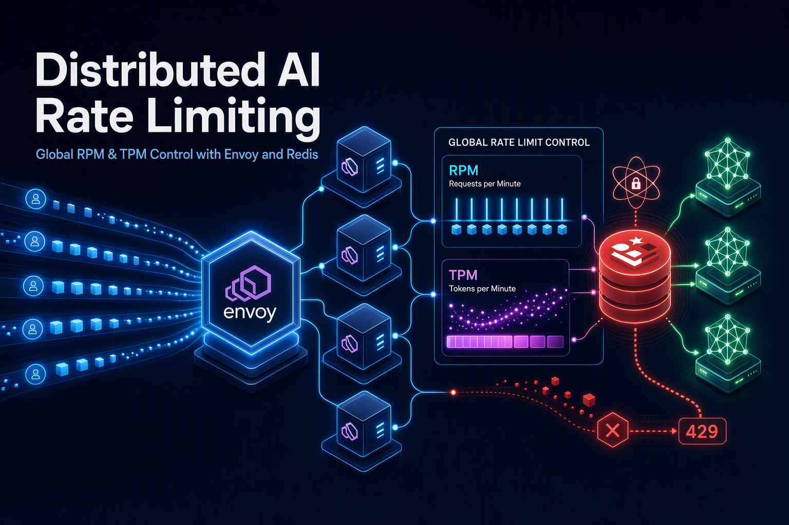

在普通 HTTP API 中，我们通常只需要限制“每分钟请求数”。但对于大模型接口，仅限制请求数量远远不够：一次请求可能只消耗几十个 Token，也可能消耗数万个 Token。

因此，一个实用的 AI 网关通常需要同时支持：

- **RPM（Requests Per Minute）**：每分钟请求数。
- **TPM（Tokens Per Minute）**：每分钟 Token 数。
- 按租户、API Key、模型或套餐分别计费。
- 多个 Envoy 实例共享同一份额度。
- 在高并发条件下避免各实例独立计数造成额度放大。
- 返回统一的 `429 Too Many Requests` 和剩余额度信息。

本文介绍如何使用 [envoyproxy/ratelimit](https://github.com/envoyproxy/ratelimit)、Redis 和 Envoy 构建一套分布式 AI 限流系统。

## 为什么不能只使用 Envoy Local Rate Limit

Envoy 提供了 Local Rate Limit Filter，但它的计数器默认位于当前 Envoy 进程中。

假设我们有 4 个 Envoy 实例，并为某个租户配置：

```text
RPM = 100
```

如果每个 Envoy 都独立维护 100 RPM，那么整个集群实际上可能放行：

```text
4 × 100 = 400 RPM
```

这显然不是我们想要的结果。

Envoy 的 Global Rate Limit Filter 可以把限流请求发送给外部 Rate Limit Service。`envoyproxy/ratelimit` 正是 Envoy 官方生态中常用的全局限流服务实现，它将计数器存放在 Redis 中。

整体架构如下：


这里增加了一个很薄的 **AI Quota Adapter**，主要用于解决两个问题：

1. 从请求体中解析模型、租户和 Token 数量。
2. 分别使用不同的 `hits_addend` 检查 RPM 和 TPM。

## 为什么 AI TPM 需要额外的适配层

Envoy 的普通限流规则通常把一次 HTTP 请求视为一次命中：

```text
hits_addend = 1
```

这适合 RPM，但不适合 TPM。

例如下面两个请求：

```text
请求 A：消耗 200 Token
请求 B：消耗 20,000 Token
```

如果两者都只增加一次计数，TPM 就没有意义。TPM 必须让一次请求按照 Token 数增加计数器：

```text
hits_addend = token_cost
```

例如：

```text
RPM 请求：hits_addend = 1
TPM 请求：hits_addend = 3200
```

Rate Limit Service 的 `hits_addend` 通常作用于整个 `RateLimitRequest`，因此 RPM 和 TPM 需要使用两次限流调用，或者由自定义适配服务组合处理。

推荐的处理顺序是：

1. 检查并增加 RPM，`hits_addend=1`。
2. RPM 允许后，再检查并增加 TPM，`hits_addend=token_cost`。
3. 任意一个返回 `OVER_LIMIT`，适配层向 Envoy 返回 429。

这种模式下，每个维度都由 Redis 原子计数，多个 Envoy 实例不会各自放大额度。

需要注意：两次调用并不是跨计数器事务。RPM 已增加后，TPM 可能拒绝请求。因此要提前明确计数语义：

- RPM 统计所有进入限流流程的请求尝试；或者
- 自行扩展服务，使用一段 Redis Lua 脚本同时检查 RPM 和 TPM。

多数系统接受第一种语义，因为它更简单，也能避免恶意用户通过大量超大请求免费消耗网关资源。

## 设计限流 Descriptor

限流维度通常包括：

- `tenant`：租户、组织或 API Key。
- `model`：模型名称。
- `metric`：`rpm` 或 `tpm`。

最终生成的 Descriptor 可以表示为：

```text
tenant = tenant-a
model  = gpt-4.1
metric = rpm
```

以及：

```text
tenant = tenant-a
model  = gpt-4.1
metric = tpm
```

这样可以实现：

```text
tenant-a + gpt-4.1 -> 60 RPM
tenant-a + gpt-4.1 -> 100,000 TPM
```

如果不希望按模型拆分额度，也可以只保留：

```text
tenant + metric
```

例如所有模型共享同一份租户额度。

## 配置 envoyproxy/ratelimit

创建 `config/config.yaml`：

```yaml
domain: ai-gateway

descriptors:
  - key: tenant
    descriptors:
      - key: model
        descriptors:
          - key: metric
            value: rpm
            rate_limit:
              unit: minute
              requests_per_unit: 60

          - key: metric
            value: tpm
            rate_limit:
              unit: minute
              requests_per_unit: 100000
```

这里 `tenant` 和 `model` 没有指定固定值，可用于根据请求中的 Descriptor 值进行分桶。实际部署前，应使用所选 ratelimit 版本提供的配置校验工具检查配置。

适配层发送 RPM Descriptor：

```json
[
  {"key": "tenant", "value": "tenant-a"},
  {"key": "model", "value": "gpt-4.1"},
  {"key": "metric", "value": "rpm"}
]
```

发送 TPM Descriptor：

```json
[
  {"key": "tenant", "value": "tenant-a"},
  {"key": "model", "value": "gpt-4.1"},
  {"key": "metric", "value": "tpm"}
]
```

Descriptor 的顺序必须与配置中的嵌套路径一致。

### 不同套餐额度

如果不同租户拥有不同额度，可以增加套餐维度：

```text
tenant -> plan -> model -> metric
```

例如：

```yaml
domain: ai-gateway

descriptors:
  - key: tenant
    descriptors:
      - key: plan
        value: standard
        descriptors:
          - key: model
            descriptors:
              - key: metric
                value: rpm
                rate_limit:
                  unit: minute
                  requests_per_unit: 60

              - key: metric
                value: tpm
                rate_limit:
                  unit: minute
                  requests_per_unit: 100000

      - key: plan
        value: enterprise
        descriptors:
          - key: model
            descriptors:
              - key: metric
                value: rpm
                rate_limit:
                  unit: minute
                  requests_per_unit: 1000

              - key: metric
                value: tpm
                rate_limit:
                  unit: minute
                  requests_per_unit: 2000000
```

请求中的 `tenant` 用于隔离计数器，`plan` 用于选择额度。

不要只使用 `plan` 作为计数维度，否则所有 Standard 用户可能共享同一个计数器。

## 五、使用 Docker Compose 部署

下面是一个简化示例：

```yaml
services:
  redis:
    image: redis:7-alpine
    command:
      - redis-server
      - --appendonly
      - "yes"
    volumes:
      - redis-data:/data
    ports:
      - "6379:6379"

  ratelimit:
    image: envoyproxy/ratelimit:<固定版本号>
    command: /bin/ratelimit
    environment:
      LOG_LEVEL: info

      REDIS_SOCKET_TYPE: tcp
      REDIS_URL: redis:6379

      RUNTIME_ROOT: /data
      RUNTIME_SUBDIRECTORY: ratelimit
      RUNTIME_WATCH_ROOT: "false"

      USE_STATSD: "false"
    volumes:
      - ./config:/data/ratelimit
    ports:
      - "8081:8081"
      - "6070:6070"
    depends_on:
      - redis

volumes:
  redis-data:
```

生产环境不要直接使用 `master` 或浮动标签，应固定到经过验证的 release 版本。

不同版本的镜像端口和环境变量可能存在差异，因此部署时应以对应版本仓库中的示例配置为准。

启动：

```bash
docker compose up -d
```

查看日志：

```bash
docker compose logs -f ratelimit
```

生产环境可以运行多个 ratelimit 副本：

```text
ratelimit-1 ─┐
ratelimit-2 ─┼── Redis
ratelimit-3 ─┘
```

ratelimit 服务本身可以保持无状态，只要所有副本：

- 使用相同的配置。
- 指向同一个 Redis 逻辑集群。
- 使用一致的 Redis Key 前缀或命名空间。

## AI Quota Adapter 的核心逻辑

适配层可以实现为 Envoy `ext_authz` 服务。它接收 Envoy 转发过来的请求信息，完成身份识别、Token 计算和额度检查。

下面是简化后的 Go 伪代码：

```go
func CheckAIQuota(
    ctx context.Context,
    tenant string,
    model string,
    tokenCost uint32,
) error {
    // 第一次调用：RPM
    rpmResp, err := rateLimitClient.ShouldRateLimit(
        ctx,
        &ratelimitv3.RateLimitRequest{
            Domain: "ai-gateway",
            Descriptors: []*ratelimitv3.RateLimitDescriptor{
                {
                    Entries: []*ratelimitv3.RateLimitDescriptor_Entry{
                        {Key: "tenant", Value: tenant},
                        {Key: "model", Value: model},
                        {Key: "metric", Value: "rpm"},
                    },
                },
            },
            HitsAddend: 1,
        },
    )
    if err != nil {
        return err
    }

    if rpmResp.OverallCode ==
        ratelimitv3.RateLimitResponse_OVER_LIMIT {
        return ErrRPMExceeded
    }

    // 第二次调用：TPM
    tpmResp, err := rateLimitClient.ShouldRateLimit(
        ctx,
        &ratelimitv3.RateLimitRequest{
            Domain: "ai-gateway",
            Descriptors: []*ratelimitv3.RateLimitDescriptor{
                {
                    Entries: []*ratelimitv3.RateLimitDescriptor_Entry{
                        {Key: "tenant", Value: tenant},
                        {Key: "model", Value: model},
                        {Key: "metric", Value: "tpm"},
                    },
                },
            },
            HitsAddend: tokenCost,
        },
    )
    if err != nil {
        return err
    }

    if tpmResp.OverallCode ==
        ratelimitv3.RateLimitResponse_OVER_LIMIT {
        return ErrTPMExceeded
    }

    return nil
}
```

实际代码中的 protobuf 包名和字段类型应以项目锁定的 Envoy API 版本为准。

适配层的完整处理流程如下：

```text
1. 从 Authorization/API Key 中识别 tenant
2. 从 JSON 请求体中读取 model
3. 使用模型对应的 tokenizer 计算 input_tokens
4. 根据策略计算 token_cost
5. 调用 RLS 检查 RPM
6. 调用 RLS 检查 TPM
7. 都允许：返回 OK
8. 任意超限：返回 429
```

## 在 Envoy 中接入适配层

如果适配层实现 Envoy 的 `ext_authz` gRPC 协议，可以在 Envoy 中配置：

```yaml
http_filters:
  - name: envoy.filters.http.ext_authz
    typed_config:
      "@type": type.googleapis.com/envoy.extensions.filters.http.ext_authz.v3.ExtAuthz

      transport_api_version: V3

      grpc_service:
        envoy_grpc:
          cluster_name: ai_quota_adapter
        timeout: 0.5s

      with_request_body:
        max_request_bytes: 1048576
        allow_partial_message: false
        pack_as_bytes: true

      failure_mode_allow: false

  - name: envoy.filters.http.router
    typed_config:
      "@type": type.googleapis.com/envoy.extensions.filters.http.router.v3.Router
```

对应的 Cluster：

```yaml
clusters:
  - name: ai_quota_adapter
    type: STRICT_DNS
    connect_timeout: 0.25s

    http2_protocol_options: {}

    load_assignment:
      cluster_name: ai_quota_adapter
      endpoints:
        - lb_endpoints:
            - endpoint:
                address:
                  socket_address:
                    address: ai-quota-adapter
                    port_value: 9000
```

因为 Token 计算需要读取 JSON 请求体，所以需要配置 `with_request_body`。

注意限制最大请求体，避免攻击者提交超大 Prompt 导致 Envoy 或适配层内存压力。

## TPM 应该如何计算

RPM 的定义比较简单，一次请求增加 1。

TPM 更复杂，因为请求发出时通常只知道输入 Token，尚不知道模型最终会产生多少输出 Token。

### 方案一：只计算输入 Token

```text
token_cost = input_tokens
```

优点：

- 请求开始前就能精确计算。
- 实现最简单。
- 非流式和流式接口都适用。

缺点：

- 无法限制输出 Token。
- 用户可能通过很短的 Prompt 请求大量输出。

适合将 TPM 定义为“输入 Token 配额”的系统。

### 方案二：预留最大输出 Token

```text
token_cost = input_tokens + requested_max_output_tokens
```

例如：

```text
input_tokens = 1200
max_tokens   = 4096
token_cost   = 5296
```

优点：

- 在调用模型前就能做严格准入控制。
- 不会因为输出 Token 未知而突破额度。
- 适合流式响应。

缺点：

- 实际只输出 300 Token 时仍预留了 4096 Token。
- 如果不实现退款，额度利用率会偏低。

这是最容易实现“严格不超额”的方案。

网关必须对 `max_tokens` 设置服务端上限，不能完全信任客户端：

```text
effective_max_tokens = min(client_max_tokens, server_model_limit)
```

否则客户端可以提交异常大的 `max_tokens`，让自己或整个租户迅速耗尽配额。

### 方案三：先预留，再按实际用量结算

完整思路是：

1. 请求开始时预留：

```text
input_tokens + max_output_tokens
```

2. 响应结束后得到实际输出 Token。
3. 退还未使用部分：

```text
refund = max_output_tokens - actual_output_tokens
```

但 `envoyproxy/ratelimit` 的标准限流调用主要面向正向增加计数，并不天然提供完整的“预留—提交—退款”事务模型。

如果业务必须支持精确退款，通常需要：

- 在适配层实现额外的 Redis Lua 脚本。
- 使用独立的预留记录和过期时间。
- 请求结束后进行 commit/refund。
- 使用请求 ID 保证幂等。

此时 `envoyproxy/ratelimit` 仍可负责 RPM 或基础 TPM，但结算逻辑已经属于定制配额服务。

### 方案四：流式增量扣费

对于流式输出，可以：

1. 请求开始时扣除输入 Token。
2. 每生成一批输出 Token，再增加一次 TPM 计数。
3. 一旦超过额度，终止上游流。

例如每 32 或 128 个 Token 扣一次。

这种方式需要能观察响应流，因此仅靠请求阶段的 `ext_authz` 不够，需要：

- Envoy `ext_proc`；
- Wasm Filter；
- 自定义 HTTP Filter；
- 或由 AI Gateway 自身代理并读取流式响应。

增量批次越小，控制越精确，但 gRPC 和 Redis 调用次数也越多。

## 多 Envoy 实例如何保证共享额度

假设一个租户拥有：

```text
RPM = 100
TPM = 200,000
```

请求可能随机落到不同 Envoy：

```text
Request 1 -> Envoy A
Request 2 -> Envoy B
Request 3 -> Envoy C
```

但所有限流请求最终都会访问同一套 Redis 计数器：

```text
ai-gateway / tenant-a / gpt-4.1 / rpm
ai-gateway / tenant-a / gpt-4.1 / tpm
```

因此额度是整个集群共享的，而不是每个 Envoy 各有一份。

可以横向扩展的部分包括：

- Envoy。
- AI Quota Adapter。
- envoyproxy/ratelimit。

不能随意拆分的是同一个配额 Key 的计数状态。如果使用多个完全独立的 Redis，则必须确保相同租户、模型和指标始终路由到同一个分片，否则额度又会被放大。

## 返回标准限流响应

发生超限时，适配层应向 Envoy 返回 429：

```http
HTTP/1.1 429 Too Many Requests
Content-Type: application/json
Retry-After: 12
```

响应体可以采用 OpenAI 风格：

```json
{
  "error": {
    "message": "Rate limit exceeded for tenant tenant-a",
    "type": "rate_limit_error",
    "code": "tpm_limit_exceeded"
  }
}
```

建议分别暴露 RPM 和 TPM 信息：

```http
X-RateLimit-Limit-Requests: 60
X-RateLimit-Remaining-Requests: 12
X-RateLimit-Reset-Requests: 18

X-RateLimit-Limit-Tokens: 100000
X-RateLimit-Remaining-Tokens: 24580
X-RateLimit-Reset-Tokens: 18
```

为了避免客户端形成同步重试风暴，SDK 应使用带随机抖动的指数退避：

```text
sleep = random(0, min(cap, base × 2^retry_count))
```

## “精准限流”需要明确的边界

使用 Redis 共享计数器可以解决多实例额度放大的问题，但“精准”仍然需要明确具体含义。

### 1. 它通常是固定时间窗

配置：

```yaml
unit: minute
```

通常表示分钟级固定时间窗，不等同于严格的滑动窗口。

用户可能在一个窗口结束前发送 100 次请求，并在新窗口开始后立刻再发送 100 次。从任意连续 60 秒观察，流量可能接近配置值的两倍。

因此，该方案能够保证：

> 所有 Envoy 实例共享同一个固定时间窗计数器。

但它不自动等于：

> 任意连续 60 秒都绝不超过限制。

如果业务要求严格滑动窗口，需要使用 Redis Sorted Set、滑动窗口计数器或专门的配额算法。

### 2. 输出 Token 在请求开始时未知

如果 TPM 包含输出 Token，则无法在生成之前知道最终消耗量。

所谓严格控制通常意味着：

- 使用 `max_tokens` 预留；或者
- 在流式生成过程中增量扣费。

单纯在响应结束后上报实际 Token，只能用于计费和统计，不能阻止当前请求突破 TPM。

### 3. RPM 和 TPM 不是一个原子事务

标准 RLS 请求中的 `hits_addend` 是统一的，而 RPM 和 TPM 需要不同增量，因此通常需要两次调用。

如果必须保证“RPM 和 TPM 同时检查、同时增加、任意失败都不修改”，需要定制服务并使用单个 Redis Lua 脚本完成事务。

## 生产环境中的关键问题

### 1. 请求重试和重复扣费

Rate Limit Service 的计数调用通常不是业务级幂等操作。

如果适配层因为超时重试同一个请求：

```text
第一次调用已经写入 Redis，但响应丢失
第二次调用再次增加计数
```

就会产生重复扣费。

建议：

- 限流调用不要盲目自动重试。
- 使用 Envoy 的 `x-request-id` 或业务请求 ID。
- 对严格计费场景，在适配层中实现请求幂等记录。
- 幂等记录过期时间至少覆盖限流窗口和最大请求时长。

### 2. 故障时 Fail Open 还是 Fail Closed

当 Redis 或 ratelimit 服务不可用时，可以选择：

**Fail Open：**

```text
限流系统不可用时继续放行
```

优点是可用性高，缺点是可能导致成本失控。

**Fail Closed：**

```text
限流系统不可用时拒绝请求
```

优点是保护成本，缺点是限流组件故障会影响业务。

AI 推理通常成本较高，面向外部用户的付费 API 更适合 Fail Closed。内部低风险环境可以考虑短时间 Fail Open，并配合熔断和告警。

### 3. Tokenizer 必须与模型匹配

不同模型的 Tokenizer 可能不同。不能使用简单的字符数除以固定比例来实现严格 TPM。

应该维护：

```text
model -> tokenizer
```

例如：

```text
gpt-family       -> cl100k/o200k 类 tokenizer
llama-family     -> 对应 SentencePiece/BPE tokenizer
自定义模型        -> 模型实际 tokenizer.json
```

如果 tokenizer 不可用，可以做保守估算，但必须预留误差：

```text
estimated_tokens = ceil(raw_estimate × safety_factor)
```

### 4. 规范化模型名称

客户端可能使用：

```text
gpt-4.1
gpt-4.1-2025-04-14
my-gpt-alias
```

限流前应将它们映射到统一的配额名称：

```text
my-gpt-alias -> gpt-4.1
```

否则用户可能通过切换别名绕过同一模型的额度。

### 5. 不要信任客户端提供的 Token 数

不能让客户端直接提交：

```http
X-Token-Cost: 1
```

然后按该值扣费。

Token 数必须由可信组件计算，或者由上游模型返回后进行校验。客户端声明只能作为参考，不能作为计费依据。

### 6. 配置发布必须一致

如果多个 ratelimit 副本加载了不同配置，可能出现：

```text
副本 A：RPM 100
副本 B：RPM 200
```

即使 Redis 相同，结果也会变得不可预测。

生产环境应：

- 使用固定版本配置。
- 进行启动前校验。
- 滚动发布时保持向后兼容。
- 为配置添加版本号和监控指标。

## 监控指标

至少应监控：

### Envoy

- ext_authz 调用次数。
- ext_authz 超时和失败次数。
- HTTP 429 数量。
- 上游请求数和并发数。
- 请求体缓冲失败次数。

### AI Quota Adapter

- RPM 允许和拒绝次数。
- TPM 允许和拒绝次数。
- Token 计算耗时。
- RLS gRPC 延迟。
- Tokenizer 加载失败次数。
- 按模型和租户聚合的 Token 消耗。
- 重复请求或幂等命中次数。

### Ratelimit

- `OK`、`OVER_LIMIT`、错误数量。
- Redis 请求延迟。
- Redis 连接池使用率。
- 配置加载状态。
- 各限流规则命中次数。

### Redis

- CPU 和内存。
- 命令延迟。
- 连接数。
- Key 数量。
- Key 过期速率。
- 主从复制延迟。
- Failover 次数。

高基数租户 ID 不适合直接作为 Prometheus Label。否则租户数量较多时会产生严重的指标基数问题。按租户的详细用量更适合写入日志、ClickHouse 或专门的计量系统。

## 推荐的最终实现

对于大多数 AI API 网关，可以采用下面的组合：

```text
Envoy
  └── ext_authz
        └── AI Quota Adapter
              ├── 解析租户和模型
              ├── 使用可信 tokenizer 计算 input_tokens
              ├── 规范化并限制 max_tokens
              ├── RPM：RLS hits_addend = 1
              └── TPM：RLS hits_addend =
                       input_tokens + max_output_tokens
                        └── envoyproxy/ratelimit
                              └── Redis
```

这一方案具备以下特征：

- 多 Envoy 实例共享统一额度。
- RPM 和 TPM 分别计数。
- 支持按租户、模型、套餐隔离。
- 在请求进入模型服务之前完成准入控制。
- 通过预留最大输出 Token，保证不会因为流式输出突破 TPM。
- Envoy、适配层和 ratelimit 服务都可以横向扩展。

如果还需要按照实际输出 Token 精确结算，则在此基础上增加：

```text
预留记录 + 响应用量采集 + commit/refund + 请求幂等
```

此时系统已经从“限流服务”演进为一套完整的“分布式 AI 配额与计量服务”。

## 总结

`envoyproxy/ratelimit` 非常适合解决多 Envoy 实例之间的全局共享限流问题。它通过 Redis 集中维护计数器，避免每个网关实例独立计算额度。

对于 AI 场景，需要在标准 HTTP 限流之上增加 Token 感知能力：

- RPM 使用 `hits_addend=1`。
- TPM 使用 `hits_addend=token_cost`。
- 使用租户、模型和指标构建 Descriptor。
- 请求阶段通过输入 Token或最大输出 Token预留完成准入。
- 多 Envoy、多个适配层和多个 RLS 副本共享同一个 Redis 计数空间。

需要特别注意的是，分布式共享计数、固定时间窗、RPM/TPM 组合事务以及实际输出 Token 结算是四个不同问题。理解这些边界，才能构建一套既能保护模型成本、又能在高并发环境中稳定运行的 AI 限流系统。
