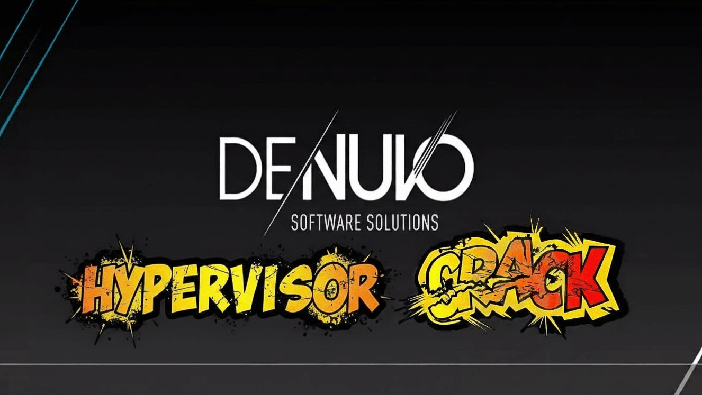

最近，单机游戏圈被一颗“深水炸弹”炸开了锅。原本号称坚不可摧的 Denuvo（D加密）阵营，在短短几周内接连失守。
《如龙 8》、《无主之地 4》以及备受瞩目的《剑星》PC 版相继传出被攻破的消息，就连国货之光《黑神话：悟空》都没有幸免遇难。

然而，这次的“攻臣”不再是传统的黑客小组，而是一个名为 Hypervisor 的新型技术手段。在白嫖党欢呼的同时，安全专家们却发出了前所未有的严厉警告：这可能是一场以出卖电脑底层控制权为代价的博弈。

## 什么是 Hypervisor 破解？（硬核科普）

传统的破解方式（如著名的 Empress）通常是“外科手术式”的：黑客通过成千上万次的调试，寻找 D 密代码中的逻辑漏洞并将其绕过或剔除。
而 Hypervisor（虚拟机监控器）破解则更像是一种“维度打击”。它不再尝试修改游戏文件，而是在你的操作系统（Windows）之下，强行插入一个极薄的软件层。

* 它的原理： 利用 CPU 的硬件虚拟化技术（VT-x 或 AMD-V），欺骗 D 加密系统，让其认为自己运行在完美的硬件环境中。
* 它的位置： 它的运行级别是 Ring -1，比 Windows 内核（Ring 0）还要深。它能拦截并伪造所有硬件指令，让 D 密在毫秒间被“降维打击”。

## 对玩家的影响：这不只是一个补丁

如果你打算尝试这种破解方式，你面临的不仅仅是安装游戏，还有以下“额外负担”：

1. 极高的技术门槛：你必须深入 BIOS 开启虚拟化设置。如果你的硬件较老，或者系统开启了 VBS（基于虚拟化的安全性），补丁将直接导致蓝屏死机。
2. 绝对的安全黑洞：这是最致命的一点。由于 Hypervisor 运行在系统最底层，现有的任何杀毒软件都无法监控它。如果破解者在其中植入了挖矿程序、键盘记录器甚至固件级后门，你的电脑将彻底变成他人的“肉鸡”，且重启和重装系统都未必能根除。
3. 系统稳定性雪崩：这种强行插入的“薄层”极易与显卡驱动或正版游戏的反作弊系统（如小蓝熊 EAC）冲突。轻则游戏掉帧、瞬间卡顿，重则系统频繁崩溃。

## 社区的争议：这是一把双刃剑

目前，包括 CS.RIN.RU 在内的全球知名破解论坛已开始对 Hypervisor 相关补丁采取限制措施。很多资深开发者认为，虽然这种技术在破解效率上惊人，但它破坏了用户对系统的基本控制权，将玩家推向了极大的安全隐患之中。

## 结语：为什么我们依然呼吁支持正版？

在这个“一键破解”看似爽快的时代，我们更需要冷静思考：免费的午餐，往往标着最昂贵的价码。

* 为了你的数据安全：相比于几百块钱的游戏票价，你电脑里的个人隐私、账号密码和硬件寿命显然更加无价。
* 为了行业的未来：3A 大作的开发动辄耗资数亿、历时数年。如果开发者无法通过作品获得合理回报，未来我们可能再也玩不到像《黑神话：悟空》或《剑星》这样精良的单机作品。
* 为了尊严与体验：正版玩家拥有云存档、成就系统和即时补丁更新，更重要的是，我们拥有一份心安理得的纯净游戏环境。

支持正版，不仅是为开发者的心血买单，更是为我们自己未来的游戏梦想投下一张赞成票。面对 Hypervisor 这样的“危险诱惑”，请握紧你的钱包，保护好你的电脑，把热爱留在阳光下。
