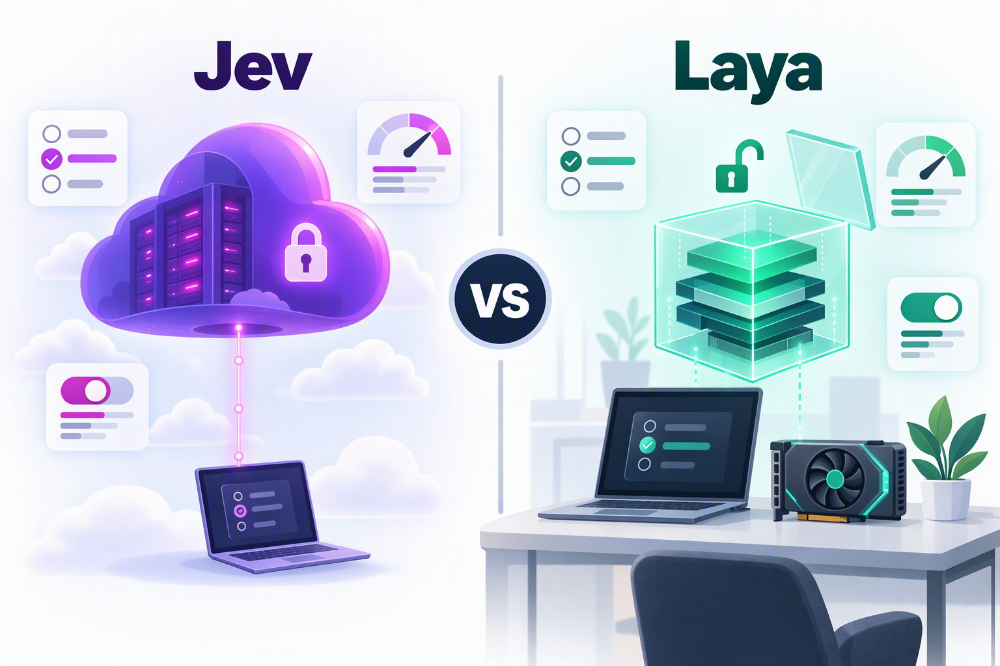
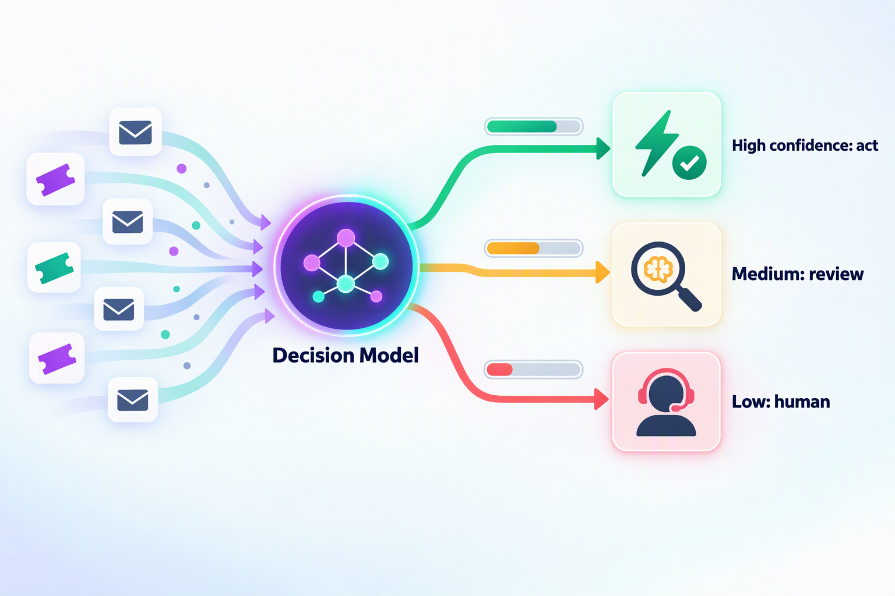

## 引言

2026 年 9 月，AI 圈突然流行起一类“不会说话”的模型。

9 月 15 日，由前 OpenAI 研究员 Diogo Almeida 创办的 TypeSafe AI 发布了 **Jev**：它不聊天、不写文章、也不生成代码，只接收一段状态（state）和一组预先定义好的问题，然后直接返回带有校准概率的结构化决策。

仅仅三天后，9 月 18 日，独立研究者 Nandakishor M（Convai Innovations）开源了 **Laya**。它同样是一个非自回归的 System 1 决策模型，采用 Apache 2.0 协议，权重可以直接从 Hugging Face 下载，三天内 GitHub 星标就超过了 6000，被社区称为“开源版 Jev”。

一边是背靠 4000 万美元种子轮、开箱即用的闭源 API，一边是 4.2 亿参数、一张 T4 甚至一台 MacBook 就能跑起来的开源模型。社交媒体上“Laya 反超 Jev”“Jev 的护城河只维持了两天”之类的说法很多，但如果把双方公开的资料仔细读一遍，就会发现结论远没有这么简单。

本文将从以下几个方面展开：

1. 什么是决策模型，它要解决什么问题
2. Jev 与 Laya 各自的技术路线
3. 核心差异与基准数据解读
4. 两者各自的优势与劣势
5. 适用场景与选型建议

## 什么是决策模型（System One Model）

### 1. 名字的由来

“System One”来自丹尼尔·卡尼曼的《思考，快与慢》：System 1 是快速、直觉式的判断，System 2 是缓慢、审慎的推理。在这个比喻下，生成式大模型（尤其是推理模型）更像 System 2，而决策模型负责的是毫秒级的“直觉反应”。

顺带一提，Jev 这个名字来自经济学家威廉·斯坦利·杰文斯（William Stanley Jevons）。TypeSafe 认为机器智能会重演“杰文斯悖论”：就像蒸汽机效率提升反而带动了煤炭需求一样，智能的单价每下降一个数量级，都会解锁更多数量级的新用例。

### 2. 用大模型做“选择题”的痛点

在真实的 AI 工程里，大量决策其实都是“小事”：

* 这张工单应该分给哪个团队？
* 这封邮件是不是钓鱼邮件？
* 这段提示词有没有注入攻击？
* Agent 下一步该调用哪个工具？上一步执行成功了吗？

今天常见的做法，是把这些问题交给一个擅长写作的大模型，再从它生成的文本里把答案“抠”出来。这会带来一系列问题：

| 问题 | 表现 |
| --- | --- |
| 延迟高 | 逐 token 生成，动辄几百毫秒到几秒，推理模型更慢 |
| 成本高 | 输入输出都要计费，输出 token 通常更贵 |
| 需要解析 | 要写 JSON 解析、Schema 校验和失败重试逻辑 |
| 类型错误 | 可能多输出一段解释，甚至返回一个根本不存在的选项 |
| 置信度不可信 | 模型写出的 `"confidence": 0.95` 只是一段“听起来很自信”的文本，缺乏统计意义上的校准 |

### 3. 决策模型的思路

决策模型干脆把“生成”这一步删掉了。TypeSafe 用一句话概括它：

> **Unstructured state in, typed probabilistic decisions out.**
>
> 非结构化的状态输入，带概率的类型化决策输出。


调用方只需要提交两部分内容：

* `state`：需要判断的当前状态，可以是字符串、JSON 对象或文本数组
* `questions`：一组类型化问题，每个问题的候选答案都由调用方提前定义

模型并行地回答所有问题，只返回数字和概率。Jev 与 Laya 采用了完全相同的三种问题原语：

| 原语 | 回答的问题 | 返回内容 | 典型用途 |
| --- | --- | --- | --- |
| `choice` | 从给定选项中选一个 | 选中项、各选项概率、confidence | 工单路由、意图识别、工具选择 |
| `score` | 在有序等级上打分 | 概率加权的期望分数、等级分布、confidence | 紧急程度、情绪强度、风险等级 |
| `noul` | 是 / 否判断 | “是”的概率（0～1） | 钓鱼检测、越狱检测、是否申请退款 |

由于输出空间被提前限定，模型**不可能返回类型错误或凭空编造的选项**。但需要注意：**类型安全不等于判断正确**，它仍然可能在合法的选项里选错，这一点后文会反复提到。

### 4. 它在系统中的位置

决策模型并不是用来取代大模型的，而是把大模型从一些“本不该由它来做”的位置上挪开。一个比较合理的分工是：

```
代码（确定性逻辑）
  └─ 流程编排、权限控制、数学与日期计算、执行动作
        │  遇到需要语义理解的“模糊 if 语句”
        ▼
决策模型（System 1：Jev / Laya）
  └─ 分类、路由、打分、校验、护栏，返回类型化答案 + 概率
        │  置信度不足，或需要生成文本 / 复杂推理
        ▼
大模型（System 2：GPT / Claude / DeepSeek 等）
  └─ 长上下文理解、规划、写作、代码生成
```

有了校准过的置信度，程序的控制流就不再只有“是 / 否”两种状态，而可以分成三档：**高置信度自动执行，中置信度交给更强的模型复核或请求用户确认，低置信度转人工**。这也是决策模型真正的价值所在：速度只是表象，可以被写进 `if` 语句的置信度才是关键。



## 两位主角

### Jev：TypeSafe AI 的闭源云端服务

**基本信息**

* 发布时间：2026 年 9 月 15 日，以 early access 形式开放
* 团队背景：TypeSafe AI 是一家旧金山公司，创始人 Diogo Almeida 曾在 Google Brain 和 OpenAI 从事研究，是 InstructGPT 论文和 GPT-4 技术报告的作者之一。发布当天，公司同时宣布了由 DCVC 领投的 4000 万美元种子轮融资
* 产品形态：闭源，只提供 API（`POST https://api.typesafe.ai/v1/systemone`）以及 Python / JavaScript SDK
* 当前版本：Jev 1.13（`jev-1.13.0`），别名 `jev-latest`

**技术路线**

TypeSafe 声称为自动化场景重建了一整套技术栈：全新的模型架构、追求极致效率的并行采样器，以及一种名为 **RLCD（Reinforcement Learning for Calibrated Decisions，面向校准决策的强化学习）** 的训练方法。与 RLHF 优化“人类偏好”、RLVR 优化“可验证奖励”不同，RLCD 的目标是让模型在给出答案的同时，给出**认知上诚实的概率**。

不过，TypeSafe 目前并没有公开模型架构、参数规模和训练数据。社区有不少人认为它更接近 BERT 这类 encoder 模型，但这只是猜测。

**关键规格**

| 项目 | 规格 |
| --- | --- |
| 价格 | 输入 $0.042 / 百万 token，输出免费 |
| 延迟 | 官方称端到端 70～500 ms |
| 上下文 | 每个请求 64k token，其中 state 加最长的单个问题不超过 32k token |
| 输入 | 仅支持文本（字符串、JSON 对象、文本数组），不支持图像、音频和视频 |
| 选项数量 | `choice` 最多支持 255 个选项 |
| 速率限制 | 250,000 token/秒、1,200 次请求/分钟（官方称会动态调整） |
| 语言 | 英语是主要训练语言，中文等 CJK 文本可用，但准确率可能下降 |
| 定制 | 不支持微调或 LoRA，所有客户共用同一套权重 |

按这个定价计算，如果每次判断平均消耗 1000 个输入 token，100 万次判断的费用只有约 42 美元。

**生态**

Jev 发布后迅速走红：LangChain 很快发布了集成指南，Vercel 把它接入了 AI Gateway，社区也涌现出不少实验项目，比如用 Jev 给 Claude Code 的工具调用输出做相关性打分、进而压缩上下文的 fast-jev-compaction。

### Laya：Convai Innovations 的开源本地模型

**基本信息**

* 发布时间：2026 年 9 月 18 日
* 作者：独立研究者 Nandakishor M（Convai Innovations）
* 开源协议：Apache 2.0，代码、权重、训练方法和微调 Notebook 全部公开
* 获取方式：`pip install laya`（要求 Python 3.10+），权重托管在 Hugging Face 的 `convaiinnovations/laya`

Laya 的诞生还有一段插曲。作者在 2025 年就先后发表过两篇相关论文（arXiv:2503.23303、arXiv:2510.01237），研究用强化学习训练非自回归的决策模型，最早用于预测销售对话的转化率。看到 Jev 以“突破”之名发布后，他把旧方案的架构缺陷全部修了一遍，做出了这个通用的开源版本。

**模型架构**

Laya 采用“双向编码器 + 决策头”的结构，总参数量 421M：

```
State（文本或 JSON）+ 类型化问题与选项
        │ 拼接为：[CLS] 问题 [SEP] [MASK] 选项1 [MASK] 选项2 ... [SEP] state [SEP]
        ▼
ModernBERT-large 编码器（395M，28 层双向注意力）
        ▼
决策头 Transformer（约 25M，2 层）
        ├─ 选项打分器：取每个 [MASK] 位置的隐状态 → logit → 温度缩放 → softmax
        └─ Act / Escalate 头：基于 [CLS] 与分布统计量，判断“自动执行”还是“升级处理”
```

每个选项前面放一个 `[MASK]` 标记，经过双向编码器之后，从这些标记的位置取出隐状态进行打分。同一个 state 上的多个问题会组成一个 batch，在一次前向传播中完成计算。

**三个检查点 + 路由器**

| 检查点 | 编码器 | 参数量 | 默认上下文 | 用途 |
| --- | --- | --- | --- | --- |
| `laya` | ModernBERT-large | 421M | 512 | 英文 |
| `laya-multilingual` | mmBERT-base | 322M | 1024 | 100+ 种语言，速度约快 2 倍 |
| `laya-typed-decisions` | ModernBERT-large | 421M | 1024 | 针对 typed-decisions 工作流微调 |

Laya 内置了一个纯 Python 实现的 `Router`，会在前向计算之前用不到 1 毫秒的时间检测文本的书写系统和语言，然后自动选择合适的检查点。之所以需要它，是因为英文检查点在非拉丁文字上会“自信地犯错”：在高棉语测试中，它的准确率为 0，置信度却高达 0.952。这种情况下，靠置信度阈值是拦不住的。

**开放的 RLCD 实现**

Laya 沿用了 RLCD 这个名字，并公开了具体做法：用**严格适当评分规则**（strictly proper scoring rules，由对数评分、球面评分和排序概率评分组合而成）作为奖励，采用 GRPO 风格的组内基线策略梯度进行训练，完全不使用监督交叉熵损失。严格适当评分规则的特点是：只有当模型报告真实的概率时，才能拿到最高的期望奖励，从而“逼”模型说实话。

Act / Escalate 头则用一个代价矩阵来训练：判对奖励 +1，判错惩罚 -3，升级人工惩罚 -0.5。由此可以推导出，只有当正确率超过 62.5% 时，自动执行才比升级人工更划算，模型也就学会了“没把握就上交”。

此外，Laya 还提供了开箱即用的工作流预设（模型路由、提示词护栏、内容审核、工单分诊），以及一个可以在 Kaggle 免费 2×T4 GPU 上运行的微调 Notebook：在约 3 万个问题上训练 4 个 epoch，耗时 4～5 小时。

## 核心差异一览


| 维度 | Jev | Laya |
| --- | --- | --- |
| 发布方 | TypeSafe AI（商业公司） | Convai Innovations（独立研究者） |
| 开源 | 闭源，仅提供 API | Apache 2.0，权重与代码全部开放 |
| 部署 | 云端托管（服务目前位于美国西海岸） | 本地、私有云或离线环境，GPU / Mac MPS / CPU 均可运行 |
| 架构 | 未公开 | ModernBERT / mmBERT 编码器 + 决策头 |
| 参数规模 | 未公开 | 322M～421M |
| 训练方法 | RLCD（细节未公开） | RLCD（严格适当评分规则 + 组基线策略梯度，已公开） |
| 问题原语 | choice / score / noul | choice / score / noul，请求格式几乎一致 |
| 上下文长度 | 64k token | 默认 512 / 1024 token（编码器最高支持 8192） |
| 选项数量 | 最多 255 个 | 超过 20 个时效果明显下降 |
| 零样本能力 | 强，开箱即用 | 弱，基础检查点需要微调 |
| 定制方式 | 只能通过 state、instructions、criteria 调整 | 可以在自有数据上微调，并拟合校准温度 |
| 多语言 | 以英语为主 | 多语言检查点 + 自动路由，51 种语言中有 45 种达到可用水平 |
| 单问题延迟 | 官方 70～500 ms，第三方实测 p50 为 236～276 ms | T4 GPU 上约 33～40 ms |
| 成本 | 输入 $0.042 / 百万 token | 模型免费，只需自备算力 |
| 数据合规 | 数据需发送到 TypeSafe，企业版支持零数据保留 | 数据不出本地 |
| 运维 | 免运维 | 需要自行部署、扩缩容、监控和管理版本 |

## 基准数据怎么看

### 1. Laya 公布的对比数据

Laya 的 README 中给出了一张与 Jev 1.13.0 的对比表（Laya 一侧为经过 Router 路由后的实测结果）：

| 指标 | Jev 1.13.0 | Laya（路由） |
| --- | --- | --- |
| typed-decisions 准确率（2000 个决策） | 0.727 | **0.766** |
| AG News 准确率（4 类） | 0.910 | **0.950** |
| DAIR Emotion 准确率（6 类） | 0.480 | **0.595** |
| Banking77 准确率（72 / 77 类） | **0.870** | 0.425 |
| ECE 校准误差（越低越好） | 0.246 | **0.081** |
| 单问题 p50 延迟 | 236～276 ms | **32.8 ms** |
| 成本 | $0.042 / 百万 token | 自托管 $0 |

乍一看，Laya 几乎全面领先。但如果只看这张表就下结论，很容易踩坑。

### 2. 解读数据时必须注意的五点

**第一，Jev 的数据并非同场实测。** Laya 作者明确说明，自己没有 TypeSafe 的 API 权限，表中 Jev 的数字全部引用自第三方公开的结果，样本量和提示词都不相同。

**第二，Laya 的高分来自针对性微调。** typed-decisions 上的 0.766 是 `laya-typed-decisions` 在该基准自己的训练集上微调后取得的成绩。未经微调的两个基础检查点只有 0.34～0.36，接近随机猜测（0.318），甚至低于“每题都猜最常见类别”的基线（0.461），而 Jev 不做任何训练就能拿到 0.727。作者自己也说得很直白：**Laya 是一个适合特化的快速底座，而不是零样本决策引擎。** 换句话说，这张表比的其实是“特化后的专才”和“零样本的通才”。

**第三，校准优势需要额外的温度拟合。** 表中 0.081 的 ECE 是用领域留出数据重新拟合温度之后的结果，出厂时为 0.466。而在同一个 typed-decisions 基准上，Laya 微调检查点的 ECE 为 0.213，反而高于 Jev 的 0.144；在衡量概率分布与参考分布吻合程度的“软准确率”上，Jev 也以 0.580 领先 Laya 的 0.471。当然 Jev 也并非完美：Laya 作者引用的数据显示，在 DAIR Emotion 上，Jev 对 16% 的样本给真实标签分配了 0 概率，这对依赖置信度做分流的系统来说是个硬伤。

**第四，延迟对比的本质是部署方式的差异。** Jev 的延迟包含从客户端到 TypeSafe 云端的网络往返（TypeSafe 的评测大多从美国西海岸发起），而 Laya 的 32.8 ms 是在本地 T4 GPU 上的推理耗时。对于国内或其他地区的用户，Jev 的实际延迟还要叠加跨境网络的开销；反过来，如果把 Laya 部署成远程服务，同样要算上网络开销。

**第五，Jev 自己的宣传数据同样需要打折。** TypeSafe 官网上“快 193.6 倍、便宜 444.6 倍”的数字来自其团队设计的 4 套工作流评测，参考答案取自 GPT-6 Astra 和 Fable 5.1 两个前沿模型的平均结果，官方也坦言这些数字处于真实收益的上限。自动化服务公司 AY Automate 发布的第三方测试则显示：Jev 比几款对照模型快约 2～3.6 倍；成本方面，相比便宜的小模型约节省 4.7～7.5 倍，相比昂贵的前沿模型才能达到 40～49 倍。

### 3. 社区实测

发布后短短几天，社区就做了不少对比测试，大多集中在高频交互场景：

* **贪吃蛇**：在同一套决策逻辑下，本地运行的 421M Laya 在 30 秒内平均每秒决策 86.5 次，P50 延迟约 9 ms；云端 Jev 每秒只能决策 3.2 次，API 往返约 317 ms
* **M5 Pro 测试**：两者的中位耗时分别为 15.3 ms 和 298.1 ms，差距接近 20 倍
* **Apple Silicon 移植**：社区项目 laya-mlx 把模型移植到 MLX，运行时最高约占 1GB 内存，在 M3 Max 上运行贪吃蛇可以达到每秒 60 次决策

这些测试体现的主要是“本地推理”与“云端往返”的差异。对于每秒需要几十次决策的实时场景，这个差距是决定性的；但对于一次工单分流来说，30 ms 和 300 ms 的区别，用户几乎感知不到。

### 4. 小结

比较公允的结论是：**在开箱即用、长上下文、选项复杂的场景下，Jev 更强；在有标注数据的垂直任务上，经过微调的 Laya 可以做到更快、更准、更便宜。**

## Jev 的优势与劣势

### 优势

1. **开箱即用，零样本能力强**：不需要任何训练数据，写好 state 和问题就能直接使用。TypeSafe 称 Jev 在 System One 类任务上达到了与现有前沿 LLM 相近的智能水平；Karpathy 也评价说，它处在 LLM 帕累托曲线上一个长期被低估的位置：不需要复杂思考，只需要在低延迟下给出足够可靠的判断。
2. **长上下文与高基数选项**：64k 的上下文可以直接放入长邮件串、合同条款或 Agent 执行轨迹；`choice` 最多支持 255 个选项，在 Banking77 这类细粒度意图分类上仍有 0.870 的准确率。
3. **出厂即校准**：不需要自己拟合温度，返回的概率可以直接用于阈值分流；官方文档还给出了按风险等级设置不同阈值的最佳实践。
4. **免运维，生态成熟**：托管服务加官方 SDK，已经接入 LangChain、Vercel AI Gateway 等生态，团队不需要操心 GPU、扩缩容和模型升级。
5. **单价极低**：按每次 1000 个输入 token 估算，100 万次判断约 42 美元，对大多数业务来说，模型费用已经不是瓶颈。

### 劣势

1. **闭源黑盒**：架构、参数量和训练数据都没有公开。决策模型本身也不输出解释，正如 Simon Willison 所提醒的，Jev 最终留给开发者的可能只有一个数字，判断出错时很难追问原因。
2. **数据必须出域**：所有 state 都要发送到 TypeSafe 的云端，零数据保留（ZDR）仅面向企业客户，这对金融、医疗、政企等场景是硬伤。另据媒体报道，Jev 目前尚未面向中国大陆开放。
3. **网络延迟无法消除**：几百毫秒的往返对于业务工作流已经足够快，但对于游戏 AI、实时风控这类每秒几十次决策的场景仍然太慢。
4. **无法微调**：所有客户共用同一套权重，只能通过 state、instructions 和 criteria 来“调教”，在高度垂直的领域可能达不到专用模型的效果。
5. **英语优先**：官方明确英语是主要训练语言，中文场景一定要先用自己的数据验证。
6. **早期产品的不确定性**：速率限制仍在动态调整；官方预计价格只降不升，但也坦言暂时无法证明当前价格没有补贴；`jev-latest` 别名会随新版本移动，调好的阈值可能需要重新标定；此外还有厂商锁定的风险。
7. **已知的能力“锯齿”**：官方文档专门列出了 Jev 1.13 的多种失效模式，包括过于字面地理解问题、不擅长计数和数学运算、日期比较不可靠、多跳的间接推理效果差、state 中无关内容过多会降低准确率、容易被 state 中的对抗内容（如提示词注入）带偏等。甚至一些“常识性”的一致性也无法保证：对同一个问题和它的否定分别提问，两个 noul 的概率之和可能是 1.19，而不是 1。

## Laya 的优势与劣势

### 优势

1. **完全开源**：Apache 2.0 协议，架构、训练方法、评测脚本和微调 Notebook 全部公开，可审计、可复现、可二次开发，没有厂商锁定。
2. **数据不出域**：可以部署在本地、私有云甚至离线环境中，天然满足数据驻留和隐私合规的要求。
3. **极低延迟、高吞吐**：T4 上单个问题约 33～40 ms，多语言检查点批量推理时每题约 7 ms，单卡吞吐约 100～330 题/秒，在实时交互类应用中优势明显。
4. **边际成本接近零**：按单张 T4 每秒 100～300 题估算，100 万次判断只需要 1～3 个 GPU 小时。
5. **可微调、可特化**：在自有数据上微调后可以超越 Jev（typed-decisions 上 0.766 对 0.727），而且整个流程在 Kaggle 的免费 GPU 上就能完成。
6. **多语言与自动路由**：`laya-multilingual` 覆盖 100 多种语言，Router 会在推理前自动选择检查点，对中文等非英语场景更友好（但仍需自测）。
7. **面向生产的设计**：Act / Escalate 头可以直接给出“自动执行还是升级人工”的建议；内置了护栏、审核、分诊等预设；文档还坦诚地列出了自身的各项短板。

### 劣势

1. **零样本能力弱**：基础检查点在 typed-decisions 上接近随机水平，想要好的效果，就必须准备标注数据并进行微调。没有数据的团队拿到手的，基本上只是一个“待训练的底座”。
2. **上下文短**：英文检查点默认只有 512 token（留给 state 的约 320 token），多语言和 typed-decisions 检查点为 1024 token（留给 state 的约 768 token）。长文档、长对话需要先做截断、摘要或分块。编码器最高支持 8192 token，但调大之后延迟会上升，效果也需要自行验证。
3. **高基数选项吃力**：所有选项共享一个固定的 token 预算，77 个选项时每个选项只能分到 3～4 个 token，Banking77 的准确率随之跌到 0.425。需要调大 `head_max_len`、先用 embedding 做候选筛选（`predict_shortlist`），或者拆成“粗分类 + 细分类”两级问题。
4. **校准需要额外工作**：出厂的检查点偏向“过度自信”，需要用领域内的留出数据拟合温度（ECE 可以从 0.466 降到 0.081）；多语言检查点出厂时则完全没有拟合温度。
5. **score 是最弱的原语**：有序打分任务的表现最差，例如 SST-5 五级情感分类的准确率只有 0.372。
6. **语言陷阱**：英文检查点在非拉丁文字上会高置信度地犯错，必须使用 Router 或手动选对检查点。另外，默认的懒加载模式下切换语言会触发 7～10 秒的模型重载，生产环境需要开启预加载。
7. **运维与项目成熟度**：需要自己负责 GPU 资源、扩缩容、监控和模型版本管理；项目刚刚发布，主要由独立研究者维护，长期演进存在不确定性。

## 适用场景与选型建议

### 1. 场景对照表

| 场景 | 推荐 | 理由 |
| --- | --- | --- |
| 快速验证 PoC，手上没有标注数据 | Jev | 零样本即可使用，几分钟就能接入 |
| 细粒度意图分类（几十上百个选项） | Jev | 最多支持 255 个选项；Laya 需要额外做候选筛选或分级设计 |
| 长文本判断（合同、长邮件串、Agent 执行轨迹） | Jev | 64k 上下文，而 Laya 默认只有 512 / 1024 |
| 云端 Agent 的工具选择、完成判定、重试决策 | Jev | 通用性强，与 LangChain、Vercel 等生态集成度高 |
| 数据不能出域（金融、医疗、政企、境内业务） | Laya | 本地部署，数据不离开自己的环境 |
| 高频实时决策（游戏 AI、实时风控、端侧应用） | Laya | 毫秒级本地推理，没有网络往返 |
| 超大规模批处理（海量分类、打标、特征提取） | Laya | 边际成本接近零 |
| 有大量标注数据的垂直任务（垃圾邮件、钓鱼检测、工单分诊、内容审核） | Laya（微调后） | 特化之后更快、更准、更便宜 |
| 多语言，尤其是中文等非拉丁文字 | Laya（多语言检查点 + Router） | Jev 以英语为主；但两者都需要用自己的数据验证 |
| 网关层的提示词护栏 | Laya | 本地低延迟，适合作为第一道过滤；但需要配合其他防护手段 |

关于最后一点再多说一句：Laya 在未参与训练的提示词注入测试集上的准确率约为 0.698，Jev 的官方文档也承认 state 中的对抗内容可能带偏判断。决策模型可以作为一道低成本的前置过滤，但不能作为唯一的安全防线。

### 2. 选型时要回答的几个问题

可以按下面的顺序依次回答：

```
1. 数据能否发送到第三方云（以及境外）？
   └─ 不能 → Laya（硬约束，其他因素都要让路）
2. 是否有标注数据，并且愿意投入微调？
   └─ 没有 → Jev
3. 是否需要每秒几十次以上的实时决策，或者要在端侧运行？
   └─ 是 → Laya
4. state 是否很长（超过 1k token），或者选项是否很多（超过 20 个）？
   └─ 是 → Jev（或 Laya + 分块 / 候选筛选）
5. 月调用量是否达到数千万级？
   └─ 是 → 倾向 Laya；否则 Jev 的总拥有成本通常更低
```

关于成本，可以简单算一笔账：假设每次判断消耗 1000 个输入 token，Jev 每 100 万次判断约 42 美元；一台 T4 实例全天候运行，按每小时约 0.5 美元估算，每月约 360 美元，相当于 Jev 约 850 万次判断的费用，这还没算高可用冗余和运维人力。所以单纯从成本角度看，只有当调用量足够大时，自托管 Laya 才有明显优势。更多时候，选择 Laya 的理由应该是**延迟、合规和可定制性**，而不仅仅是省钱。

### 3. 组合使用：不必二选一

在实际项目中，两者完全可以组合使用：

1. **阶段式迁移**：先用 Jev 快速上线，验证问题拆解、选项设计和置信度阈值是否合理，同时沉淀真实数据和人工复核的标签；当调用量上来或合规要求收紧时，再用这些人工标签微调 Laya，迁移到自托管。由于两者的请求格式（state + questions，以及 choice / score / noul 的 instructions、criteria 结构）几乎一致，迁移成本很低。需要注意的是，如果打算直接把 Jev 的输出当作训练标签，请先确认 TypeSafe 的服务条款；Laya 作者也提醒过，用模型生成的标签来训练，只会把新模型校准到“老师”的错误上。
2. **分层级联**：本地 Laya 处理高频、简单、短文本的判断；低置信度或长上下文的请求升级给 Jev；Jev 仍然拿不准的，再交给推理型大模型或人工处理。
3. **按数据敏感度路由**：涉及个人隐私或敏感业务数据的请求走本地 Laya，其余请求走 Jev。

### 4. 其他选择

除了这两者，社区还出现了一条“零训练复刻”的路线：直接读取现成开源 LLM 在候选项上的 token 概率来模拟 Jev 的输出。例如 SemIf 用一个现成的 4B 开源模型直接读取概率，据称与 Jev 的结论一致率在 85% 左右；Kev 则基于 Qwen 3.5 制作了 0.8B、4B 和 9B 三个 Jev-like 模型。这类方案在门槛和效果上介于两者之间，适合想先低成本尝鲜的团队。

## 代码示例：同一组问题，两种调用方式

由于 Jev 和 Laya 的问题格式几乎一致，同一组 `state` 和 `questions` 可以同时用于两者：

```python
state = {
    "message": "I was charged twice for order A-104. Please refund the duplicate.",
    "order": {"charges": [49, 49]},
}

questions = {
    "department": {
        "type": "choice",
        "instructions": "Which team should handle this request?",
        "criteria": {
            "billing": "Payments, invoices, and refunds",
            "technical": "Bugs and integrations",
            "account": "Account access and profile issues",
        },
    },
    "urgency": {
        "type": "score",
        "instructions": "How urgent is this request?",
        "criteria": ["Not urgent", "Soon", "Critical or blocking"],
    },
    "refund_requested": {
        "type": "noul",
        "instructions": "Does the message request a refund?",
    },
}
```

调用云端的 Jev（固定版本号，避免别名升级后调好的阈值失效）：

```python
import os
import requests

resp = requests.post(
    "https://api.typesafe.ai/v1/systemone",
    headers={"Authorization": f"Bearer {os.environ['TYPESAFE_API_KEY']}"},
    json={"model": "jev-1.13.0", "state": state, "questions": questions},
    timeout=5,
)
resp.raise_for_status()
answers = resp.json()["answers"]
```

在本地运行 Laya：

```python
from laya import Router

# 生产环境建议预加载，避免切换语言时重新加载模型
router = Router(preload=True)
answers = router.predict(state, questions)["answers"]
```

两者返回的结构基本相同：`choice` 包含 `choice`、`probabilities` 和 `confidence`，`score` 包含期望分数、等级概率分布和 `confidence`，`noul` 则直接返回“是”的概率。后续的置信度分流逻辑可以完全复用：

```python
dept = answers["department"]

if dept["confidence"] >= 0.9:
    route_to_team(dept["choice"])     # 高置信度：自动执行
elif dept["confidence"] >= 0.6:
    review_with_llm(state, dept)      # 中置信度：交给更强的模型复核
else:
    send_to_human(state)              # 低置信度：转人工
```

这里的 0.9 和 0.6 只是示意，真实的阈值一定要用自己的数据来标定。

## 落地时的共同注意事项

无论选择哪一个，以下几点都同样适用：

1. **类型安全 ≠ 判断正确**：校准描述的是一组预测的统计性质，并不保证单个答案正确，阈值必须用自己的数据标定。
2. **把问题拆小**：不要问“这张工单该怎么处理”，而是拆成“是否申请退款”“紧急程度如何”“属于哪条业务线”等原子问题，再在代码里组合。
3. **计算交给代码**：计数、数学运算、日期比较等确定性逻辑不要交给模型。
4. **精简 state**：只放与问题相关的字段，无关内容会降低准确率；Laya 的上下文更短，这一点尤为关键。
5. **不可逆操作要兜底**：付款、删除数据、医疗或合规审批等操作，不能仅凭一个概率就自动执行。
6. **防范注入**：state 虽然是数据，但其中的恶意内容仍可能影响判断，不要把决策模型当作唯一的安全防线。
7. **固定版本，持续监控**：固定模型版本（如 `jev-1.13.0` 或指定的 Laya 检查点），升级后重新标定阈值；上线后持续记录概率分布、抽样复核，并监控校准漂移。

## 总结

用一句话概括：

> **Jev 是“开箱即用的云端通才”，Laya 是“可以特化的本地专才”。**


* 如果你追求快速上线、手上没有标注数据，或者面对长上下文和复杂的选项空间，Jev 是更省心的选择；
* 如果你有数据、有合规要求、需要毫秒级的实时决策或海量调用，并且有能力运维一个小模型，Laya 更值得投入。

两者并不是替代关系，而是同一条“决策光谱”上的不同档位。更值得关注的是这场对决背后的趋势：AI 系统正在从“一个大模型包打天下”走向分工协作，**代码负责骨架，决策模型负责快速判断，大模型负责深度思考**。Jev 定义了这个品类，Laya 则在三天之内证明了开源社区可以迅速跟上。对开发者来说，这意味着工具箱里又多了一种更快、更便宜、也更可控的构建模块。

## 参考资料

* [TypeSafe AI：Introducing System One Models & Jev](https://typesafe.ai/blog/introducing-system-one-models-and-jev)
* [TypeSafe 文档：Models](https://docs.typesafe.ai/models)
* [TypeSafe 文档：Jev 1.13 jaggedness](https://docs.typesafe.ai/model-jaggedness/jev-1.13)
* [TypeSafe 文档：Confidence](https://docs.typesafe.ai/confidence)
* [TypeSafe Workflow Evals](https://evals.typesafe.ai/)
* [Laya GitHub 仓库](https://github.com/NandhaKishorM/laya)
* [Laya Hugging Face 模型页](https://huggingface.co/convaiinnovations/laya)
* [Nandakishor M：I Built Non-Autoregressive Decision Models a Year Ago. Then a Frontier Lab Called It a "Breakthrough".](https://dev.to/nandakishor_m_6cc0adfde9f/i-built-non-autoregressive-decision-models-a-year-ago-then-a-frontier-lab-called-it-a-18me)
* [虎嗅：号称快200倍的Jev模型，拿不下LLM的大结果](https://www.huxiu.com/article/4893173.html)
