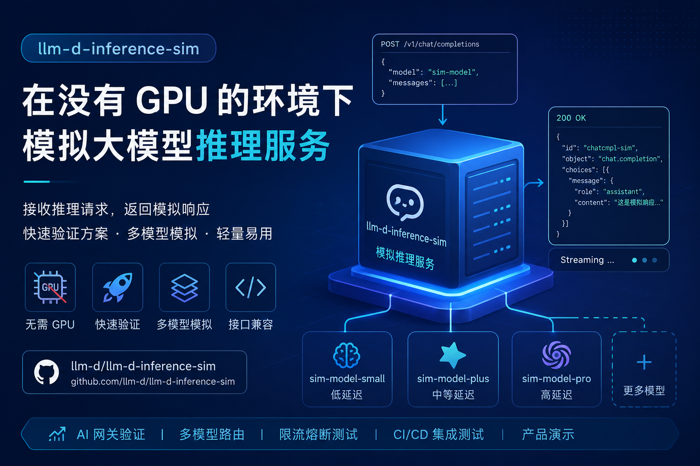

在大模型应用快速落地的过程中，**推理服务的工程化能力**往往比模型本身更复杂：模型调度、路由策略、限流、灰度发布、网关治理等问题，都需要真实的推理接口进行验证。然而，大模型推理依赖 GPU 和高成本算力资源，使得开发和测试门槛居高不下。

如果你希望在**没有 GPU 或资源受限的环境中验证推理架构设计**，那么这个工具值得关注：

[llm-d-inference-sim GitHub 项目](https://github.com/llm-d/llm-d-inference-sim?utm_source=chatgpt.com)

本文将系统介绍这个工具的能力、设计思路，以及它在实际工程中的应用价值。

## 工具定位：为推理工程而生的“模拟器”

**llm-d-inference-sim** 是一个专门用于模拟大模型推理服务的工具，其核心能力包括：

* 提供与真实 LLM 推理服务一致的接口（如 OpenAI-style API）
* 接收推理请求（prompt / messages）
* 按配置生成“模拟响应”
* 支持多实例、多模型模拟部署

简单来说，它并不真正执行模型推理，而是：

> **模拟“推理服务行为”，而非“推理计算本身”**

## 为什么需要推理模拟？

在真实项目中，我们经常遇到以下问题：

### 1. 推理资源昂贵

* GPU 成本高（A100 / H100）
* 推理服务部署复杂（vLLM / TensorRT-LLM / SGLang）
* 测试环境难以复刻生产规模

### 2. 工程验证依赖真实服务

很多关键能力必须依赖推理接口验证，例如：

* API 网关路由策略（Envoy / Istio）
* 多模型调度与 fallback 机制
* embedding + intent routing
* 限流 / 熔断 / 超时控制
* 灰度发布与 A/B testing

但这些能力**并不依赖模型“正确性”**，只依赖：

> “是否有一个行为类似 LLM 的服务存在”

## llm-d-inference-sim 的核心价值

### 1. 零 GPU 依赖

开发者可以在以下环境直接使用：

* 本地 MacBook
* CI/CD 环境
* Kubernetes 测试集群
* 云主机（无 GPU）

无需部署任何真实模型。

### 2. 高度可控的响应模拟

可以模拟：

* 固定响应（用于稳定测试）
* 延迟（模拟推理耗时）
* Token 生成节奏（Streaming）
* 错误返回（测试容错）

这使它非常适合：

> **压测、容错测试、链路验证**

### 3. 支持多模型实例

你可以快速部署多个“模拟模型”：

* gpt-4 模拟服务
* embedding 模型模拟
* 不同延迟 / 不同性能 profile

用于验证：

* 多模型路由策略
* 智能网关（AI Gateway）
* fallback 逻辑

### 4. 与真实 API 兼容

接口风格通常兼容：

* OpenAI API（/v1/chat/completions）
* streaming 输出

这意味着：

> **可以无缝替换真实模型服务**

## 典型使用场景

### 场景 1：AI 网关 / 服务网格验证

例如使用 Envoy / Istio 构建 AI Gateway：

* 基于路径或 header 路由不同模型
* embedding-based routing
* Canary 发布

问题：没有真实模型怎么办？

使用 llm-d-inference-sim 模拟多个模型后端，即可验证完整链路。

### 场景 2：多模型调度系统开发

在做类似以下系统时：

* vLLM-aware scheduler
* KV Cache aware routing
* 模型负载均衡

你需要：

* 多个模型 endpoint
* 不同响应延迟
* 可控行为

模拟器可以快速构造这些环境。

### 场景 3：CI/CD 自动化测试

真实模型服务难以接入 CI：

* 成本高
* 不稳定
* 启动慢

使用模拟器：

* 启动快速
* 行为可预测
* 支持 mock response

非常适合集成测试（integration test）

### 场景 4：产品演示 / Demo 环境

在售前或内部 Demo 中：

* 不需要真实模型
* 只需要“看起来能跑”

使用模拟器可以：

* 快速部署多个模型服务
* 构造稳定演示环境
* 避免 GPU 成本

## 工作原理简析

llm-d-inference-sim 的设计可以理解为：

### 请求流程

1. 接收 HTTP 请求（如 `/v1/chat/completions`）
2. 解析输入（prompt/messages）
3. 根据配置规则生成响应
4. 返回 JSON 或 streaming 输出

### 模拟能力通常包括

* **Response 模板**

  * 固定文本
  * 参数化生成

* **Latency 注入**

  * 模拟推理耗时（如 200ms / 2s）

* **Streaming**

  * 分块返回 token
  * 模拟真实 LLM 输出节奏

* **错误注入**

  * 500 / timeout
  * 测试重试机制

## 与真实推理服务的关系

| 维度     | 模拟器     | 真实模型（vLLM 等） |
| ------ | ------- | ------------ |
| GPU    | ❌ 不需要   | ✅ 必需         |
| 成本     | 极低      | 高            |
| 响应真实性  | ❌ 无语义能力 | ✅            |
| 接口兼容性  | ✅       | ✅            |
| 工程验证能力 | ✅       | ✅            |

> **模拟器 ≠ 替代模型，而是补齐工程验证环节**

## 最佳实践建议

### 1. 与网关结合使用

推荐组合：

* Envoy / Istio
* AI Gateway
* llm-d-inference-sim

构建完整推理流量链路

### 2. 构造多模型拓扑

例如：

* model-a（低延迟）
* model-b（高质量，高延迟）
* model-fallback

验证智能路由策略

### 3. 注入异常场景

主动模拟：

* timeout
* 高延迟
* 错误返回

提升系统鲁棒性

### 4. 用于开发早期阶段

在以下阶段优先使用模拟器：

* 架构设计
* API 设计
* 路由策略验证

等到后期再接入真实模型。

## 总结

**llm-d-inference-sim** 解决的是一个被低估但关键的问题：

> 在没有模型的情况下，如何推进大模型工程化？

它的核心价值不在于“模拟模型”，而在于：

* 降低开发门槛
* 提升验证效率
* 解耦算力与工程

对于正在构建 AI 基础设施（AI Gateway / 推理平台 / 多模型调度系统）的团队来说，这是一个非常实用的工具。
