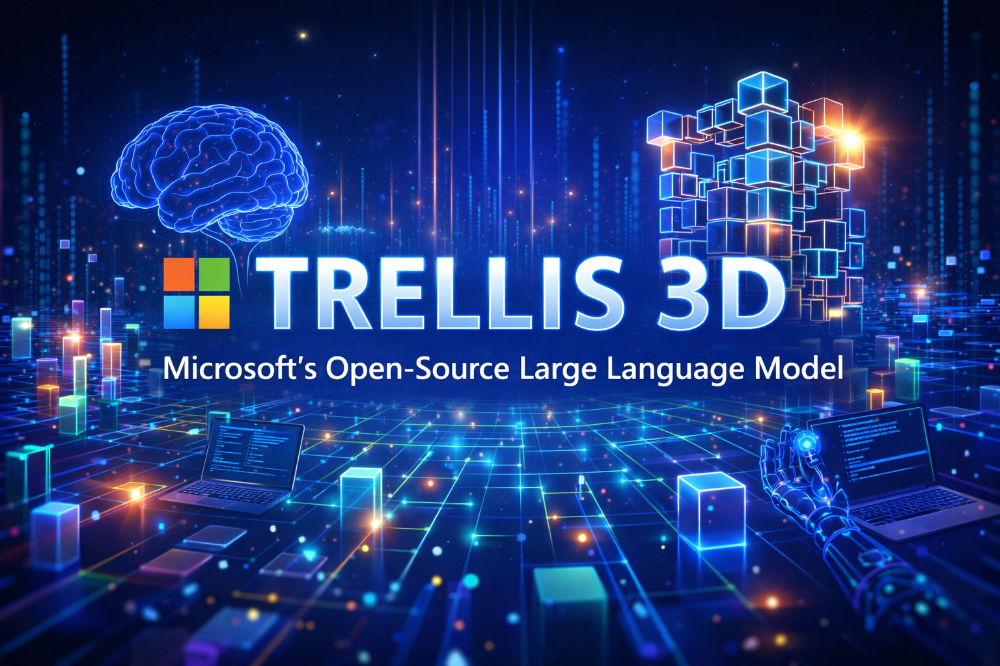
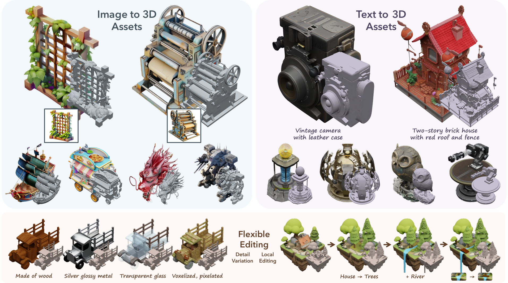

2025 年末，微软研究院发布了一个面向 3D 内容创作的开源大模型项目 **TRELLIS**，并伴随学术论文[《Structured 3D Latents for Scalable and Versatile 3D Generation》](https://arxiv.org/abs/2412.01506)。该项目通过统一的结构化潜在空间与先进的流模型技术，显著提升了文本/图像到 3D 资产生成的质量与灵活性，同时拓展了 3D 模型的多格式输出与编辑能力，成为当前 3D AI 模型生态中的重要技术之一。

官方 Github 仓库地址：[https://github.com/microsoft/TRELLIS](https://github.com/microsoft/TRELLIS)

## TRELLIS 是什么？——核心概念与架构

TRELLIS 是微软构建的**大型 3D 资产生成模型**，支持输入文本提示或图像，并输出高质量的三维模型资产。其技术创新点主要包括：

* **统一结构化潜在表示（SLAT）**：将三维信息编码为一种可扩展的结构化潜在空间表示，使模型能够以统一方式理解和生成不同表现形式的 3D 结果。
* **整流流（Rectified Flow Transformers）**：专为 SLAT 设计的生成骨干网络，通过适应 sparse 表示提升生成效率与质量。
* **大规模训练与预训练模型**：模型规模最高达**约 20 亿参数**，并在包含 **50 万多样化三维资产的数据集**上训练，具备强泛化能力。

TRELLIS 不仅能生成三维几何，还能捕获复杂纹理与外观信息，使得生成的资产更贴近真实世界中可用的三维内容。

## 主要功能特性

以下是 TRELLIS 的核心功能模块及技术亮点：

### 多模态输入能力

TRELLIS 支持以下输入条件：

* **文本提示（Text-to-3D）**：通过自然语言描述生成三维资产（提示须清晰准确）。
* **图像条件（Image-to-3D）**：根据一张或多张图片生成对应三维模型。

这种多模态输入支持，使 TRELLIS 适用于从概念设计到真实原型的全流程创作。



### 灵活的输出格式

根据下游需求，TRELLIS 输出包括：

* **辐射场（NeRF/Radiance Fields）**：适合渲染与展示
* **3D 高斯表示**：一种可渲染密度表示
* **传统网格 Mesh**：可导出为标准 3D 文件格式（例如 GLB/OBJ）用于游戏、AR/VR 等应用

这种格式灵活性是模型在实际生产环境中落地的关键能力。

### 本地三维编辑与变体生成

与早期单一生成模型不同，TRELLIS 能：

* **局部编辑**：在已有模型上进行细部修改
* **生成变体**：在保持基本结构不变的前提下，创建风格、细节不同的多版本输出

这种能力特别适合迭代式 3D 内容设计。

### 支持大规模数据集训练与可扩展性

TRELLIS 在包含多种来源（如 Objaverse、ABO 等）的大规模 3D 数据集上进行训练，使其具备：

* **强泛化能力**
* **更丰富的几何与纹理表现**
* **多任务适配能力**

这样的数据基础是其较竞品更具优势的根本原因之一。

## 与其他竞品对比：优势与提升点

目前市场上其他比较知名的 3D 生成模型（例如 **OpenAI Shap-E**、或研究型模型如 MeshGen 等）多存在以下局限：

* 有的只能输出单一 3D 表示（如内隐函数或点云）
* 多数不支持本地编辑与多种格式输出
* 在复杂纹理、细节表现上效果有限

相比之下：

### TRELLIS 的主要优势包括

1. **结构化潜在表示（SLAT）框架**：支持统一的生成与解码机制，同时兼顾几何与纹理细节。
2. **多格式生成输出**：与只生成单种数据结构的竞品相比更通用。
3. **本地编辑与变体生成**：提升了设计迭代效率。
4. **大规模预训练与更丰富数据集支撑**：提升了模型对稀有或复杂对象的生成能力。

总的来说，TRELLIS 更偏向工业级 3D 生成工具，而不只是科研展示或单一生成模型。

## 部署和使用

目前，微软尚未在 **Azure AI Foundry / Microsoft Foundry** 中以 Serverless 或托管模型的形式直接提供 TRELLIS。因此，在 Azure 云环境中使用 TRELLIS 的**最可行、也是最稳定的方式**，是基于 **Azure GPU 虚拟机（VM）**进行自托管部署。

这种方式具备以下优势：

* 完全控制模型版本与推理流程
* 支持大显存 GPU，适合 3D 模型生成场景
* 可与企业现有 Azure 网络、安全、存储体系无缝集成

### 1. Azure GPU VM 规格选型建议

TRELLIS 属于**显存与算力敏感型 3D 生成模型**，对 GPU 资源要求较高，推荐如下规格：

#### 推荐 VM 系列

* **Standard_NC A100 v4**（A100 80GB，首选）
* **Standard_NC A100 v5**（A100 80GB，新一代）
* **Standard_ND H100 v5**（H100，若需要更高吞吐）

> 实践建议：
>
> * **推理 / Demo**：单卡 A100 80GB 即可
> * **高分辨率 / 批量生成 / 编辑任务**：建议单机多卡或更高规格

### 2. 操作系统与基础环境

推荐环境组合如下：

* OS：Ubuntu 20.04 / 22.04 LTS
* CUDA：与 VM 驱动匹配的官方版本
* Python：3.8 或以上
* PyTorch：官方 CUDA 版本

Azure Marketplace 中可直接选择 **CUDA + NVIDIA Driver 预装镜像**，可显著降低环境准备成本。

### 3. TRELLIS 安装与依赖配置

#### 拉取代码

```bash
git clone --recurse-submodules https://github.com/microsoft/TRELLIS.git
cd TRELLIS
```

#### 创建独立 Python 环境并安装依赖

官方已提供自动化脚本：

```bash
./setup.sh --new-env --basic
```

如需支持训练、编辑或高级功能，可根据官方说明启用对应参数。

### 4. 基于 Azure VM 的推理运行方式

#### 方式一：命令行推理（适合批量任务）

文本或图像驱动生成 3D 模型：

```bash
python example_text.py \
  --prompt "a futuristic electric motorcycle" \
  --output_dir outputs/
```

或多图像条件输入：

```bash
python example_multi_image.py \
  --input_images images/ \
  --output_dir outputs/
```

生成结果可直接导出为 Mesh / Radiance Field 等格式，用于后续渲染或工具链集成。

#### 方式二：Gradio Web UI（推荐用于演示与验证）

TRELLIS 官方提供基于 Gradio 的 Web Demo，适合：

* 团队内部体验
* 产品验证
* 算法效果对比

```bash
python app.py
```

然后通过 Azure VM 公网 IP 或内网负载均衡访问 Web UI。

### 5. Azure 上的工程化部署建议

为了更好地在 Azure 上长期运行 TRELLIS，建议采用以下架构实践：

#### 存储解耦

* 模型权重：Azure Blob Storage
* 生成结果：Blob / Azure Files
* 日志与元数据：Azure Monitor / Log Analytics

#### 服务化封装

* 使用 **FastAPI / Flask** 将 TRELLIS 推理封装为 HTTP API
* GPU VM 作为推理节点
* 前端或工作流通过 REST 调用

#### 安全与网络

* VM 置于 VNet 内
* Web UI / API 通过 Application Gateway 或内部访问
* 支持私有部署，满足企业安全要求

## 总结与展望

微软 TRELLIS 代表了当前 3D AI 生成技术的重要进步，它在生成质量、格式多样性与本地编辑能力方面具备显著优势。对于希望自动化 3D 内容创建的开发者与设计者而言，它是一个有实力的开源方案。部署方面，虽然目前官方尚未将其作为 Foundry 的 serverless 模型，但可通过 Azure 的常规模型部署管道与 GPU 计算能力在云端高效运行 TRELLIS 推理与自定义训练。
