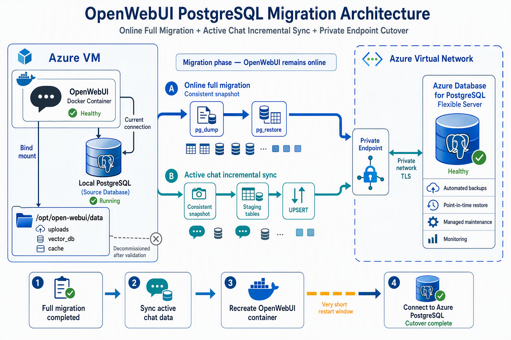

随着 OpenWebUI 中的用户、对话、文件和知识库数据不断增长，原先部署在 Azure VM 上的自建 PostgreSQL 带来了越来越多的运维工作，包括数据库补丁、备份、故障恢复、存储监控和安全维护。

为了降低维护成本并提高数据库可靠性，我将 **OpenWebUI 的业务数据库**从 VM 本地 PostgreSQL 迁移到了 **Azure Database for PostgreSQL Flexible Server**。

这次迁移采用了：

> 在线全量迁移 + 数据一致性验证 + 活跃对话增量同步 + 快速切换

全量数据库导出和恢复期间，OpenWebUI 始终保持在线。最终切换仅涉及一次很短的 Docker 容器重建，用户侧基本无感。

> 本文中的服务器地址、数据库名称、用户名、密码和资源标识均已隐藏或替换为占位符。

## 迁移背景

OpenWebUI 以 Docker 容器形式运行在 Azure VM 中，最初使用安装在同一台 VM 上的 PostgreSQL。

迁移前的架构如下：

```text
用户
  │
  ▼
Azure VM
  ├── OpenWebUI Docker 容器
  │      └── 连接 VM 宿主机 PostgreSQL
  │
  └── PostgreSQL
         └── 数据保存在 VM 本地磁盘
```

这种部署方式比较简单，但随着应用逐渐稳定运行，数据库维护也成为了新的负担。

需要自行处理的工作包括：

- PostgreSQL 安全更新和补丁
- 数据库备份及备份轮换
- 数据恢复和恢复演练
- 磁盘容量监控
- 数据库服务监控
- PostgreSQL 版本升级
- 故障处理
- 网络和访问权限管理

对于 OpenWebUI 这样的应用来说，数据库是重要的状态组件，但并不是应用的核心运维目标。因此，将 PostgreSQL 迁移到 Azure 托管服务是一个更合理的选择。

## 迁移后的架构

迁移后的架构如下：

```text
用户
  │
  ▼
Azure VM
  └── OpenWebUI Docker 容器
          │
          ├── Private Endpoint
          │       └── Azure Database for PostgreSQL
          │
          └── 宿主机持久化目录
                  ├── uploads
                  ├── vector_db
                  └── cache
```

最终实现了：

- OpenWebUI 使用 Azure 托管 PostgreSQL
- 数据库通过 Private Endpoint 私网访问
- 数据库连接启用 TLS
- PostgreSQL 不再占用 VM 本地端口和磁盘
- OpenWebUI 上传文件和向量数据实现持久化挂载
- Azure 自动执行数据库备份
- VM 上只保留 PostgreSQL 客户端，用于日常管理 Azure 数据库



## 为什么选择 Azure Database for PostgreSQL

### 1. 降低数据库运维成本

Azure Database for PostgreSQL Flexible Server 是一项托管数据库服务。

与 VM 自建 PostgreSQL 相比，Azure 可以帮助处理大量底层工作，例如：

- 数据库基础设施维护
- 自动备份
- 事务日志备份
- 时间点恢复
- 监控指标采集
- 存储管理
- 计划性维护
- 可选高可用
- 可选只读副本

迁移完成后，VM 只需要负责运行 OpenWebUI，数据库生命周期则交给 Azure 管理。

### 2. 自动备份和时间点恢复

Azure PostgreSQL 提供内置自动备份，并持续备份事务日志，支持时间点恢复（Point-in-Time Restore，PITR）。

当前环境配置了自动备份保留策略。发生误操作时，可以在保留期内创建一台恢复到指定时间点的新服务器。

与自行编写 `pg_dump` 和 Cron 脚本相比，Azure 托管备份具有以下优势：

- 不需要维护备份脚本
- 不需要手动轮换备份文件
- 不会占用 VM 本地磁盘
- 可以恢复到保留期内的特定时间
- 备份操作由平台统一管理

需要注意的是，Azure 内置备份主要用于平台恢复，不等同于可随意下载的逻辑备份文件。

如果有以下需求，仍建议额外定期执行 `pg_dump`：

- 长期离线归档
- 跨平台恢复
- 数据审计
- 跨订阅或跨云迁移
- 保留期超过平台备份策略

### 3. 使用 Private Endpoint 私网访问

本次迁移没有将 PostgreSQL 直接暴露到公网，而是为 Azure PostgreSQL 配置了 Private Endpoint。

OpenWebUI 访问数据库时，数据库域名通过 Private DNS 解析到 VNet 中的私有 IP：

```text
Azure PostgreSQL FQDN
        ↓
Private DNS
        ↓
Private Endpoint 私有 IP
```

从 OpenWebUI 容器内部进行了两层验证：

1. DNS 是否解析到私有地址
2. TCP 5432 是否可以通过私网访问

示例：

```bash
docker exec -i open-webui python3 - <<'PY'
import socket

host = "<AZURE_POSTGRESQL_PRIVATE_FQDN>"
port = 5432

addresses = sorted({
    item[4][0]
    for item in socket.getaddrinfo(
        host,
        port,
        type=socket.SOCK_STREAM
    )
})

print("Resolved addresses:", addresses)

with socket.create_connection((host, port), timeout=5) as sock:
    print("TCP connection: OK")
    print("Connected peer:", sock.getpeername())
PY
```

数据库安全性并不只是来自 Private Endpoint，而是来自以下措施的组合：

- Private Endpoint
- Private DNS
- VNet 隔离
- NSG 和路由控制
- 禁用或限制公网访问
- PostgreSQL 身份认证
- TLS 链路加密
- 最小权限数据库账号

### 4. 数据库连接启用 TLS

OpenWebUI 的数据库连接串启用了：

```text
sslmode=require
```

脱敏后的连接串格式如下：

```text
postgresql://<APP_USER>:<PASSWORD>@<AZURE_POSTGRESQL_FQDN>:5432/<APP_DATABASE>?sslmode=require
```

迁移前还通过 OpenWebUI 使用的 Python 和 SQLAlchemy 环境实际验证了 TLS：

```python
import os
from sqlalchemy import create_engine, text

engine = create_engine(os.environ["DATABASE_URL"])

with engine.connect() as conn:
    ssl_enabled = conn.execute(text("""
        SELECT ssl
        FROM pg_stat_ssl
        WHERE pid = pg_backend_pid()
    """)).scalar_one()

print("TLS enabled:", ssl_enabled)
```

如果安全要求更高，可以进一步使用：

```text
sslmode=verify-full
```

这种模式不仅加密连接，还会验证证书和服务器主机名，但需要正确配置 CA 证书，并使用与证书匹配的服务器 FQDN。

### 5. 更容易扩展可靠性能力

迁移到 Azure PostgreSQL 后，可以根据 OpenWebUI 的使用规模继续配置：

- 计算规格扩缩容
- 存储扩容
- 可用区高可用
- 只读副本
- 慢查询分析
- 数据库连接监控
- CPU、内存和存储告警
- 更长的备份保留期
- 异地恢复策略

这使 OpenWebUI 的数据库层从“单 VM 上的本地服务”升级为独立、可管理的托管数据服务。

## 迁移目标：让 OpenWebUI 尽量保持在线

传统迁移通常采用以下流程：

```text
停止应用
  ↓
导出数据库
  ↓
恢复目标数据库
  ↓
修改连接配置
  ↓
重新启动应用
```

这种方式虽然简单，但数据库越大，停机时间越长。

本次迁移采用了不同策略：

```text
在线全量备份
  ↓
在线恢复到 Azure PostgreSQL
  ↓
验证结构、权限和数据
  ↓
同步迁移期间新增的活跃对话
  ↓
快速重建 OpenWebUI 容器
```

在以下阶段，OpenWebUI 都保持在线：

- 全量 `pg_dump`
- Azure PostgreSQL 数据恢复
- 表结构验证
- 数据量对比
- Private Endpoint 验证
- TLS 验证
- 增量数据同步

最终只有更换 `DATABASE_URL` 并重建容器时发生了短暂连接中断。

因此，更准确地说，这是一种：

> **近零停机、用户侧近乎无感知的 OpenWebUI 数据库迁移方案。**

## 迁移前检查 OpenWebUI

### 1. 确认 OpenWebUI 使用的数据库类型

首先检查 OpenWebUI 容器环境变量：

```bash
docker inspect open-webui \
  --format '{{range .Config.Env}}{{println .}}{{end}}' |
grep -E 'DATABASE_URL|DATA_DIR|WEBUI_SECRET_KEY'
```

确认 OpenWebUI 已经使用 PostgreSQL，而不是默认 SQLite：

```text
DATABASE_URL=postgresql://<LOCAL_USER>:***@<LOCAL_HOST>:5432/<LOCAL_DATABASE>
```

由于源端和目标端都是 PostgreSQL，因此可以直接使用：

```text
pg_dump → pg_restore
```

不需要使用 SQLite 到 PostgreSQL 的转换工具。

### 2. 检查源数据库

检查 PostgreSQL 版本和数据库大小：

```bash
sudo -u postgres psql \
  -d <LOCAL_DATABASE> \
  -c "
SELECT
  current_database(),
  current_setting('server_version'),
  pg_size_pretty(
    pg_database_size(current_database())
  );
"
```

同时检查源数据库使用了哪些扩展：

```bash
sudo -u postgres psql \
  -d <LOCAL_DATABASE> \
  -c "
SELECT extname, extversion
FROM pg_extension
ORDER BY extname;
"
```

本次源数据库没有使用额外的第三方扩展，因此降低了跨环境迁移的兼容性风险。

### 3. 检查 OpenWebUI 的本地文件

数据库并不是 OpenWebUI 的全部数据。

检查容器挂载后发现，原容器没有配置持久化 volume，而 `/app/backend/data` 中已经存在大量数据：

```text
/app/backend/data
├── cache
├── uploads
└── vector_db
```

这些内容包括：

- 用户上传文件
- 向量数据库
- 缓存
- 其他应用本地状态

它们不会进入 PostgreSQL 的 `pg_dump`，因此必须单独处理。

这也是本次迁移中一个非常重要的发现：

> 迁移 OpenWebUI 的 PostgreSQL，并不等于迁移了 OpenWebUI 的全部数据。

## 准备 Azure PostgreSQL

### 1. 创建独立应用账号

不建议让 OpenWebUI 长期使用 Azure PostgreSQL 管理员账号。

在目标服务器中创建专用角色：

```sql
CREATE ROLE <APP_USER> LOGIN;
```

通过 `psql` 交互方式设置密码，可以避免密码出现在 Shell 历史记录中：

```psql
\password <APP_USER>
```

然后创建目标数据库：

```sql
CREATE DATABASE <APP_DATABASE>
OWNER <APP_USER>;
```

### 2. 验证应用账号

```bash
psql \
  "host=<AZURE_POSTGRESQL_FQDN> \
   port=5432 \
   dbname=<APP_DATABASE> \
   user=<APP_USER> \
   sslmode=require" \
  -W \
  -c "SELECT current_user, current_database();"
```

同时确认目标数据库为空：

```sql
SELECT count(*)
FROM information_schema.tables
WHERE table_schema = 'public'
  AND table_type = 'BASE TABLE';
```

### 3. 处理 `public` schema 权限

第一次测试恢复时遇到了：

```text
ERROR: permission denied for schema public
```

原因是应用账号虽然可以连接数据库，但没有在 `public` schema 中创建对象的权限。

使用管理员账号连接目标数据库后执行：

```sql
ALTER SCHEMA public OWNER TO <APP_USER>;

GRANT USAGE, CREATE
ON SCHEMA public
TO <APP_USER>;
```

这个问题说明，仅验证账号“能否登录”还不够，还需要确认该账号能否：

- 创建表
- 创建索引
- 创建序列
- 创建约束
- 执行 OpenWebUI 的 Alembic 数据库迁移

## 在线执行全量数据库迁移

### 1. 在线导出 OpenWebUI 数据库

PostgreSQL 的 `pg_dump` 会基于一致性事务快照导出数据，因此可以在 OpenWebUI 继续运行时执行。

```bash
sudo -u postgres pg_dump \
  --dbname=<LOCAL_DATABASE> \
  --format=custom \
  --no-owner \
  --no-acl \
  --file=/tmp/openwebui-pre-migration.dump
```

参数含义：

- `--format=custom`：使用 PostgreSQL 自定义归档格式
- `--no-owner`：不恢复源端对象 owner
- `--no-acl`：不恢复源端权限
- `--file`：指定备份文件

检查归档是否有效：

```bash
pg_restore \
  --list \
  /tmp/openwebui-pre-migration.dump |
head -30
```

自定义格式会保留：

- 表结构
- 表数据
- 主键
- 唯一约束
- 索引
- 外键
- 序列
- Alembic 迁移版本

### 2. 恢复到 Azure PostgreSQL

```bash
pg_restore \
  --host=<AZURE_POSTGRESQL_FQDN> \
  --port=5432 \
  --username=<APP_USER> \
  --dbname=<APP_DATABASE> \
  --no-owner \
  --no-acl \
  --exit-on-error \
  --verbose \
  /tmp/openwebui-pre-migration.dump
```

使用：

```text
--exit-on-error
```

可以确保遇到恢复错误时立即停止，避免忽略关键问题。

恢复成功后更新统计信息：

```bash
psql \
  "host=<AZURE_POSTGRESQL_FQDN> \
   port=5432 \
   dbname=<APP_DATABASE> \
   user=<APP_USER> \
   sslmode=require" \
  -W \
  -c "ANALYZE;"
```

## 对比源端与目标端数据

恢复完成后，需要对 OpenWebUI 的核心表进行对比。

示例查询：

```sql
SELECT
  (SELECT count(*) FROM "user") AS users,
  (SELECT count(*) FROM chat) AS chats,
  (SELECT count(*) FROM chat_message) AS chat_messages,
  (SELECT count(*) FROM file) AS files,
  (SELECT count(*) FROM knowledge) AS knowledge,
  (
    SELECT count(*)
    FROM information_schema.tables
    WHERE table_schema = 'public'
      AND table_type = 'BASE TABLE'
  ) AS tables;
```

重点检查：

- 用户数量
- 对话数量
- 消息数量
- 文件记录数量
- 知识库数量
- 业务表数量
- Alembic 版本
- 表 owner
- 序列状态

对比时发现，目标端的对话消息比源端少了少量记录。

这并不是恢复失败，而是因为：

> 在全量备份和恢复过程中，OpenWebUI 仍然在线，当前迁移操作的对话还在不断产生新消息。

因此，下一步需要同步全量快照之后新增的数据。

## 同步迁移期间新增的活跃对话

本次迁移期间，主要只有当前操作对话仍在更新，因此没有再次恢复整个数据库，而是只同步当前活跃对话。

涉及两张表：

```text
chat
chat_message
```

### 1. 找到最近更新的对话

```sql
SELECT
  c.id,
  c.title,
  to_timestamp(c.updated_at) AS updated_at,
  count(cm.id) AS message_count
FROM chat c
LEFT JOIN chat_message cm
  ON cm.chat_id = c.id
GROUP BY
  c.id,
  c.title,
  c.updated_at
ORDER BY c.updated_at DESC
LIMIT 5;
```

确定活跃对话后，后续脚本通过环境变量或参数接收对话 ID，而不是将其直接写入公开文档：

```bash
CHAT_ID="<ACTIVE_CHAT_ID>"
```

### 2. 使用一致性快照导出对话数据

为了保证 `chat` 和 `chat_message` 来自同一个时间点，使用只读、可重复读事务：

```sql
BEGIN TRANSACTION
ISOLATION LEVEL REPEATABLE READ
READ ONLY;
```

然后在同一事务中导出：

```psql
\copy (
  SELECT *
  FROM chat
  WHERE id = '<ACTIVE_CHAT_ID>'
) TO '/tmp/chat.csv'
WITH (FORMAT CSV);
```

```psql
\copy (
  SELECT *
  FROM chat_message
  WHERE chat_id = '<ACTIVE_CHAT_ID>'
  ORDER BY created_at, id
) TO '/tmp/chat-messages.csv'
WITH (FORMAT CSV);
```

最后提交：

```sql
COMMIT;
```

需要注意：`psql` 的 `\copy` 是客户端元命令，复杂字段列表最好写在同一行，否则可能出现：

```text
\copy: parse error at end of line
```

### 3. 在 Azure 中使用临时表和 UPSERT

目标端创建临时 staging 表：

```sql
CREATE TEMP TABLE stage_chat
(LIKE public.chat INCLUDING DEFAULTS);

CREATE TEMP TABLE stage_chat_message
(LIKE public.chat_message INCLUDING DEFAULTS);
```

将 CSV 导入临时表后，对 `chat` 主记录执行 UPSERT：

```sql
INSERT INTO public.chat (...)
SELECT ...
FROM stage_chat
ON CONFLICT (id) DO UPDATE SET
  title              = EXCLUDED.title,
  updated_at         = EXCLUDED.updated_at,
  chat               = EXCLUDED.chat,
  meta               = EXCLUDED.meta,
  current_message_id = EXCLUDED.current_message_id;
```

对消息表执行类似操作：

```sql
INSERT INTO public.chat_message (...)
SELECT ...
FROM stage_chat_message
ON CONFLICT (id) DO UPDATE SET
  content         = EXCLUDED.content,
  output          = EXCLUDED.output,
  status_history  = EXCLUDED.status_history,
  error           = EXCLUDED.error,
  usage           = EXCLUDED.usage,
  done            = EXCLUDED.done,
  updated_at      = EXCLUDED.updated_at,
  context_summary = EXCLUDED.context_summary;
```

为了让 Azure 中该对话的消息集合与源快照完全一致，还会删除目标端多余记录：

```sql
DELETE FROM public.chat_message target
WHERE target.chat_id = '<ACTIVE_CHAT_ID>'
  AND NOT EXISTS (
    SELECT 1
    FROM stage_chat_message staged
    WHERE staged.id = target.id
  );
```

整个导入和 UPSERT 过程放在一个事务中执行：

```sql
BEGIN;

-- 创建临时表
-- 导入数据
-- UPSERT
-- 清理多余记录

COMMIT;
```

如果任何步骤失败，事务会自动回滚，不会留下部分同步数据。

## 最终快速切换 OpenWebUI

完成在线全量迁移后，最终操作为：

```text
最后同步一次当前活跃对话
              ↓
重建 OpenWebUI 容器
              ↓
新容器连接 Azure PostgreSQL
```

示例：

```bash
./sync-active-chat-to-azure.sh && \
docker compose \
  -f run-with-azure-pg.yml \
  up -d --force-recreate
```

完整数据库已经提前迁移并验证，因此最终阶段不需要再次等待几百 MB 数据恢复，只需要同步少量增量记录并快速重建容器。

这将切换窗口缩短到了容器启动所需的时间。

## 安全保存 OpenWebUI 数据库连接串

数据库连接串没有直接写入 Compose 文件，而是放在独立环境文件中：

```text
open-webui-azure-db.env
```

文件内容形式：

```dotenv
DATABASE_URL=postgresql://<APP_USER>:<URL_ENCODED_PASSWORD>@<AZURE_POSTGRESQL_FQDN>:5432/<APP_DATABASE>?sslmode=require
```

文件权限设置为：

```bash
chmod 600 open-webui-azure-db.env
```

如果密码包含特殊字符，需要先进行 URL 编码：

```bash
python3 - <<'PY'
import getpass
import urllib.parse

password = getpass.getpass("Database password: ")
print(urllib.parse.quote(password, safe=""))
PY
```

新的 Compose 文件示例：

```yaml
services:
  open-webui:
    image: ghcr.io/open-webui/open-webui:<VERSION>
    container_name: open-webui
    restart: always

    ports:
      - "8080:8080"

    env_file:
      - ./open-webui.env
      - ./open-webui-azure-db.env

    volumes:
      - /opt/open-webui/data:/app/backend/data
```

## 持久化 OpenWebUI 本地文件

迁移前，OpenWebUI 的 `/app/backend/data` 没有挂载到宿主机。

先将数据复制出来：

```bash
sudo install \
  -d \
  -m 700 \
  -o "$(id -un)" \
  -g "$(id -gn)" \
  /opt/open-webui/data
```

```bash
docker cp \
  open-webui:/app/backend/data/. \
  /opt/open-webui/data/
```

在 Compose 中加入：

```yaml
volumes:
  - /opt/open-webui/data:/app/backend/data
```

这样，即使未来重建或升级 OpenWebUI 容器，以下内容仍会保留：

- 上传文件
- 向量数据库
- 缓存
- 其他本地应用数据

迁移后验证：

```bash
docker inspect open-webui \
  --format '{{range .Mounts}}{{println .Source "->" .Destination "rw=" .RW}}{{end}}'
```

预期：

```text
/opt/open-webui/data -> /app/backend/data rw=true
```

## 迁移后的验证

### 1. OpenWebUI 健康检查

```bash
curl \
  -sS \
  -o /dev/null \
  -w 'HTTP %{http_code}\n' \
  --max-time 10 \
  http://127.0.0.1:8080/health
```

预期：

```text
HTTP 200
```

### 2. 验证 OpenWebUI 当前数据库

为了避免输出密码，只解析连接串中的非敏感部分：

```bash
docker exec -i open-webui python3 - <<'PY'
import os
from urllib.parse import urlsplit

u = urlsplit(os.environ["DATABASE_URL"])

print("Database host configured:", bool(u.hostname))
print("Database port:", u.port)
print("TLS required:", "sslmode=require" in u.query)
PY
```

验证重点：

- Host 已不再指向 VM 本地 PostgreSQL
- 端口为 5432
- 已启用 `sslmode=require`

### 3. 检查启动日志

```bash
docker logs \
  --since 15m \
  open-webui 2>&1 |
grep -Ei \
  'error|fatal|exception|traceback|permission denied|database|postgres|alembic|ssl|timeout'
```

正常情况下只会看到类似：

```text
INFO [alembic.runtime.migration] Context impl PostgresqlImpl.
INFO [alembic.runtime.migration] Will assume transactional DDL.
```

不应出现：

- 数据库连接失败
- 密码认证失败
- TLS 错误
- Schema 权限错误
- Alembic 迁移失败
- Python Traceback

## 卸载 VM 本地 PostgreSQL

确认 OpenWebUI 已稳定连接 Azure PostgreSQL 后，可以删除 VM 上的本地 PostgreSQL。

首先确认：

- OpenWebUI 健康检查正常
- 数据库连接已切换
- Azure PostgreSQL 中存在最新数据
- 自动备份策略已经启用
- 本地 PostgreSQL 不再有应用连接

停止并删除本地集群：

```bash
sudo pg_dropcluster \
  --stop \
  <POSTGRESQL_VERSION> \
  main
```

卸载 PostgreSQL 服务端：

```bash
sudo apt-get purge -y \
  postgresql \
  postgresql-<POSTGRESQL_VERSION> \
  postgresql-contrib
```

删除遗留数据和配置：

```bash
sudo rm -rf \
  /var/lib/postgresql \
  /etc/postgresql \
  /var/log/postgresql
```

可以继续保留 PostgreSQL 客户端：

```text
postgresql-client
postgresql-client-common
```

这样仍然可以从 VM 使用 `psql` 管理 Azure PostgreSQL。

最终检查本地 5432：

```bash
if sudo ss -lntp | grep -q ':5432'; then
  sudo ss -lntp | grep ':5432'
else
  echo "No local PostgreSQL listener"
fi
```

## 迁移过程中的经验总结

### 1. 数据库迁移不等于 OpenWebUI 全部数据迁移

OpenWebUI 除了 PostgreSQL，还可能在 `/app/backend/data` 中保存：

- 上传文件
- 向量数据库
- 缓存
- 本地状态文件

只执行 `pg_dump` 并不能迁移这些内容。

### 2. 不要只测试端口连通

`nc` 成功只能证明 TCP 5432 可达，并不能证明：

- PostgreSQL 用户可以登录
- 密码正确
- TLS 正常
- 数据库权限正确
- OpenWebUI 使用的驱动兼容

应至少完成以下验证：

```text
DNS → TCP → PostgreSQL 登录 → TLS → SQL 查询 → OpenWebUI 实际连接
```

### 3. 数据库 owner 不代表一定拥有 schema 创建权限

即使应用用户是数据库 owner，也可能遇到：

```text
permission denied for schema public
```

迁移前应验证应用账号是否具备：

- `USAGE`
- `CREATE`
- 表和序列所有权
- Alembic DDL 权限

### 4. 在线全量备份后必须处理增量写入

`pg_dump` 提供的是开始备份时的一致性快照。

备份期间 OpenWebUI 新产生的对话和消息不会自动进入已经完成的 dump。因此在线迁移必须增加以下机制之一：

- 最终停写后重新完整备份
- 逻辑复制
- CDC
- 应用双写
- 按业务对象执行增量同步

本次采用的是“全量快照 + 活跃对话 UPSERT”。

### 5. 不要在迁移时顺便升级 OpenWebUI

本次迁移始终保持 OpenWebUI 镜像版本不变。

如果同时升级应用和迁移数据库，一旦发生问题，很难快速判断原因来自：

- PostgreSQL 版本
- 数据迁移
- Azure 网络
- 数据库权限
- OpenWebUI 版本
- Alembic schema 变化

更稳妥的做法是：

```text
先迁移数据库并稳定运行
          ↓
再单独升级 OpenWebUI
```

## 这算不算真正的零停机？

从用户体验看，这次迁移接近零停机：

- 在线完成全量备份
- 在线恢复目标数据库
- 在线完成数据验证
- 在线同步活跃对话
- 仅在最后重建了一次 OpenWebUI 容器

但如果采用严格工程定义，真正的零停机还需要满足：

- 任意时刻都能接受新连接
- 最后时刻写入绝不丢失
- 没有单实例容器重启窗口
- 客户端连接完全不中断
- 具备自动流量切换能力

更大规模的 OpenWebUI 部署可以考虑：

- PostgreSQL 逻辑复制
- Azure Database Migration Service
- CDC 增量迁移
- 应用双写
- 蓝绿部署
- 多个 OpenWebUI 实例
- 反向代理健康检查
- 连接排空和流量切换

对于单 VM、单 OpenWebUI 容器和中小规模数据库，本次采用的方案在复杂度、风险和停机时间之间取得了较好的平衡。

## 迁移后的日常运维

启动 OpenWebUI：

```bash
docker compose \
  -f run-with-azure-pg.yml \
  up -d
```

查看状态：

```bash
docker compose \
  -f run-with-azure-pg.yml \
  ps
```

查看日志：

```bash
docker compose \
  -f run-with-azure-pg.yml \
  logs -f --tail=200
```

健康检查：

```bash
curl \
  -sS \
  -o /dev/null \
  -w 'HTTP %{http_code}\n' \
  http://127.0.0.1:8080/health
```

日常还应重点监控 Azure PostgreSQL 的：

- CPU 使用率
- 内存使用情况
- 存储空间
- 活跃连接数
- 失败连接数
- 查询延迟
- 自动备份状态
- 维护事件
- Private Endpoint 状态

## 总结

这次迁移将 OpenWebUI 的数据库从 Azure VM 自建 PostgreSQL 平滑迁移到了 Azure Database for PostgreSQL Flexible Server。

最终实现了：

- OpenWebUI 数据库由 Azure 托管
- 通过 Private Endpoint 私网访问
- 数据库连接启用 TLS
- 自动备份和时间点恢复
- OpenWebUI 本地文件持久化
- VM 本地 PostgreSQL 完全下线
- 本地 5432 端口关闭
- 全量迁移期间应用持续在线
- 最终切换对用户影响极低

本次最关键的经验是：

> 对 OpenWebUI 进行低停机数据库迁移，不应只关注 `pg_dump` 和 `pg_restore`，还必须同时考虑增量写入、Private Endpoint、TLS、数据库权限、Alembic 迁移以及 `/app/backend/data` 中的本地文件。

通过“**在线全量迁移、目标端预验证、活跃数据增量同步、快速容器切换**”，可以在不引入复杂 CDC 平台的情况下，将中小规模 OpenWebUI 平滑迁移到 Azure 托管 PostgreSQL。
