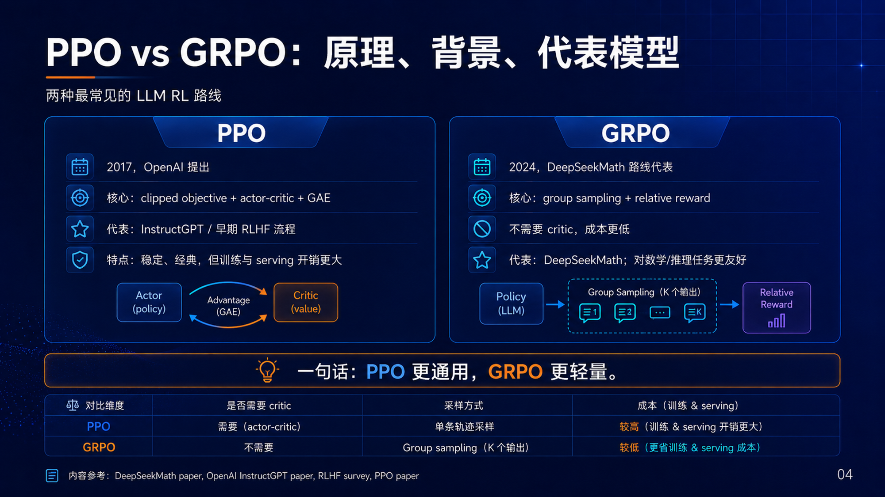
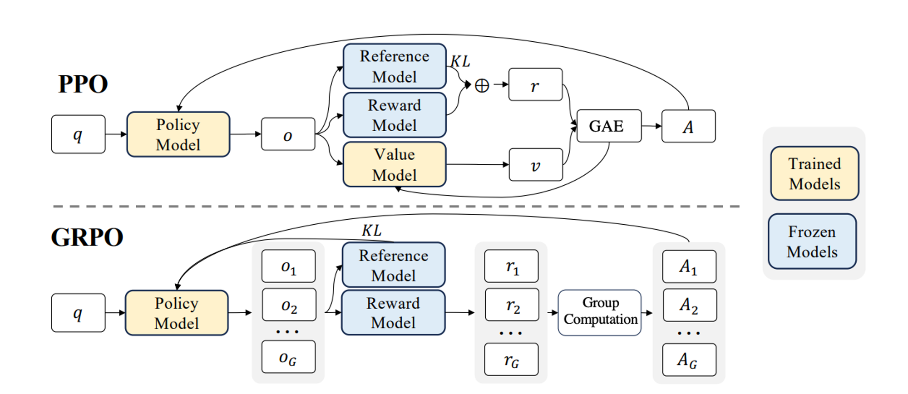

## 引言

在大模型后训练（Post-training）阶段，强化学习（RLHF / RLAIF）已经成为决定模型能力上限的关键因素之一。近期，GLM-5.2 在训练算法上从 GLM-5.1 使用的 GRPO（Generalized Reward Policy Optimization）切换到更经典的 PPO（Proximal Policy Optimization），并带来了明显的效果提升。

这一变化并非简单的“算法替换”，而是一次在**稳定性、泛化能力以及训练可控性**上的系统性升级。

本文将从三个层面展开分析：

1. PPO 与 GRPO 的核心原理
2. 两种算法的关键差异
3. 为什么 PPO 能带来“质的提升”

## PPO（Proximal Policy Optimization）原理

### 1. 背景

PPO 是 OpenAI 在 2017 年提出的一种策略梯度方法，是 TRPO（Trust Region Policy Optimization）的工程化简化版本，目前已经成为 RLHF 训练中的事实标准。

### 2. 核心思想

PPO 的核心目标是：

> **在优化策略的同时，限制新旧策略之间的偏移，防止训练不稳定。**

其优化目标函数为：

[
L^{PPO}(\theta) = \mathbb{E}\left[\min\left(r_t(\theta) A_t,\ \text{clip}(r_t(\theta), 1-\epsilon, 1+\epsilon) A_t\right)\right]
]

其中：

* ( r_t(\theta) = \frac{\pi_\theta(a|s)}{\pi_{\theta_{old}}(a|s)} )
* ( A_t )：优势函数（Advantage）
* ( \epsilon )：裁剪系数（通常 0.1~0.2）

### 3. 关键机制

PPO 的稳定性来源于三点：

#### Clipping 机制

限制策略更新幅度，防止“过度优化”。

#### dvantage Estimation（GAE）

降低方差，提高训练稳定性。

#### 多步更新（Epoch）

在同一批数据上进行多次优化，提高 sample efficiency。

### 4. 在大模型中的作用

在 LLM 训练中，PPO 通常用于：

* 对齐人类偏好（RLHF）
* 控制生成风格（安全、格式、推理能力）
* 平衡 exploration vs exploitation

## GRPO（Generalized Reward Policy Optimization）原理

### 1. 背景

GRPO 是在 RLHF 场景中提出的一种**去 Value Function（无 critic）**的优化方法，其目标是：

> **简化 PPO 训练流程，降低工程复杂度，同时提升吞吐。**

### 2. 核心思想

GRPO 的关键在于：

* 不训练 value model
* 不计算 advantage（或用简化替代）
* 直接基于 reward 进行相对优化

典型流程：

1. 对同一 prompt 采样多个输出（N samples）
2. 使用 reward model 打分
3. 做归一化或排序
4. 使用相对奖励更新策略

可表示为：

[
L^{GRPO} = \mathbb{E}\left[\log \pi_\theta(a|s) \cdot \hat{R}(a)\right]
]

其中：

* ( \hat{R}(a) )：归一化后的 reward（如 rank-based 或 mean-centered）

### 3. 关键特点

#### 无 Critic 架构

避免 value model 训练的不稳定性。

#### Batch 内对比学习

依赖同一 prompt 下多个样本的“相对优劣”。

#### 高吞吐

更适合大规模并行训练（尤其是多 GPU 推理采样）。

## PPO vs GRPO：核心差异对比

| 维度               | PPO   | GRPO     |
| ---------------- | ----- | -------- |
| 是否使用 Value Model | ✅ 使用  | ❌ 不使用    |
| Advantage 计算     | ✅ GAE | ❌ 无（或简化） |
| 稳定性              | ⭐⭐⭐⭐⭐ | ⭐⭐⭐      |
| 训练复杂度            | 高     | 低        |
| 样本效率             | 高     | 中        |
| 并行友好性            | 中     | 高        |
| 对 reward 依赖      | 中     | 高        |
| 对数据质量敏感性         | 中     | 高        |

## 为什么 GLM-5.2 从 GRPO 切换到 PPO？

这是本文的核心问题。

### 1. GRPO 的瓶颈

尽管 GRPO 在工程上更简单，但存在几个关键问题：

#### Reward 噪声放大

GRPO 强依赖 reward 的“相对排序”，当：

* reward model 不够精确
* 多样本之间差异较小

会导致：

> 梯度信号极不稳定

#### 缺乏长期信用分配（Credit Assignment）

GRPO 没有 value function：

* 无法建模长期回报
* 对长链推理（CoT）不友好

#### 训练容易 collapse

在某些情况下：

* 模型会过拟合 reward model
* 输出趋于模式化（mode collapse）

### 2. PPO 的优势在 GLM-5.2 中体现

#### 更稳定的优化路径

PPO 的 clipping + advantage：

* 避免策略震荡
* 保证逐步改进（monotonic improvement）

#### 更好的推理能力（Reasoning）

PPO 的 value function：

* 能对“中间步骤”进行隐式建模
* 更适合 chain-of-thought / multi-step reasoning

#### 对 reward model 依赖降低

相比 GRPO：

* PPO 不完全依赖 reward 排序
* 对 reward 噪声更鲁棒

#### 更强的泛化能力

PPO 本质上优化的是：

> **策略分布，而不是样本排序**

因此在：

* 未见任务
* 长文本生成
* 工具调用

等场景中更稳定。

## 一个直观理解：排序 vs 回归

可以用一个类比帮助理解：

* **GRPO：像做“排序学习”**

  * 哪个答案更好？
  * 强依赖 pairwise / listwise 对比

* **PPO：像做“回归优化”**

  * 当前策略离最优策略有多远？
  * 有连续的优化方向

结论：

> GRPO 更“快”，PPO 更“稳且准”。

## 总结

GLM-5.2 从 GRPO 切换到 PPO，本质上是一次：

> **从工程效率优先 → 模型能力优先 的转变**

### 关键结论

1. GRPO 适合：

   * 快速训练
   * 大规模并行
   * reward 明确的任务

2. PPO 更适合：

   * 高质量对齐
   * 复杂推理任务
   * 长上下文生成

3. 在当前 LLM 发展阶段：

> **稳定性、泛化能力、推理能力 > 训练吞吐**

因此，PPO 的回归成为一个“必然选择”。

## 结语

强化学习算法的选择，正在成为大模型能力差异的关键分水岭。从 GRPO 到 PPO，不只是算法切换，更代表着：

> **大模型训练从“能跑”走向“跑得好、跑得稳”。**

未来我们很可能看到：

* PPO + DPO 混合范式
* 或新的 off-policy RL 方法
* 甚至 reward-free alignment

但在当前阶段：

> **PPO 仍然是最稳健的工业级选择。**
