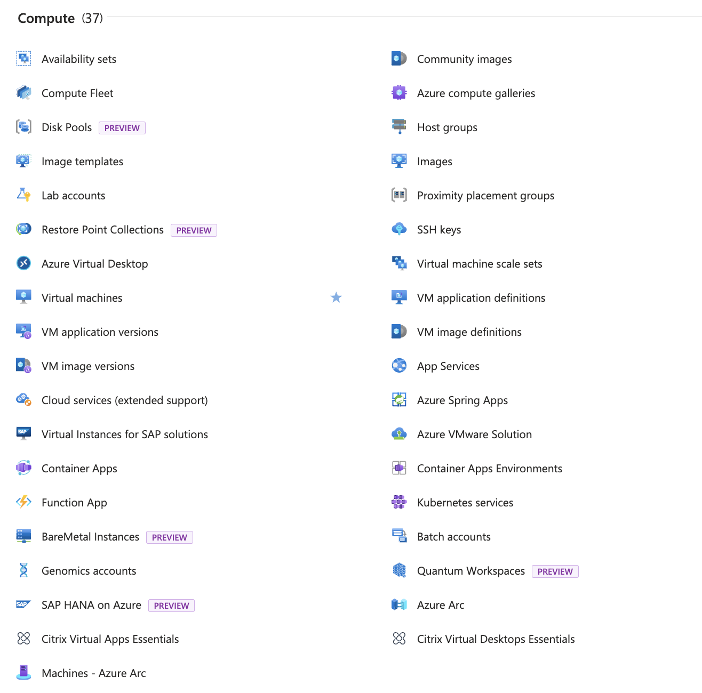
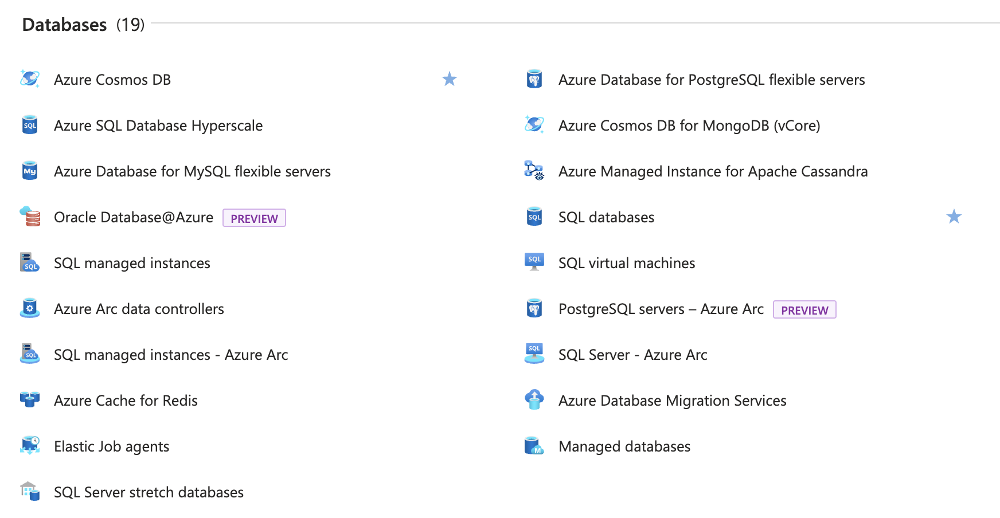
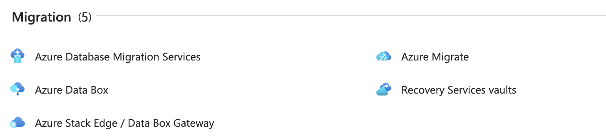

Azure 是由 Microsoft 提供的云计算平台和服务。它提供了一系列的基础设施即服务（Infrastructure as a Service，IaaS）、平台即服务（Platform as a Service，PaaS）和软件即服务（Software as a Service，SaaS）解决方案，用于构建、部署和管理各种类型的应用程序和服务。

## 总览 {#overview}

Azure 提供了广泛的功能和服务，包括虚拟机、存储、数据库、人工智能、机器学习、区块链、物联网、容器、Serverless 计算等。它还提供了全球范围的数据中心网络，使用户能够在全球范围内部署和扩展应用程序。

Azure 拥有数百项自身提供或合作伙伴提供的服务，截止至 2024 年 6 月 19 日，其拥有 19 个大分类，共计 413 项服务：

使用 Azure，您可以轻松地创建和管理虚拟机，存储和管理数据，构建和部署 Web 应用程序，进行大规模数据分析，实现自动化和监控等。Azure 还提供了强大的安全性和合规性功能，以确保您的数据和应用程序的安全性。

无论您是个人开发者、创业公司还是大型企业，Azure 都提供了灵活的定价模型，以满足不同规模和需求的项目。您可以根据实际使用情况付费，避免了高额的固定成本。

以下将总体介绍 19 个大分类的服务概述。

### AI + Machine Learning {#ai-machine-learning}

Azure 提供了强大的 AI + 机器学习功能，使用户能够构建和部署智能应用程序和解决方案。通过 Azure 的 AI + 机器学习服务，您可以利用先进的机器学习算法和模型来处理和分析大规模数据，从而获得有价值的洞察和预测能力。

通过这些 AI + 机器学习服务，您可以实现各种应用场景，如智能推荐、欺诈检测、情感分析、语音识别和自动化决策等。无论您是初学者还是专业人士，Azure 的 AI + 机器学习功能都能帮助您轻松构建和部署智能应用程序。

### Analytics {#analytics}

Azure Analytics 是 Azure 平台下的一个重要分类，提供了一系列强大的数据分析和洞察服务。这些服务可以帮助用户从海量数据中提取有价值的信息，并进行深入的数据分析和可视化展示。

Azure Analytics 提供了丰富的数据分析和洞察服务，帮助用户从海量数据中提取有价值的信息，并进行深入的数据分析和可视化展示。无论是处理结构化数据还是非结构化数据，无论是批处理还是实时处理，Azure Analytics 都能满足用户的各种数据分析需求。

### Compute {#compute}

Compute 计算服务是 Azure 平台下的一个庞大分类，提供了各种计算资源和服务，用于构建、部署和管理应用程序和服务。

Azure Compute 提供了多种计算选项，包括虚拟机、容器、Serverless 计算和批处理等。您可以根据应用程序的需求选择适合的计算资源，并根据实际使用情况进行弹性扩展和收缩。

### Containers {#containers}

Containers 容器分类，提供了一系列容器相关的服务和工具，用于构建、部署和管理容器化应用程序。

Azure Containers 提供了强大的容器编排和管理功能，使用户能够轻松地创建、部署和扩展容器化应用程序。通过 Azure 的容器服务，您可以使用 Docker 容器技术来打包应用程序及其依赖项，并在云端或本地环境中运行。

Azure Containers 提供了多种容器服务选项，包括 Azure Kubernetes Service (AKS)、Azure Container Instances (ACI) 和 Azure Container Registry (ACR) 等。这些服务提供了灵活的容器部署和管理方式，适用于不同规模和需求的项目。

使用 Azure Containers，您可以实现容器化应用程序的高可用性、弹性扩展和自动化管理。无论是单个容器应用程序还是复杂的微服务架构，Azure Containers 都能提供可靠的容器化解决方案。

### Databases {#databases}

Databases 数据库服务提供了多种数据库服务和解决方案，用于存储和管理结构化数据。

Azure Databases 提供了多种数据库选项，包括关系型数据库、NoSQL 数据库和缓存服务等。您可以根据应用程序的需求选择适合的数据库类型，并根据实际使用情况进行弹性扩展和收缩。

无论您是需要传统的关系型数据库、灵活的 NoSQL 数据库还是高性能的缓存服务，Azure Databases 都能提供适合您的数据库服务和解决方案。
通过 Azure Databases，您可以轻松地创建和管理数据库实例，进行数据的读写和查询，实现高可用性和数据的持久性。Azure Databases 还提供了强大的安全性和合规性功能，以确保您的数据的安全性和隐私保护。

### DevOps {#devops}

在 DevOps 中提供了一系列强大的工具和服务，用于实现持续交付和持续集成的 DevOps 实践。

DevOps 中提供了全面的 DevOps 解决方案，包括混沌测试，持续集成、持续交付、测试自动化、应用程序监控和故障排除等。

### General {#general}

Azure General 分类提供了一系列通用的云服务和工具，是使用 Azure 整个平台的最基础功能。

通过 Azure General，您可以找到一系列帮助您快速熟悉和使用 Azure 的工具，并且有效的管理您的各类资源以及计划您的支出，如果您对云计算服务不是特别熟悉或刚刚开始从事相关工作，在 General 中获取帮助是您的很好选择。

### Hybrid + Multicloud {#hybrid-multicloud}

Azure Hybrid + Multicloud 分类提供了一系列强大的混合云和多云解决方案，帮助用户在不同的云环境中构建、部署和管理应用程序和服务。

Azure Hybrid + Multicloud 提供了多种混合云和多云服务选项，包括混合云连接、数据集成、应用程序迁移和多云管理等。这些服务使用户能够在不同的云环境中灵活地部署和管理应用程序，实现资源的共享和协同工作。

通过 Azure Hybrid + Multicloud，您可以实现混合云环境中的数据集成和应用程序迁移，实现跨云平台的协同工作和资源的共享。Azure Hybrid + Multicloud 还提供了强大的多云管理功能，帮助用户统一管理和监控不同云环境中的资源和服务。

### Identity {#identity}

Azure Identity 分类提供了一系列身份验证和访问管理服务，用于保护应用程序和数据的安全性。

Azure Identity 提供了多种身份验证和访问管理服务选项，包括 Azure Active Directory (Azure AD)、Azure AD B2C 和 Azure AD Domain Services 等。这些服务提供了全面的身份验证和访问管理解决方案，帮助用户建立安全的身份验证和访问控制机制。

通过 Azure Identity，您可以实现用户身份验证和访问管理，保护应用程序和数据的机密性和完整性。Azure Identity 还提供了强大的身份验证和访问管理功能，如多因素身份验证、单一登录、角色基于访问控制和身份联合等，帮助用户确保只有授权的用户能够访问应用程序和数据。

### Integration {#integration}

Azure Integration 提供了一系列强大的集成服务和工具，用于实现应用程序和系统之间的无缝集成和数据交换。

Azure Integration 提供了多种集成服务选项，包括消息队列、事件网格、逻辑应用程序和数据工厂等。这些服务使用户能够轻松地构建、部署和管理应用程序和系统之间的集成解决方案。

通过 Azure Integration，您可以实现应用程序和系统之间的实时数据交换和协同工作。Azure Integration 还提供了强大的消息传递和事件处理功能，帮助用户实现高效的数据流和业务流程。

### Internet of Things {#iot}

Azure Internet of Things (IoT) 分类提供了一系列强大的物联网服务和解决方案，用于连接、监控和管理物理设备和传感器。

Azure IoT 提供了多种物联网服务选项，包括设备连接、数据采集、实时分析和远程监控等。这些服务使用户能够轻松地构建、部署和管理物联网解决方案，实现设备之间的互联和数据的实时处理。

通过 Azure IoT，您可以实现设备的连接和管理，监控设备的状态和性能，并进行实时数据分析和预测。Azure IoT 还提供了强大的远程监控和控制功能，帮助用户实现远程设备管理和操作。

使用 Azure IoT，您可以构建各种物联网应用场景，如智能家居、智能工厂、智能农业和智能城市等。无论是个人用户还是企业客户，Azure IoT 都能提供可靠的物联网解决方案，帮助您实现设备的互联和数据的实时处理。

### Management and Governance {#management-governance}

Azure Management and Governance 分类提供了一系列强大的管理和治理服务，帮助用户有效地管理和监控 Azure 资源和应用程序。

Azure Management and Governance 提供了多种管理和治理服务选项，包括资源管理、访问控制、成本管理、策略和合规性等。这些服务使用户能够轻松地管理和监控 Azure 资源和应用程序，实现资源的优化和合规性的保证。

通过 Azure Management and Governance，您可以实现资源的集中管理和监控，优化资源的使用和成本的控制。Azure Management and Governance 还提供了强大的访问控制和权限管理功能，帮助用户确保只有授权的用户能够访问和操作资源。

使用 Azure Management and Governance，您可以定义和实施策略和合规性规则，确保应用程序和数据的合规性和安全性。Azure Management and Governance 还提供了丰富的监控和报告功能，帮助用户实时了解资源的状态和性能。

### Migration {#migration}

Azure Migration 分类提供了一系列强大的迁移服务和工具，帮助用户将现有应用程序和数据迁移到 Azure 平台上。

Azure Migration 提供了多种迁移服务选项，包括虚拟机迁移、数据库迁移、应用程序迁移和数据迁移等。这些服务使用户能够轻松地将现有的应用程序和数据迁移到 Azure 平台上，实现平滑的迁移过程和无缝的应用程序转换。

通过 Azure Migration，您可以实现虚拟机的迁移和转换，将现有的虚拟机环境迁移到 Azure 虚拟机中。Azure Migration 还提供了强大的数据库迁移功能，帮助用户将现有的数据库迁移到 Azure 数据库服务中，实现数据的平滑迁移和无缝连接。

使用 Azure Migration，您可以轻松地将现有的应用程序迁移到 Azure 平台上，实现应用程序的云化和弹性扩展。Azure Migration 还提供了强大的数据迁移功能，帮助用户将现有的数据迁移到 Azure 存储服务中，实现数据的安全存储和高可用性。

### Mixed Reality {#mixed-reality}

Azure Mixed Reality 分类提供了一系列强大的混合现实服务和解决方案，用于构建、部署和管理混合现实应用程序和体验。

Azure Mixed Reality 提供了多种混合现实服务选项，包括混合现实开发工具、混合现实内容管理和分发、混合现实设备管理和监控等。这些服务使用户能够轻松地构建、部署和管理混合现实应用程序和体验，实现沉浸式的交互和创新的用户体验。

通过 Azure Mixed Reality，您可以利用先进的混合现实技术和工具来创建逼真的虚拟场景和交互体验。Azure Mixed Reality 还提供了强大的混合现实内容管理和分发功能，帮助用户将混合现实应用程序和体验推送到不同的设备和平台上。

使用 Azure Mixed Reality，您可以构建各种混合现实应用场景，如虚拟培训、虚拟会议、虚拟展览和虚拟旅游等。无论是个人用户还是企业客户，Azure Mixed Reality 都能提供创新的混合现实解决方案，帮助您实现沉浸式的交互和创新的用户体验。

### Monitor {#monitor}

Azure Monitor 分类提供了一系列强大的监控和日志管理服务，帮助用户实时监测和分析应用程序和基础设施的性能和健康状况。

Azure Monitor 提供了多种监控和日志管理服务选项，包括应用程序性能监视、基础设施监视、日志分析和警报管理等。这些服务使用户能够实时监测和分析应用程序和基础设施的性能和健康状况，及时发现和解决潜在的问题。

通过 Azure Monitor，您可以实时监测应用程序的性能和可用性，了解应用程序的负载和响应时间。Azure Monitor 还提供了强大的基础设施监视功能，帮助用户监控服务器、虚拟机和容器等基础设施的性能和资源使用情况。

使用 Azure Monitor，您可以收集和分析应用程序和基础设施的日志数据，了解应用程序的运行状况和事件发生情况。Azure Monitor 还提供了灵活的警报管理功能，帮助用户设置和管理警报规则，及时通知和响应关键事件。

### Networking {#networking}

Azure Networking 提供了一系列强大的网络服务和解决方案，用于构建、部署和管理网络基础设施和连接。

Azure Networking 提供了多种网络服务选项，包括虚拟网络、负载均衡、应用网关、VPN 网关和 ExpressRoute 等。这些服务使用户能够轻松地构建和管理灵活、可靠的网络架构，实现应用程序和服务之间的高速连接和通信。

通过 Azure Networking，您可以创建和管理虚拟网络，定义网络拓扑和子网划分，实现应用程序和服务之间的隔离和安全性。Azure Networking 还提供了强大的负载均衡和应用网关功能，帮助用户实现应用程序的高可用性和性能优化。

使用 Azure Networking，您可以轻松地创建和管理 VPN 网关和 ExpressRoute 连接，实现安全、可靠的远程连接和混合云环境的扩展。Azure Networking 还提供了强大的网络安全和防火墙功能，帮助用户保护网络和应用程序的安全性和隐私保护。

### Security {#security}

在 Azure Security 分类中提供了一系列强大的安全性和合规性服务。这些服务可以帮助用户保护应用程序和数据的安全性，防止恶意攻击和数据泄露。

Azure Security 提供了多种安全性和合规性服务选项，包括身份验证和访问管理、数据保护和加密、威胁检测和防御、安全监控和审计等。这些服务提供了全面的安全性解决方案，帮助用户建立安全的云环境和应用程序。

通过 Azure Security，您可以实现身份验证和访问管理，保护应用程序和数据的机密性和完整性。Azure Security 还提供了强大的威胁检测和防御功能，帮助用户及时发现和应对安全威胁。

### Storage {#storage}

Azure Storage 提供了可扩展的云存储解决方案，用于存储和管理大规模的结构化和非结构化数据。

Azure Storage 提供了多种存储服务选项，包括 Blob 存储、文件存储、表存储和队列存储等。这些服务使用户能够轻松地存储和访问各种类型的数据，实现数据的持久性和可靠性。

通过 Azure Storage，您可以存储和管理大规模的结构化和非结构化数据，如图像、视频、文档和日志等。Azure Storage 还提供了强大的数据复制和备份功能，帮助用户保护数据的安全性和可用性。

使用 Azure Storage，您可以实现数据的高可用性和弹性扩展，根据实际使用情况进行存储容量的调整。Azure Storage 还提供了灵活的访问控制和权限管理功能，帮助用户控制数据的访问和使用权限。

### Web + Mobile {#web-mobile}

Azure Web + Mobile 分类提供了一系列强大的云服务和工具，用于构建、部署和管理 Web 和移动应用程序。

Azure Web + Mobile 提供了多种服务选项，包括 Web 应用程序、移动应用程序、API 管理和通知服务等。这些服务使用户能够轻松地构建和部署高性能、可扩展的 Web 和移动应用程序。

使用 Azure Web + Mobile，您可以构建各种 Web 和移动应用场景，如电子商务网站、社交媒体应用、企业门户和移动客户端等。无论是个人开发者还是企业客户，Azure Web + Mobile 都能提供可靠的云服务和工具，帮助您构建和部署高性能、可扩展的 Web 和移动应用程序。

## 总结 {#conclusion}

本文介绍了 Azure 101 系列课程中的 Microsoft Azure 概览。Azure 是由 Microsoft 提供的云计算平台和服务，提供了广泛的功能和服务，包括虚拟机、存储、数据库、人工智能、机器学习、区块链、物联网、容器、Serverless 计算等。Azure 还提供了全球范围的数据中心网络，使用户能够在全球范围内部署和扩展应用程序。本文还介绍了 Azure 19 个大分类的服务概述，包括 AI + 机器学习、数据分析、计算、容器、数据库、DevOps、通用云服务、混合云和多云、身份验证和访问管理、集成、物联网、管理和治理、迁移、混合现实、监控、网络、安全、存储、Web 和移动应用程序。这些服务和解决方案可以帮助用户构建、部署和管理各种类型的应用程序和服务，并提供了强大的安全性和合规性功能。无论是个人开发者、创业公司还是大型企业，Azure 都提供了灵活的定价模型，以满足不同规模和需求的项目。
